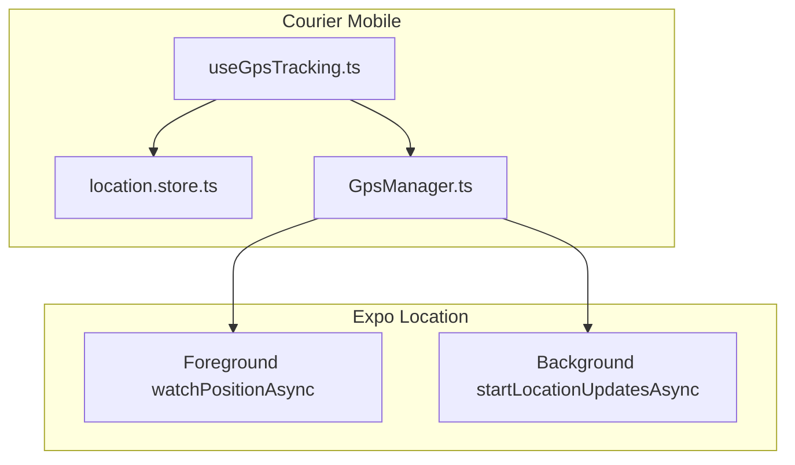
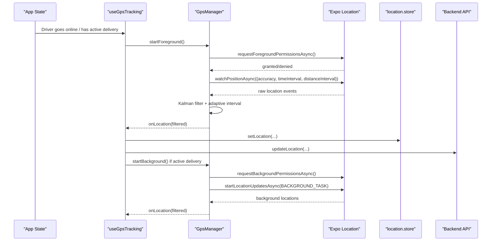
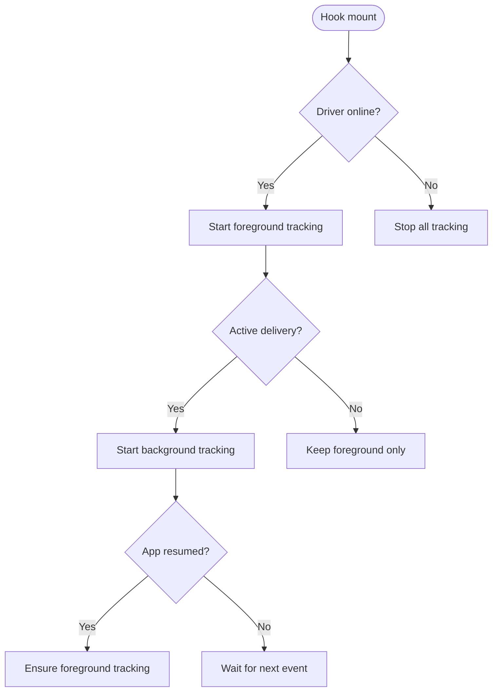
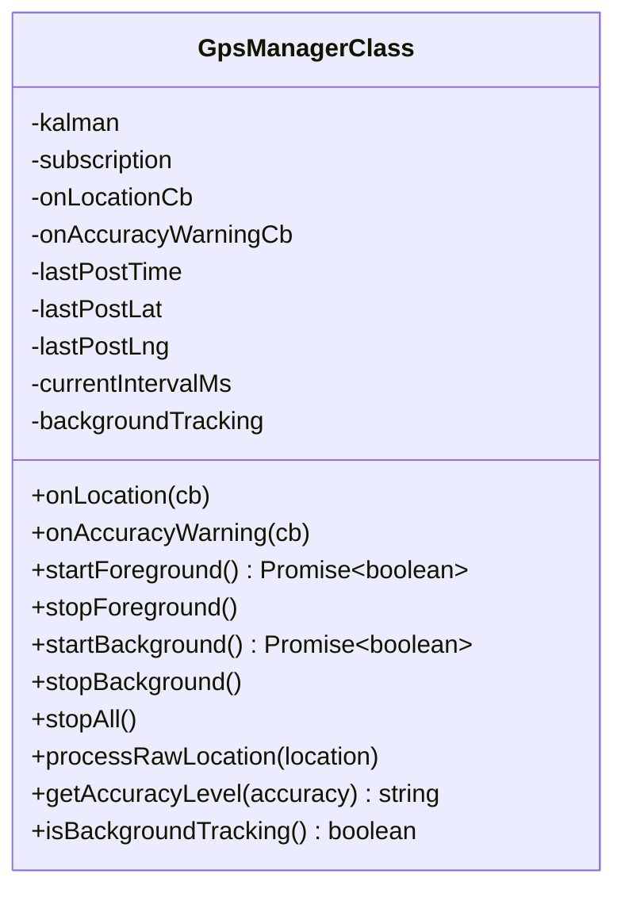
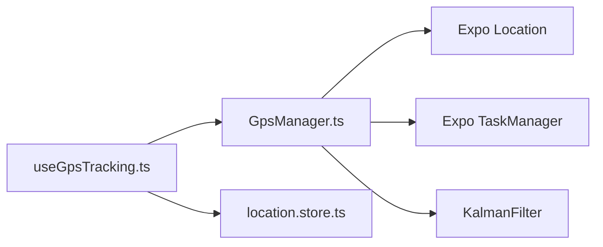

# Platform-Specific Implementation

<cite>
**Referenced Files in This Document**
- [useGpsTracking.ts](file://apps/courier-mobile/src/hooks/useGpsTracking.ts)
- [location.store.ts](file://apps/courier-mobile/src/stores/location.store.ts)
- [GpsManager.ts](file://apps/courier-mobile/src/lib/gps/GpsManager.ts)
- [app.json](file://apps/shopper-native/app.json)
</cite>

## Table of Contents
1. [Introduction](#introduction)
2. [Project Structure](#project-structure)
3. [Core Components](#core-components)
4. [Architecture Overview](#architecture-overview)
5. [Detailed Component Analysis](#detailed-component-analysis)
6. [Dependency Analysis](#dependency-analysis)
7. [Performance Considerations](#performance-considerations)
8. [Troubleshooting Guide](#troubleshooting-guide)
9. [Conclusion](#conclusion)

## Introduction
This document explains platform-specific location service implementations for iOS and Android within the project, focusing on how native permissions are handled, how background location services operate, and where platform-specific optimizations occur. It details the integration with Expo Location (used across both platforms), including foreground and background updates, adaptive update intervals, and filtering to improve accuracy and reduce battery usage. It also outlines platform differences such as update frequencies, background execution limits, and privacy restrictions, and provides troubleshooting guidance for common issues like low accuracy, battery drain, and permission denials.

## Project Structure
The location functionality is implemented primarily in the courier mobile app using a layered approach:
- A React hook orchestrates lifecycle events and coordinates tracking based on user state and active deliveries.
- A GPS manager encapsulates platform interactions via Expo Location, manages subscriptions, and applies filtering and adaptive intervals.
- A Zustand store maintains current location state and tracking flags consumed by UI components.
- The shopper-native app config declares required location permissions and usage descriptions for iOS and Android.

**Diagram sources**
- [useGpsTracking.ts:1-109](file://apps/courier-mobile/src/hooks/useGpsTracking.ts#L1-L109)
- [location.store.ts:1-44](file://apps/courier-mobile/src/stores/location.store.ts#L1-L44)
- [GpsManager.ts:1-245](file://apps/courier-mobile/src/lib/gps/GpsManager.ts#L1-L245)

**Section sources**
- [useGpsTracking.ts:1-109](file://apps/courier-mobile/src/hooks/useGpsTracking.ts#L1-L109)
- [location.store.ts:1-44](file://apps/courier-mobile/src/stores/location.store.ts#L1-L44)
- [GpsManager.ts:1-245](file://apps/courier-mobile/src/lib/gps/GpsManager.ts#L1-L245)
- [app.json:16-38](file://apps/shopper-native/app.json#L16-L38)

## Core Components
- useGpsTracking hook: Starts or stops foreground tracking when the driver goes online/offline; starts background tracking during an active delivery; resumes foreground tracking when the app returns to the foreground; posts filtered locations to the backend via an API client; updates the location store with position, heading, speed, accuracy, and altitude.
- GpsManager: Encapsulates Expo Location APIs for requesting permissions, starting/stopping foreground and background updates, defining and invoking a background task, applying Kalman filtering, gating updates by accuracy/speed, and adapting posting intervals based on movement.
- location.store: Holds current location data and tracking state, exposing setters and lifecycle toggles used by the hook and UI.
- app.json: Declares iOS and Android location permissions and usage descriptions for the shopper-native app.

Key responsibilities:
- Permission handling: Request and validate foreground/background permissions before starting updates.
- Background services: Use Expo TaskManager to define and run a background location task when needed.
- Optimizations: Kalman filter smoothing, distance-based posting thresholds, adaptive intervals based on speed, and stationary detection to minimize network calls and battery usage.

**Section sources**
- [useGpsTracking.ts:1-109](file://apps/courier-mobile/src/hooks/useGpsTracking.ts#L1-L109)
- [GpsManager.ts:1-245](file://apps/courier-mobile/src/lib/gps/GpsManager.ts#L1-L245)
- [location.store.ts:1-44](file://apps/courier-mobile/src/stores/location.store.ts#L1-L44)
- [app.json:16-38](file://apps/shopper-native/app.json#L16-L38)

## Architecture Overview
The system uses Expo Location for cross-platform access to device sensors while abstracting platform specifics through a single manager. The hook drives behavior based on application state, and the store centralizes location state.

**Diagram sources**
- [useGpsTracking.ts:1-109](file://apps/courier-mobile/src/hooks/useGpsTracking.ts#L1-L109)
- [GpsManager.ts:1-245](file://apps/courier-mobile/src/lib/gps/GpsManager.ts#L1-L245)
- [location.store.ts:1-44](file://apps/courier-mobile/src/stores/location.store.ts#L1-L44)

## Detailed Component Analysis

### useGpsTracking Hook
Responsibilities:
- Start/stop foreground tracking based on driver online status.
- Start/stop background tracking when there is an active delivery.
- Maintain a stable callback reference to avoid stale closures.
- Post filtered locations to the backend with retry queue semantics.
- Update the location store with latest metrics.

Behavior highlights:
- Uses AppState to resume foreground tracking when returning to the app.
- Delegates all sensor interaction to GpsManager.
- Batches post requests to avoid concurrent writes.

**Diagram sources**
- [useGpsTracking.ts:1-109](file://apps/courier-mobile/src/hooks/useGpsTracking.ts#L1-L109)

**Section sources**
- [useGpsTracking.ts:1-109](file://apps/courier-mobile/src/hooks/useGpsTracking.ts#L1-L109)

### GpsManager
Responsibilities:
- Manage Expo Location subscriptions for foreground and background.
- Define and invoke a background task via TaskManager.
- Apply Kalman filtering to smooth noisy readings.
- Gate updates by accuracy and speed; adapt posting intervals based on movement.
- Emit warnings for low accuracy and handle permission denials.

Key implementation patterns:
- Adaptive interval function selects between frequent updates when moving and less frequent updates when stationary.
- Distance threshold prevents unnecessary posts when near the last posted location.
- Stationary detection further reduces posting frequency to conserve battery.
- Background task registration occurs at module load; handler forwards locations back into the manager.

**Diagram sources**
- [GpsManager.ts:1-245](file://apps/courier-mobile/src/lib/gps/GpsManager.ts#L1-L245)

**Section sources**
- [GpsManager.ts:1-245](file://apps/courier-mobile/src/lib/gps/GpsManager.ts#L1-L245)

### location.store
Responsibilities:
- Hold current latitude, longitude, heading, speed, accuracy, altitude, tracking flag, and last updated timestamp.
- Provide methods to set location, toggle tracking, and reset state.

Usage:
- Updated by the hook whenever a new filtered location arrives.
- Consumed by UI components to render markers and status indicators.

**Section sources**
- [location.store.ts:1-44](file://apps/courier-mobile/src/stores/location.store.ts#L1-L44)

### Platform Permissions and Configuration
- iOS: Declares NSLocationWhenInUseUsageDescription in InfoPlist via expo configuration.
- Android: Declares ACCESS_FINE_LOCATION and ACCESS_COARSE_LOCATION permissions in expo configuration.
- These declarations ensure that runtime permission prompts present appropriate context to users.

**Section sources**
- [app.json:16-38](file://apps/shopper-native/app.json#L16-L38)

## Dependency Analysis
- useGpsTracking depends on:
  - GpsManager for sensor access and filtering.
  - location.store for state management.
  - AppState for lifecycle events.
  - API client for posting locations.
- GpsManager depends on:
  - Expo Location for permissions and updates.
  - Expo TaskManager for background tasks.
  - KalmanFilter utilities for smoothing and distance calculations.
- location.store is independent and consumed by multiple components.

**Diagram sources**
- [useGpsTracking.ts:1-109](file://apps/courier-mobile/src/hooks/useGpsTracking.ts#L1-L109)
- [GpsManager.ts:1-245](file://apps/courier-mobile/src/lib/gps/GpsManager.ts#L1-L245)
- [location.store.ts:1-44](file://apps/courier-mobile/src/stores/location.store.ts#L1-L44)

**Section sources**
- [useGpsTracking.ts:1-109](file://apps/courier-mobile/src/hooks/useGpsTracking.ts#L1-L109)
- [GpsManager.ts:1-245](file://apps/courier-mobile/src/lib/gps/GpsManager.ts#L1-L245)
- [location.store.ts:1-44](file://apps/courier-mobile/src/stores/location.store.ts#L1-L44)

## Performance Considerations
- Adaptive intervals: Posting frequency adapts to speed to balance accuracy and battery life.
- Filtering: Kalman smoothing reduces jitter and improves marker stability.
- Distance gating: Avoids redundant posts when close to the last posted location.
- Stationary optimization: Further reduces posting frequency when not moving.
- Foreground vs background: Foreground uses higher accuracy and more frequent updates; background uses balanced accuracy and longer intervals to conserve resources.

[No sources needed since this section provides general guidance]

## Troubleshooting Guide

Common issues and resolutions:
- Permission denied:
  - Symptom: No location updates; warning message indicates denial.
  - Resolution: Ensure runtime permission prompts are shown; verify InfoPlist keys and Android permissions are declared; guide users to enable location in settings.
  - Relevant paths:
    - [GpsManager.ts:58-63](file://apps/courier-mobile/src/lib/gps/GpsManager.ts#L58-L63)
    - [GpsManager.ts:94-98](file://apps/courier-mobile/src/lib/gps/GpsManager.ts#L94-L98)
    - [app.json:16-38](file://apps/shopper-native/app.json#L16-L38)

- Low accuracy:
  - Symptom: Accuracy values exceed thresholds; UI may show poor accuracy.
  - Resolution: Move outdoors or near windows; wait for GPS lock; consider reducing movement speed to allow better fixes; rely on Kalman smoothing for stability.
  - Relevant paths:
    - [GpsManager.ts:154-157](file://apps/courier-mobile/src/lib/gps/GpsManager.ts#L154-L157)
    - [GpsManager.ts:215-220](file://apps/courier-mobile/src/lib/gps/GpsManager.ts#L215-L220)

- Battery drain:
  - Symptom: Rapid battery depletion during long sessions.
  - Resolution: Use background mode with balanced accuracy and longer intervals; leverage adaptive intervals and stationary detection; ensure background task is defined and running efficiently.
  - Relevant paths:
    - [GpsManager.ts:24-28](file://apps/courier-mobile/src/lib/gps/GpsManager.ts#L24-L28)
    - [GpsManager.ts:106-117](file://apps/courier-mobile/src/lib/gps/GpsManager.ts#L106-L117)
    - [GpsManager.ts:185-197](file://apps/courier-mobile/src/lib/gps/GpsManager.ts#L185-L197)

- Background updates not firing:
  - Symptom: No updates when app is in background.
  - Resolution: Verify background task is defined; confirm background permission granted; check that startLocationUpdatesAsync is called with correct task name; ensure pausesUpdatesAutomatically is configured appropriately.
  - Relevant paths:
    - [GpsManager.ts:90-121](file://apps/courier-mobile/src/lib/gps/GpsManager.ts#L90-L121)
    - [GpsManager.ts:229-244](file://apps/courier-mobile/src/lib/gps/GpsManager.ts#L229-L244)

- Excessive network calls:
  - Symptom: High API traffic from frequent location posts.
  - Resolution: Rely on adaptive intervals and distance gating; ensure stationary detection is effective; review speed thresholds and posting logic.
  - Relevant paths:
    - [GpsManager.ts:166-197](file://apps/courier-mobile/src/lib/gps/GpsManager.ts#L166-L197)

- UI not updating:
  - Symptom: Map markers do not move or lag behind.
  - Resolution: Confirm onLocation callbacks are registered; verify store updates are occurring; check that hook’s stable ref pattern is used to avoid stale closures.
  - Relevant paths:
    - [useGpsTracking.ts:56-78](file://apps/courier-mobile/src/hooks/useGpsTracking.ts#L56-L78)
    - [location.store.ts:32-43](file://apps/courier-mobile/src/stores/location.store.ts#L32-L43)

**Section sources**
- [GpsManager.ts:58-63](file://apps/courier-mobile/src/lib/gps/GpsManager.ts#L58-L63)
- [GpsManager.ts:94-98](file://apps/courier-mobile/src/lib/gps/GpsManager.ts#L94-L98)
- [GpsManager.ts:154-157](file://apps/courier-mobile/src/lib/gps/GpsManager.ts#L154-L157)
- [GpsManager.ts:215-220](file://apps/courier-mobile/src/lib/gps/GpsManager.ts#L215-L220)
- [GpsManager.ts:24-28](file://apps/courier-mobile/src/lib/gps/GpsManager.ts#L24-L28)
- [GpsManager.ts:106-117](file://apps/courier-mobile/src/lib/gps/GpsManager.ts#L106-L117)
- [GpsManager.ts:185-197](file://apps/courier-mobile/src/lib/gps/GpsManager.ts#L185-L197)
- [GpsManager.ts:229-244](file://apps/courier-mobile/src/lib/gps/GpsManager.ts#L229-L244)
- [useGpsTracking.ts:56-78](file://apps/courier-mobile/src/hooks/useGpsTracking.ts#L56-L78)
- [location.store.ts:32-43](file://apps/courier-mobile/src/stores/location.store.ts#L32-L43)
- [app.json:16-38](file://apps/shopper-native/app.json#L16-L38)

## Conclusion
The project implements robust, cross-platform location services using Expo Location, with clear separation of concerns between lifecycle orchestration (hook), sensor management and optimization (manager), and state storage (store). Permissions are explicitly requested and validated, background updates are supported via TaskManager, and performance is optimized through filtering, adaptive intervals, and distance gating. The provided troubleshooting guide addresses common platform-specific issues related to permissions, accuracy, battery usage, and background execution constraints.