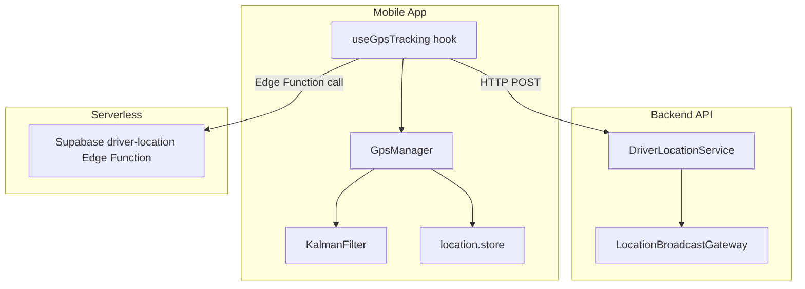
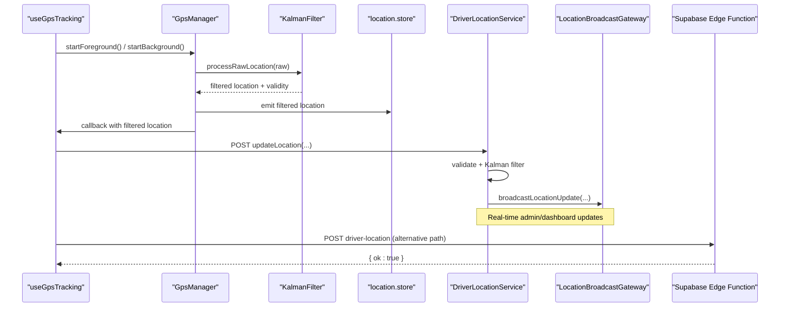
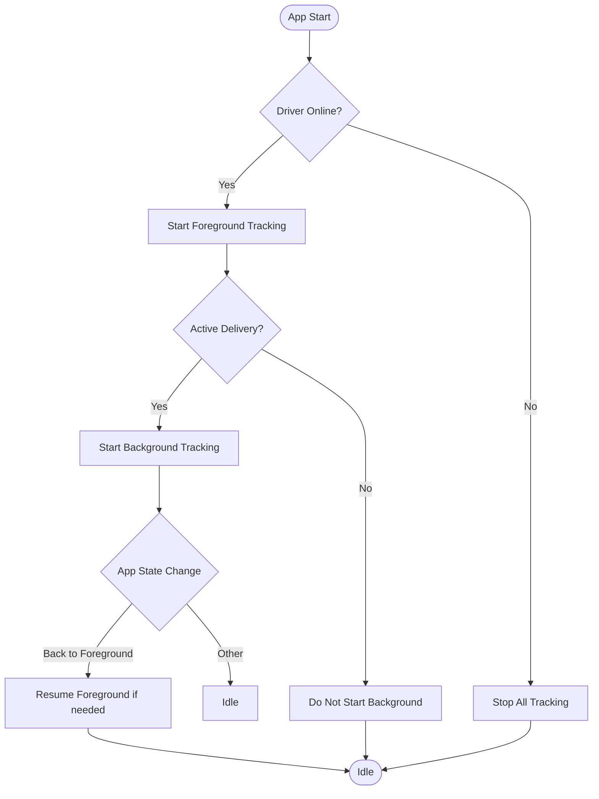
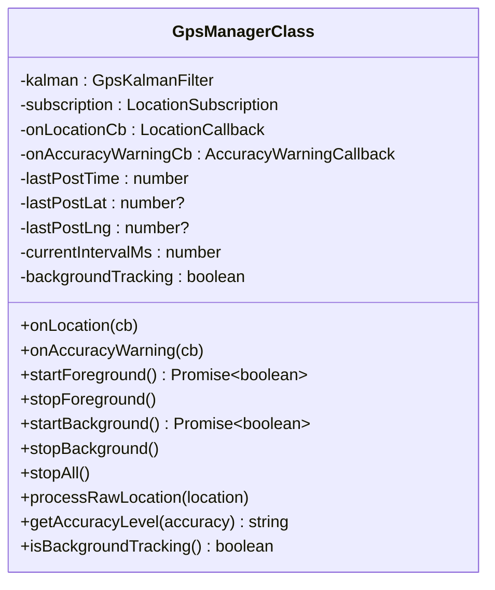
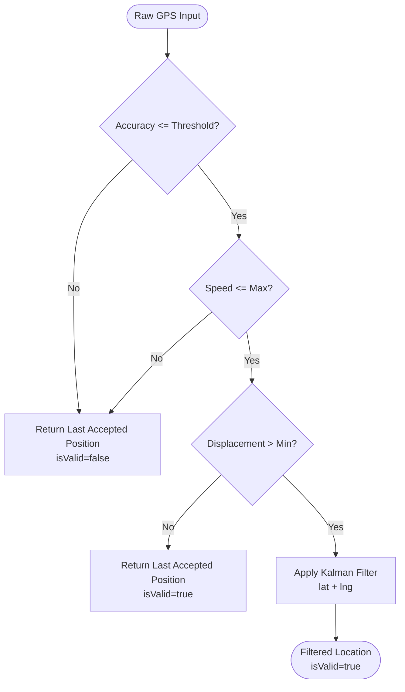
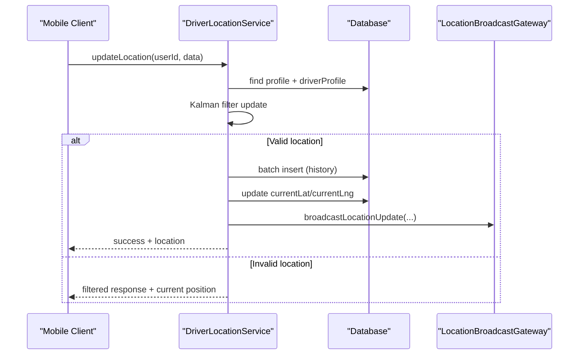
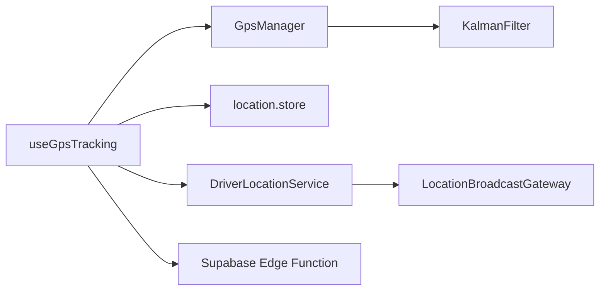

# Real-time Location Tracking

<cite>
**Referenced Files in This Document**
- [useGpsTracking.ts](file://apps/courier-mobile/src/hooks/useGpsTracking.ts)
- [GpsManager.ts](file://apps/courier-mobile/src/lib/gps/GpsManager.ts)
- [KalmanFilter.ts](file://apps/courier-mobile/src/lib/gps/KalmanFilter.ts)
- [location.store.ts](file://apps/courier-mobile/src/stores/location.store.ts)
- [driver-location.service.ts](file://apps/api/src/modules/driver/driver-location.service.ts)
- [location-broadcast.gateway.ts](file://apps/api/src/modules/driver/location-broadcast.gateway.ts)
- [index.ts (Supabase driver-location function)](file://supabase/functions/driver-location/index.ts)
</cite>

## Table of Contents
1. Introduction
2. Project Structure
3. Core Components
4. Architecture Overview
5. Detailed Component Analysis
6. Dependency Analysis
7. Performance Considerations
8. Troubleshooting Guide
9. Conclusion

## Introduction
This document explains the real-time location tracking system implemented across mobile and backend services. It covers GPS tracking hooks, background location updates, foreground service management, battery optimization techniques, accuracy settings, update frequency configuration, platform-specific behaviors for iOS and Android, integration with delivery tracking systems, driver location broadcasting, and customer order tracking features. It also documents error handling for location permissions, network connectivity issues, and GPS signal loss scenarios.

## Project Structure
The location tracking system spans three main layers:
- Mobile client (React Native/Expo): Captures GPS, filters readings, manages foreground/background lifecycle, and posts to backend or Supabase Edge Function.
- Backend API (NestJS): Validates, filters, persists, and broadcasts driver locations via WebSockets.
- Serverless persistence (Supabase Edge Function): Securely records driver location pings with strict authorization and validation.

**Diagram sources**
- [useGpsTracking.ts:1-110](file://apps/courier-mobile/src/hooks/useGpsTracking.ts#L1-L110)
- [GpsManager.ts:1-245](file://apps/courier-mobile/src/lib/gps/GpsManager.ts#L1-L245)
- [KalmanFilter.ts:1-182](file://apps/courier-mobile/src/lib/gps/KalmanFilter.ts#L1-L182)
- [location.store.ts:1-44](file://apps/courier-mobile/src/stores/location.store.ts#L1-L44)
- [driver-location.service.ts:1-352](file://apps/api/src/modules/driver/driver-location.service.ts#L1-L352)
- [location-broadcast.gateway.ts:1-214](file://apps/api/src/modules/driver/location-broadcast.gateway.ts#L1-L214)
- [index.ts (Supabase driver-location function):1-236](file://supabase/functions/driver-location/index.ts#L1-L236)

**Section sources**
- [useGpsTracking.ts:1-110](file://apps/courier-mobile/src/hooks/useGpsTracking.ts#L1-L110)
- [GpsManager.ts:1-245](file://apps/courier-mobile/src/lib/gps/GpsManager.ts#L1-L245)
- [KalmanFilter.ts:1-182](file://apps/courier-mobile/src/lib/gps/KalmanFilter.ts#L1-L182)
- [location.store.ts:1-44](file://apps/courier-mobile/src/stores/location.store.ts#L1-L44)
- [driver-location.service.ts:1-352](file://apps/api/src/modules/driver/driver-location.service.ts#L1-L352)
- [location-broadcast.gateway.ts:1-214](file://apps/api/src/modules/driver/location-broadcast.gateway.ts#L1-L214)
- [index.ts (Supabase driver-location function):1-236](file://supabase/functions/driver-location/index.ts#L1-L236)

## Core Components
- useGpsTracking hook: Orchestrates starting/stopping foreground and background tracking based on driver online status and active deliveries; queues and posts filtered locations to the backend; handles app lifecycle events.
- GpsManager: Manages Expo Location APIs for foreground and background tracking, registers background tasks, applies Kalman filtering, enforces adaptive posting intervals, and emits warnings for low accuracy.
- KalmanFilter: Implements 1D and 2D Kalman filtering with accuracy and speed gating, jitter suppression, and haversine distance checks to discard invalid GPS jumps.
- location.store: Zustand store holding current location state and tracking flags used by UI and hooks.
- DriverLocationService: Accepts location updates, validates driver status, applies server-side Kalman filtering, batches DB writes, updates current position, and triggers WebSocket broadcasts.
- LocationBroadcastGateway: WebSocket gateway that authenticates clients, subscribes/unsubscribes rooms, and broadcasts driver location updates and status changes.
- Supabase driver-location Edge Function: Securely accepts driver location pings, validates payload and authorization, and persists to the database.

**Section sources**
- [useGpsTracking.ts:1-110](file://apps/courier-mobile/src/hooks/useGpsTracking.ts#L1-L110)
- [GpsManager.ts:1-245](file://apps/courier-mobile/src/lib/gps/GpsManager.ts#L1-L245)
- [KalmanFilter.ts:1-182](file://apps/courier-mobile/src/lib/gps/KalmanFilter.ts#L1-L182)
- [location.store.ts:1-44](file://apps/courier-mobile/src/stores/location.store.ts#L1-L44)
- [driver-location.service.ts:1-352](file://apps/api/src/modules/driver/driver-location.service.ts#L1-L352)
- [location-broadcast.gateway.ts:1-214](file://apps/api/src/modules/driver/location-broadcast.gateway.ts#L1-L214)
- [index.ts (Supabase driver-location function):1-236](file://supabase/functions/driver-location/index.ts#L1-L236)

## Architecture Overview
End-to-end flow from GPS capture to real-time display:

**Diagram sources**
- [useGpsTracking.ts:1-110](file://apps/courier-mobile/src/hooks/useGpsTracking.ts#L1-L110)
- [GpsManager.ts:1-245](file://apps/courier-mobile/src/lib/gps/GpsManager.ts#L1-L245)
- [KalmanFilter.ts:1-182](file://apps/courier-mobile/src/lib/gps/KalmanFilter.ts#L1-L182)
- [driver-location.service.ts:1-352](file://apps/api/src/modules/driver/driver-location.service.ts#L1-L352)
- [location-broadcast.gateway.ts:1-214](file://apps/api/src/modules/driver/location-broadcast.gateway.ts#L1-L214)
- [index.ts (Supabase driver-location function):1-236](file://supabase/functions/driver-location/index.ts#L1-L236)

## Detailed Component Analysis

### Mobile GPS Tracking Hook (useGpsTracking)
- Starts foreground tracking when driver is online; stops all tracking when offline.
- Starts background tracking during an active delivery; stops when no active delivery.
- Resumes foreground tracking when app returns to foreground if not already background tracking.
- Maintains a stable ref for location callbacks to avoid stale closures.
- Queues location posts to ensure sequential uploads even under network latency.

**Diagram sources**
- [useGpsTracking.ts:1-110](file://apps/courier-mobile/src/hooks/useGpsTracking.ts#L1-L110)

**Section sources**
- [useGpsTracking.ts:1-110](file://apps/courier-mobile/src/hooks/useGpsTracking.ts#L1-L110)

### GPS Manager (GpsManager)
- Foreground tracking: requests permissions, watches position with high accuracy and movement thresholds, processes raw locations through Kalman filter, and emits filtered results.
- Background tracking: defines and starts a background task with a persistent notification; uses balanced accuracy and larger intervals to conserve battery.
- Adaptive posting interval: adjusts post frequency based on speed (stationary ~15s, slow ~5s, fast ~3s).
- Distance gating: avoids posting when stationary and within small displacement thresholds.
- Accuracy warnings: emits warnings when accuracy exceeds thresholds.

**Diagram sources**
- [GpsManager.ts:1-245](file://apps/courier-mobile/src/lib/gps/GpsManager.ts#L1-L245)

**Section sources**
- [GpsManager.ts:1-245](file://apps/courier-mobile/src/lib/gps/GpsManager.ts#L1-L245)

### Kalman Filter (KalmanFilter)
- 1D filter per axis with configurable process and measurement noise.
- 2D filter combining lat/lng with accuracy gate, speed gate, and jitter suppression.
- Haversine distance calculation for speed and displacement checks.

**Diagram sources**
- [KalmanFilter.ts:1-182](file://apps/courier-mobile/src/lib/gps/KalmanFilter.ts#L1-L182)

**Section sources**
- [KalmanFilter.ts:1-182](file://apps/courier-mobile/src/lib/gps/KalmanFilter.ts#L1-L182)

### Location Store (Zustand)
- Holds current latitude, longitude, heading, speed, accuracy, altitude, tracking flag, and last updated timestamp.
- Provides setLocation, startTracking, stopTracking, and reset actions.

**Section sources**
- [location.store.ts:1-44](file://apps/courier-mobile/src/stores/location.store.ts#L1-L44)

### Backend Driver Location Service
- Validates driver profile and online status before accepting updates.
- Applies server-side Kalman filtering per driver.
- Batches location history inserts for performance.
- Updates driver’s current position immediately for real-time views.
- Broadcasts location updates via WebSocket gateway.

**Diagram sources**
- [driver-location.service.ts:1-352](file://apps/api/src/modules/driver/driver-location.service.ts#L1-L352)
- [location-broadcast.gateway.ts:1-214](file://apps/api/src/modules/driver/location-broadcast.gateway.ts#L1-L214)

**Section sources**
- [driver-location.service.ts:1-352](file://apps/api/src/modules/driver/driver-location.service.ts#L1-L352)

### WebSocket Broadcast Gateway
- Authenticates connections using tokens and restricts certain endpoints to admin roles.
- Subscribes clients to rooms (e.g., driver-specific rooms, admin-updates).
- Emits driver location updates and status changes to subscribers.

**Section sources**
- [location-broadcast.gateway.ts:1-214](file://apps/api/src/modules/driver/location-broadcast.gateway.ts#L1-L214)

### Supabase Edge Function (driver-location)
- Enforces strict authorization: valid JWT, driver role, and accepted delivery assignment.
- Validates payload fields including lat/lng ranges and optional numeric fields.
- Persists location pings securely using service-role client after application-level checks.

**Section sources**
- [index.ts (Supabase driver-location function):1-236](file://supabase/functions/driver-location/index.ts#L1-L236)

## Dependency Analysis
Key dependencies and relationships:
- useGpsTracking depends on GpsManager, location.store, auth store, orders store, and driver API.
- GpsManager depends on expo-location, expo-task-manager, and KalmanFilter.
- DriverLocationService depends on PrismaService and LocationBroadcastGateway.
- LocationBroadcastGateway depends on NestJS WebSockets and SupabaseAuthService.
- Supabase Edge Function depends on Supabase JS client and environment variables.

**Diagram sources**
- [useGpsTracking.ts:1-110](file://apps/courier-mobile/src/hooks/useGpsTracking.ts#L1-L110)
- [GpsManager.ts:1-245](file://apps/courier-mobile/src/lib/gps/GpsManager.ts#L1-L245)
- [KalmanFilter.ts:1-182](file://apps/courier-mobile/src/lib/gps/KalmanFilter.ts#L1-L182)
- [location.store.ts:1-44](file://apps/courier-mobile/src/stores/location.store.ts#L1-L44)
- [driver-location.service.ts:1-352](file://apps/api/src/modules/driver/driver-location.service.ts#L1-L352)
- [location-broadcast.gateway.ts:1-214](file://apps/api/src/modules/driver/location-broadcast.gateway.ts#L1-L214)
- [index.ts (Supabase driver-location function):1-236](file://supabase/functions/driver-location/index.ts#L1-L236)

**Section sources**
- [useGpsTracking.ts:1-110](file://apps/courier-mobile/src/hooks/useGpsTracking.ts#L1-L110)
- [GpsManager.ts:1-245](file://apps/courier-mobile/src/lib/gps/GpsManager.ts#L1-L245)
- [KalmanFilter.ts:1-182](file://apps/courier-mobile/src/lib/gps/KalmanFilter.ts#L1-L182)
- [location.store.ts:1-44](file://apps/courier-mobile/src/stores/location.store.ts#L1-L44)
- [driver-location.service.ts:1-352](file://apps/api/src/modules/driver/driver-location.service.ts#L1-L352)
- [location-broadcast.gateway.ts:1-214](file://apps/api/src/modules/driver/location-broadcast.gateway.ts#L1-L214)
- [index.ts (Supabase driver-location function):1-236](file://supabase/functions/driver-location/index.ts#L1-L236)

## Performance Considerations
- Adaptive posting intervals reduce network load and battery usage by adjusting to driver speed.
- Kalman filtering smooths noisy GPS readings and discards implausible jumps, improving map stability and reducing unnecessary updates.
- Batching location history writes minimizes database overhead while keeping current positions fresh for real-time displays.
- Background tracking uses balanced accuracy and larger intervals to preserve battery life during deliveries.
- Distance gating prevents excessive updates when the driver is stationary.

[No sources needed since this section provides general guidance]

## Troubleshooting Guide
Common issues and resolutions:
- Location permission denied:
  - Ensure foreground and background permissions are granted; handle denial gracefully and prompt users to enable in settings.
  - See permission checks in GpsManager and warning callbacks.
- Low GPS accuracy:
  - Monitor accuracy thresholds; consider prompting users to move outdoors or disable battery saver modes.
  - GpsManager emits accuracy warnings when accuracy exceeds thresholds.
- Network connectivity issues:
  - Use a queue to serialize location posts; retry logic can be added around HTTP calls.
  - The hook maintains a posting queue to avoid lost updates under transient failures.
- GPS signal loss:
  - Kalman filter will return last accepted position; UI should indicate “no signal” or show last known location.
  - Speed and displacement gates prevent unrealistic jumps during signal recovery.
- Background task not defined:
  - Ensure the background task is registered at module level; otherwise background tracking will fail.
  - GpsManager checks task definition before starting updates.
- Unauthorized or invalid payloads (Supabase Edge Function):
  - Verify Authorization header, driver role, and accepted delivery assignment; ensure lat/lng ranges and timestamps are valid.

**Section sources**
- [GpsManager.ts:58-121](file://apps/courier-mobile/src/lib/gps/GpsManager.ts#L58-L121)
- [GpsManager.ts:150-213](file://apps/courier-mobile/src/lib/gps/GpsManager.ts#L150-L213)
- [KalmanFilter.ts:94-149](file://apps/courier-mobile/src/lib/gps/KalmanFilter.ts#L94-L149)
- [useGpsTracking.ts:29-73](file://apps/courier-mobile/src/hooks/useGpsTracking.ts#L29-L73)
- [index.ts (Supabase driver-location function):91-236](file://supabase/functions/driver-location/index.ts#L91-L236)

## Conclusion
The real-time location tracking system combines robust mobile GPS management, advanced filtering, efficient backend processing, and secure serverless persistence. It supports both foreground and background tracking with adaptive intervals and accuracy controls, integrates seamlessly with delivery workflows, and provides real-time updates to admins and customers via WebSockets. Proper error handling ensures resilience against permission denials, network issues, and GPS signal loss, delivering a reliable experience for drivers and customers alike.

[No sources needed since this section summarizes without analyzing specific files]