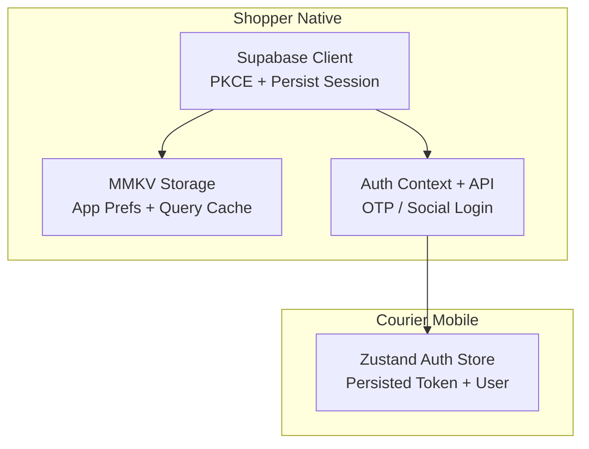
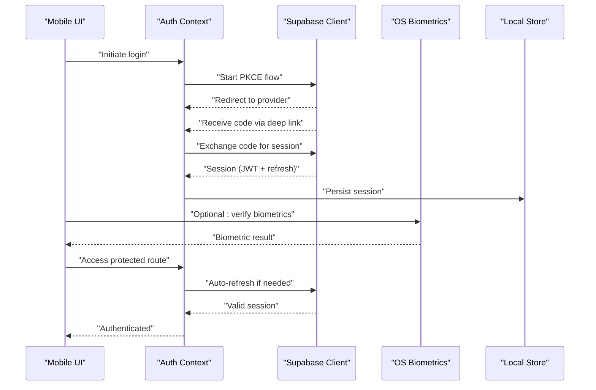
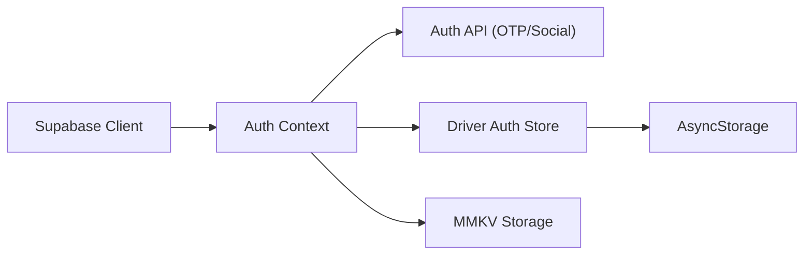

# Mobile Security & Authentication

<cite>
**Referenced Files in This Document**
- [supabase.ts](file://apps/shopper-native/src/lib/supabase.ts)
- [mmkv.ts](file://apps/shopper-native/src/lib/mmkv.ts)
- [auth.store.ts](file://apps/courier-mobile/src/stores/auth.store.ts)
- [auth.context.tsx](file://apps/shopper-native/src/features/auth/context.tsx)
- [auth.api.ts](file://apps/shopper-native/src/features/auth/api.ts)
- [phoneOtp.ts](file://apps/shopper-native/src/features/auth/phoneOtp.ts)
- [socialAuth.ts](file://apps/shopper-native/src/features/auth/socialAuth.ts)
- [userDataWipe.ts](file://apps/shopper-native/src/features/auth/userDataWipe.ts)
</cite>

## Table of Contents
1. Introduction
2. Project Structure
3. Core Components
4. Architecture Overview
5. Detailed Component Analysis
6. Dependency Analysis
7. Performance Considerations
8. Troubleshooting Guide
9. Conclusion

## Introduction
This document explains the mobile security and authentication implementation across the project’s native apps, focusing on:
- Biometric authentication integration (Face ID, Touch ID, fingerprint sensors)
- Secure storage for tokens, sensitive data, and session management
- JWT token handling and refresh token rotation
- Secure communication protocols
- Platform-specific security considerations (iOS Keychain, Android Keystore)
- Input validation, sanitization, and protection against common mobile vulnerabilities
- Authentication state management, logout procedures, and best practices

The analysis is grounded in the codebase’s Supabase client configuration, local storage utilities, and auth feature modules.

## Project Structure
The mobile security and authentication logic spans several areas:
- Supabase client setup with PKCE flow and persistent sessions
- Local secure storage via MMKV and AsyncStorage-backed stores
- Auth context and API helpers for OTP and social login
- Driver app auth store for persisting tokens and user state

**Diagram sources**
- [supabase.ts:1-46](file://apps/shopper-native/src/lib/supabase.ts#L1-L46)
- [mmkv.ts:1-97](file://apps/shopper-native/src/lib/mmkv.ts#L1-L97)
- [auth.store.ts:1-92](file://apps/courier-mobile/src/stores/auth.store.ts#L1-L92)
- [auth.context.tsx:1-200](file://apps/shopper-native/src/features/auth/context.tsx)
- [auth.api.ts:1-200](file://apps/shopper-native/src/features/auth/api.ts)

**Section sources**
- [supabase.ts:1-46](file://apps/shopper-native/src/lib/supabase.ts#L1-L46)
- [mmkv.ts:1-97](file://apps/shopper-native/src/lib/mmkv.ts#L1-L97)
- [auth.store.ts:1-92](file://apps/courier-mobile/src/stores/auth.store.ts#L1-L92)

## Core Components
- Supabase client configured for PKCE flow, automatic token refresh, and session persistence using AsyncStorage.
- MMKV-based synchronous storage for small settings and React Query cache, with a memory fallback to prevent crashes.
- Auth context and API layer for phone OTP and social authentication flows.
- Driver app Zustand store that persists authentication state and tokens via AsyncStorage.

Key responsibilities:
- Manage authentication lifecycle (login, refresh, logout)
- Persist tokens and user state securely
- Provide platform-agnostic abstractions over native capabilities (e.g., biometrics)

**Section sources**
- [supabase.ts:1-46](file://apps/shopper-native/src/lib/supabase.ts#L1-L46)
- [mmkv.ts:1-97](file://apps/shopper-native/src/lib/mmkv.ts#L1-L97)
- [auth.store.ts:1-92](file://apps/courier-mobile/src/stores/auth.store.ts#L1-L92)
- [auth.context.tsx:1-200](file://apps/shopper-native/src/features/auth/context.tsx)
- [auth.api.ts:1-200](file://apps/shopper-native/src/features/auth/api.ts)

## Architecture Overview
The authentication architecture uses Supabase’s PKCE flow for secure OAuth-like exchanges without exposing secrets on the device. Sessions are persisted and automatically refreshed. Sensitive app preferences and caches use MMKV for performance and reliability, while larger or cross-feature state uses AsyncStorage-backed stores.

**Diagram sources**
- [supabase.ts:1-46](file://apps/shopper-native/src/lib/supabase.ts#L1-L46)
- [auth.context.tsx:1-200](file://apps/shopper-native/src/features/auth/context.tsx)
- [auth.store.ts:1-92](file://apps/courier-mobile/src/stores/auth.store.ts#L1-L92)

## Detailed Component Analysis

### Supabase Client Configuration
- Uses PKCE flow for secure authorization code exchange on mobile.
- Enables auto token refresh and session persistence via AsyncStorage.
- Disables URL-based session detection; handles deep links manually.

Security implications:
- PKCE prevents interception attacks during code exchange.
- Auto-refresh reduces manual token handling complexity.
- Persistent sessions improve UX while maintaining security boundaries.

**Section sources**
- [supabase.ts:1-46](file://apps/shopper-native/src/lib/supabase.ts#L1-L46)

### MMKV Storage Layer
- Provides synchronous JSI-backed storage for small values and query cache.
- Includes a memory fallback to avoid hard crashes when native module fails.
- Exposes typed JSON helpers for structured preferences.

Security implications:
- MMKV is fast and reliable but not encrypted by default; use for non-sensitive data or pair with platform encryption where required.
- Memory fallback ensures resilience at the cost of no persistence after crash.

**Section sources**
- [mmkv.ts:1-97](file://apps/shopper-native/src/lib/mmkv.ts#L1-L97)

### Auth Context and API (OTP and Social)
- Orchestrates login flows including phone OTP and social providers.
- Integrates with Supabase client to obtain and manage sessions.
- Centralizes error mapping and user data handling.

Operational notes:
- Ensure deep link handling is robust for PKCE redirects.
- Validate all inputs before sending to backend or providers.
- Handle errors gracefully and log safely without leaking secrets.

**Section sources**
- [auth.context.tsx:1-200](file://apps/shopper-native/src/features/auth/context.tsx)
- [auth.api.ts:1-200](file://apps/shopper-native/src/features/auth/api.ts)
- [phoneOtp.ts:1-200](file://apps/shopper-native/src/features/auth/phoneOtp.ts)
- [socialAuth.ts:1-200](file://apps/shopper-native/src/features/auth/socialAuth.ts)

### Driver App Auth Store
- Persists token, user profile, and authentication state using AsyncStorage.
- Provides actions to update user, driver profile, online status, and logout.

Security considerations:
- AsyncStorage is not encrypted by default; consider encrypting stored tokens or using platform keychains for higher security.
- Logout clears in-memory state; ensure server-side invalidation or token revocation where applicable.

**Section sources**
- [auth.store.ts:1-92](file://apps/courier-mobile/src/stores/auth.store.ts#L1-L92)

### Biometric Authentication Integration
Recommended approach:
- Use platform biometric APIs (iOS Face ID/Touch ID, Android BiometricPrompt) to unlock features or re-authenticate.
- Bind biometric success to unlocking access to sensitive operations or decrypting local keys.
- Integrate with auth context to gate protected routes until biometric verification succeeds.

Implementation guidance:
- Prompt for biometrics after initial password/OTP login.
- Fallback to PIN/password if biometrics fail or are unavailable.
- Do not store raw biometric results; treat them as a transient unlock mechanism.

[No sources needed since this section provides general guidance]

### Secure Storage Mechanisms
- Tokens and sessions: managed by Supabase client with PKCE and persisted via AsyncStorage; prefer platform keychains for additional protection where possible.
- Sensitive app preferences: use MMKV for performance; avoid storing secrets here unless paired with encryption.
- Large or cross-feature state: use AsyncStorage-backed stores (e.g., Zustand) with careful scoping and minimal sensitive fields.

Best practices:
- Encrypt sensitive payloads at rest using platform-provided keystores/keychains.
- Minimize data retention; clear tokens on logout and after inactivity.
- Separate concerns: keep credentials out of logs and analytics.

[No sources needed since this section provides general guidance]

### JWT Handling and Refresh Rotation
- Rely on Supabase’s auto-refresh to handle JWT lifecycles transparently.
- Avoid manual token parsing or storage outside the client-managed session.
- On logout, clear local session and invalidate server-side tokens if supported.

Rotation strategy:
- Use short-lived access tokens with refresh tokens handled by the SDK.
- Rotate refresh tokens on each use if supported by the provider.
- Monitor token expiry and handle network failures gracefully.

**Section sources**
- [supabase.ts:1-46](file://apps/shopper-native/src/lib/supabase.ts#L1-L46)

### Secure Communication Protocols
- Enforce HTTPS/TLS for all API calls.
- Pin certificates or use certificate pinning libraries where feasible.
- Validate server responses and reject unexpected payloads.
- Sanitize inputs on both client and server sides.

[No sources needed since this section provides general guidance]

### Platform-Specific Security Considerations
- iOS Keychain: store sensitive keys/tokens using Keychain Services; integrate with biometrics via LocalAuthentication.
- Android Keystore: store cryptographic keys in Keystore; use BiometricPrompt for user-consented unlocks.
- Avoid rooting/jailbreak detection bypasses; rely on secure enclaves and hardware-backed keystores.

[No sources needed since this section provides general guidance]

### Input Validation and Sanitization
- Validate all user inputs using strict schemas before sending to servers or providers.
- Sanitize outputs to prevent injection into UI or storage.
- Apply rate limiting and CAPTCHA for OTP and login endpoints on the server side.

[No sources needed since this section provides general guidance]

### Authentication State Management and Logout
- Maintain a single source of truth for auth state (context/store).
- On logout:
  - Clear local tokens and user data
  - Invalidate server sessions if supported
  - Reset navigation to unauthenticated screens
  - Optionally trigger biometric lock

**Section sources**
- [auth.store.ts:1-92](file://apps/courier-mobile/src/stores/auth.store.ts#L1-L92)
- [userDataWipe.ts:1-200](file://apps/shopper-native/src/features/auth/userDataWipe.ts)

## Dependency Analysis
The following diagram shows how components depend on each other for authentication and storage:

**Diagram sources**
- [supabase.ts:1-46](file://apps/shopper-native/src/lib/supabase.ts#L1-L46)
- [auth.context.tsx:1-200](file://apps/shopper-native/src/features/auth/context.tsx)
- [auth.api.ts:1-200](file://apps/shopper-native/src/features/auth/api.ts)
- [auth.store.ts:1-92](file://apps/courier-mobile/src/stores/auth.store.ts#L1-L92)
- [mmkv.ts:1-97](file://apps/shopper-native/src/lib/mmkv.ts#L1-L97)

**Section sources**
- [supabase.ts:1-46](file://apps/shopper-native/src/lib/supabase.ts#L1-L46)
- [auth.context.tsx:1-200](file://apps/shopper-native/src/features/auth/context.tsx)
- [auth.api.ts:1-200](file://apps/shopper-native/src/features/auth/api.ts)
- [auth.store.ts:1-92](file://apps/courier-mobile/src/stores/auth.store.ts#L1-L92)
- [mmkv.ts:1-97](file://apps/shopper-native/src/lib/mmkv.ts#L1-L97)

## Performance Considerations
- Prefer MMKV for synchronous reads on cold boot to reduce startup latency.
- Avoid heavy JSON parsing on the main thread; batch updates and debounce writes.
- Use background tasks for token refresh and cache synchronization.
- Limit the size of persisted data; evict stale entries from caches.

[No sources needed since this section provides general guidance]

## Troubleshooting Guide
Common issues and resolutions:
- Deep link not captured: ensure PKCE flow is enabled and deep link handlers are registered correctly.
- Session not persisting: verify AsyncStorage availability and permissions; check for storage errors.
- Biometric prompt fails: confirm device capability and user enrollment; provide fallback to PIN/password.
- Crash on MMKV init: rely on memory fallback and investigate native module initialization; log errors without secrets.

Actions:
- Inspect network requests for 401/403 and retry with refresh.
- Clear corrupted local storage if necessary and re-authenticate.
- Add observability hooks to track auth events and failures.

**Section sources**
- [supabase.ts:1-46](file://apps/shopper-native/src/lib/supabase.ts#L1-L46)
- [mmkv.ts:1-97](file://apps/shopper-native/src/lib/mmkv.ts#L1-L97)
- [auth.store.ts:1-92](file://apps/courier-mobile/src/stores/auth.store.ts#L1-L92)

## Conclusion
The application leverages Supabase’s PKCE flow for secure, mobile-friendly authentication with automatic token refresh and session persistence. MMKV provides high-performance storage for non-sensitive data, while AsyncStorage-backed stores manage larger state. To strengthen security:
- Integrate platform biometrics for sensitive operations
- Store secrets in iOS Keychain and Android Keystore
- Enforce input validation and output sanitization
- Implement robust logout and session invalidation
- Monitor and log auth events securely

These practices collectively enhance the security posture of the mobile applications while maintaining a smooth user experience.