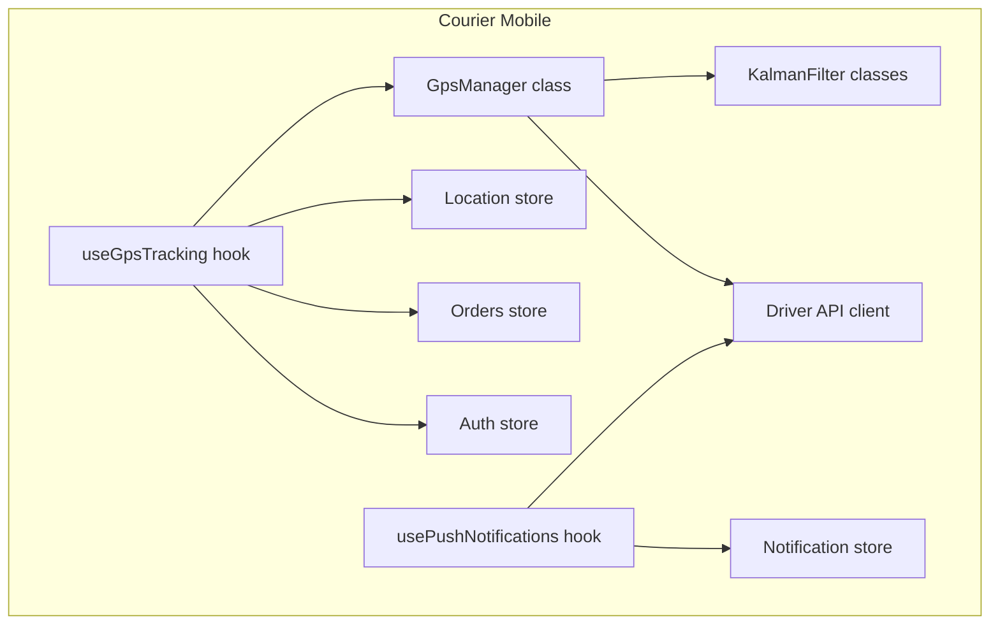
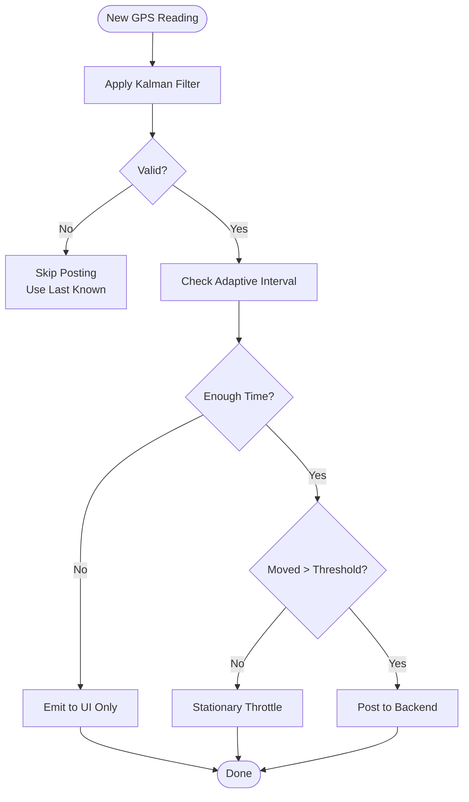
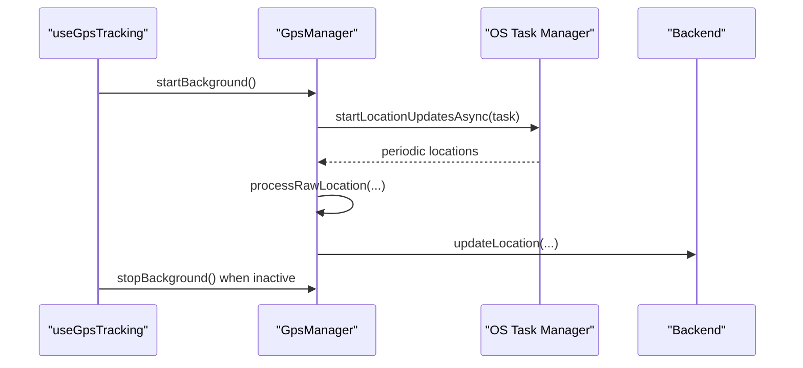
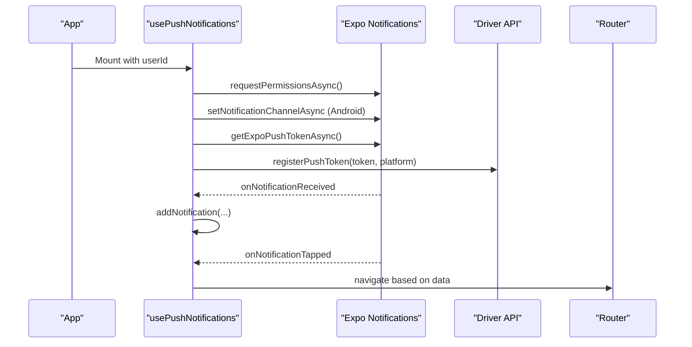
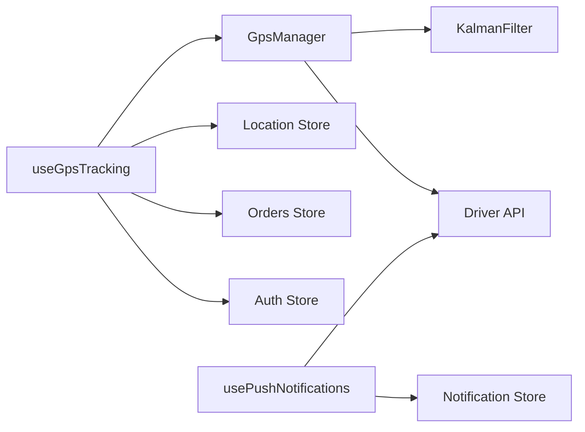

# Mobile-Specific Features

<cite>
**Referenced Files in This Document**
- [useGpsTracking.ts](file://apps/courier-mobile/src/hooks/useGpsTracking.ts)
- [GpsManager.ts](file://apps/courier-mobile/src/lib/gps/GpsManager.ts)
- [KalmanFilter.ts](file://apps/courier-mobile/src/lib/gps/KalmanFilter.ts)
- [usePushNotifications.ts](file://apps/courier-mobile/src/hooks/usePushNotifications.ts)
- [location.store.ts](file://apps/courier-mobile/src/stores/location.store.ts)
- [notification.store.ts](file://apps/courier-mobile/src/stores/notification.store.ts)
- [auth.store.ts](file://apps/courier-mobile/src/stores/auth.store.ts)
- [orders.store.ts](file://apps/courier-mobile/src/stores/orders.store.ts)
- [api.ts](file://apps/courier-mobile/src/lib/api.ts)
</cite>

## Table of Contents
1. Introduction
2. Project Structure
3. Core Components
4. Architecture Overview
5. Detailed Component Analysis
6. Dependency Analysis
7. Performance Considerations
8. Troubleshooting Guide
9. Conclusion

## Introduction
This document explains mobile-specific features in the United Pharmacy ecosystem with a focus on:
- GPS tracking for real-time location services, background updates, and geofencing considerations
- Push notification registration, delivery handling, and user preference management
- Camera integration for prescription scanning, barcode reading, and receipt capture (conceptual guidance)
- Offline mode implementation with local persistence, sync strategies, and conflict resolution (conceptual guidance)
- Platform-specific optimizations for iOS and Android, performance tuning, and battery optimization
- Mobile security considerations, biometric authentication, and secure storage of sensitive data

Where applicable, this document references concrete implementations found in the courier-mobile application and provides conceptual guidance for features not yet implemented in code.

## Project Structure
The mobile feature set spans two primary apps:
- Courier mobile app: Implements live GPS tracking and push notifications for drivers
- Shopper native app: Provides customer-facing features; camera and offline capabilities are addressed conceptually here



**Diagram sources**
- [useGpsTracking.ts:1-109](file://apps/courier-mobile/src/hooks/useGpsTracking.ts#L1-L109)
- [GpsManager.ts:1-245](file://apps/courier-mobile/src/lib/gps/GpsManager.ts#L1-L245)
- [KalmanFilter.ts:1-182](file://apps/courier-mobile/src/lib/gps/KalmanFilter.ts#L1-L182)
- [usePushNotifications.ts:1-120](file://apps/courier-mobile/src/hooks/usePushNotifications.ts#L1-L120)
- [location.store.ts:1-200](file://apps/courier-mobile/src/stores/location.store.ts)
- [notification.store.ts:1-200](file://apps/courier-mobile/src/stores/notification.store.ts)
- [auth.store.ts:1-200](file://apps/courier-mobile/src/stores/auth.store.ts)
- [orders.store.ts:1-200](file://apps/courier-mobile/src/stores/orders.store.ts)
- [api.ts:1-200](file://apps/courier-mobile/src/lib/api.ts)

**Section sources**
- [useGpsTracking.ts:1-109](file://apps/courier-mobile/src/hooks/useGpsTracking.ts#L1-L109)
- [GpsManager.ts:1-245](file://apps/courier-mobile/src/lib/gps/GpsManager.ts#L1-L245)
- [KalmanFilter.ts:1-182](file://apps/courier-mobile/src/lib/gps/KalmanFilter.ts#L1-L182)
- [usePushNotifications.ts:1-120](file://apps/courier-mobile/src/hooks/usePushNotifications.ts#L1-L120)

## Core Components
- GPS Tracking Hook: Orchestrates foreground/background location based on driver online status and active deliveries; posts filtered locations to backend via API client; manages queueing and error handling.
- GpsManager: Encapsulates expo-location usage, background task registration, adaptive posting intervals, accuracy warnings, and Kalman filtering pipeline.
- Kalman Filter: Smooths GPS coordinates, applies accuracy/speed gating, jitter suppression, and returns validated positions.
- Push Notifications Hook: Handles permission requests, token registration, platform channel setup, foreground display, and navigation on tap.
- Stores: Location, Notification, Auth, and Orders stores coordinate state across hooks and UI.

**Section sources**
- [useGpsTracking.ts:1-109](file://apps/courier-mobile/src/hooks/useGpsTracking.ts#L1-L109)
- [GpsManager.ts:1-245](file://apps/courier-mobile/src/lib/gps/GpsManager.ts#L1-L245)
- [KalmanFilter.ts:1-182](file://apps/courier-mobile/src/lib/gps/KalmanFilter.ts#L1-L182)
- [usePushNotifications.ts:1-120](file://apps/courier-mobile/src/hooks/usePushNotifications.ts#L1-L120)
- [location.store.ts:1-200](file://apps/courier-mobile/src/stores/location.store.ts)
- [notification.store.ts:1-200](file://apps/courier-mobile/src/stores/notification.store.ts)
- [auth.store.ts:1-200](file://apps/courier-mobile/src/stores/auth.store.ts)
- [orders.store.ts:1-200](file://apps/courier-mobile/src/stores/orders.store.ts)
- [api.ts:1-200](file://apps/courier-mobile/src/lib/api.ts)

## Architecture Overview
The GPS and notifications subsystems integrate tightly with React Native lifecycle events and platform services.

```mermaid
sequenceDiagram
participant App as "App"
participant Hook as "useGpsTracking"
participant GM as "GpsManager"
participant KF as "KalmanFilter"
participant Store as "Location Store"
participant API as "Driver API"
App->>Hook : Mount
Hook->>GM : startForeground()
GM->>GM : watchPositionAsync(...)
GM->>KF : processRawLocation(...)
KF-->>GM : {filtered lat/lng, isValid}
GM->>Store : emit location (UI smooth updates)
GM->>API : updateLocation(...) (adaptive interval)
Note over GM,API : Queue posts if busy; retry after completion
```

**Diagram sources**
- [useGpsTracking.ts:1-109](file://apps/courier-mobile/src/hooks/useGpsTracking.ts#L1-L109)
- [GpsManager.ts:1-245](file://apps/courier-mobile/src/lib/gps/GpsManager.ts#L1-L245)
- [KalmanFilter.ts:1-182](file://apps/courier-mobile/src/lib/gps/KalmanFilter.ts#L1-L182)
- [api.ts:1-200](file://apps/courier-mobile/src/lib/api.ts)

## Detailed Component Analysis

### GPS Tracking Implementation
- Foreground tracking: Starts when driver is online; uses high-accuracy settings and frequent raw updates for smooth UI movement.
- Background tracking: Activated during active deliveries; registers a background task and maintains a persistent notification on Android.
- Adaptive posting: Uses speed-based intervals to reduce network calls while keeping UI responsive.
- Accuracy and jitter control: Filters out low-accuracy readings, prevents unrealistic speeds, and suppresses micro-movements.



**Diagram sources**
- [GpsManager.ts:146-213](file://apps/courier-mobile/src/lib/gps/GpsManager.ts#L146-L213)
- [KalmanFilter.ts:90-149](file://apps/courier-mobile/src/lib/gps/KalmanFilter.ts#L90-L149)

**Section sources**
- [useGpsTracking.ts:19-109](file://apps/courier-mobile/src/hooks/useGpsTracking.ts#L19-L109)
- [GpsManager.ts:55-144](file://apps/courier-mobile/src/lib/gps/GpsManager.ts#L55-L144)
- [GpsManager.ts:146-213](file://apps/courier-mobile/src/lib/gps/GpsManager.ts#L146-L213)
- [KalmanFilter.ts:1-182](file://apps/courier-mobile/src/lib/gps/KalmanFilter.ts#L1-L182)

### Background Location Updates
- Background task registration: Ensures a named task exists before starting updates.
- Foreground service: On Android, displays a persistent notification during delivery tracking.
- Graceful stop: Stops background updates when no longer needed or when driver goes offline.



**Diagram sources**
- [GpsManager.ts:90-132](file://apps/courier-mobile/src/lib/gps/GpsManager.ts#L90-L132)
- [GpsManager.ts:229-245](file://apps/courier-mobile/src/lib/gps/GpsManager.ts#L229-L245)
- [useGpsTracking.ts:91-98](file://apps/courier-mobile/src/hooks/useGpsTracking.ts#L91-L98)

**Section sources**
- [GpsManager.ts:90-132](file://apps/courier-mobile/src/lib/gps/GpsManager.ts#L90-L132)
- [GpsManager.ts:229-245](file://apps/courier-mobile/src/lib/gps/GpsManager.ts#L229-L245)
- [useGpsTracking.ts:91-98](file://apps/courier-mobile/src/hooks/useGpsTracking.ts#L91-L98)

### Geofencing Capabilities
- Current state: Not implemented in the referenced files.
- Recommended approach: Use platform geofencing APIs (e.g., expo-location geofencing or native modules) to define zones around pharmacies/delivery points and trigger actions upon entry/exit. Integrate with the existing notification system to alert users or drivers.

[No sources needed since this section describes conceptual guidance without analyzing specific files]

### Push Notification System
- Registration: Requests permissions, sets up Android channels, retrieves Expo push token, and registers it with the backend.
- Delivery: Listens for incoming notifications; shows in-app toast in foreground; navigates on tap based on payload.
- Preferences: Token and device type stored and sent to backend; can be extended to support opt-in/out categories.



**Diagram sources**
- [usePushNotifications.ts:21-118](file://apps/courier-mobile/src/hooks/usePushNotifications.ts#L21-L118)
- [api.ts:1-200](file://apps/courier-mobile/src/lib/api.ts)

**Section sources**
- [usePushNotifications.ts:1-120](file://apps/courier-mobile/src/hooks/usePushNotifications.ts#L1-L120)
- [notification.store.ts:1-200](file://apps/courier-mobile/src/stores/notification.store.ts)
- [api.ts:1-200](file://apps/courier-mobile/src/lib/api.ts)

### Camera Integration (Conceptual)
- Prescription scanning: Capture images using camera APIs, then run OCR or send to backend for processing.
- Barcode reading: Use barcode scanning libraries to extract product codes; validate against catalog.
- Receipt capture: Allow image upload for reimbursement or verification flows.
- UX considerations: Provide clear instructions, handle permissions, and show previews before submission.

[No sources needed since this section provides general guidance without analyzing specific files]

### Offline Mode (Conceptual)
- Local persistence: Cache orders, products, and user preferences locally using secure storage and lightweight databases.
- Sync strategy: Implement queued operations with exponential backoff; reconcile conflicts using timestamps or server-authoritative merges.
- Conflict resolution: Prefer server state for critical entities; merge non-conflicting fields; prompt user for ambiguous cases.
- Observability: Track sync status and surface connectivity issues to users.

[No sources needed since this section provides general guidance without analyzing specific files]

### Platform-Specific Optimizations
- iOS:
  - Ensure proper background modes are configured for location updates.
  - Respect battery optimizations by reducing update frequency when stationary.
- Android:
  - Configure foreground service notifications for continuous tracking.
  - Use appropriate location accuracy and intervals to balance precision and power.

[No sources needed since this section provides general guidance without analyzing specific files]

### Performance Tuning for Mobile Devices
- Adaptive intervals: Reduce network calls when stationary or moving slowly.
- Filtering: Apply Kalman smoothing to avoid UI jank and unnecessary backend load.
- Queued posting: Serialize API calls to prevent race conditions and reduce overhead.

**Section sources**
- [GpsManager.ts:20-40](file://apps/courier-mobile/src/lib/gps/GpsManager.ts#L20-L40)
- [GpsManager.ts:146-213](file://apps/courier-mobile/src/lib/gps/GpsManager.ts#L146-L213)
- [useGpsTracking.ts:29-54](file://apps/courier-mobile/src/hooks/useGpsTracking.ts#L29-L54)

### Battery Optimization Techniques
- Lower accuracy in background: Use balanced accuracy for background updates.
- Distance thresholds: Trigger updates only after meaningful movement.
- Pause when inactive: Stop all tracking when driver goes offline or has no active delivery.

**Section sources**
- [GpsManager.ts:90-132](file://apps/courier-mobile/src/lib/gps/GpsManager.ts#L90-L132)
- [useGpsTracking.ts:80-98](file://apps/courier-mobile/src/hooks/useGpsTracking.ts#L80-L98)

### Mobile Security Considerations
- Biometric authentication: Gate sensitive actions (e.g., viewing prescriptions) behind biometric prompts.
- Secure storage: Store tokens and sensitive data using platform secure storage solutions.
- Network security: Enforce HTTPS and certificate pinning where feasible; sanitize inputs.

[No sources needed since this section provides general guidance without analyzing specific files]

## Dependency Analysis
Key dependencies among components:
- useGpsTracking depends on GpsManager, stores, and API client
- GpsManager depends on KalmanFilter and expo-location/task manager
- usePushNotifications depends on expo-notifications, router, and API client
- Stores provide shared state for location, notifications, auth, and orders



**Diagram sources**
- [useGpsTracking.ts:1-109](file://apps/courier-mobile/src/hooks/useGpsTracking.ts#L1-L109)
- [GpsManager.ts:1-245](file://apps/courier-mobile/src/lib/gps/GpsManager.ts#L1-L245)
- [KalmanFilter.ts:1-182](file://apps/courier-mobile/src/lib/gps/KalmanFilter.ts#L1-L182)
- [usePushNotifications.ts:1-120](file://apps/courier-mobile/src/hooks/usePushNotifications.ts#L1-L120)
- [location.store.ts:1-200](file://apps/courier-mobile/src/stores/location.store.ts)
- [notification.store.ts:1-200](file://apps/courier-mobile/src/stores/notification.store.ts)
- [auth.store.ts:1-200](file://apps/courier-mobile/src/stores/auth.store.ts)
- [orders.store.ts:1-200](file://apps/courier-mobile/src/stores/orders.store.ts)
- [api.ts:1-200](file://apps/courier-mobile/src/lib/api.ts)

**Section sources**
- [useGpsTracking.ts:1-109](file://apps/courier-mobile/src/hooks/useGpsTracking.ts#L1-L109)
- [GpsManager.ts:1-245](file://apps/courier-mobile/src/lib/gps/GpsManager.ts#L1-L245)
- [usePushNotifications.ts:1-120](file://apps/courier-mobile/src/hooks/usePushNotifications.ts#L1-L120)

## Performance Considerations
- Use adaptive intervals to minimize network traffic and battery drain
- Apply Kalman filtering to reduce UI jitter and backend load
- Queue and serialize API calls to avoid contention
- Limit background updates to necessary scenarios (active delivery)

[No sources needed since this section provides general guidance]

## Troubleshooting Guide
Common issues and resolutions:
- Location permission denied: Ensure foreground and background permissions are granted; re-prompt if necessary
- Background task not defined: Verify background task registration before starting updates
- Low GPS accuracy: Warn users and fall back to last known position; encourage moving outdoors
- Push token registration failed: Check device capability and network; retry with exponential backoff

**Section sources**
- [GpsManager.ts:55-68](file://apps/courier-mobile/src/lib/gps/GpsManager.ts#L55-L68)
- [GpsManager.ts:90-104](file://apps/courier-mobile/src/lib/gps/GpsManager.ts#L90-L104)
- [usePushNotifications.ts:31-84](file://apps/courier-mobile/src/hooks/usePushNotifications.ts#L31-L84)

## Conclusion
The courier-mobile app implements robust GPS tracking and push notifications tailored for driver workflows. It leverages adaptive intervals, Kalman filtering, and background tasks to balance accuracy, performance, and battery life. While camera integration and offline mode are not yet implemented in the referenced files, the architecture supports extending these capabilities with secure storage, reliable sync strategies, and platform-specific optimizations.

[No sources needed since this section summarizes without analyzing specific files]