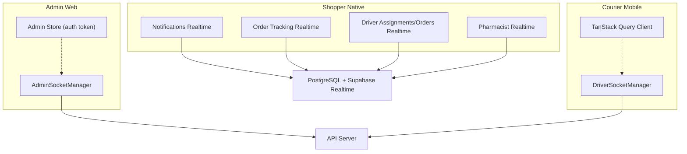
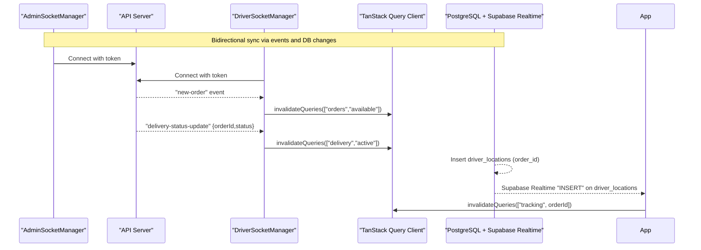
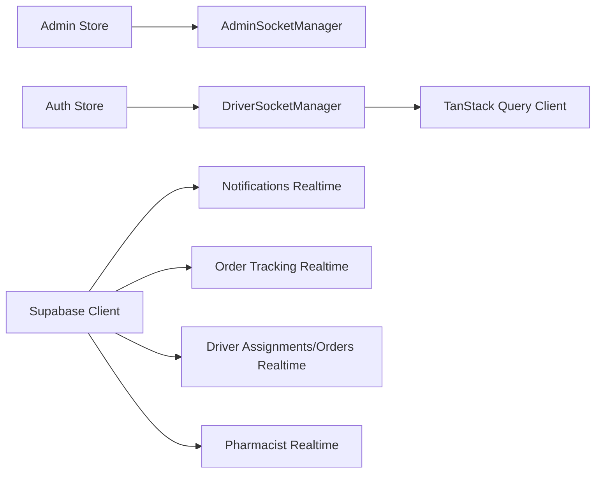

# Data Synchronization & Conflict Resolution

<cite>
**Referenced Files in This Document**
- [socket.ts](file://apps/admin/src/lib/socket.ts)
- [socket.ts](file://apps/courier-mobile/src/lib/socket.ts)
- [realtime.ts](file://apps/shopper-native/src/features/driver/realtime.ts)
- [realtime.ts](file://apps/shopper-native/src/features/notifications/realtime.ts)
- [realtime.ts](file://apps/shopper-native/src/features/orders/realtime.ts)
- [realtime.ts](file://apps/shopper-native/src/features/pharmacist/realtime.ts)
- [admin.store.ts](file://apps/admin/src/stores/admin.store.ts)
</cite>

## Table of Contents
1. Introduction
2. Project Structure
3. Core Components
4. Architecture Overview
5. Detailed Component Analysis
6. Dependency Analysis
7. Performance Considerations
8. Troubleshooting Guide
9. Conclusion

## Introduction
This document explains the data synchronization protocols and conflict resolution strategies implemented across the application. It covers bidirectional sync mechanisms, real-time conflict detection, automatic reconciliation triggers (manual refresh, background sync, event-driven), conflict resolution policies (last-write-wins, merge strategies, user intervention), optimistic UI updates, sync state management, progress tracking, handling different data types, custom sync rules, and performance optimization for large datasets.

The implementation combines:
- Server-Sent events via Socket.IO for driver-facing and admin-facing real-time updates.
- Supabase Realtime channels for database-level change notifications with row-level security enforcement.
- Client-side stores and query invalidation to keep UIs consistent and responsive.

## Project Structure
Synchronization spans three primary areas:
- Admin web app: WebSocket-based driver location broadcast and admin socket lifecycle.
- Courier mobile app: WebSocket-based order and delivery status updates with query cache invalidation.
- Shopper native app: Supabase Realtime subscriptions for orders, notifications, driver locations, and pharmacist queues.

**Diagram sources**
- [socket.ts:6-60](file://apps/admin/src/lib/socket.ts#L6-L60)
- [socket.ts:18-86](file://apps/courier-mobile/src/lib/socket.ts#L18-L86)
- [realtime.ts:13-33](file://apps/shopper-native/src/features/driver/realtime.ts#L13-L33)
- [realtime.ts:60-98](file://apps/shopper-native/src/features/notifications/realtime.ts#L60-L98)
- [realtime.ts:54-110](file://apps/shopper-native/src/features/orders/realtime.ts#L54-L110)
- [realtime.ts:29-75](file://apps/shopper-native/src/features/pharmacist/realtime.ts#L29-L75)
- [admin.store.ts:23-45](file://apps/admin/src/stores/admin.store.ts#L23-L45)

**Section sources**
- [socket.ts:6-60](file://apps/admin/src/lib/socket.ts#L6-L60)
- [socket.ts:18-86](file://apps/courier-mobile/src/lib/socket.ts#L18-L86)
- [realtime.ts:13-33](file://apps/shopper-native/src/features/driver/realtime.ts#L13-L33)
- [realtime.ts:60-98](file://apps/shopper-native/src/features/notifications/realtime.ts#L60-L98)
- [realtime.ts:54-110](file://apps/shopper-native/src/features/orders/realtime.ts#L54-L110)
- [realtime.ts:29-75](file://apps/shopper-native/src/features/pharmacist/realtime.ts#L29-L75)
- [admin.store.ts:23-45](file://apps/admin/src/stores/admin.store.ts#L23-L45)

## Core Components
- AdminSocketManager: Manages a persistent Socket.IO connection for admin dashboards, reattaches listeners on reconnect, and exposes connect/disconnect/isConnected APIs.
- DriverSocketManager: Manages a persistent Socket.IO connection for drivers, handles new-order and delivery-status-update events, and invalidates TanStack Query caches to reflect changes immediately.
- Supabase Realtime Subscriptions:
  - Notifications: Per-user channel with retry on channel errors/timeouts; transforms rows into typed notifications.
  - Order Tracking: Per-order channel for driver_locations INSERT events; RLS ensures only relevant customers receive updates.
  - Driver Assignments/Orders: Per-driver channels for assignments and orders tables.
  - Pharmacist Queues: Unique channel names per subscription to avoid callback registration conflicts under StrictMode or rapid remounts.

Key behaviors:
- Event-driven sync: Database changes or server events trigger client-side cache invalidation or UI updates.
- Resilient connections: Exponential backoff retries for Supabase channels; robust reconnection for Socket.IO.
- Security: Row-level filtering at the database level for Supabase Realtime; tokens passed via Socket.IO auth.

**Section sources**
- [socket.ts:6-60](file://apps/admin/src/lib/socket.ts#L6-L60)
- [socket.ts:18-86](file://apps/courier-mobile/src/lib/socket.ts#L18-L86)
- [realtime.ts:60-98](file://apps/shopper-native/src/features/notifications/realtime.ts#L60-L98)
- [realtime.ts:54-110](file://apps/shopper-native/src/features/orders/realtime.ts#L54-L110)
- [realtime.ts:13-33](file://apps/shopper-native/src/features/driver/realtime.ts#L13-L33)
- [realtime.ts:29-75](file://apps/shopper-native/src/features/pharmacist/realtime.ts#L29-L75)

## Architecture Overview
The system uses two complementary sync layers:
- WebSocket layer (Socket.IO): Pushes operational events (new orders, delivery status changes) to clients and triggers immediate cache invalidation.
- Database Realtime layer (Supabase): Subscribes to table-level changes with filters and RLS, enabling fine-grained, secure, and scalable event distribution.

**Diagram sources**
- [socket.ts:18-86](file://apps/courier-mobile/src/lib/socket.ts#L18-L86)
- [realtime.ts:54-110](file://apps/shopper-native/src/features/orders/realtime.ts#L54-L110)

**Section sources**
- [socket.ts:18-86](file://apps/courier-mobile/src/lib/socket.ts#L18-L86)
- [realtime.ts:54-110](file://apps/shopper-native/src/features/orders/realtime.ts#L54-L110)

## Detailed Component Analysis

### Admin WebSocket Manager
Responsibilities:
- Establishes a Socket.IO connection using an auth token from the admin store.
- Reconnects automatically with exponential backoff and reattaches all listeners.
- Provides methods to subscribe/unsubscribe to events and manage lifecycle.

Sync triggers:
- Manual: connect() called when admin authenticates.
- Background: automatic reconnection on disconnect.
- Event-driven: listener callbacks can trigger UI updates or further actions.

Conflict resolution:
- Not directly involved in conflict resolution; primarily used for broadcasting driver locations and related events.

Optimistic UI:
- Not applicable here; relies on server events to update UI.

Progress tracking:
- Connection state exposed via isConnected().

**Section sources**
- [socket.ts:6-60](file://apps/admin/src/lib/socket.ts#L6-L60)
- [admin.store.ts:23-45](file://apps/admin/src/stores/admin.store.ts#L23-L45)

### Driver WebSocket Manager
Responsibilities:
- Maintains a Socket.IO connection with authentication and reconnection logic.
- Listens for new-order and delivery-status-update events.
- Invalidates TanStack Query caches to reflect changes immediately.

Sync triggers:
- Manual: connect() upon driver login.
- Background: automatic reconnection with attempts and delays.
- Event-driven: new-order and delivery-status-update events.

Conflict resolution:
- Uses last-write-wins semantics by invalidating cached queries so the latest server state is fetched.

Optimistic UI:
- Not applied; UI reflects server state after invalidation.

Progress tracking:
- Connection events logged; reconnect attempts tracked internally.

**Section sources**
- [socket.ts:18-86](file://apps/courier-mobile/src/lib/socket.ts#L18-L86)

### Notifications Realtime Subscription
Responsibilities:
- Subscribes to INSERT events on the notifications table filtered by user_id.
- Transforms rows into typed notifications and delivers them to the caller.
- Implements resilient channel joining with exponential backoff on errors/timeouts.

Sync triggers:
- Event-driven: new notification inserts.
- Background: automatic retry on channel errors/timeouts.

Conflict resolution:
- No direct conflict resolution; each insert is treated as authoritative.

Optimistic UI:
- Not applied; UI updated based on server events.

Progress tracking:
- Channel status logged in development mode; unsubscribe handle provided.

**Section sources**
- [realtime.ts:60-98](file://apps/shopper-native/src/features/notifications/realtime.ts#L60-L98)

### Order Tracking Realtime Subscription
Responsibilities:
- Subscribes to INSERT events on driver_locations filtered by order_id.
- Ensures RLS allows only the customer associated with the order to receive updates.
- Triggers cache invalidation to refresh tracking UI without polling.

Sync triggers:
- Event-driven: driver location pings.
- Background: automatic retry on channel errors/timeouts.

Conflict resolution:
- Last-write-wins via cache invalidation; latest location is displayed.

Optimistic UI:
- Not applied; relies on server events.

Progress tracking:
- Channel status logged in development mode; unsubscribe handle provided.

**Section sources**
- [realtime.ts:54-110](file://apps/shopper-native/src/features/orders/realtime.ts#L54-L110)

### Driver Assignments and Orders Realtime
Responsibilities:
- Subscribes to changes on delivery_assignments and orders tables filtered by driver_id.
- Triggers UI updates when assignments or orders change for the current driver.

Sync triggers:
- Event-driven: any change to assigned deliveries or orders.

Conflict resolution:
- Relies on server authority; client refetches or updates UI accordingly.

Optimistic UI:
- Not applied; driven by server events.

Progress tracking:
- Callbacks invoked on changes; no explicit progress UI here.

**Section sources**
- [realtime.ts:13-33](file://apps/shopper-native/src/features/driver/realtime.ts#L13-L33)

### Pharmacist Realtime Subscriptions
Responsibilities:
- Subscribes to changes on orders, prescriptions, and inventory_state tables.
- Uses unique channel names per subscription to avoid callback registration conflicts under StrictMode or rapid remounts.

Sync triggers:
- Event-driven: any change to relevant tables.

Conflict resolution:
- Last-write-wins via cache invalidation or UI refresh triggered by onChange.

Optimistic UI:
- Not applied; server events drive updates.

Progress tracking:
- Channels created uniquely; cleanup via removeChannel.

**Section sources**
- [realtime.ts:29-75](file://apps/shopper-native/src/features/pharmacist/realtime.ts#L29-L75)

## Dependency Analysis
- AdminSocketManager depends on the admin store for authentication tokens and manages its own listener registry for reattachment on reconnect.
- DriverSocketManager depends on auth store and TanStack Query client to invalidate specific query keys upon receiving events.
- Supabase Realtime subscriptions depend on Supabase client configuration and rely on RLS policies to filter events securely.

**Diagram sources**
- [socket.ts:6-60](file://apps/admin/src/lib/socket.ts#L6-L60)
- [socket.ts:18-86](file://apps/courier-mobile/src/lib/socket.ts#L18-L86)
- [realtime.ts:60-98](file://apps/shopper-native/src/features/notifications/realtime.ts#L60-L98)
- [realtime.ts:54-110](file://apps/shopper-native/src/features/orders/realtime.ts#L54-L110)
- [realtime.ts:13-33](file://apps/shopper-native/src/features/driver/realtime.ts#L13-L33)
- [realtime.ts:29-75](file://apps/shopper-native/src/features/pharmacist/realtime.ts#L29-L75)
- [admin.store.ts:23-45](file://apps/admin/src/stores/admin.store.ts#L23-L45)

**Section sources**
- [socket.ts:6-60](file://apps/admin/src/lib/socket.ts#L6-L60)
- [socket.ts:18-86](file://apps/courier-mobile/src/lib/socket.ts#L18-L86)
- [realtime.ts:60-98](file://apps/shopper-native/src/features/notifications/realtime.ts#L60-L98)
- [realtime.ts:54-110](file://apps/shopper-native/src/features/orders/realtime.ts#L54-L110)
- [realtime.ts:13-33](file://apps/shopper-native/src/features/driver/realtime.ts#L13-L33)
- [realtime.ts:29-75](file://apps/shopper-native/src/features/pharmacist/realtime.ts#L29-L75)
- [admin.store.ts:23-45](file://apps/admin/src/stores/admin.store.ts#L23-L45)

## Performance Considerations
- Prefer event-driven invalidation over polling: Use Supabase Realtime and Socket.IO events to minimize network requests and reduce latency.
- Scope channels narrowly: Filter by user_id, order_id, or driver_id to limit event volume and leverage RLS for security.
- Avoid duplicate subscriptions: Ensure unique channel names and proper cleanup to prevent memory leaks and redundant processing.
- Batch UI updates: Group multiple invalidations where possible to reduce re-renders.
- Optimize large datasets: Use pagination, selective fields, and indexes on filtered columns (e.g., user_id, order_id, driver_id).
- Backoff and retries: Implement exponential backoff for channel joins to handle transient failures gracefully.

[No sources needed since this section provides general guidance]

## Troubleshooting Guide
Common issues and resolutions:
- Socket.IO reconnection: If disconnected, ensure reconnection is enabled and tokens are valid; log connection events to diagnose.
- Supabase channel errors/timeouts: Subscribe with status callbacks; on CHANNEL_ERROR or TIMED_OUT, remove the failed channel and retry with exponential backoff.
- StrictMode double-invocation: Use unique channel names per subscription to avoid adding callbacks to already-subscribed channels.
- RLS policy mismatches: Verify that realtime publications include required tables and policies allow the intended audience (e.g., customers seeing their own order locations).
- Stale subscriptions: Always call unsubscribe/removeChannel on unmount or sign-out to prevent leaks.

**Section sources**
- [socket.ts:18-86](file://apps/courier-mobile/src/lib/socket.ts#L18-L86)
- [realtime.ts:60-98](file://apps/shopper-native/src/features/notifications/realtime.ts#L60-L98)
- [realtime.ts:54-110](file://apps/shopper-native/src/features/orders/realtime.ts#L54-L110)
- [realtime.ts:29-75](file://apps/shopper-native/src/features/pharmacist/realtime.ts#L29-L75)

## Conclusion
The application implements robust, event-driven synchronization using both Socket.IO and Supabase Realtime. Conflicts are resolved using last-write-wins semantics through cache invalidation and server-authoritative updates. The design emphasizes resilience (retries, reconnection), security (RLS), and performance (narrow filters, minimal polling). For complex merges or user interventions, additional conflict resolution layers can be introduced atop these foundations.

[No sources needed since this section summarizes without analyzing specific files]