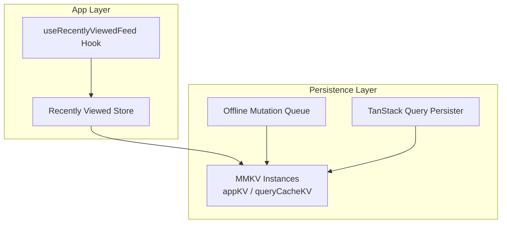
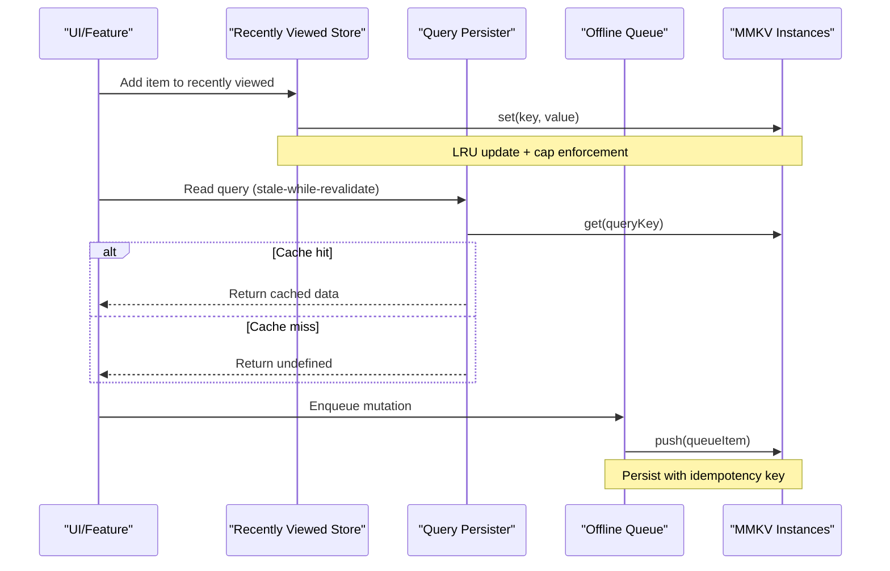
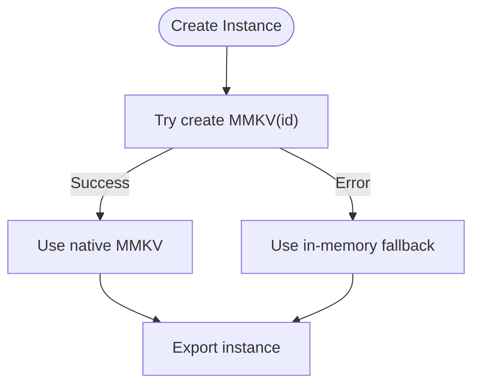
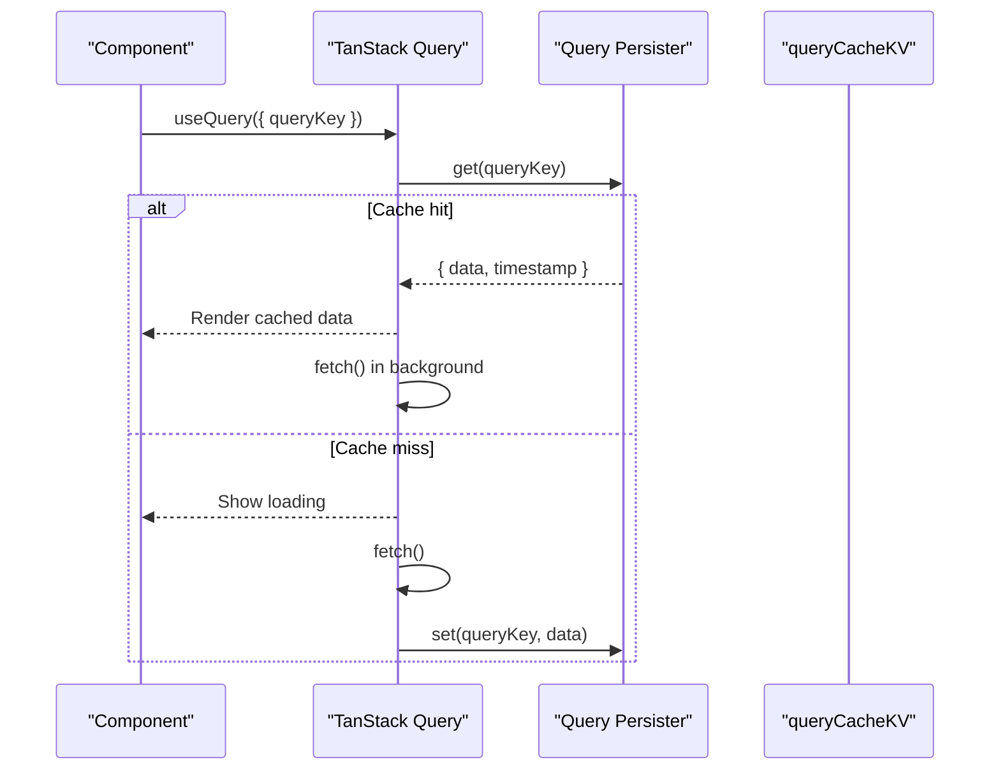
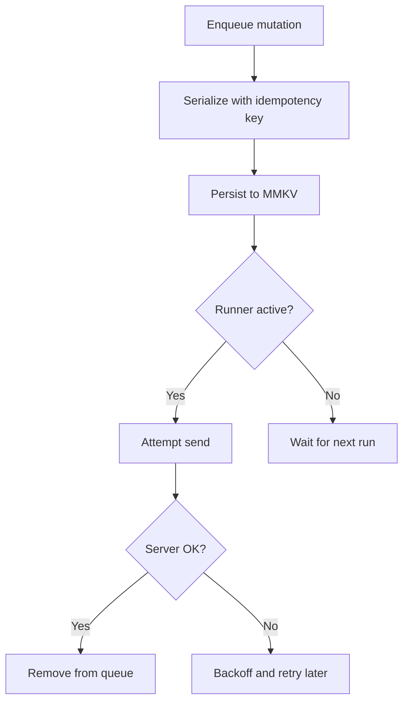
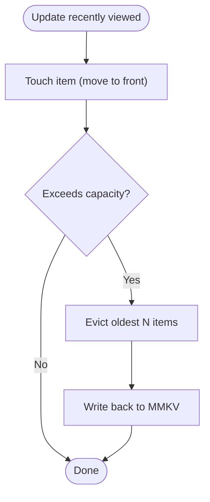
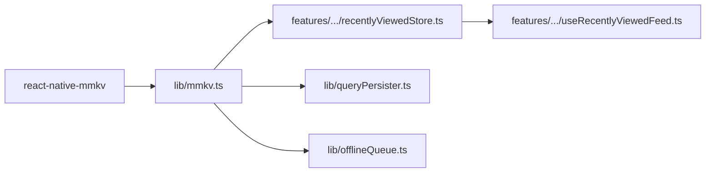

# Local Storage Architecture

<cite>
**Referenced Files in This Document**
- [mmkv.ts](file://apps/shopper-native/src/lib/mmkv.ts)
- [recentlyViewedStore.ts](file://apps/shopper-native/src/features/products/stores/recentlyViewedStore.ts)
- [useRecentlyViewedFeed.ts](file://apps/shopper-native/src/features/recommendations/hooks/useRecentlyViewedFeed.ts)
- [offlineQueue.ts](file://apps/shopper-native/src/lib/offlineQueue.ts)
- [queryPersister.ts](file://apps/shopper-native/src/lib/queryPersister.ts)
- [package.json](file://apps/shopper-native/package.json)
</cite>

## Table of Contents
1. [Introduction](#introduction)
2. [Project Structure](#project-structure)
3. [Core Components](#core-components)
4. [Architecture Overview](#architecture-overview)
5. [Detailed Component Analysis](#detailed-component-analysis)
6. [Dependency Analysis](#dependency-analysis)
7. [Performance Considerations](#performance-considerations)
8. [Troubleshooting Guide](#troubleshooting-guide)
9. [Conclusion](#conclusion)
10. [Appendices](#appendices)

## Introduction
This document explains the local storage architecture used by the shopper-native application to deliver high-performance key-value operations and robust data persistence across app sessions. The system centers on MMKV for fast, synchronous key-value storage with a memory fallback when native modules are unavailable. It integrates with TanStack Query via a query persister to cache query results locally, enabling stale-while-revalidate behavior and offline resilience. An offline mutation queue persists write operations to disk so they can be retried later. Together, these components provide:
- A unified storage abstraction over MMKV and an in-memory store
- Configured instances for app-wide state and query result caching
- LRU-style eviction and size management for bounded storage usage
- Persistence strategies for UI state and query results
- A resilient offline queue for mutations

Note: SQLite is not present in this codebase. The local storage layer relies on MMKV for key-value persistence and TanStack Query’s persisted client for query result caching.

## Project Structure
The local storage features live primarily under apps/shopper-native/src/lib and feature-specific stores/hooks that consume them:
- lib/mmkv.ts: Abstraction and configuration for MMKV instances with a memory fallback
- lib/queryPersister.ts: Persists TanStack Query cache to MMKV for offline-first reads
- lib/offlineQueue.ts: MMKV-backed queue for offline mutations with idempotency and retry
- features/products/stores/recentlyViewedStore.ts: LRU-backed recently viewed list stored in MMKV
- features/recommendations/hooks/useRecentlyViewedFeed.ts: Reads from the MMKV-backed store to render recommendations

**Diagram sources**
- [mmkv.ts:34-46](file://apps/shopper-native/src/lib/mmkv.ts#L34-L46)
- [recentlyViewedStore.ts:1-60](file://apps/shopper-native/src/features/products/stores/recentlyViewedStore.ts#L1-L60)
- [useRecentlyViewedFeed.ts:1-40](file://apps/shopper-native/src/features/recommendations/hooks/useRecentlyViewedFeed.ts#L1-L40)
- [offlineQueue.ts:1-100](file://apps/shopper-native/src/lib/offlineQueue.ts#L1-L100)
- [queryPersister.ts:1-200](file://apps/shopper-native/src/lib/queryPersister.ts#L1-L200)

**Section sources**
- [mmkv.ts:1-60](file://apps/shopper-native/src/lib/mmkv.ts#L1-L60)
- [recentlyViewedStore.ts:1-60](file://apps/shopper-native/src/features/products/stores/recentlyViewedStore.ts#L1-L60)
- [useRecentlyViewedFeed.ts:1-40](file://apps/shopper-native/src/features/recommendations/hooks/useRecentlyViewedFeed.ts#L1-L40)
- [offlineQueue.ts:1-100](file://apps/shopper-native/src/lib/offlineQueue.ts#L1-L100)
- [queryPersister.ts:1-200](file://apps/shopper-native/src/lib/queryPersister.ts#L1-L200)

## Core Components
- MMKV Abstraction and Instances
  - Provides a typed wrapper around react-native-mmkv with a safe memory fallback if the native module cannot be loaded
  - Exposes two instances:
    - appKV: general-purpose app state (e.g., settings, flags)
    - queryCacheKV: dedicated instance for TanStack Query cache
- Query Result Caching (TanStack Query Persister)
  - Serializes query responses into MMKV and restores them on app start
  - Enables stale-while-revalidate: UI renders cached data immediately while fetching fresh data in the background
- Offline Mutation Queue
  - Persists pending writes to MMKV with idempotency keys
  - Retries failed mutations when connectivity returns; includes aggressive truncation on storage full
- Recently Viewed Store (LRU)
  - Maintains a capped, LRU-ordered list of recently viewed items in MMKV
  - Evicts oldest entries when capacity is exceeded or when MMKV reports it is full

**Section sources**
- [mmkv.ts:21-46](file://apps/shopper-native/src/lib/mmkv.ts#L21-L46)
- [queryPersister.ts:1-200](file://apps/shopper-native/src/lib/queryPersister.ts#L1-L200)
- [offlineQueue.ts:1-100](file://apps/shopper-native/src/lib/offlineQueue.ts#L1-L100)
- [recentlyViewedStore.ts:1-60](file://apps/shopper-native/src/features/products/stores/recentlyViewedStore.ts#L1-L60)

## Architecture Overview
The storage layer abstracts MMKV behind a simple API and composes higher-level services:
- App state and small datasets use appKV directly
- Query results are persisted via queryPersister using queryCacheKV
- Writes go through the offline queue to ensure durability and eventual consistency
- Feature stores (e.g., recently viewed) manage their own LRU policies and sizes

**Diagram sources**
- [recentlyViewedStore.ts:1-60](file://apps/shopper-native/src/features/products/stores/recentlyViewedStore.ts#L1-L60)
- [queryPersister.ts:1-200](file://apps/shopper-native/src/lib/queryPersister.ts#L1-L200)
- [offlineQueue.ts:1-100](file://apps/shopper-native/src/lib/offlineQueue.ts#L1-L100)
- [mmkv.ts:34-46](file://apps/shopper-native/src/lib/mmkv.ts#L34-L46)

## Detailed Component Analysis

### MMKV Abstraction and Configuration
- Purpose: Provide a consistent key-value interface with automatic fallback to an in-memory store if the native MMKV module fails to initialize
- Key behaviors:
  - Creates named instances for isolation (app state vs query cache)
  - Wraps instantiation in try/catch to avoid crashes and degrade gracefully
  - Exposes standard get/set semantics suitable for JSON-serializable values
- Performance characteristics:
  - Synchronous JSI-backed operations for minimal overhead
  - Separate instances reduce contention between app state and large query caches

**Diagram sources**
- [mmkv.ts:34-46](file://apps/shopper-native/src/lib/mmkv.ts#L34-L46)

**Section sources**
- [mmkv.ts:21-46](file://apps/shopper-native/src/lib/mmkv.ts#L21-L46)

### Query Result Caching with TanStack Query Persister
- Purpose: Persist query responses to MMKV to support offline-first reads and faster re-renders
- Behavior:
  - On read: return cached response if available (stale), then refetch in background
  - On write: invalidate relevant queries to trigger refetch and update cache
  - Uses a dedicated MMKV instance (queryCacheKV) to isolate cache data
- Data serialization:
  - Stores structured query payloads keyed by query identifiers
  - Supports TTL-based invalidation where applicable

**Diagram sources**
- [queryPersister.ts:1-200](file://apps/shopper-native/src/lib/queryPersister.ts#L1-L200)
- [mmkv.ts:45-46](file://apps/shopper-native/src/lib/mmkv.ts#L45-L46)

**Section sources**
- [queryPersister.ts:1-200](file://apps/shopper-native/src/lib/queryPersister.ts#L1-L200)
- [mmkv.ts:45-46](file://apps/shopper-native/src/lib/mmkv.ts#L45-L46)

### Offline Mutation Queue
- Purpose: Ensure writes survive app restarts and network failures
- Behavior:
  - Each mutation is serialized with an idempotency key to prevent duplicates
  - Stored in MMKV until successfully acknowledged by the server
  - Includes aggressive truncation when MMKV reports it is full to keep the app responsive
- Retry strategy:
  - Periodic runner attempts to flush queued mutations when connectivity is available
  - Failed items remain queued for subsequent retries

**Diagram sources**
- [offlineQueue.ts:1-100](file://apps/shopper-native/src/lib/offlineQueue.ts#L1-L100)

**Section sources**
- [offlineQueue.ts:1-100](file://apps/shopper-native/src/lib/offlineQueue.ts#L1-L100)

### Recently Viewed Store (LRU)
- Purpose: Maintain a bounded list of recently viewed items for quick access and recommendations
- Behavior:
  - Keeps only IDs or lightweight references to minimize MMKV footprint
  - Applies LRU policy: move accessed items to front, evict oldest when exceeding capacity
  - Handles MMKV full errors by trimming the oldest half and retrying once
- Integration:
  - Consumed by recommendation hooks to render a carousel of recent items without network calls

**Diagram sources**
- [recentlyViewedStore.ts:1-60](file://apps/shopper-native/src/features/products/stores/recentlyViewedStore.ts#L1-L60)

**Section sources**
- [recentlyViewedStore.ts:1-60](file://apps/shopper-native/src/features/products/stores/recentlyViewedStore.ts#L1-L60)

### Conceptual Overview
- Stale-while-revalidate pattern:
  - Immediate UI responsiveness using cached data
  - Background refresh updates cache and triggers re-render when new data arrives
- Storage limits and cleanup:
  - LRU eviction for bounded lists
  - Aggressive truncation on storage-full conditions
  - Isolated instances to prevent cache bloat from affecting app state

[No sources needed since this section doesn't analyze specific files]

## Dependency Analysis
- External dependency: react-native-mmkv provides the underlying JSI-backed storage
- Internal dependencies:
  - Features depend on lib/mmkv.ts for storage primitives
  - Hooks and stores compose lib/mmkv.ts and lib/queryPersister.ts for caching
  - Offline queue depends on lib/mmkv.ts for persistence

**Diagram sources**
- [package.json:68-68](file://apps/shopper-native/package.json#L68-L68)
- [mmkv.ts:18-46](file://apps/shopper-native/src/lib/mmkv.ts#L18-L46)
- [recentlyViewedStore.ts:1-60](file://apps/shopper-native/src/features/products/stores/recentlyViewedStore.ts#L1-L60)
- [useRecentlyViewedFeed.ts:1-40](file://apps/shopper-native/src/features/recommendations/hooks/useRecentlyViewedFeed.ts#L1-L40)
- [queryPersister.ts:1-200](file://apps/shopper-native/src/lib/queryPersister.ts#L1-L200)
- [offlineQueue.ts:1-100](file://apps/shopper-native/src/lib/offlineQueue.ts#L1-L100)

**Section sources**
- [package.json:68-68](file://apps/shopper-native/package.json#L68-L68)
- [mmkv.ts:18-46](file://apps/shopper-native/src/lib/mmkv.ts#L18-L46)

## Performance Considerations
- Use separate MMKV instances:
  - appKV for small, frequently accessed app state
  - queryCacheKV for larger, less frequent query payloads to reduce contention
- Keep payload sizes small:
  - Store lightweight references (IDs) in LRU lists rather than full objects
  - Avoid storing large binary blobs in MMKV
- Leverage stale-while-revalidate:
  - Minimize perceived latency by serving cached data immediately
  - Configure appropriate cache lifetimes to balance freshness and performance
- Monitor storage pressure:
  - Handle MMKV full errors gracefully by trimming oldest entries
  - Implement periodic cleanup jobs to remove expired or unused cache entries

[No sources needed since this section provides general guidance]

## Troubleshooting Guide
- MMKV initialization failure:
  - Symptom: Native module not available; app falls back to in-memory storage
  - Impact: Data lost on process restart
  - Resolution: Ensure react-native-mmkv is linked and available on the platform
- Storage full errors:
  - Symptom: Writes fail due to insufficient space
  - Mitigation: Aggressively trim oldest entries; consider reducing cache size or TTL
- Stale data issues:
  - Symptom: UI shows outdated information after server updates
  - Resolution: Invalidate affected queries on mutations; adjust cache lifetimes
- Offline queue backlog:
  - Symptom: Many pending mutations after long offline periods
  - Resolution: Increase retry frequency; implement batched sends; monitor queue size

**Section sources**
- [mmkv.ts:34-46](file://apps/shopper-native/src/lib/mmkv.ts#L34-L46)
- [recentlyViewedStore.ts:40-60](file://apps/shopper-native/src/features/products/stores/recentlyViewedStore.ts#L40-L60)
- [offlineQueue.ts:60-100](file://apps/shopper-native/src/lib/offlineQueue.ts#L60-L100)

## Conclusion
The shopper-native local storage architecture uses MMKV as a high-performance key-value store with a robust memory fallback, combined with TanStack Query’s persisted client to enable offline-first reads and stale-while-revalidate patterns. An offline mutation queue ensures durable writes, while feature-specific stores like the recently viewed list apply LRU policies to maintain bounded storage usage. This design balances speed, reliability, and resource efficiency across app sessions.

[No sources needed since this section summarizes without analyzing specific files]

## Appendices

### Examples and Best Practices
- Storing different data types:
  - Strings, numbers, booleans, arrays, and plain objects are supported via JSON serialization
  - For complex objects, normalize and store minimal necessary fields
- Handling large datasets:
  - Prefer pagination and selective caching
  - Use queryCacheKV for query results; avoid caching entire catalogs
- Managing storage limits effectively:
  - Set reasonable capacities for LRU lists
  - Implement TTL-based invalidation for query cache
  - Monitor and prune unused entries periodically

[No sources needed since this section provides general guidance]