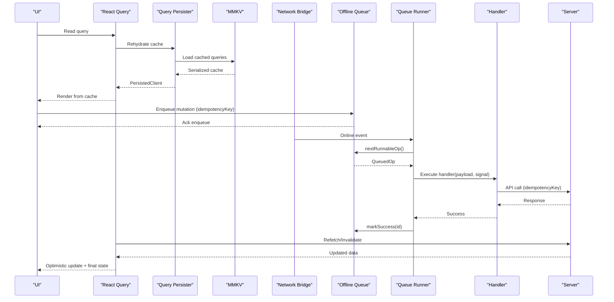
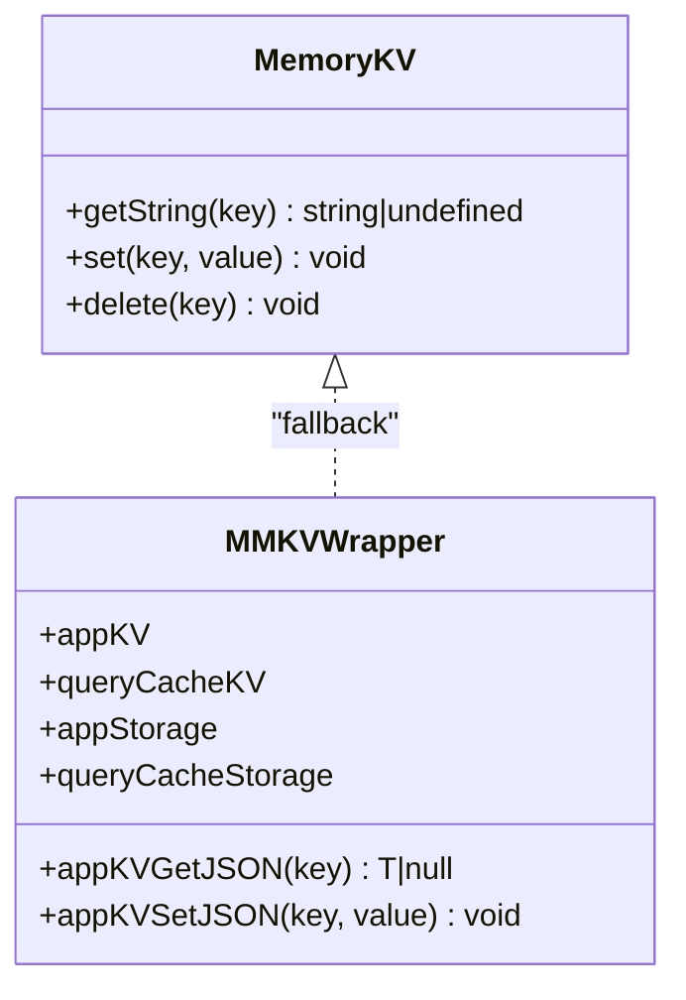
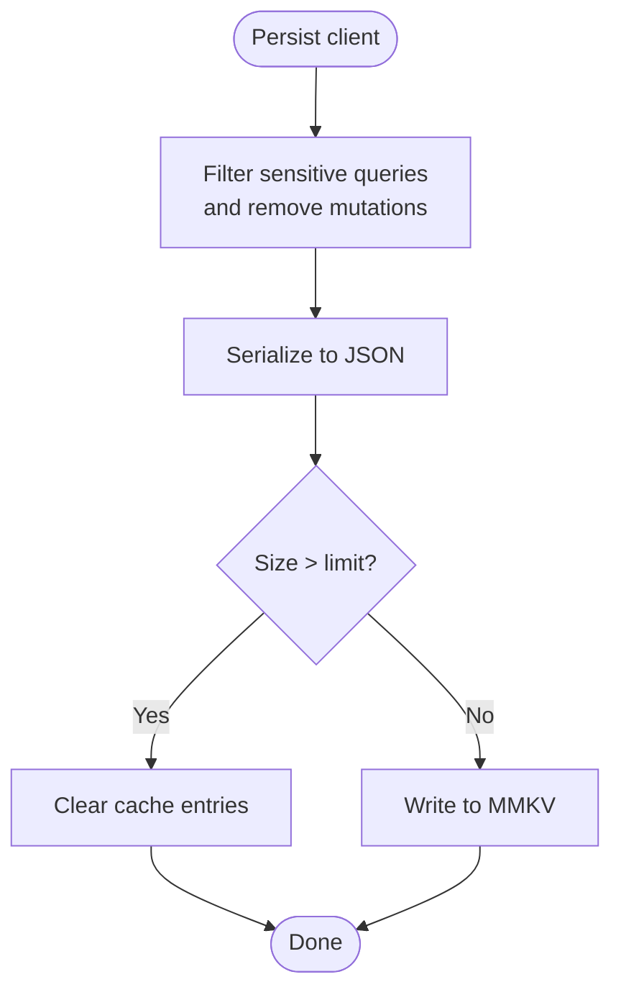
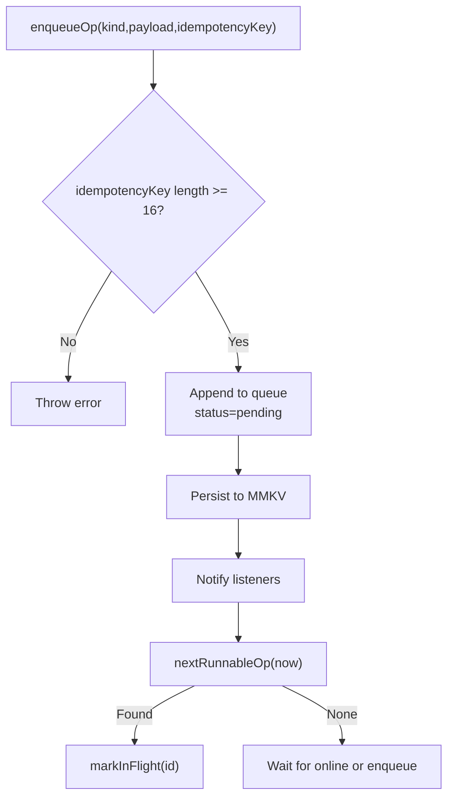
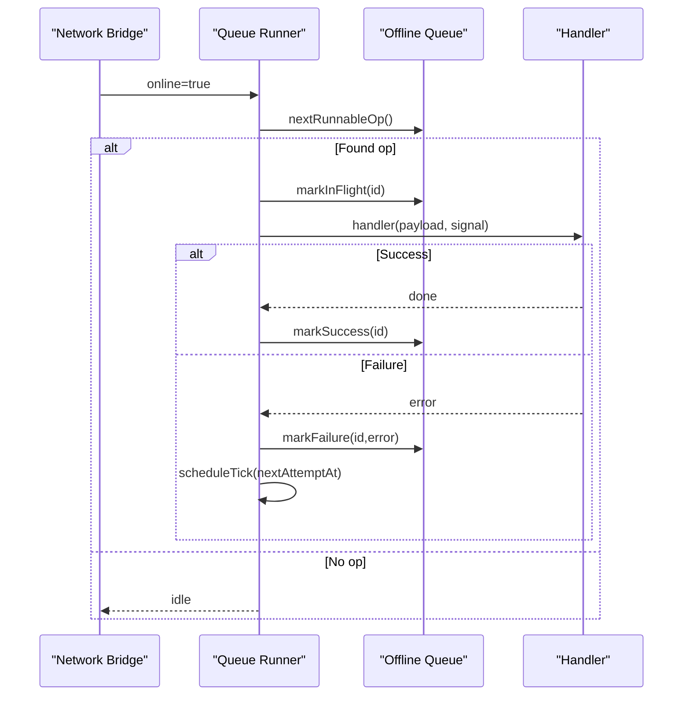
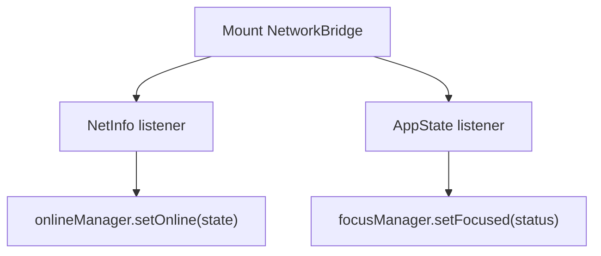
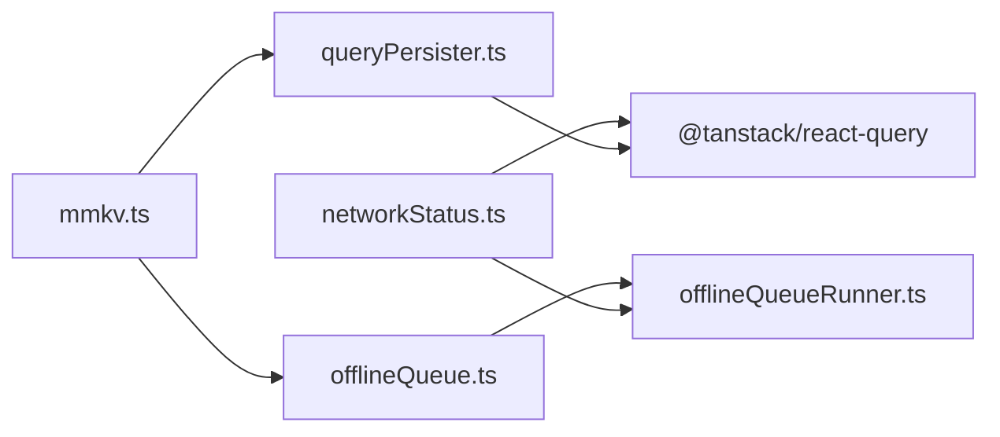

# Offline Mode & Data Synchronization

<cite>
**Referenced Files in This Document**
- [mmkv.ts](file://apps/shopper-native/src/lib/mmkv.ts)
- [offlineQueue.ts](file://apps/shopper-native/src/lib/offlineQueue.ts)
- [offlineQueueRunner.ts](file://apps/shopper-native/src/lib/offlineQueueRunner.ts)
- [networkStatus.ts](file://apps/shopper-native/src/lib/networkStatus.ts)
- [queryPersister.ts](file://apps/shopper-native/src/lib/queryPersister.ts)
</cite>

## Table of Contents
1. Introduction
2. Project Structure
3. Core Components
4. Architecture Overview
5. Detailed Component Analysis
6. Dependency Analysis
7. Performance Considerations
8. Troubleshooting Guide
9. Conclusion

## Introduction
This document explains the offline-first architecture and data synchronization strategy implemented in the shopper-native application. It covers local storage using MMKV for fast key-value operations, React Query persistence for query cache, an offline mutation queue with idempotency and retry logic, network-aware behavior, and strategies for conflict detection and reconciliation. It also provides guidance on optimistic UI updates, background sync, and user experience during connectivity issues.

## Project Structure
The offline capabilities are centered around a small set of modules under apps/shopper-native/src/lib:
- Storage layer: MMKV-backed synchronous key-value store with safe fallbacks.
- Persistence layer: React Query persister that serializes to MMKV with size limits and sensitive data filtering.
- Queue layer: A persistent, idempotent, FIFO queue for mutations with backoff and failure handling.
- Runner layer: A singleton that drains the queue when online and aborts in-flight work when offline.
- Network bridge: Bridges device connectivity and app focus state into React Query’s online/focus managers.

```mermaid
graph TB
UI["UI / Screens"]
RQ["React Query Client"]
Persister["Query Persister (MMKV)"]
MMKV["MMKV Instances"]
NetBridge["Network Bridge"]
Queue["Offline Queue"]
Runner["Queue Runner"]
Handlers["Registered Handlers"]
Server["Backend API"]
UI --> RQ
RQ < --> Persister
Persister < --> MMKV
NetBridge --> RQ
UI --> Queue
Queue --> Runner
Runner --> Handlers
Handlers --> Server
NetBridge --> Runner
```

**Diagram sources**
- [mmkv.ts:1-97](file://apps/shopper-native/src/lib/mmkv.ts#L1-L97)
- [queryPersister.ts:1-96](file://apps/shopper-native/src/lib/queryPersister.ts#L1-L96)
- [offlineQueue.ts:1-247](file://apps/shopper-native/src/lib/offlineQueue.ts#L1-L247)
- [offlineQueueRunner.ts:1-158](file://apps/shopper-native/src/lib/offlineQueueRunner.ts#L1-L158)
- [networkStatus.ts:1-46](file://apps/shopper-native/src/lib/networkStatus.ts#L1-L46)

**Section sources**
- [mmkv.ts:1-97](file://apps/shopper-native/src/lib/mmkv.ts#L1-L97)
- [queryPersister.ts:1-96](file://apps/shopper-native/src/lib/queryPersister.ts#L1-L96)
- [offlineQueue.ts:1-247](file://apps/shopper-native/src/lib/offlineQueue.ts#L1-L247)
- [offlineQueueRunner.ts:1-158](file://apps/shopper-native/src/lib/offlineQueueRunner.ts#L1-L158)
- [networkStatus.ts:1-46](file://apps/shopper-native/src/lib/networkStatus.ts#L1-L46)

## Core Components
- MMKV storage wrapper: Provides two isolated instances for app preferences and React Query cache, with an in-memory fallback if native initialization fails. Exposes a SyncStorage interface compatible with React Query’s persister.
- Query persister: Serializes successful queries to MMKV while excluding sensitive prefixes and mutations; enforces a maximum serialized size to avoid blocking cold starts; includes cache busting and corruption recovery.
- Offline queue: A persisted, idempotent, FIFO queue for mutations with exponential backoff, jitter, attempt limits, and manual controls to drop or clear failed operations.
- Queue runner: Drains the queue when online, aborts in-flight requests when going offline, schedules next attempts based on backoff windows, and emits observability metrics.
- Network bridge: Connects NetInfo and AppState to React Query’s onlineManager and focusManager so queries pause/resume and refetch appropriately.

**Section sources**
- [mmkv.ts:1-97](file://apps/shopper-native/src/lib/mmkv.ts#L1-L97)
- [queryPersister.ts:1-96](file://apps/shopper-native/src/lib/queryPersister.ts#L1-L96)
- [offlineQueue.ts:1-247](file://apps/shopper-native/src/lib/offlineQueue.ts#L1-L247)
- [offlineQueueRunner.ts:1-158](file://apps/shopper-native/src/lib/offlineQueueRunner.ts#L1-L158)
- [networkStatus.ts:1-46](file://apps/shopper-native/src/lib/networkStatus.ts#L1-L46)

## Architecture Overview
The system follows an offline-first pattern:
- Reads are served from React Query cache, which is persisted to MMKV for instant cold-start rendering.
- Writes are captured by the offline queue and executed when online; handlers perform server calls with idempotency keys to prevent duplicates.
- Network changes drive both React Query behavior and queue execution; going offline aborts in-flight work cleanly.



**Diagram sources**
- [queryPersister.ts:1-96](file://apps/shopper-native/src/lib/queryPersister.ts#L1-L96)
- [mmkv.ts:1-97](file://apps/shopper-native/src/lib/mmkv.ts#L1-L97)
- [offlineQueue.ts:1-247](file://apps/shopper-native/src/lib/offlineQueue.ts#L1-L247)
- [offlineQueueRunner.ts:1-158](file://apps/shopper-native/src/lib/offlineQueueRunner.ts#L1-L158)
- [networkStatus.ts:1-46](file://apps/shopper-native/src/lib/networkStatus.ts#L1-L46)

## Detailed Component Analysis

### MMKV Storage Layer
- Two isolated instances: one for durable app settings and another for React Query cache.
- Safe fallback to an in-memory Map if native MMKV cannot initialize, preventing hard crashes before React starts.
- Exposes a SyncStorage interface used by React Query’s persister.
- Typed helpers for JSON values in app settings.



**Diagram sources**
- [mmkv.ts:1-97](file://apps/shopper-native/src/lib/mmkv.ts#L1-L97)

**Section sources**
- [mmkv.ts:1-97](file://apps/shopper-native/src/lib/mmkv.ts#L1-L97)

### React Query Cache Persistence
- Filters out sensitive query prefixes and mutations from persistence to protect privacy.
- Enforces a maximum serialized size to avoid long cold-start parse times; clears cache if exceeded.
- Uses a cache buster to invalidate incompatible caches after schema changes.
- Gracefully handles corrupted or incompatible persisted data by clearing and booting clean.



**Diagram sources**
- [queryPersister.ts:1-96](file://apps/shopper-native/src/lib/queryPersister.ts#L1-L96)

**Section sources**
- [queryPersister.ts:1-96](file://apps/shopper-native/src/lib/queryPersister.ts#L1-L96)

### Offline Mutation Queue
- Stores queued operations in MMKV with status tracking, attempt counts, and timestamps.
- Requires an idempotency key per operation to ensure safe retries without duplicate side effects.
- Supports enqueue, mark in-flight, success, failure with backoff/jitter, drop, and clear failed.
- Emits snapshots via a subscriber pattern for UI visibility and debugging.



**Diagram sources**
- [offlineQueue.ts:1-247](file://apps/shopper-native/src/lib/offlineQueue.ts#L1-L247)

**Section sources**
- [offlineQueue.ts:1-247](file://apps/shopper-native/src/lib/offlineQueue.ts#L1-L247)

### Queue Runner
- Starts once at app root; subscribes to React Query’s onlineManager and queue changes.
- Drains the queue when online; aborts in-flight requests when going offline.
- Applies exponential backoff with jitter and caps attempts; logs observability metrics.
- Provides pokeQueue for manual retry affordances.



**Diagram sources**
- [offlineQueueRunner.ts:1-158](file://apps/shopper-native/src/lib/offlineQueueRunner.ts#L1-L158)
- [offlineQueue.ts:1-247](file://apps/shopper-native/src/lib/offlineQueue.ts#L1-L247)

**Section sources**
- [offlineQueueRunner.ts:1-158](file://apps/shopper-native/src/lib/offlineQueueRunner.ts#L1-L158)
- [offlineQueue.ts:1-247](file://apps/shopper-native/src/lib/offlineQueue.ts#L1-L247)

### Network Bridge
- Listens to NetInfo and AppState to update React Query’s onlineManager and focusManager.
- Ensures queries pause when truly offline and refetch on reconnect or app focus.



**Diagram sources**
- [networkStatus.ts:1-46](file://apps/shopper-native/src/lib/networkStatus.ts#L1-L46)

**Section sources**
- [networkStatus.ts:1-46](file://apps/shopper-native/src/lib/networkStatus.ts#L1-L46)

## Dependency Analysis
- The runner depends on the queue and React Query’s onlineManager; it does not directly depend on network libraries.
- The queue persists to MMKV and exposes a subscription API for UI components.
- The persister depends on MMKV and a cache buster constant to manage compatibility.
- The network bridge connects platform networking APIs to React Query’s managers.



**Diagram sources**
- [mmkv.ts:1-97](file://apps/shopper-native/src/lib/mmkv.ts#L1-L97)
- [queryPersister.ts:1-96](file://apps/shopper-native/src/lib/queryPersister.ts#L1-L96)
- [offlineQueue.ts:1-247](file://apps/shopper-native/src/lib/offlineQueue.ts#L1-L247)
- [offlineQueueRunner.ts:1-158](file://apps/shopper-native/src/lib/offlineQueueRunner.ts#L1-L158)
- [networkStatus.ts:1-46](file://apps/shopper-native/src/lib/networkStatus.ts#L1-L46)

**Section sources**
- [mmkv.ts:1-97](file://apps/shopper-native/src/lib/mmkv.ts#L1-L97)
- [queryPersister.ts:1-96](file://apps/shopper-native/src/lib/queryPersister.ts#L1-L96)
- [offlineQueue.ts:1-247](file://apps/shopper-native/src/lib/offlineQueue.ts#L1-L247)
- [offlineQueueRunner.ts:1-158](file://apps/shopper-native/src/lib/offlineQueueRunner.ts#L1-L158)
- [networkStatus.ts:1-46](file://apps/shopper-native/src/lib/networkStatus.ts#L1-L46)

## Performance Considerations
- Use MMKV for synchronous, JSI-backed reads/writes to avoid blocking the UI thread.
- Persist only successful queries and exclude sensitive data to keep cache size manageable.
- Enforce a maximum serialized cache size to prevent long cold-start parsing; clear cache if exceeded.
- Keep the offline queue short and process serially to avoid backend race conditions; use idempotency keys to safely replay.
- Apply exponential backoff with jitter to reduce server load and improve resilience.
- Abort in-flight requests when going offline to free resources promptly.

[No sources needed since this section provides general guidance]

## Troubleshooting Guide
- If MMKV fails to initialize, the code falls back to an in-memory store; check logs for initialization errors and verify native module availability.
- If the persisted cache becomes too large, it will be cleared automatically; monitor cache sizes and consider reducing payload or query scope.
- If a queued operation has no registered handler, the runner logs a warning and reschedules; ensure handlers are registered before enqueueing.
- For repeated failures, inspect lastError and attempt count; use manual retry or drop operations from the queue UI.
- If queries do not refetch on reconnect, verify the network bridge is mounted and onlineManager is updated correctly.

**Section sources**
- [mmkv.ts:1-97](file://apps/shopper-native/src/lib/mmkv.ts#L1-L97)
- [queryPersister.ts:1-96](file://apps/shopper-native/src/lib/queryPersister.ts#L1-L96)
- [offlineQueueRunner.ts:1-158](file://apps/shopper-native/src/lib/offlineQueueRunner.ts#L1-L158)
- [offlineQueue.ts:1-247](file://apps/shopper-native/src/lib/offlineQueue.ts#L1-L247)
- [networkStatus.ts:1-46](file://apps/shopper-native/src/lib/networkStatus.ts#L1-L46)

## Conclusion
The offline-first design combines fast MMKV-backed storage, a robust React Query persistence layer, and a resilient offline mutation queue with idempotency and automatic retries. Network awareness ensures smooth transitions between online and offline states, while safeguards like cache size limits and corruption recovery maintain reliability. By registering handlers for each operation kind and leveraging optimistic UI updates, the app delivers a responsive experience even under poor connectivity.

[No sources needed since this section summarizes without analyzing specific files]