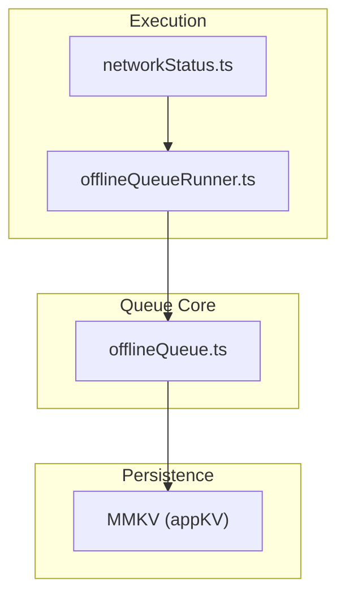
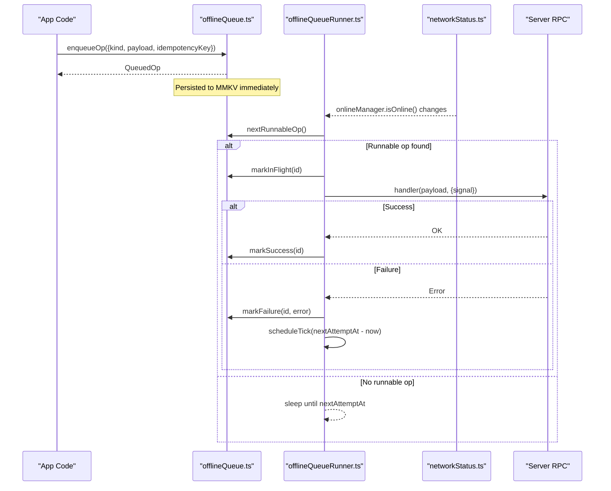
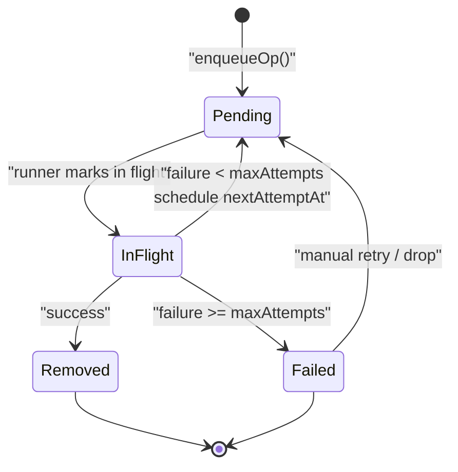
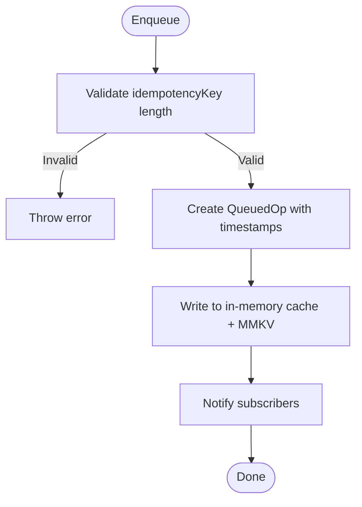
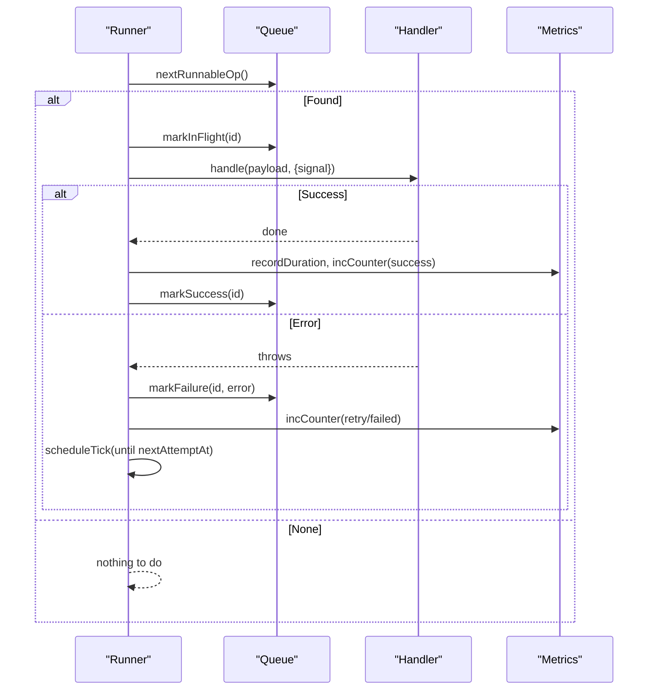
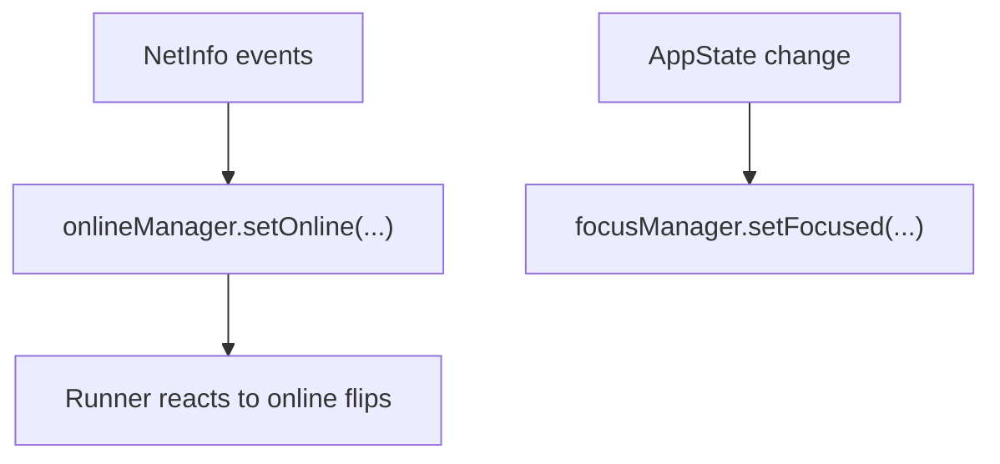
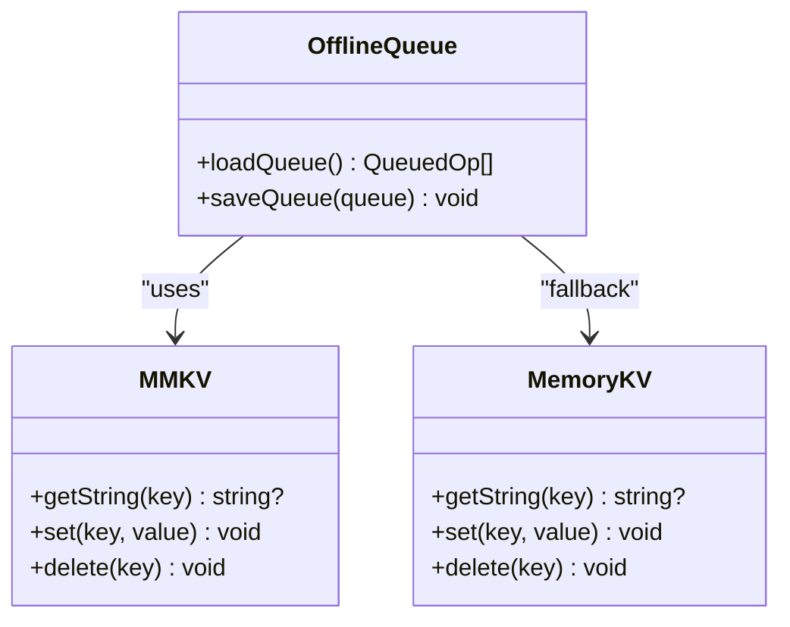

# Offline Queue Management

<cite>
**Referenced Files in This Document**
- [offlineQueue.ts](file://apps/shopper-native/src/lib/offlineQueue.ts)
- [offlineQueueRunner.ts](file://apps/shopper-native/src/lib/offlineQueueRunner.ts)
- [networkStatus.ts](file://apps/shopper-native/src/lib/networkStatus.ts)
- [mmkv.ts](file://apps/shopper-native/src/lib/mmkv.ts)
</cite>

## Table of Contents
1. [Introduction](#introduction)
2. [Project Structure](#project-structure)
3. [Core Components](#core-components)
4. [Architecture Overview](#architecture-overview)
5. [Detailed Component Analysis](#detailed-component-analysis)
6. [Dependency Analysis](#dependency-analysis)
7. [Performance Considerations](#performance-considerations)
8. [Troubleshooting Guide](#troubleshooting-guide)
9. [Conclusion](#conclusion)
10. [Appendices](#appendices)

## Introduction
This document explains the offline queue system that persists and retries pending operations when connectivity is unavailable or intermittent. It covers how operations are queued, prioritized, retried with exponential backoff, persisted across app restarts, monitored, and debugged. It also details idempotency guarantees, conflict handling strategies, memory management, and background processing considerations.

## Project Structure
The offline queue spans a small set of focused modules:
- Persistence layer using MMKV for durable storage
- Queue core for enqueueing, state transitions, and retry scheduling
- Runner that drives execution based on network status and schedules retries
- Network bridge that feeds React Query’s online/focus managers from device signals

**Diagram sources**
- [offlineQueue.ts:1-247](file://apps/shopper-native/src/lib/offlineQueue.ts#L1-L247)
- [offlineQueueRunner.ts:1-158](file://apps/shopper-native/src/lib/offlineQueueRunner.ts#L1-L158)
- [networkStatus.ts:1-46](file://apps/shopper-native/src/lib/networkStatus.ts#L1-L46)
- [mmkv.ts:1-97](file://apps/shopper-native/src/lib/mmkv.ts#L1-L97)

**Section sources**
- [offlineQueue.ts:1-247](file://apps/shopper-native/src/lib/offlineQueue.ts#L1-L247)
- [offlineQueueRunner.ts:1-158](file://apps/shopper-native/src/lib/offlineQueueRunner.ts#L1-L158)
- [networkStatus.ts:1-46](file://apps/shopper-native/src/lib/networkStatus.ts#L1-L46)
- [mmkv.ts:1-97](file://apps/shopper-native/src/lib/mmkv.ts#L1-L97)

## Core Components
- Queued operation model: Each item carries an id, kind, payload, idempotencyKey, status, attempt count, timestamps, and last error.
- Handler registry: A map from kind to handler functions; handlers execute the actual work and must be idempotent.
- Persistence: The queue is serialized to MMKV and rehydrated on load; safe truncation prevents full-store corruption.
- Runner: Drives execution when online, aborts mid-flight requests on reconnect, and schedules next attempts respecting backoff windows.
- Network bridge: Connects NetInfo and AppState to React Query’s onlineManager and focusManager so queries pause/resume appropriately.

**Section sources**
- [offlineQueue.ts:36-56](file://apps/shopper-native/src/lib/offlineQueue.ts#L36-L56)
- [offlineQueue.ts:68-106](file://apps/shopper-native/src/lib/offlineQueue.ts#L68-L106)
- [offlineQueueRunner.ts:1-158](file://apps/shopper-native/src/lib/offlineQueueRunner.ts#L1-L158)
- [networkStatus.ts:1-46](file://apps/shopper-native/src/lib/networkStatus.ts#L1-L46)

## Architecture Overview
The system is designed around three phases: enqueue, run, and persist.

**Diagram sources**
- [offlineQueue.ts:143-197](file://apps/shopper-native/src/lib/offlineQueue.ts#L143-L197)
- [offlineQueueRunner.ts:33-131](file://apps/shopper-native/src/lib/offlineQueueRunner.ts#L33-L131)
- [networkStatus.ts:18-44](file://apps/shopper-native/src/lib/networkStatus.ts#L18-L44)

## Detailed Component Analysis

### Queue Model and State Machine
- States: pending → in_flight → removed (success) or failed (after max attempts).
- Idempotency: Every op includes an idempotencyKey enforced at enqueue time; server-side RPCs cache by this key to prevent double-processing.
- Backoff: Exponential with jitter and a cap; after max attempts, ops move to failed for manual inspection/retry.

**Diagram sources**
- [offlineQueue.ts:36-50](file://apps/shopper-native/src/lib/offlineQueue.ts#L36-L50)
- [offlineQueue.ts:170-197](file://apps/shopper-native/src/lib/offlineQueue.ts#L170-L197)

**Section sources**
- [offlineQueue.ts:28-34](file://apps/shopper-native/src/lib/offlineQueue.ts#L28-L34)
- [offlineQueue.ts:143-197](file://apps/shopper-native/src/lib/offlineQueue.ts#L143-L197)

### Enqueue and Persistence
- Enqueue validates idempotencyKey length and creates a new op with initial timestamps and status.
- The queue is cached in memory and written to MMKV on every mutation; on read, it loads from storage if not cached.
- On MMKV full, the queue is aggressively truncated to the most recent entries to preserve overall queue integrity.

**Diagram sources**
- [offlineQueue.ts:143-160](file://apps/shopper-native/src/lib/offlineQueue.ts#L143-L160)
- [offlineQueue.ts:68-106](file://apps/shopper-native/src/lib/offlineQueue.ts#L68-L106)

**Section sources**
- [offlineQueue.ts:68-106](file://apps/shopper-native/src/lib/offlineQueue.ts#L68-L106)
- [offlineQueue.ts:143-160](file://apps/shopper-native/src/lib/offlineQueue.ts#L143-L160)

### Runner and Retry Scheduling
- Subscribes to onlineManager; ticks when online and queues wake on any enqueue.
- For each tick: pick next runnable op, resolve handler, mark in flight, execute with AbortSignal, record metrics, then either remove on success or schedule retry on failure.
- Sleeps until the next op’s nextAttemptAt to honor backoff windows.

**Diagram sources**
- [offlineQueueRunner.ts:33-131](file://apps/shopper-native/src/lib/offlineQueueRunner.ts#L33-L131)
- [offlineQueue.ts:162-197](file://apps/shopper-native/src/lib/offlineQueue.ts#L162-L197)

**Section sources**
- [offlineQueueRunner.ts:33-131](file://apps/shopper-native/src/lib/offlineQueueRunner.ts#L33-L131)

### Network Integration
- Bridges NetInfo to onlineManager and AppState to focusManager.
- Ensures queries pause while offline and resume on reconnect; runner uses the same online signal to drive queue processing.

**Diagram sources**
- [networkStatus.ts:18-44](file://apps/shopper-native/src/lib/networkStatus.ts#L18-L44)
- [offlineQueueRunner.ts:33-52](file://apps/shopper-native/src/lib/offlineQueueRunner.ts#L33-L52)

**Section sources**
- [networkStatus.ts:1-46](file://apps/shopper-native/src/lib/networkStatus.ts#L1-L46)

### Storage and Fallback
- Uses MMKV for fast, synchronous persistence; falls back to an in-memory Map if native module fails to initialize.
- Queue data is stored under a dedicated key; corrupted entries are cleared on parse errors.

**Diagram sources**
- [mmkv.ts:20-46](file://apps/shopper-native/src/lib/mmkv.ts#L20-L46)
- [offlineQueue.ts:68-106](file://apps/shopper-native/src/lib/offlineQueue.ts#L68-L106)

**Section sources**
- [mmkv.ts:1-97](file://apps/shopper-native/src/lib/mmkv.ts#L1-L97)
- [offlineQueue.ts:68-106](file://apps/shopper-native/src/lib/offlineQueue.ts#L68-L106)

## Dependency Analysis
- offlineQueueRunner depends on offlineQueue for queue operations and on networkStatus via React Query’s onlineManager for lifecycle control.
- offlineQueue depends on mmkv for persistence and exposes a handler registry for decoupled business logic.
- networkStatus depends on platform APIs and React Query managers to synchronize app state with device state.

**Diagram sources**
- [offlineQueueRunner.ts:16-25](file://apps/shopper-native/src/lib/offlineQueueRunner.ts#L16-L25)
- [offlineQueue.ts:24-24](file://apps/shopper-native/src/lib/offlineQueue.ts#L24-L24)
- [networkStatus.ts:13-16](file://apps/shopper-native/src/lib/networkStatus.ts#L13-L16)

**Section sources**
- [offlineQueueRunner.ts:16-25](file://apps/shopper-native/src/lib/offlineQueueRunner.ts#L16-L25)
- [offlineQueue.ts:24-24](file://apps/shopper-native/src/lib/offlineQueue.ts#L24-L24)
- [networkStatus.ts:13-16](file://apps/shopper-native/src/lib/networkStatus.ts#L13-L16)

## Performance Considerations
- Serial processing avoids backend race conditions and simplifies conflict resolution; head-of-line blocking is acceptable given short queues.
- Exponential backoff with jitter reduces thundering herd and server pressure during outages.
- MMKV provides synchronous, JSI-backed storage; truncation strategy protects against full-store failures.
- Metrics recording (duration and counters) enables performance monitoring per operation kind.

[No sources needed since this section provides general guidance]

## Troubleshooting Guide
Common issues and recovery patterns:
- Missing handler: If an op kind has no registered handler, the runner logs a warning and reschedules briefly to avoid permanent parking. Ensure handlers register before enqueuing.
- Max retries reached: Ops move to failed; inspect lastError and either retry manually or drop the op.
- MMKV full: Queue is truncated to recent entries; investigate storage usage and consider reducing payload sizes.
- Mid-flight cancellation: Going offline aborts in-flight requests; ensure handlers respect AbortSignal to release resources promptly.

**Section sources**
- [offlineQueueRunner.ts:80-92](file://apps/shopper-native/src/lib/offlineQueueRunner.ts#L80-L92)
- [offlineQueue.ts:178-197](file://apps/shopper-native/src/lib/offlineQueue.ts#L178-L197)
- [offlineQueue.ts:83-95](file://apps/shopper-native/src/lib/offlineQueue.ts#L83-L95)

## Conclusion
The offline queue provides a robust, persistent, and observable mechanism to handle operations during connectivity issues. With idempotency keys, serial execution, exponential backoff, and clear failure states, it ensures reliable delivery while keeping the user informed and in control. Monitoring hooks and safe storage fallbacks make it production-ready for mobile environments.

[No sources needed since this section summarizes without analyzing specific files]

## Appendices

### Implementing Custom Queue Handlers
- Register a handler for a unique kind before enqueuing operations of that kind.
- Handlers receive payload and a context with an AbortSignal; use it to cancel long-running work when going offline.
- Errors should be thrown to trigger retry logic; successful completion returns normally.

**Section sources**
- [offlineQueue.ts:58-66](file://apps/shopper-native/src/lib/offlineQueue.ts#L58-L66)
- [offlineQueueRunner.ts:94-124](file://apps/shopper-native/src/lib/offlineQueueRunner.ts#L94-L124)

### Conflict Resolution Strategies
- Use idempotency keys to deduplicate server-side operations.
- Serialize per-user mutations through the single-queue design to avoid concurrent writes.
- For multi-user scenarios, scope idempotency keys to user/account boundaries.

**Section sources**
- [offlineQueue.ts:16-21](file://apps/shopper-native/src/lib/offlineQueue.ts#L16-L21)
- [offlineQueue.ts:143-146](file://apps/shopper-native/src/lib/offlineQueue.ts#L143-L146)

### Transaction Rollback Mechanisms
- The queue itself does not wrap multiple operations in a transaction; instead, rely on idempotency and atomic server-side RPCs.
- If a batch must be atomic, group into a single RPC keyed by a composite idempotency key.

[No sources needed since this section provides general guidance]

### Queue Monitoring and Debugging
- Observe queue length and snapshot via provided APIs for UI indicators.
- Inspect failed ops’ lastError to diagnose issues.
- Use built-in metrics (counters and durations) to track throughput and latency per kind.

**Section sources**
- [offlineQueue.ts:128-134](file://apps/shopper-native/src/lib/offlineQueue.ts#L128-L134)
- [offlineQueueRunner.ts:97-120](file://apps/shopper-native/src/lib/offlineQueueRunner.ts#L97-L120)

### Persistence Across App Restarts
- Queue is persisted to MMKV; on app start, the runner resumes automatically when online.
- In-memory cache is refreshed from storage on first read.

**Section sources**
- [offlineQueue.ts:68-106](file://apps/shopper-native/src/lib/offlineQueue.ts#L68-L106)
- [offlineQueueRunner.ts:33-52](file://apps/shopper-native/src/lib/offlineQueueRunner.ts#L33-L52)

### Size Limits and Memory Management
- Aggressive truncation on MMKV full preserves recent queue items.
- Keep payloads small to avoid large JSON serialization overhead.
- Clear failed ops periodically to free space.

**Section sources**
- [offlineQueue.ts:83-95](file://apps/shopper-native/src/lib/offlineQueue.ts#L83-L95)
- [offlineQueue.ts:203-209](file://apps/shopper-native/src/lib/offlineQueue.ts#L203-L209)

### Background Processing Considerations
- Runner respects onlineManager; it will not run while truly offline.
- Handlers should be resilient to interruptions via AbortSignal.
- Avoid heavy CPU work in handlers; prefer lightweight networking calls.

**Section sources**
- [offlineQueueRunner.ts:37-44](file://apps/shopper-native/src/lib/offlineQueueRunner.ts#L37-L44)
- [offlineQueueRunner.ts:94-124](file://apps/shopper-native/src/lib/offlineQueueRunner.ts#L94-L124)