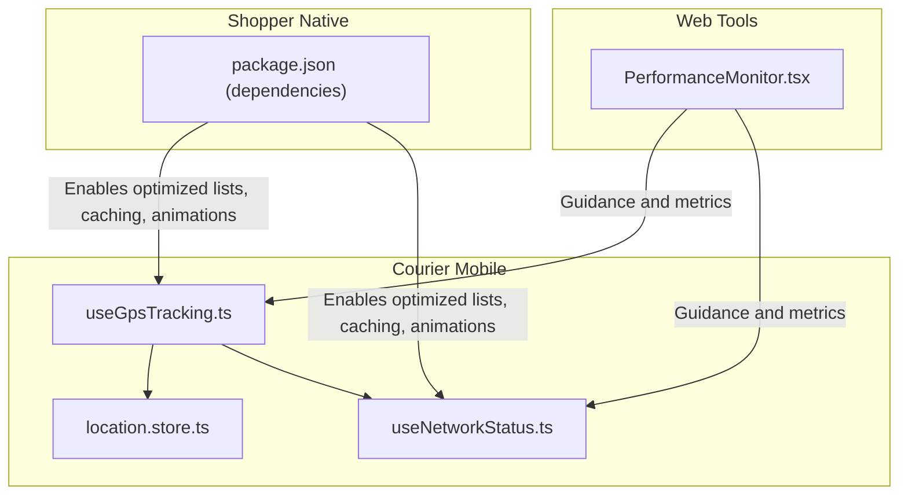
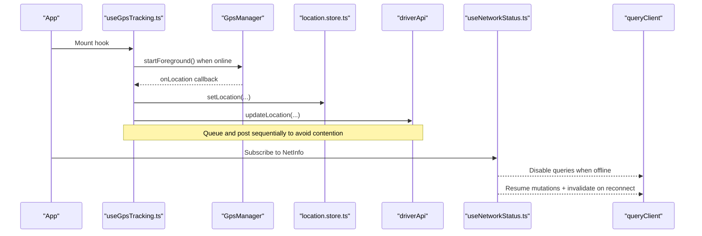
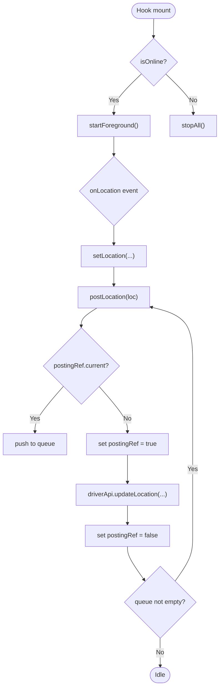
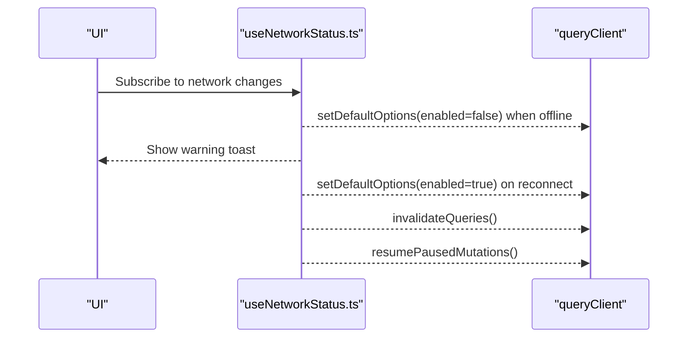
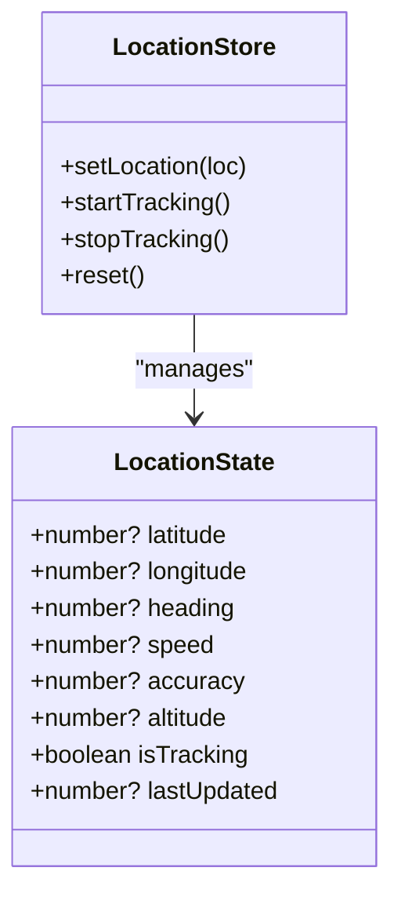
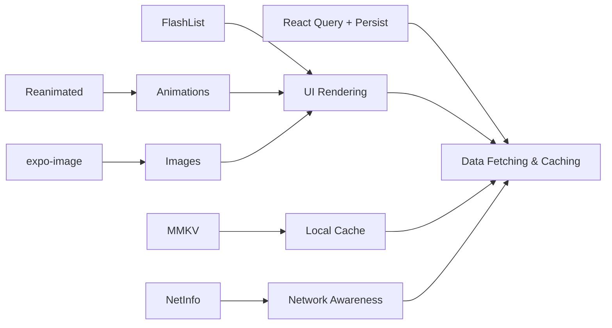

# Performance Optimization & Battery Management

<cite>
**Referenced Files in This Document**
- [PERFORMANCE_OPTIMIZATION_GUIDE.md](file://PERFORMANCE_OPTIMIZATION_GUIDE.md)
- [useGpsTracking.ts](file://apps/courier-mobile/src/hooks/useGpsTracking.ts)
- [useNetworkStatus.ts](file://apps/courier-mobile/src/hooks/useNetworkStatus.ts)
- [location.store.ts](file://apps/courier-mobile/src/stores/location.store.ts)
- [package.json (shopper-native)](file://apps/shopper-native/package.json)
- [PerformanceMonitor.tsx](file://apps/shopper-web/src/components/PerformanceMonitor.tsx)
</cite>

## Table of Contents
1. Introduction
2. Project Structure
3. Core Components
4. Architecture Overview
5. Detailed Component Analysis
6. Dependency Analysis
7. Performance Considerations
8. Troubleshooting Guide
9. Conclusion
10. Appendices

## Introduction
This document provides a comprehensive guide to mobile performance optimization and battery management for the project’s mobile applications. It covers memory management, garbage collection considerations, efficient data structures, battery-saving strategies for location services, background tasks, and network requests, as well as performance monitoring using React Native tools and custom metrics. It also includes image optimization, lazy loading, bundle size reduction, startup time improvements, rendering performance, smooth scrolling, debugging/profiling techniques, and performance testing methodologies grounded in the codebase.

## Project Structure
The repository contains multiple apps and shared packages. For mobile performance and battery management, the most relevant areas are:
- Courier mobile app hooks and stores that implement GPS tracking and network-aware behavior
- Shopper native app dependencies indicating performance-oriented libraries (e.g., FlashList, MMKV, Reanimated)
- Web performance monitor component used for real-time metrics and guidance

**Diagram sources**
- [useGpsTracking.ts:1-110](file://apps/courier-mobile/src/hooks/useGpsTracking.ts#L1-L110)
- [useNetworkStatus.ts:1-41](file://apps/courier-mobile/src/hooks/useNetworkStatus.ts#L1-L41)
- [location.store.ts:1-44](file://apps/courier-mobile/src/stores/location.store.ts#L1-L44)
- [package.json (shopper-native):17-79](file://apps/shopper-native/package.json#L17-L79)
- [PerformanceMonitor.tsx](file://apps/shopper-web/src/components/PerformanceMonitor.tsx)

**Section sources**
- [useGpsTracking.ts:1-110](file://apps/courier-mobile/src/hooks/useGpsTracking.ts#L1-L110)
- [useNetworkStatus.ts:1-41](file://apps/courier-mobile/src/hooks/useNetworkStatus.ts#L1-L41)
- [location.store.ts:1-44](file://apps/courier-mobile/src/stores/location.store.ts#L1-L44)
- [package.json (shopper-native):17-79](file://apps/shopper-native/package.json#L17-L79)
- [PerformanceMonitor.tsx](file://apps/shopper-web/src/components/PerformanceMonitor.tsx)

## Core Components
- GPS Tracking Hook: Orchestrates foreground/background location updates, posts locations efficiently, and integrates with state stores.
- Network Status Hook: Monitors connectivity, pauses/resumes queries, and invalidates stale data on reconnect.
- Location Store: Lightweight Zustand store for current location, tracking state, and timestamps.
- Performance Monitor (Web): Provides real-time metrics and actionable tips to guide optimization efforts.

Key responsibilities:
- Minimize redundant work by batching and debouncing where appropriate
- Avoid unnecessary re-renders via stable refs and selective subscriptions
- Reduce network overhead by pausing queries offline and resuming intelligently
- Leverage platform APIs for efficient background operations

**Section sources**
- [useGpsTracking.ts:1-110](file://apps/courier-mobile/src/hooks/useGpsTracking.ts#L1-L110)
- [useNetworkStatus.ts:1-41](file://apps/courier-mobile/src/hooks/useNetworkStatus.ts#L1-L41)
- [location.store.ts:1-44](file://apps/courier-mobile/src/stores/location.store.ts#L1-L44)
- [PerformanceMonitor.tsx](file://apps/shopper-web/src/components/PerformanceMonitor.tsx)

## Architecture Overview
The mobile performance architecture centers around three pillars:
- Efficient location capture and posting with adaptive intervals and background handling
- Network-aware data fetching that respects connectivity and reduces wasted work
- Optimized UI rendering and media handling through modern libraries

**Diagram sources**
- [useGpsTracking.ts:1-110](file://apps/courier-mobile/src/hooks/useGpsTracking.ts#L1-L110)
- [useNetworkStatus.ts:1-41](file://apps/courier-mobile/src/hooks/useNetworkStatus.ts#L1-L41)
- [location.store.ts:1-44](file://apps/courier-mobile/src/stores/location.store.ts#L1-L44)

## Detailed Component Analysis

### GPS Tracking Hook (Battery and Performance)
- Foreground vs background tracking: Starts foreground tracking when the driver is online; starts background tracking during active deliveries; resumes foreground on app resume if needed.
- Stable callbacks: Uses a ref to hold the latest handler to avoid stale closures and repeated registrations.
- Posting strategy: Batches queued locations and posts them one-by-one to prevent concurrent writes and reduce CPU/network spikes.
- State integration: Updates a lightweight location store with filtered coordinates and metadata.

**Diagram sources**
- [useGpsTracking.ts:1-110](file://apps/courier-mobile/src/hooks/useGpsTracking.ts#L1-L110)

**Section sources**
- [useGpsTracking.ts:1-110](file://apps/courier-mobile/src/hooks/useGpsTracking.ts#L1-L110)

### Network-Aware Data Fetching
- Connectivity monitoring: Subscribes to NetInfo events to track connection state.
- Offline behavior: Disables query refetches while offline and notifies users.
- Reconnect behavior: Re-enables queries, invalidates stale data, and resumes paused mutations.

**Diagram sources**
- [useNetworkStatus.ts:1-41](file://apps/courier-mobile/src/hooks/useNetworkStatus.ts#L1-L41)

**Section sources**
- [useNetworkStatus.ts:1-41](file://apps/courier-mobile/src/hooks/useNetworkStatus.ts#L1-L41)

### Location Store (Memory-Efficient State)
- Minimal shape: Stores only necessary fields (coordinates, heading, speed, accuracy, altitude), plus tracking flags and last updated timestamp.
- Immutable updates: Creates new objects on each change to keep components predictable and easy to diff.
- Selective subscriptions: Consumers subscribe to specific slices to minimize re-renders.

**Diagram sources**
- [location.store.ts:1-44](file://apps/courier-mobile/src/stores/location.store.ts#L1-L44)

**Section sources**
- [location.store.ts:1-44](file://apps/courier-mobile/src/stores/location.store.ts#L1-L44)

### Performance Monitoring and Guidance
- Real-time metrics: Tracks page load times, cache hit rates, memory usage, and network performance.
- Actionable feedback: Provides grades and tips to guide developers toward better performance.
- Integration points: Can be extended to surface mobile-specific metrics or connect to analytics.

**Section sources**
- [PERFORMANCE_OPTIMIZATION_GUIDE.md:1-270](file://PERFORMANCE_OPTIMIZATION_GUIDE.md#L1-L270)
- [PerformanceMonitor.tsx](file://apps/shopper-web/src/components/PerformanceMonitor.tsx)

## Dependency Analysis
The shopper-native app includes several performance-focused dependencies:
- @shopify/flash-list: High-performance list rendering for large datasets
- react-native-mmkv: Fast key-value storage for local caching
- react-native-reanimated: Smooth animations off the JS thread
- expo-image: Optimized image loading and caching
- @react-native-community/netinfo: Network status detection
- @tanstack/react-query with persist client: Robust data fetching and caching

These libraries enable:
- Efficient rendering of large lists with virtualization
- Low-latency local reads/writes
- Smooth UI interactions without jank
- Reduced network usage via caching and persistence
- Graceful offline/online transitions

**Diagram sources**
- [package.json (shopper-native):17-79](file://apps/shopper-native/package.json#L17-L79)

**Section sources**
- [package.json (shopper-native):17-79](file://apps/shopper-native/package.json#L17-L79)

## Performance Considerations

### Memory Management and Garbage Collection
- Prefer immutable updates in stores to aid GC and simplify diffs
- Use stable refs for callbacks passed to native modules to avoid frequent allocations
- Debounce or throttle expensive computations and network calls
- Avoid holding large object graphs in memory longer than necessary; clear caches on navigation away from heavy screens

### Efficient Data Structures
- Use flat arrays for lists; prefer FlashList for large datasets
- Keep store shapes minimal and normalized
- Use MMKV for fast, compact local storage of small-to-medium datasets

### Battery Optimization for Location Services
- Use foreground tracking only when necessary; switch to background tracking during active deliveries
- Apply Kalman filtering at the source to reduce noisy updates
- Batch and queue location posts to avoid network bursts
- Respect app lifecycle: pause tracking when inactive or offline

### Background Tasks and Network Requests
- Pause query refetching while offline; resume and invalidate on reconnect
- Use exponential backoff and retries for failed requests
- Defer non-critical network work until idle or connected

### Image Optimization and Lazy Loading
- Use expo-image for automatic resizing, caching, and format selection
- Implement lazy loading for images below the fold
- Preload critical images and defer others

### Bundle Size Reduction
- Tree-shake unused code and remove dev-only imports in production
- Use code splitting and route-level lazy loading
- Audit dependencies and replace heavy libraries with lighter alternatives where possible

### Startup Time Optimization
- Minimize synchronous work during app bootstrap
- Defer heavy initialization until first user interaction
- Use splash screen and progressive content loading

### Rendering Performance and Smooth Scrolling
- Virtualize long lists with FlashList
- Memoize expensive components and derived values
- Offload animations to Reanimated to keep the main thread free

[No sources needed since this section provides general guidance]

## Troubleshooting Guide
- Excessive battery drain:
  - Verify background tracking is only enabled during active deliveries
  - Ensure location updates are filtered and posted with proper intervals
- Janky scrolling:
  - Confirm FlashList is used for large lists
  - Check for unnecessary re-renders and memoize where appropriate
- Stale data after reconnect:
  - Validate that queries are disabled offline and invalidated on reconnect
  - Ensure mutations are resumed correctly
- Large bundle sizes:
  - Analyze bundle with build tools and remove unused dependencies
  - Enable code splitting and lazy routes

**Section sources**
- [useGpsTracking.ts:1-110](file://apps/courier-mobile/src/hooks/useGpsTracking.ts#L1-L110)
- [useNetworkStatus.ts:1-41](file://apps/courier-mobile/src/hooks/useNetworkStatus.ts#L1-L41)
- [PERFORMANCE_OPTIMIZATION_GUIDE.md:1-270](file://PERFORMANCE_OPTIMIZATION_GUIDE.md#L1-L270)

## Conclusion
The codebase implements strong foundations for mobile performance and battery efficiency:
- Intelligent GPS tracking with foreground/background modes and queued posting
- Network-aware data fetching that minimizes waste and improves resilience
- Modern, performance-oriented dependencies enabling smooth UI and efficient data handling
- Real-time performance monitoring to guide ongoing optimization

Adopting the recommended practices—efficient memory use, optimized lists, image handling, and careful background task design—will further improve responsiveness, extend battery life, and deliver a superior user experience.

[No sources needed since this section summarizes without analyzing specific files]

## Appendices

### Debugging Tools and Profiling Techniques
- React DevTools: Inspect component trees, props, and state changes
- Flipper (if configured): Network inspection, logs, and performance insights
- Metro profiler: Measure render times and identify bottlenecks
- Android/iOS profilers: CPU, memory, and energy usage analysis

### Performance Testing Methodologies
- Load testing: Simulate high traffic to validate caching and pagination
- A/B tests: Compare performance across UI variants
- Real-user monitoring: Track core web vitals and custom metrics in production
- Automated checks: Integrate performance budgets into CI pipelines

[No sources needed since this section provides general guidance]