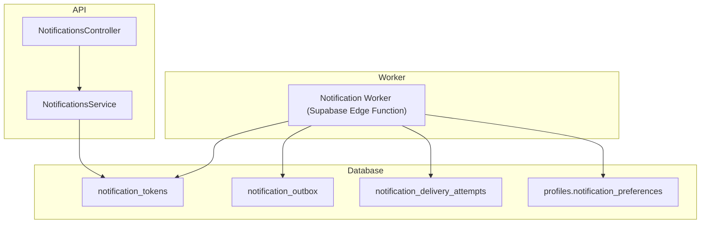
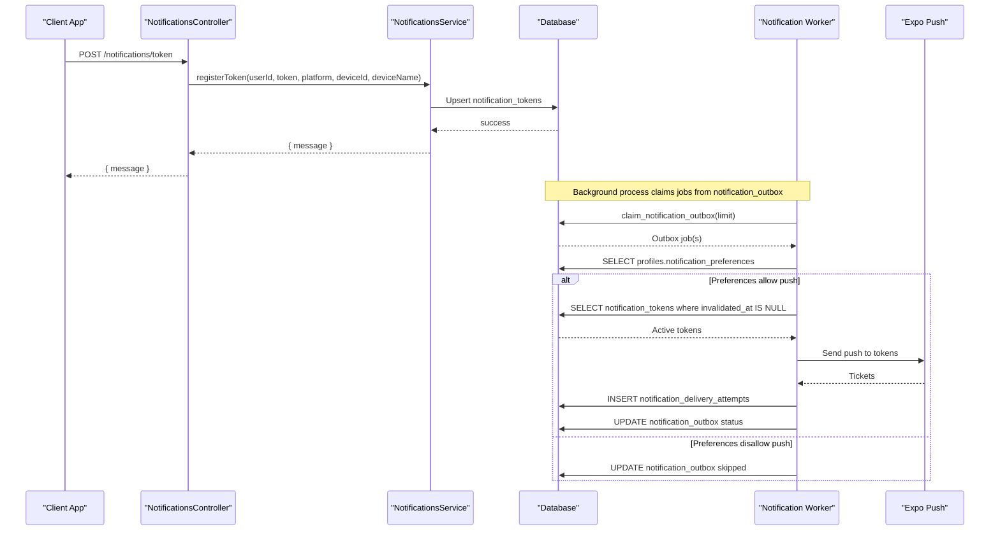
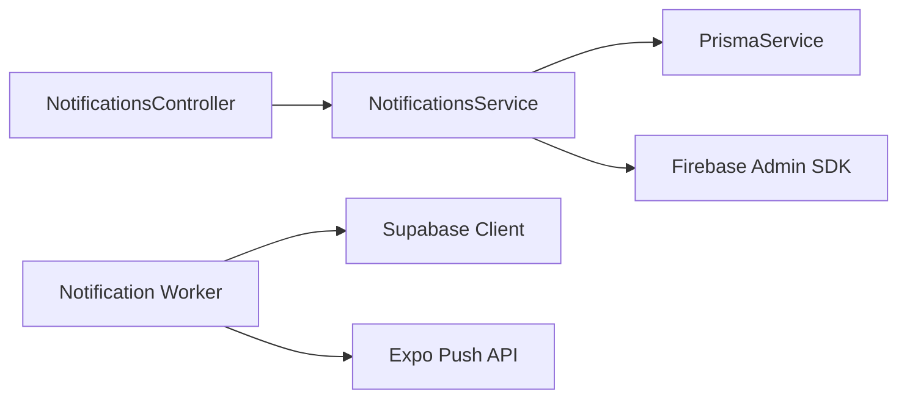

# Notification Preferences & User Control

<cite>
**Referenced Files in This Document**
- [notifications.controller.ts](file://apps/api/src/modules/notifications/notifications.controller.ts)
- [notifications.service.ts](file://apps/api/src/modules/notifications/notifications.service.ts)
- [notification-worker/index.ts](file://supabase/functions/notification-worker/index.ts)
</cite>

## Table of Contents
1. [Introduction](#introduction)
2. [Project Structure](#project-structure)
3. [Core Components](#core-components)
4. [Architecture Overview](#architecture-overview)
5. [Detailed Component Analysis](#detailed-component-analysis)
6. [Dependency Analysis](#dependency-analysis)
7. [Performance Considerations](#performance-considerations)
8. [Troubleshooting Guide](#troubleshooting-guide)
9. [Conclusion](#conclusion)
10. [Appendices](#appendices)

## Introduction
This document explains the notification preferences system that allows users to control their notification experience across channels and categories. It covers preference categories such as order updates, promotional messages, delivery alerts, and marketing communications; UI components for managing preferences; real-time synchronization; persistence mechanisms; opt-in/opt-out flows; default settings; privacy compliance; and handling edge cases like OS-level notification controls and do-not-disturb modes.

The system is implemented with:
- A backend API for token registration and broadcasting notifications
- A background worker that enforces user preferences before sending push notifications
- A database schema that stores tokens, outbox jobs, delivery attempts, and user preferences

## Project Structure
The notification preferences flow spans three primary areas:
- API module for device token management and broadcast endpoints
- Supabase Edge Function worker that reads preferences and sends push via Expo
- Database tables storing tokens, outbox, delivery attempts, and user preferences

**Diagram sources**
- [notifications.controller.ts:7-59](file://apps/api/src/modules/notifications/notifications.controller.ts#L7-L59)
- [notifications.service.ts:20-229](file://apps/api/src/modules/notifications/notifications.service.ts#L20-L229)
- [notification-worker/index.ts:37-126](file://supabase/functions/notification-worker/index.ts#L37-L126)

**Section sources**
- [notifications.controller.ts:7-59](file://apps/api/src/modules/notifications/notifications.controller.ts#L7-L59)
- [notifications.service.ts:20-229](file://apps/api/src/modules/notifications/notifications.service.ts#L20-L229)
- [notification-worker/index.ts:37-126](file://supabase/functions/notification-worker/index.ts#L37-L126)

## Core Components
- NotificationsController: Exposes endpoints for driver token registration, history retrieval, admin broadcasts, and admin history.
- NotificationsService: Manages Firebase Admin SDK initialization, token lifecycle, single/broadcast messaging, and logging.
- Notification Worker: Claims outbox jobs, checks user preferences, sends push via Expo, records delivery attempts, and handles receipts.

Key responsibilities:
- Token registration ensures only one active token per device/platform per user.
- Preference enforcement occurs in the worker before any push is sent.
- Delivery outcomes are persisted for auditability and retries.

**Section sources**
- [notifications.controller.ts:7-59](file://apps/api/src/modules/notifications/notifications.controller.ts#L7-L59)
- [notifications.service.ts:20-229](file://apps/api/src/modules/notifications/notifications.service.ts#L20-L229)
- [notification-worker/index.ts:37-126](file://supabase/functions/notification-worker/index.ts#L37-L126)

## Architecture Overview
The system separates concerns between API-driven token management and a background worker that enforces preferences and delivers push notifications.

**Diagram sources**
- [notifications.controller.ts:13-17](file://apps/api/src/modules/notifications/notifications.controller.ts#L13-L17)
- [notifications.service.ts:63-98](file://apps/api/src/modules/notifications/notifications.service.ts#L63-L98)
- [notification-worker/index.ts:43-99](file://supabase/functions/notification-worker/index.ts#L43-L99)

## Detailed Component Analysis

### NotificationsController
- Purpose: Define REST endpoints for token registration, history, and admin broadcasts.
- Key endpoints:
  - POST /notifications/token: Driver registers a push token.
  - GET /notifications/history: Driver retrieves recent notifications.
  - POST /notifications/broadcast: Admin triggers broadcasts to drivers or specific users.
  - GET /notifications/admin/history: Admin retrieves global notification logs.

Behavior highlights:
- Guards enforce role-based access for drivers and admins.
- Broadcast targets include all approved/active drivers, online drivers, or specific user IDs.

**Section sources**
- [notifications.controller.ts:7-59](file://apps/api/src/modules/notifications/notifications.controller.ts#L7-L59)

### NotificationsService
- Purpose: Manage Firebase Admin SDK, token lifecycle, and send notifications to devices.
- Token management:
  - Deactivates older tokens on the same platform/device when registering a new token.
  - Upserts the current token with metadata (platform, device info).
- Messaging:
  - Sends single messages to a token or broadcasts to multiple tokens in chunks.
  - Logs each attempt with status and error details.
  - Invalidates tokens on provider errors indicating unregistered or invalid tokens.

Preference integration note:
- The service does not check preferences directly; it persists tokens and logs. Preference enforcement happens in the worker.

**Section sources**
- [notifications.service.ts:20-229](file://apps/api/src/modules/notifications/notifications.service.ts#L20-L229)

### Notification Worker (Supabase Edge Function)
- Purpose: Process outbox jobs, enforce user preferences, deliver push via Expo, and record outcomes.
- Preference enforcement:
  - Reads profiles.notification_preferences.
  - Skips push if channels.push is false or if a category-specific flag is false.
- Delivery pipeline:
  - Claims jobs from notification_outbox.
  - Retrieves active tokens from notification_tokens.
  - Sends push via Expo and records delivery attempts.
  - Updates outbox status based on acceptance and retry policy.
  - Polls receipts to mark delivered or failed and invalidate tokens on DeviceNotRegistered.

Retry and resilience:
- Uses exponential backoff for next_attempt_at.
- Caps maximum attempts and marks jobs as failed after threshold.

**Section sources**
- [notification-worker/index.ts:37-126](file://supabase/functions/notification-worker/index.ts#L37-L126)

## Dependency Analysis
- API depends on Prisma to manage tokens and logs.
- Worker depends on Supabase client to read profiles, tokens, outbox, and attempts.
- External providers:
  - Firebase Admin SDK used by the API for direct token messaging.
  - Expo Push used by the worker for mobile push delivery.

**Diagram sources**
- [notifications.controller.ts:1-59](file://apps/api/src/modules/notifications/notifications.controller.ts#L1-L59)
- [notifications.service.ts:1-229](file://apps/api/src/modules/notifications/notifications.service.ts#L1-L229)
- [notification-worker/index.ts:1-126](file://supabase/functions/notification-worker/index.ts#L1-L126)

**Section sources**
- [notifications.controller.ts:1-59](file://apps/api/src/modules/notifications/notifications.controller.ts#L1-L59)
- [notifications.service.ts:1-229](file://apps/api/src/modules/notifications/notifications.service.ts#L1-L229)
- [notification-worker/index.ts:1-126](file://supabase/functions/notification-worker/index.ts#L1-L126)

## Performance Considerations
- Chunked multicast messaging reduces payload size and improves throughput.
- Batch claiming of outbox jobs limits database load per worker invocation.
- Retry logic with exponential backoff prevents thundering herds during failures.
- Receipt polling batches results to minimize provider calls.

[No sources needed since this section provides general guidance]

## Troubleshooting Guide
Common issues and resolutions:
- Missing Firebase credentials:
  - Symptom: API logs warnings about missing credentials and disables push.
  - Resolution: Ensure environment variables for Firebase project ID, client email, and private key are set.
- Invalid or unregistered tokens:
  - Symptom: Errors indicating unregistered or invalid tokens.
  - Resolution: Tokens are automatically deactivated; ensure clients re-register tokens on app start or after reinstall.
- Preferences blocking delivery:
  - Symptom: Jobs marked as skipped due to disabled push or category flags.
  - Resolution: Update profiles.notification_preferences to enable desired channels/categories.
- No active device tokens:
  - Symptom: Jobs skipped because no active tokens exist.
  - Resolution: Prompt users to grant notification permissions and register tokens.
- Provider errors:
  - Symptom: Expo rejects pushes or receipts indicate errors.
  - Resolution: Inspect delivery attempts and update tokens; handle DeviceNotRegistered by prompting re-registration.

**Section sources**
- [notifications.service.ts:32-48](file://apps/api/src/modules/notifications/notifications.service.ts#L32-L48)
- [notifications.service.ts:112-132](file://apps/api/src/modules/notifications/notifications.service.ts#L112-L132)
- [notification-worker/index.ts:48-65](file://supabase/functions/notification-worker/index.ts#L48-L65)
- [notification-worker/index.ts:102-124](file://supabase/functions/notification-worker/index.ts#L102-L124)

## Conclusion
The notification preferences system combines robust token management, explicit preference enforcement, and resilient delivery pipelines. Users can control whether they receive push notifications and which categories apply to them. The worker ensures compliance with preferences before any push is sent, while the API maintains accurate token state and logs for auditing. Together, these components provide a scalable, compliant, and user-centric notification experience.

[No sources needed since this section summarizes without analyzing specific files]

## Appendices

### Preference Categories and Defaults
- Channels:
  - push: Boolean flag controlling whether push notifications are allowed at all.
- Categories:
  - Per-category boolean flags (e.g., order updates, promotional messages, delivery alerts, marketing communications).
- Default behavior:
  - If channels.push is false or a category flag is false, the worker skips delivery for that job.

Implementation references:
- Preference structure and checks occur in the worker when reading profiles.notification_preferences and evaluating channels.push and category flags.

**Section sources**
- [notification-worker/index.ts:48-54](file://supabase/functions/notification-worker/index.ts#L48-L54)

### Opt-In/Opt-Out Flows
- Opt-in:
  - On first launch, prompt OS permission and register token via API endpoint.
  - Persist user’s initial preferences (e.g., allow push, enable categories).
- Opt-out:
  - Allow users to toggle channels.push or individual categories in settings.
  - Changes take effect immediately for subsequent jobs processed by the worker.

References:
- Token registration endpoint and service logic.
- Worker preference checks before sending.

**Section sources**
- [notifications.controller.ts:13-17](file://apps/api/src/modules/notifications/notifications.controller.ts#L13-L17)
- [notifications.service.ts:63-98](file://apps/api/src/modules/notifications/notifications.service.ts#L63-L98)
- [notification-worker/index.ts:48-54](file://supabase/functions/notification-worker/index.ts#L48-L54)

### Real-Time Preference Synchronization
- Immediate effect:
  - Since the worker reads preferences per job, changes propagate instantly to future deliveries.
- UI considerations:
  - Show current preference state and confirm changes.
  - Provide feedback when preferences block delivery (e.g., “Push disabled”).

**Section sources**
- [notification-worker/index.ts:48-54](file://supabase/functions/notification-worker/index.ts#L48-L54)

### Persistence Mechanisms
- Tokens:
  - Stored in notification_tokens with activation status and metadata.
- Outbox:
  - Jobs queued in notification_outbox with retry scheduling.
- Attempts:
  - Each delivery attempt recorded in notification_delivery_attempts for audit and receipt tracking.
- Preferences:
  - Stored in profiles.notification_preferences and checked per job.

**Section sources**
- [notifications.service.ts:63-98](file://apps/api/src/modules/notifications/notifications.service.ts#L63-L98)
- [notification-worker/index.ts:43-99](file://supabase/functions/notification-worker/index.ts#L43-L99)

### Privacy Compliance
- Consent-driven:
  - Only send push if user has enabled channels.push and relevant categories.
- Transparency:
  - Log all attempts and outcomes for auditability.
- Data minimization:
  - Store only necessary token metadata and preference flags.

**Section sources**
- [notification-worker/index.ts:48-54](file://supabase/functions/notification-worker/index.ts#L48-L54)
- [notifications.service.ts:213-227](file://apps/api/src/modules/notifications/notifications.service.ts#L213-L227)

### Edge Cases and Graceful Degradation
- OS-level notifications disabled:
  - Clients should detect OS permission denials and guide users to settings.
  - Worker will skip jobs if no active tokens exist.
- Do Not Disturb modes:
  - OS may suppress notifications; apps should inform users and allow snoozing or batching.
- Provider failures:
  - Retries with exponential backoff; mark as failed after max attempts.
  - Invalidate tokens on DeviceNotRegistered and prompt re-registration.

**Section sources**
- [notification-worker/index.ts:55-65](file://supabase/functions/notification-worker/index.ts#L55-L65)
- [notification-worker/index.ts:84-99](file://supabase/functions/notification-worker/index.ts#L84-L99)
- [notification-worker/index.ts:102-124](file://supabase/functions/notification-worker/index.ts#L102-L124)