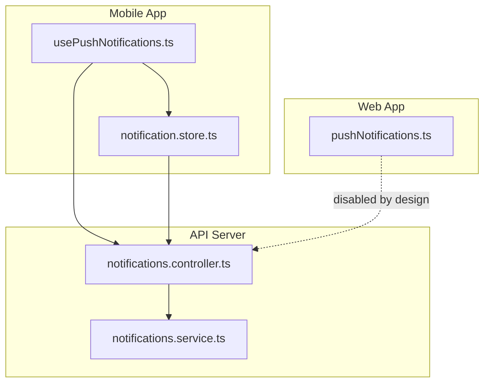
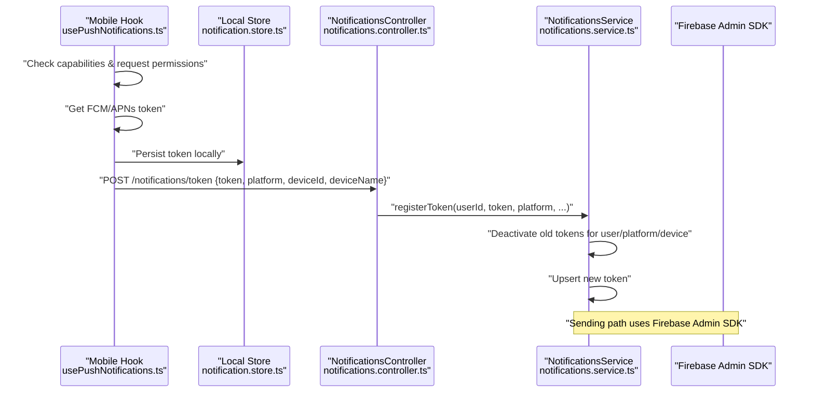
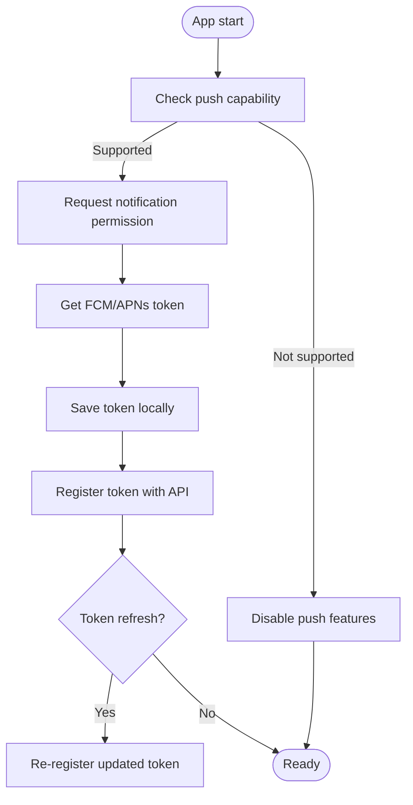
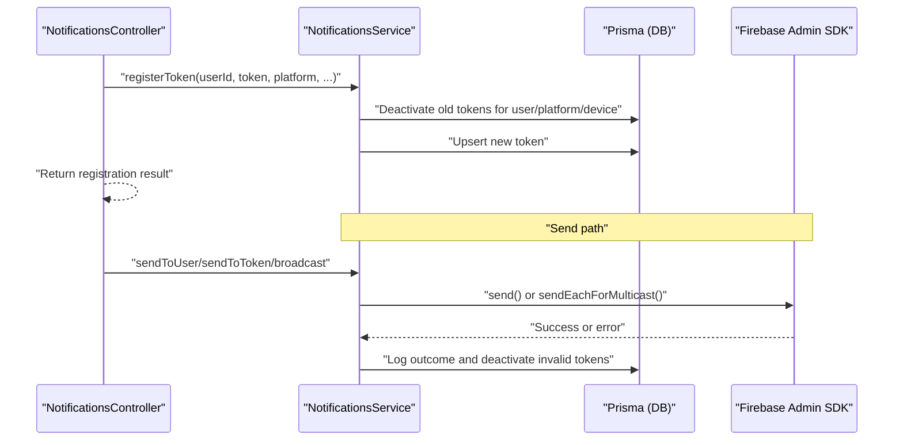
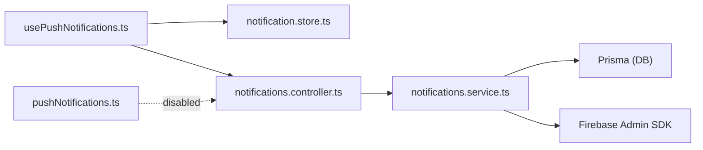

# Notification Registration & Token Management

<cite>
**Referenced Files in This Document**
- [notifications.service.ts](file://apps/api/src/modules/notifications/notifications.service.ts)
- [notifications.controller.ts](file://apps/api/src/modules/notifications/notifications.controller.ts)
- [usePushNotifications.ts](file://apps/courier-mobile/src/hooks/usePushNotifications.ts)
- [notification.store.ts](file://apps/courier-mobile/src/stores/notification.store.ts)
- [pushNotifications.ts](file://apps/shopper-web/src/services/pushNotifications.ts)
</cite>

## Table of Contents
1. Introduction
2. Project Structure
3. Core Components
4. Architecture Overview
5. Detailed Component Analysis
6. Dependency Analysis
7. Performance Considerations
8. Troubleshooting Guide
9. Conclusion

## Introduction
This document explains the push notification registration and token management system across the mobile and web clients and the API server. It covers device capability detection, platform permission handling (Android/iOS), FCM/APNs token generation and storage, the registration flow including consent prompts and background setup, token refresh mechanisms, token validation, error handling for registration failures, and fallback strategies when notifications are unavailable. Platform-specific considerations such as Android Doze mode, iOS background fetch limitations, and silent notifications are addressed.

## Project Structure
The notification system spans:
- Mobile client (Courier app): obtains tokens from the OS, stores them locally, and registers them with the API.
- Web client (Shopper web): contains a service that would forward to Expo Push; currently disabled in favor of server-owned delivery.
- API server: manages token lifecycle, sends messages via Firebase Admin SDK, and logs outcomes.

**Diagram sources**
- [usePushNotifications.ts](file://apps/courier-mobile/src/hooks/usePushNotifications.ts)
- [notification.store.ts](file://apps/courier-mobile/src/stores/notification.store.ts)
- [pushNotifications.ts](file://apps/shopper-web/src/services/pushNotifications.ts)
- [notifications.controller.ts](file://apps/api/src/modules/notifications/notifications.controller.ts)
- [notifications.service.ts](file://apps/api/src/modules/notifications/notifications.service.ts)

**Section sources**
- [notifications.controller.ts:11-25](file://apps/api/src/modules/notifications/notifications.controller.ts#L11-L25)
- [notifications.service.ts:50-98](file://apps/api/src/modules/notifications/notifications.service.ts#L50-L98)

## Core Components
- NotificationsService (API): Initializes Firebase Admin SDK, registers and deactivates tokens, sends single or broadcast messages, and logs results.
- NotificationsController (API): Exposes endpoints for drivers to register tokens and retrieve history, and for admins to broadcast notifications.
- usePushNotifications (Mobile hook): Orchestrates capability checks, permissions, token retrieval, and registration to the API.
- notification.store (Mobile store): Persists local push token and in-app notification list.
- pushNotifications (Web service): Currently disabled; enforces server-owned delivery to avoid client-side push gateways.

**Section sources**
- [notifications.service.ts:20-48](file://apps/api/src/modules/notifications/notifications.service.ts#L20-L48)
- [notifications.controller.ts:11-58](file://apps/api/src/modules/notifications/notifications.controller.ts#L11-L58)
- [notification.store.ts:1-72](file://apps/courier-mobile/src/stores/notification.store.ts#L1-L72)
- [pushNotifications.ts:1-89](file://apps/shopper-web/src/services/pushNotifications.ts#L1-L89)

## Architecture Overview
End-to-end flow:
- Device capability detection and permissions are handled on the client before requesting tokens.
- The mobile app retrieves an FCM/APNs token and registers it with the API.
- The API persists the token, deactivating older ones for the same user/platform/device to ensure one active token per context.
- When sending, the API uses Firebase Admin SDK to deliver to FCM/APNs and logs success/failure. Invalid tokens are deactivated automatically.

**Diagram sources**
- [usePushNotifications.ts](file://apps/courier-mobile/src/hooks/usePushNotifications.ts)
- [notification.store.ts:14-33](file://apps/courier-mobile/src/stores/notification.store.ts#L14-L33)
- [notifications.controller.ts:11-17](file://apps/api/src/modules/notifications/notifications.controller.ts#L11-L17)
- [notifications.service.ts:50-98](file://apps/api/src/modules/notifications/notifications.service.ts#L50-L98)

## Detailed Component Analysis

### Mobile: Capability Detection, Permissions, and Token Lifecycle
- Capability detection: Before requesting permissions, verify that the platform supports push notifications and that the necessary services are available.
- Permission handling:
  - Android: Request notification permission at runtime; configure channels for high-priority delivery.
  - iOS: Request notification permission; handle background modes and silent notifications where applicable.
- Token retrieval: Obtain the FCM/APNs token from the native messaging SDK.
- Local storage: Persist the token in the app store for quick access and UI state.
- Registration: Send the token to the API endpoint to associate it with the current user and device metadata.
- Token refresh: Listen for token refresh events and re-register the updated token with the API.

[No sources needed since this diagram shows conceptual workflow, not actual code structure]

**Section sources**
- [usePushNotifications.ts](file://apps/courier-mobile/src/hooks/usePushNotifications.ts)
- [notification.store.ts:14-33](file://apps/courier-mobile/src/stores/notification.store.ts#L14-L33)

### API: Token Registration and Delivery
- Token registration:
  - Deactivates all other active tokens for the same user and platform to ensure only the current device receives notifications.
  - Optionally deactivates tokens sharing the same deviceId to handle reinstall scenarios.
  - Upserts the new token with metadata (platform, deviceId, deviceName).
- Sending messages:
  - Single send to a specific token with platform-specific options (Android channel and priority; iOS sound and priority).
  - Broadcasts to multiple users or driver subsets using chunked multicast messages.
- Error handling:
  - Logs each attempt with status and optional error message.
  - Automatically deactivates tokens flagged as invalid or unregistered by the provider.

**Diagram sources**
- [notifications.controller.ts:11-58](file://apps/api/src/modules/notifications/notifications.controller.ts#L11-L58)
- [notifications.service.ts:50-229](file://apps/api/src/modules/notifications/notifications.service.ts#L50-L229)

**Section sources**
- [notifications.service.ts:50-98](file://apps/api/src/modules/notifications/notifications.service.ts#L50-L98)
- [notifications.service.ts:106-132](file://apps/api/src/modules/notifications/notifications.service.ts#L106-L132)
- [notifications.service.ts:136-211](file://apps/api/src/modules/notifications/notifications.service.ts#L136-L211)
- [notifications.controller.ts:11-58](file://apps/api/src/modules/notifications/notifications.controller.ts#L11-L58)

### Web: Push Delivery Policy
- The web service is intentionally disabled to enforce server-owned delivery. Any automated triggers enqueue notifications rather than calling the Expo Push gateway directly. This centralizes token management and delivery reliability.

**Section sources**
- [pushNotifications.ts:1-89](file://apps/shopper-web/src/services/pushNotifications.ts#L1-L89)

## Dependency Analysis
- Mobile depends on:
  - Native messaging SDK for token acquisition and refresh.
  - Local store for token persistence.
  - API controller endpoint for registration.
- API depends on:
  - Prisma for token and log persistence.
  - Firebase Admin SDK for FCM/APNs delivery.
- Web depends on:
  - Supabase client (currently unused due to disabled delivery).

**Diagram sources**
- [usePushNotifications.ts](file://apps/courier-mobile/src/hooks/usePushNotifications.ts)
- [notification.store.ts:14-33](file://apps/courier-mobile/src/stores/notification.store.ts#L14-L33)
- [notifications.controller.ts:11-58](file://apps/api/src/modules/notifications/notifications.controller.ts#L11-L58)
- [notifications.service.ts:20-48](file://apps/api/src/modules/notifications/notifications.service.ts#L20-L48)
- [pushNotifications.ts:1-89](file://apps/shopper-web/src/services/pushNotifications.ts#L1-L89)

**Section sources**
- [notifications.service.ts:20-48](file://apps/api/src/modules/notifications/notifications.service.ts#L20-L48)
- [notifications.controller.ts:11-58](file://apps/api/src/modules/notifications/notifications.controller.ts#L11-L58)

## Performance Considerations
- Token registration:
  - Batch deactivation of old tokens ensures minimal writes and avoids duplicate deliveries.
- Message delivery:
  - Multicast batching (chunks of 500) reduces API calls and improves throughput.
  - High priority flags and platform-specific settings improve delivery timeliness.
- Logging:
  - Non-critical logging errors are swallowed to avoid impacting delivery performance.

[No sources needed since this section provides general guidance]

## Troubleshooting Guide
Common issues and resolutions:
- Missing Firebase credentials:
  - Symptom: Push disabled; warnings logged during module initialization.
  - Resolution: Ensure environment variables for project ID, client email, and private key are set.
- Invalid or unregistered tokens:
  - Symptom: Errors indicating invalid-registration-token or registration-token-not-registered.
  - Resolution: Tokens are automatically deactivated; re-register after app reinstall or token refresh.
- No tokens registered:
  - Symptom: Zero sent, zero failed; check if the client successfully obtained and registered a token.
  - Resolution: Verify capability detection and permission prompts; confirm registration endpoint returns success.
- Background delivery constraints:
  - Android: Ensure proper notification channels and consider Doze mode impacts; use high priority and appropriate channels.
  - iOS: Configure background modes and silent notifications as needed; respect user privacy settings.

**Section sources**
- [notifications.service.ts:32-48](file://apps/api/src/modules/notifications/notifications.service.ts#L32-L48)
- [notifications.service.ts:121-132](file://apps/api/src/modules/notifications/notifications.service.ts#L121-L132)
- [notifications.service.ts:187-206](file://apps/api/src/modules/notifications/notifications.service.ts#L187-L206)

## Conclusion
The system centralizes token management and delivery on the server while delegating capability checks and permissions to the client. Tokens are kept up-to-date through refresh events and validated on send, with automatic deactivation of invalid entries. Broadcasting leverages efficient batching, and logging provides observability. Platform-specific behaviors are accounted for in message payloads and should be complemented by correct client-side configuration for optimal delivery under background and power-saving modes.