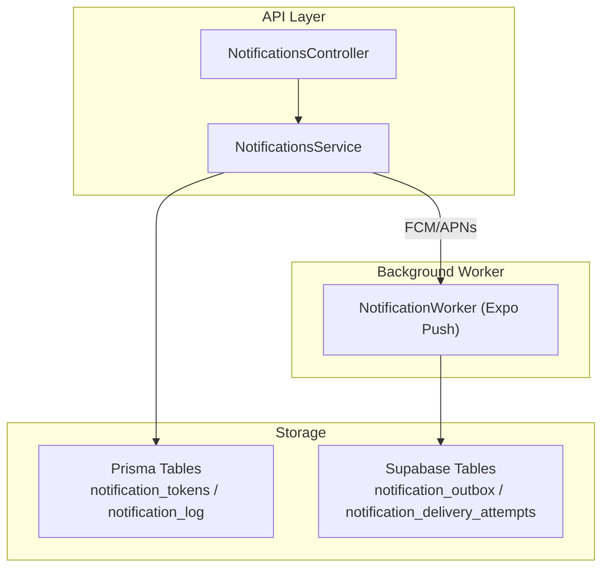
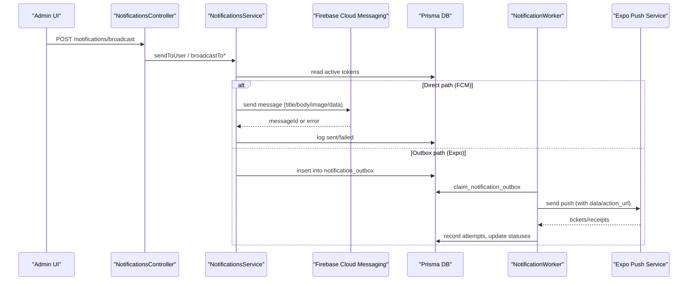
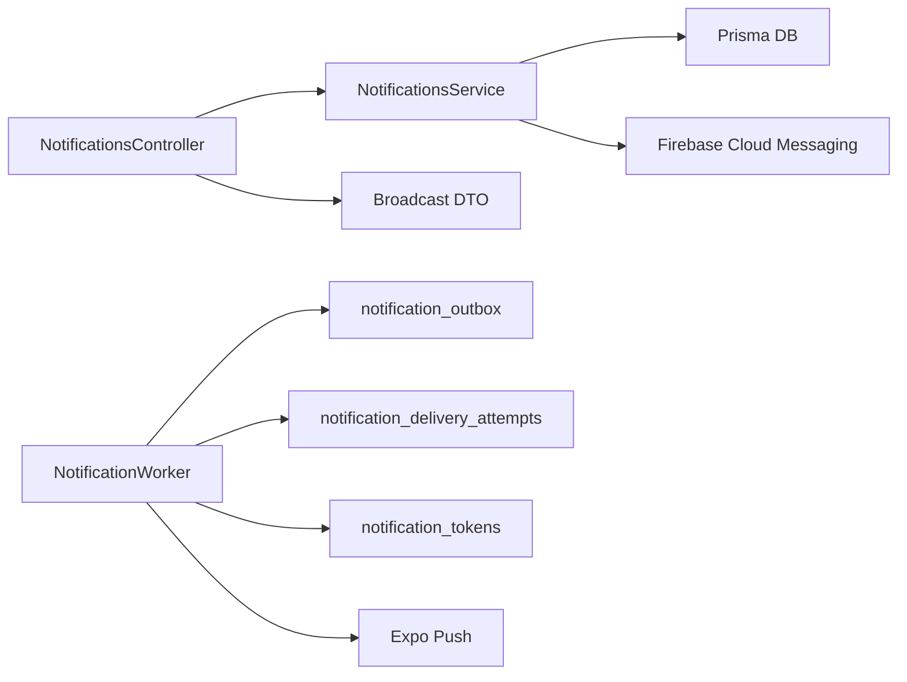

# Notification Types & Payloads

<cite>
**Referenced Files in This Document**
- [notifications.service.ts](file://apps/api/src/modules/notifications/notifications.service.ts)
- [notifications.controller.ts](file://apps/api/src/modules/notifications/notifications.controller.ts)
- [broadcast.dto.ts](file://apps/api/src/modules/notifications/dto/broadcast.dto.ts)
- [index.ts (notification-worker)](file://supabase/functions/notification-worker/index.ts)
- [20260713090000_notification_delivery_pipeline.sql](file://supabase/migrations/20260713090000_notification_delivery_pipeline.sql)
- [20260809103000_prescription_submission_notifications.sql](file://supabase/migrations/20260809103000_prescription_submission_notifications.sql)
- [20260729120000_pharmacist_customer_notifications.sql](file://supabase/migrations/20260729120000_pharmacist_customer_notifications.sql)
- [driver-orders.service.ts](file://apps/api/src/modules/driver/driver-orders.service.ts)
</cite>

## Table of Contents
1. Introduction
2. Project Structure
3. Core Components
4. Architecture Overview
5. Detailed Component Analysis
6. Dependency Analysis
7. Performance Considerations
8. Troubleshooting Guide
9. Conclusion

## Introduction
This document defines all notification types supported by the system and their payloads, with a focus on order status updates, delivery alerts, promotional messages, prescription approvals, and system notifications. It explains payload schemas, required and optional fields, validation rules, rich media support, categorization, priority, and scheduling options. It also provides examples of rich notifications with images, action buttons, and deep linking via data payloads.

## Project Structure
Notifications are implemented across:
- API layer (NestJS): token management, single and broadcast messaging to FCM/APNs, logging, and admin endpoints.
- Background worker (Supabase Edge Function): reliable delivery via Expo Push with retry, receipts, and preference-aware routing.
- Database migrations: outbox tables, delivery attempts, tokens, and domain-specific notification triggers for prescriptions and pharmacist/customer events.

**Diagram sources**
- [notifications.controller.ts:1-60](file://apps/api/src/modules/notifications/notifications.controller.ts#L1-L60)
- [notifications.service.ts:1-229](file://apps/api/src/modules/notifications/notifications.service.ts#L1-L229)
- [index.ts (notification-worker):1-127](file://supabase/functions/notification-worker/index.ts#L1-L127)
- [20260713090000_notification_delivery_pipeline.sql](file://supabase/migrations/20260713090000_notification_delivery_pipeline.sql)

**Section sources**
- [notifications.controller.ts:1-60](file://apps/api/src/modules/notifications/notifications.controller.ts#L1-L60)
- [notifications.service.ts:1-229](file://apps/api/src/modules/notifications/notifications.service.ts#L1-L229)
- [index.ts (notification-worker):1-127](file://supabase/functions/notification-worker/index.ts#L1-L127)

## Core Components
- NotificationsService: Initializes Firebase Admin SDK, manages device tokens, sends single or multicast push notifications, logs outcomes, and deactivates invalid tokens.
- NotificationsController: Exposes endpoints for driver token registration, history retrieval, and admin broadcasts to drivers/users.
- NotificationWorker: Claims jobs from an outbox table, respects user preferences, sends Expo Push messages, records delivery attempts, and reconciles receipts.

Key responsibilities:
- Token lifecycle: register, deactivate, prune duplicates per platform/device.
- Delivery: high-priority Android channels, APNs priority headers, image attachments, custom data for deep links.
- Reliability: retries with exponential backoff, receipt-based finality, preference gating.

**Section sources**
- [notifications.service.ts:20-229](file://apps/api/src/modules/notifications/notifications.service.ts#L20-L229)
- [notifications.controller.ts:1-60](file://apps/api/src/modules/notifications/notifications.controller.ts#L1-L60)
- [index.ts (notification-worker):1-127](file://supabase/functions/notification-worker/index.ts#L1-L127)

## Architecture Overview
The system supports two delivery paths:
- Direct push via Firebase Admin SDK (Android/iOS) from the API service.
- Reliable background delivery via Supabase Edge Function using Expo Push, with outbox/retry semantics.

**Diagram sources**
- [notifications.controller.ts:27-58](file://apps/api/src/modules/notifications/notifications.controller.ts#L27-L58)
- [notifications.service.ts:104-211](file://apps/api/src/modules/notifications/notifications.service.ts#L104-L211)
- [index.ts (notification-worker):37-126](file://supabase/functions/notification-worker/index.ts#L37-L126)

## Detailed Component Analysis

### Notification Types and Payloads
Below are the supported notification categories, their purpose, and payload structure. All payloads include common fields; category-specific fields are listed under each type.

Common fields
- title: string (required). Displayed as notification title.
- body: string (required). Main notification text.
- imageUrl: string (optional). Rich media attachment supported by FCM/APNs.
- data: object (optional). Key-value pairs used for deep linking and actions. Recommended keys:
  - action_url: string (optional). Deep link URL to open in-app.
  - notification_id: string (optional). Unique ID for tracking and analytics.
  - category: string (optional). Used by worker to respect user preferences.
  - orderId: string (optional). For order-related notifications.
  - driverId: string (optional). For driver-related notifications.
  - pharmacyId: string (optional). For prescription/pharmacy context.

Categorization and priority
- Categories: order_status, delivery_alert, promotion, prescription_approval, system.
- Priority:
  - Android: channel "delivery-orders" with high priority.
  - iOS: APNs priority header set to 10 (immediate), sound default, badge increment.
  - Worker (Expo): priority "high", channelId "orders".

Scheduling
- Immediate: via direct API calls.
- Delayed/retried: via outbox with exponential backoff and max attempts.

Validation rules
- title/body must be non-empty strings.
- imageUrl must be a valid URL if provided.
- data keys should conform to expected naming; unknown keys are forwarded to clients.
- category must be one of the allowed values when used by the worker.

#### Order Status Updates
Purpose: Notify customers about order lifecycle changes.
- pending: order received, awaiting preparation.
- preparing: order is being prepared.
- out-for-delivery: order has been dispatched.
- delivered: order completed.

Payload example (conceptual)
- title: "Order #12345 updated"
- body: "Your order is now preparing."
- data: { category: "order_status", orderId: "12345", action_url: "app://orders/12345" }
- imageUrl: optional order summary image

Rich behavior
- Deep link opens order details screen.
- Optional image shows order thumbnail.

**Section sources**
- [notifications.service.ts:6-11](file://apps/api/src/modules/notifications/notifications.service.ts#L6-L11)
- [notifications.service.ts:112-132](file://apps/api/src/modules/notifications/notifications.service.ts#L112-L132)
- [index.ts (notification-worker):47-70](file://supabase/functions/notification-worker/index.ts#L47-L70)

#### Delivery Alerts
Purpose: Real-time updates about driver assignment and arrival proximity.
- driver_assigned: a driver has been assigned to the order.
- arriving_soon: driver is near the customer location.

Payload example (conceptual)
- title: "Driver assigned"
- body: "Your driver is on the way."
- data: { category: "delivery_alert", orderId: "12345", driverId: "d1", action_url: "app://orders/12345/live" }
- imageUrl: optional driver avatar or vehicle image

Rich behavior
- Live tracking deep link.
- Optional image enhances engagement.

Integration points
- Driver order flow emits delivery updates that can trigger notifications.

**Section sources**
- [driver-orders.service.ts:613-616](file://apps/api/src/modules/driver/driver-orders.service.ts#L613-L616)
- [notifications.service.ts:112-132](file://apps/api/src/modules/notifications/notifications.service.ts#L112-L132)
- [index.ts (notification-worker):66-70](file://supabase/functions/notification-worker/index.ts#L66-L70)

#### Promotional Messages
Purpose: Marketing campaigns, offers, and discounts.
- Use category "promotion".
- Include campaign identifiers in data for attribution.

Payload example (conceptual)
- title: "Flash Sale: 20% off"
- body: "Shop now before it ends."
- data: { category: "promotion", campaignId: "camp_1", action_url: "app://offers/camp_1" }
- imageUrl: promotional banner

Delivery considerations
- Respect user preferences; worker skips if push disabled or category opted out.
- Can be broadcast to specific users or all drivers/customers.

**Section sources**
- [notifications.controller.ts:27-58](file://apps/api/src/modules/notifications/notifications.controller.ts#L27-L58)
- [index.ts (notification-worker):47-54](file://supabase/functions/notification-worker/index.ts#L47-L54)

#### Prescription Approvals
Purpose: Inform customers when prescriptions are reviewed/approved by pharmacists.
- Triggered by prescription review flows.

Payload example (conceptual)
- title: "Prescription approved"
- body: "Your prescription is ready for pickup/delivery."
- data: { category: "prescription_approval", pharmacyId: "ph_1", orderId: "12345", action_url: "app://prescriptions/12345" }
- imageUrl: optional pharmacy image

Integration points
- Migrations define prescription submission and review notifications.

**Section sources**
- [20260809103000_prescription_submission_notifications.sql](file://supabase/migrations/20260809103000_prescription_submission_notifications.sql)
- [20260729120000_pharmacist_customer_notifications.sql](file://supabase/migrations/20260729120000_pharmacist_customer_notifications.sql)

#### System Notifications
Purpose: Platform-wide announcements, maintenance notices, or policy updates.
- Use category "system".
- Broadcast to all users or targeted segments.

Payload example (conceptual)
- title: "System Maintenance"
- body: "Scheduled downtime tonight from 2–4 AM."
- data: { category: "system", action_url: "app://help/maintenance" }
- imageUrl: optional informational graphic

**Section sources**
- [notifications.controller.ts:27-58](file://apps/api/src/modules/notifications/notifications.controller.ts#L27-L58)
- [notifications.service.ts:136-158](file://apps/api/src/modules/notifications/notifications.service.ts#L136-L158)

### Rich Notifications and Deep Linking
- Images: Provide imageUrl in the payload; supported by both FCM and Expo Push.
- Action buttons: Implement client-side handling using data fields like action_url to navigate to in-app screens.
- Deep linking: Use action_url in data to route to specific content (orders, offers, prescriptions).

Examples
- Order status update with deep link to order detail.
- Promotion with deep link to offer page.
- Driver arrival alert with live tracking link.

**Section sources**
- [notifications.service.ts:112-132](file://apps/api/src/modules/notifications/notifications.service.ts#L112-L132)
- [index.ts (notification-worker):66-70](file://supabase/functions/notification-worker/index.ts#L66-L70)

### Categorization, Priority, and Scheduling
- Categorization: category field in data determines preference gating and analytics.
- Priority:
  - Android: channel "delivery-orders" with high priority.
  - iOS: APNs priority 10, sound default, badge increment.
  - Worker: priority "high", channelId "orders".
- Scheduling:
  - Immediate via API.
  - Delayed via outbox with exponential backoff and max attempts.

**Section sources**
- [notifications.service.ts:112-132](file://apps/api/src/modules/notifications/notifications.service.ts#L112-L132)
- [index.ts (notification-worker):23-25](file://supabase/functions/notification-worker/index.ts#L23-L25)
- [index.ts (notification-worker):84-90](file://supabase/functions/notification-worker/index.ts#L84-L90)

## Dependency Analysis
- NotificationsService depends on Prisma for token storage and logging, and Firebase Admin SDK for push delivery.
- NotificationsController depends on guards for driver/admin access control and DTOs for input validation.
- NotificationWorker depends on Supabase RPCs and tables for outbox and delivery attempts, and Expo Push for delivery.

**Diagram sources**
- [notifications.controller.ts:1-60](file://apps/api/src/modules/notifications/notifications.controller.ts#L1-L60)
- [notifications.service.ts:1-229](file://apps/api/src/modules/notifications/notifications.service.ts#L1-L229)
- [broadcast.dto.ts:1-53](file://apps/api/src/modules/notifications/dto/broadcast.dto.ts#L1-L53)
- [index.ts (notification-worker):1-127](file://supabase/functions/notification-worker/index.ts#L1-L127)
- [20260713090000_notification_delivery_pipeline.sql](file://supabase/migrations/20260713090000_notification_delivery_pipeline.sql)

**Section sources**
- [notifications.controller.ts:1-60](file://apps/api/src/modules/notifications/notifications.controller.ts#L1-L60)
- [notifications.service.ts:1-229](file://apps/api/src/modules/notifications/notifications.service.ts#L1-L229)
- [broadcast.dto.ts:1-53](file://apps/api/src/modules/notifications/dto/broadcast.dto.ts#L1-L53)
- [index.ts (notification-worker):1-127](file://supabase/functions/notification-worker/index.ts#L1-L127)

## Performance Considerations
- Multicast batching: The service chunks tokens to reduce overhead and improve throughput.
- High priority channels: Ensures timely delivery for time-sensitive alerts.
- Retry strategy: Exponential backoff prevents overload and improves resilience.
- Preference gating: Avoids unnecessary sends to opted-out users.

[No sources needed since this section provides general guidance]

## Troubleshooting Guide
Common issues and resolutions:
- Invalid or unregistered tokens: Automatically deactivated by the service upon receiving provider errors.
- Delivery failures: Check notification_log for error messages; worker records attempts and final status.
- Preferences blocking delivery: Verify user notification_preferences; worker skips if push disabled or category opted out.
- Receipt errors: Worker updates delivery attempts based on Expo receipts; DeviceNotRegistered invalidates tokens.

Operational tips:
- Monitor broadcast results for sent/failed counts.
- Use admin history endpoint to audit recent notifications.
- Inspect worker logs and database tables for outbox and attempts.

**Section sources**
- [notifications.service.ts:121-131](file://apps/api/src/modules/notifications/notifications.service.ts#L121-L131)
- [notifications.service.ts:187-206](file://apps/api/src/modules/notifications/notifications.service.ts#L187-L206)
- [index.ts (notification-worker):84-121](file://supabase/functions/notification-worker/index.ts#L84-L121)

## Conclusion
The notification system supports comprehensive messaging across order status updates, delivery alerts, promotions, prescription approvals, and system announcements. It provides robust payloads with rich media and deep linking, enforces categorization and priority, and ensures reliable delivery through immediate and scheduled paths. Administrators can broadcast targeted messages, while users retain control over preferences.

[No sources needed since this section summarizes without analyzing specific files]