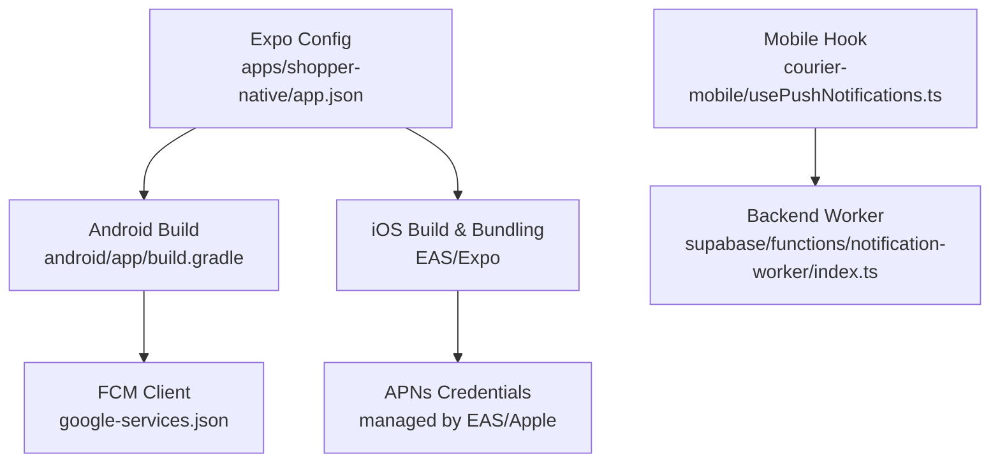
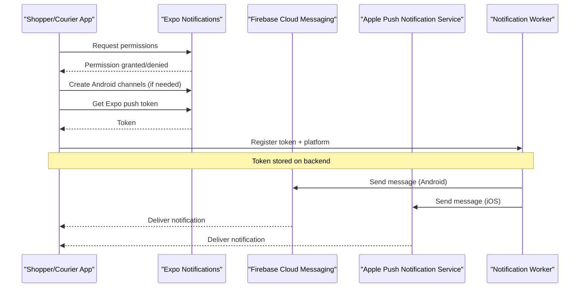
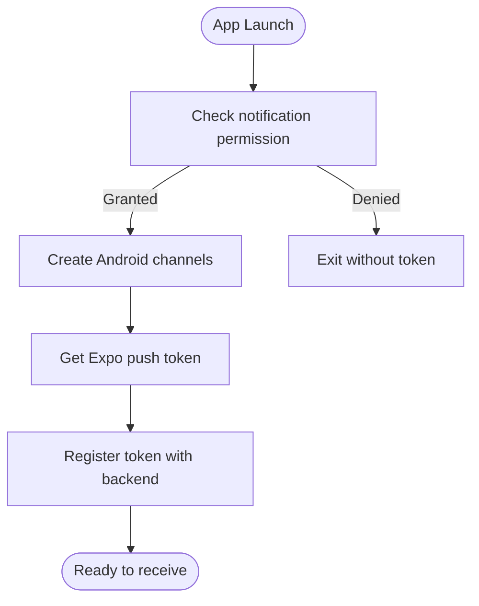
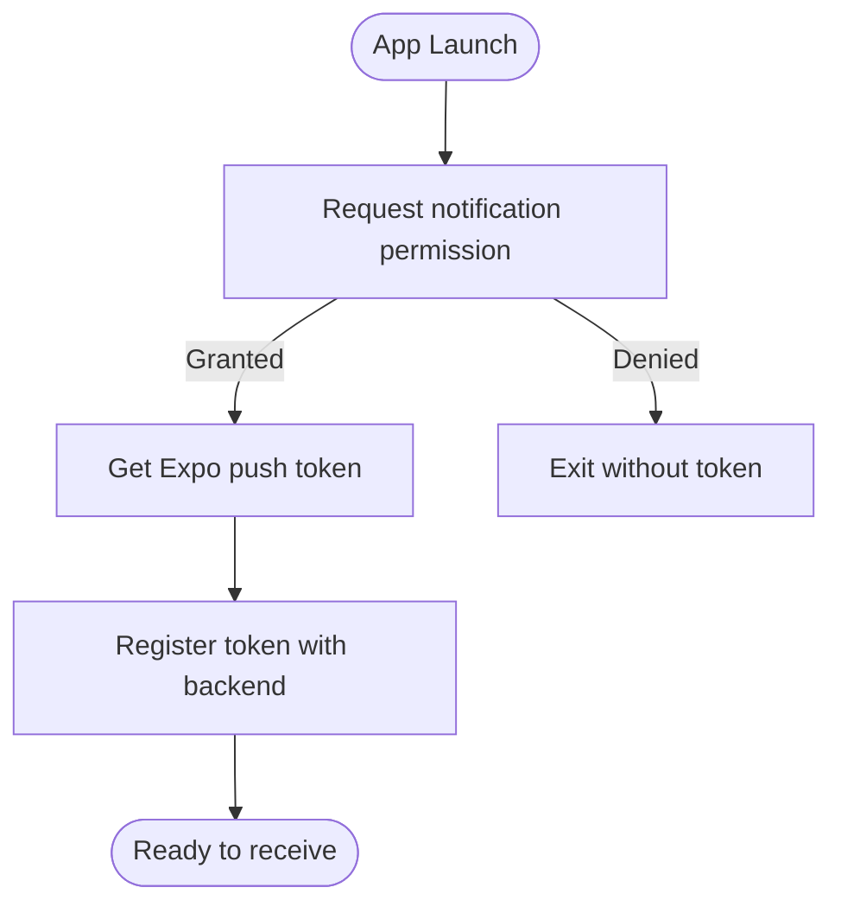
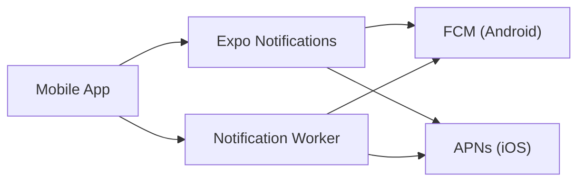

# Platform-Specific Configuration

<cite>
**Referenced Files in This Document**
- [google-services.json](file://apps\shopper-native\google-services.json)
- [build.gradle (Android app)](file://apps\shopper-native\android\app\build.gradle)
- [app.json (Expo config)](file://apps\shopper-native\app.json)
- [usePushNotifications.ts](file://apps\courier-mobile\src\hooks\usePushNotifications.ts)
- [eas.json (root)](file://eas.json)
- [notification-worker index.ts](file://supabase\functions\notification-worker\index.ts)
</cite>

## Table of Contents
1. [Introduction](#introduction)
2. [Project Structure](#project-structure)
3. [Core Components](#core-components)
4. [Architecture Overview](#architecture-overview)
5. [Detailed Component Analysis](#detailed-component-analysis)
6. [Dependency Analysis](#dependency-analysis)
7. [Performance Considerations](#performance-considerations)
8. [Troubleshooting Guide](#troubleshooting-guide)
9. [Conclusion](#conclusion)
10. [Appendices](#appendices)

## Introduction
This document specifies the platform-specific configurations required to enable push notifications for Android and iOS within this project. It covers Firebase Cloud Messaging (FCM) setup for Android, Apple Push Notification Service (APNs) configuration for iOS, environment-specific settings, build-time and runtime considerations, and troubleshooting guidance for common issues such as certificate mismatches and permission denials.

## Project Structure
The push notification implementation spans several layers:
- Expo configuration defines platform identifiers, permissions, and plugin behavior for notifications.
- Android build configuration integrates FCM via Google Services.
- The mobile hook initializes notification channels, requests permissions, retrieves tokens, and registers them with the backend.
- A Supabase Edge Function serves as a notification worker that can send messages through FCM/APNs.

**Diagram sources**
- [app.json (Expo config):16-38](file://apps\shopper-native\app.json#L16-L38)
- [build.gradle (Android app):84-123](file://apps\shopper-native\android\app\build.gradle#L84-L123)
- [usePushNotifications.ts:1-120](file://apps\courier-mobile\src\hooks\usePushNotifications.ts#L1-L120)
- [google-services.json:1-29](file://apps\shopper-native\google-services.json#L1-L29)
- [eas.json (root):1-200](file://eas.json#L1-L200)
- [notification-worker index.ts:1-200](file://supabase\functions\notification-worker\index.ts#L1-L200)

**Section sources**
- [app.json (Expo config):1-113](file://apps\shopper-native\app.json#L1-L113)
- [build.gradle (Android app):1-184](file://apps\shopper-native\android\app\build.gradle#L1-L184)
- [usePushNotifications.ts:1-120](file://apps\courier-mobile\src\hooks\usePushNotifications.ts#L1-L120)
- [google-services.json:1-29](file://apps\shopper-native\google-services.json#L1-L29)
- [eas.json (root):1-200](file://eas.json#L1-L200)
- [notification-worker index.ts:1-200](file://supabase\functions\notification-worker\index.ts#L1-L200)

## Core Components
- Expo Notifications plugin is enabled and configured with a theme color.
- Android package name and Google Services file are declared for FCM integration.
- Android build script applies the Google Services plugin and sets application ID and signing configs.
- The mobile hook manages permissions, creates Android notification channels, retrieves Expo push tokens, and registers them with the backend API.
- EAS configuration supports building and distributing builds with platform credentials managed securely.

Key responsibilities:
- Android: FCM client registration via google-services.json and Gradle plugin; notification channel creation at runtime.
- iOS: Token retrieval and background handling via Expo Notifications; APNs credentials managed by EAS/Apple tooling.
- Backend: Notification worker function to dispatch messages using platform credentials.

**Section sources**
- [app.json (Expo config):45-98](file://apps\shopper-native\app.json#L45-L98)
- [build.gradle (Android app):155-184](file://apps\shopper-native\android\app\build.gradle#L155-L184)
- [usePushNotifications.ts:21-87](file://apps\courier-mobile\src\hooks\usePushNotifications.ts#L21-L87)
- [eas.json (root):1-200](file://eas.json#L1-L200)
- [notification-worker index.ts:1-200](file://supabase\functions\notification-worker\index.ts#L1-L200)

## Architecture Overview
The end-to-end flow involves device-side initialization, token exchange, and server-side delivery.

**Diagram sources**
- [usePushNotifications.ts:21-87](file://apps\courier-mobile\src\hooks\usePushNotifications.ts#L21-L87)
- [google-services.json:1-29](file://apps\shopper-native\google-services.json#L1-L29)
- [notification-worker index.ts:1-200](file://supabase\functions\notification-worker\index.ts#L1-L200)

## Detailed Component Analysis

### Android: Firebase Cloud Messaging Setup
- Project configuration:
  - The Android client is linked to an FCM project via google-services.json, which includes project metadata, client info, and API keys.
  - The Android app module applies the Google Services plugin to integrate FCM services during build.
- App-level permissions:
  - Permissions are declared in the Expo config for camera, audio, and location access, which may be required by features that trigger notifications or handle related actions.
- Runtime behavior:
  - The mobile hook creates Android notification channels with appropriate importance and vibration patterns, ensuring notifications appear correctly even when the app is in the foreground.

**Diagram sources**
- [usePushNotifications.ts:21-87](file://apps\courier-mobile\src\hooks\usePushNotifications.ts#L21-L87)
- [google-services.json:1-29](file://apps\shopper-native\google-services.json#L1-L29)
- [build.gradle (Android app):155-184](file://apps\shopper-native\android\app\build.gradle#L155-L184)

**Section sources**
- [google-services.json:1-29](file://apps\shopper-native\google-services.json#L1-L29)
- [build.gradle (Android app):84-123](file://apps\shopper-native\android\app\build.gradle#L84-L123)
- [build.gradle (Android app):155-184](file://apps\shopper-native\android\app\build.gradle#L155-L184)
- [app.json (Expo config):25-38](file://apps\shopper-native\app.json#L25-L38)
- [usePushNotifications.ts:51-68](file://apps\courier-mobile\src\hooks\usePushNotifications.ts#L51-L68)

### iOS: Apple Push Notification Service (APNs) Configuration
- Certificate and provisioning management:
  - iOS builds are handled via Expo/EAS, which can manage APNs certificates and provisioning profiles securely during cloud builds. Ensure the correct bundle identifier matches the Expo config.
- Entitlements and InfoPlist:
  - The Expo config declares the iOS bundle identifier and InfoPlist entries. Additional entitlements for background modes and remote notifications are typically managed by EAS or Xcode when building custom native projects.
- Runtime behavior:
  - The mobile hook retrieves the Expo push token on iOS and registers it with the backend. Foreground notification display is controlled by the global notification handler.

**Diagram sources**
- [usePushNotifications.ts:21-87](file://apps\courier-mobile\src\hooks\usePushNotifications.ts#L21-L87)
- [app.json (Expo config):16-24](file://apps\shopper-native\app.json#L16-L24)
- [eas.json (root):1-200](file://eas.json#L1-L200)

**Section sources**
- [app.json (Expo config):16-24](file://apps\shopper-native\app.json#L16-L24)
- [usePushNotifications.ts:21-87](file://apps\courier-mobile\src\hooks\usePushNotifications.ts#L21-L87)
- [eas.json (root):1-200](file://eas.json#L1-L200)

### Environment-Specific Configurations
- Development:
  - Use debug signing for Android and development builds via EAS. Ensure the FCM project and APNs credentials correspond to development environments.
- Staging:
  - Maintain separate FCM project or service account key for staging, and distinct APNs credentials if required by your distribution strategy. Update google-services.json and EAS credentials accordingly.
- Production:
  - Use release signing for Android and production APNs credentials. Ensure the google-services.json and bundle identifiers match production targets.

Practical notes:
- Keep environment-specific secrets out of version control. Use EAS secrets or secure credential stores.
- Validate that the backend notification worker uses the correct credentials per environment.

[No sources needed since this section provides general guidance]

### Build-Time Configurations
- Android:
  - The Google Services plugin is applied to integrate FCM. Application ID and namespace are set in the Android module configuration.
- iOS:
  - Bundle identifier is defined in the Expo config. EAS handles APNs certificate and profile management during builds.
- Expo plugins:
  - Notifications plugin is enabled with a theme color; other plugins configure permissions and behaviors relevant to notification-triggered features.

**Section sources**
- [build.gradle (Android app):155-184](file://apps\shopper-native\android\app\build.gradle#L155-L184)
- [app.json (Expo config):45-98](file://apps\shopper-native\app.json#L45-L98)
- [app.json (Expo config):16-24](file://apps\shopper-native\app.json#L16-L24)

### Runtime Permission Handling
- The mobile hook checks and requests notification permissions before retrieving tokens.
- On Android, it creates notification channels with appropriate importance and vibration patterns to ensure visibility and user experience.
- Foreground notifications are handled to show in-app feedback and update local state.

**Section sources**
- [usePushNotifications.ts:21-87](file://apps\courier-mobile\src\hooks\usePushNotifications.ts#L21-L87)
- [usePushNotifications.ts:89-118](file://apps\courier-mobile\src\hooks\usePushNotifications.ts#L89-L118)

### Backend Notification Worker
- The Supabase Edge Function acts as the notification worker. It should use the appropriate platform credentials (FCM service account for Android, APNs credentials for iOS) based on the target platform indicated by the registered token.

[No sources needed since this section provides general guidance]

## Dependency Analysis
- Mobile app depends on Expo Notifications for cross-platform push token management and notification presentation.
- Android depends on FCM via google-services.json and the Google Services Gradle plugin.
- iOS depends on APNs through Expo/EAS-managed credentials.
- Backend depends on platform-specific providers to deliver messages to devices.

**Diagram sources**
- [usePushNotifications.ts:21-87](file://apps\courier-mobile\src\hooks\usePushNotifications.ts#L21-L87)
- [google-services.json:1-29](file://apps\shopper-native\google-services.json#L1-L29)
- [notification-worker index.ts:1-200](file://supabase\functions\notification-worker\index.ts#L1-L200)

**Section sources**
- [usePushNotifications.ts:21-87](file://apps\courier-mobile\src\hooks\usePushNotifications.ts#L21-L87)
- [google-services.json:1-29](file://apps\shopper-native\google-services.json#L1-L29)
- [notification-worker index.ts:1-200](file://supabase\functions\notification-worker\index.ts#L1-L200)

## Performance Considerations
- Minimize unnecessary permission prompts by checking existing status first.
- Create Android notification channels once at startup to avoid repeated overhead.
- Batch token registrations where possible to reduce network calls.
- Use efficient payload structures in notifications to reduce bandwidth and parsing time.

[No sources needed since this section provides general guidance]

## Troubleshooting Guide
Common issues and resolutions:
- Permission denied:
  - Ensure the app requests notification permissions before attempting to retrieve tokens. Verify that the user has not disabled notifications in system settings.
- No notifications on Android:
  - Confirm that notification channels are created with appropriate importance levels. Check that the Google Services plugin is applied and google-services.json is present and valid.
- Certificate mismatch on iOS:
  - Ensure the bundle identifier matches the one used for APNs credentials. Rebuild with correct EAS credentials and verify that the provisioning profile aligns with the app’s identifier.
- Token not received or invalid:
  - Verify that the device is a physical device (emulators may not support push). Check network connectivity and re-register the token if necessary.
- Foreground notifications not showing:
  - Ensure the global notification handler is configured to allow alerts, sounds, badges, banners, and lists while the app is in the foreground.

**Section sources**
- [usePushNotifications.ts:21-87](file://apps\courier-mobile\src\hooks\usePushNotifications.ts#L21-L87)
- [usePushNotifications.ts:89-118](file://apps\courier-mobile\src\hooks\usePushNotifications.ts#L89-L118)
- [google-services.json:1-29](file://apps\shopper-native\google-services.json#L1-L29)
- [build.gradle (Android app):155-184](file://apps\shopper-native\android\app\build.gradle#L155-L184)
- [app.json (Expo config):16-24](file://apps\shopper-native\app.json#L16-L24)

## Conclusion
This project implements push notifications using Expo Notifications across Android and iOS. Android relies on FCM with google-services.json and Gradle integration, while iOS uses APNs managed via EAS. The mobile hook centralizes permission handling, channel creation, token retrieval, and registration with the backend. Proper environment separation and credential management are essential for reliable delivery across development, staging, and production.

[No sources needed since this section summarizes without analyzing specific files]

## Appendices
- Recommended checklist:
  - Android:
    - Place google-services.json in the correct path.
    - Apply Google Services plugin in the Android module.
    - Define notification channels at app startup.
  - iOS:
    - Ensure bundle identifier matches APNs credentials.
    - Use EAS to manage certificates and provisioning profiles.
  - Backend:
    - Configure notification worker with correct platform credentials per environment.
    - Validate token registration endpoints and error handling.

[No sources needed since this section provides general guidance]