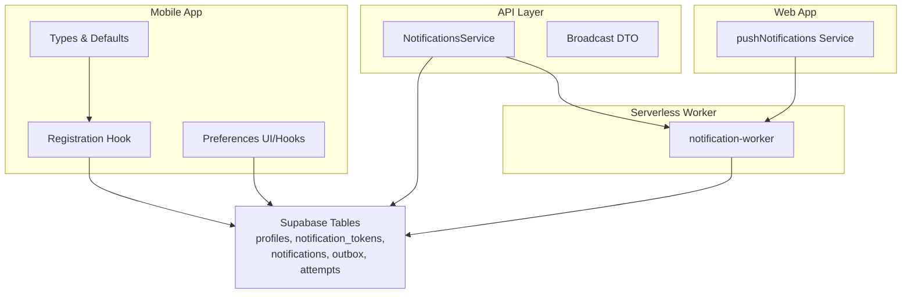
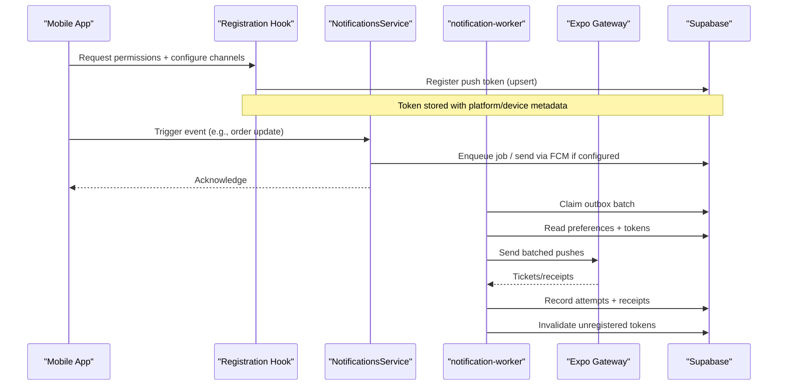
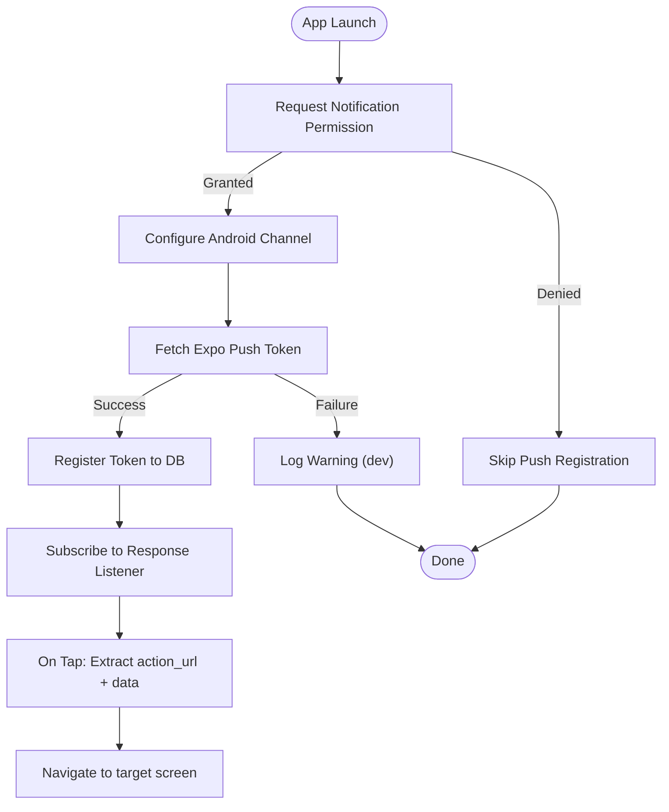
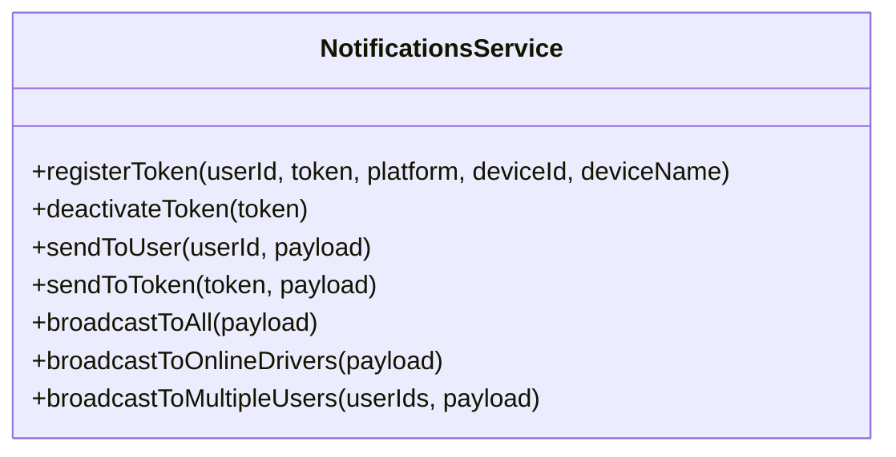
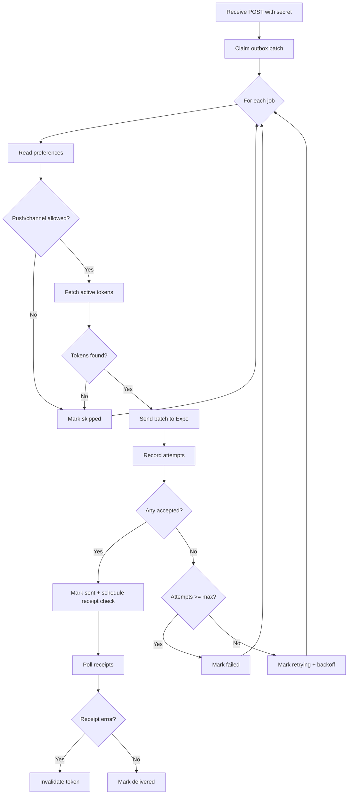
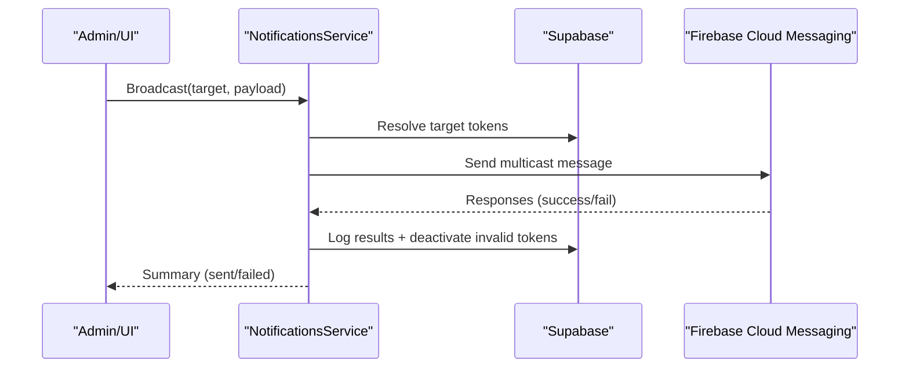
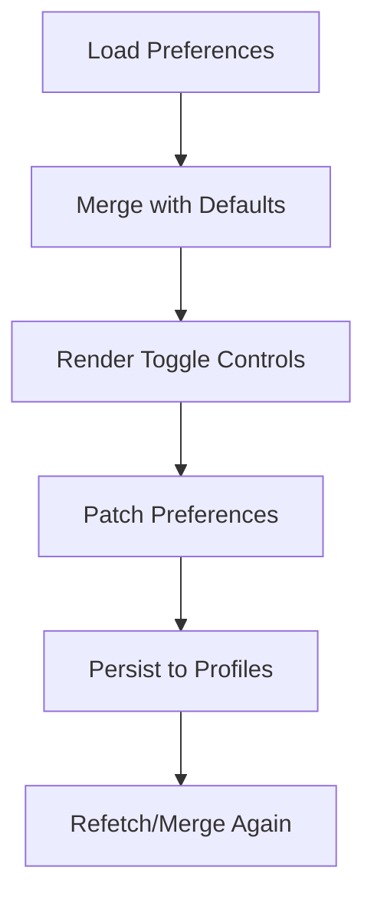
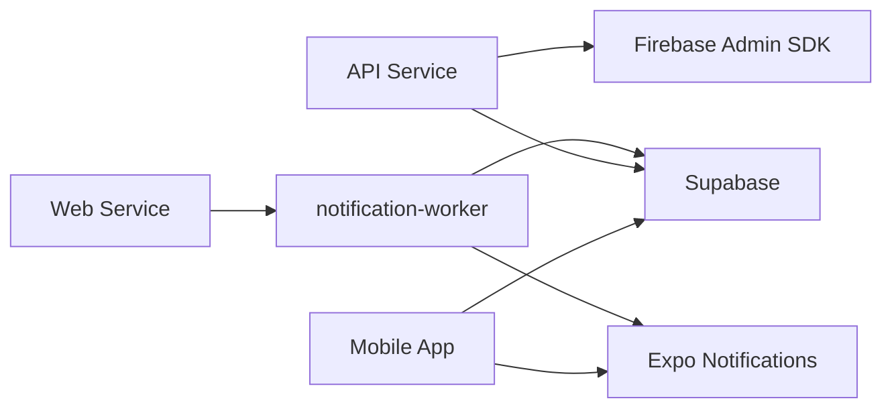

# Push Notifications System

<cite>
**Referenced Files in This Document**
- [index.ts](file://supabase/functions/notification-worker/index.ts)
- [notifications.service.ts](file://apps/api/src/modules/notifications/notifications.service.ts)
- [broadcast.dto.ts](file://apps/api/src/modules/notifications/dto/broadcast.dto.ts)
- [usePushNotificationRegistration.ts](file://apps/shopper-native/src/features/notifications/hooks/usePushNotificationRegistration.ts)
- [api.ts](file://apps/shopper-native/src/features/notifications/api.ts)
- [types.ts](file://apps/shopper-native/src/features/notifications/types.ts)
- [pushNotifications.ts](file://apps/shopper-web/src/services/pushNotifications.ts)
</cite>

## Table of Contents
1. Introduction
2. Project Structure
3. Core Components
4. Architecture Overview
5. Detailed Component Analysis
6. Dependency Analysis
7. Performance Considerations
8. Troubleshooting Guide
9. Conclusion
10. Appendices

## Introduction
This document describes the end-to-end push notification system across mobile and web applications. It covers registration, token management, device capability detection, notification types, server-side worker processing, message queuing, delivery optimization, platform-specific configurations for FCM/APNs via Expo and Firebase Admin SDK, user preferences and consent handling, deep linking, and interactive notifications.

## Project Structure
The system spans:
- Mobile app (Expo-based): handles permissions, channel setup, token acquisition, and response handling for taps.
- Web app: provides a centralized service to enqueue or forward pushes to the Expo gateway.
- API layer: manages tokens and sends direct FCM messages where applicable.
- Serverless worker: claims outbox jobs, respects preferences, batches delivery via Expo, records attempts/receipts, and invalidates stale tokens.

**Diagram sources**
- [usePushNotificationRegistration.ts:20-152](file://apps/shopper-native/src/features/notifications/hooks/usePushNotificationRegistration.ts#L20-L152)
- [api.ts:121-211](file://apps/shopper-native/src/features/notifications/api.ts#L121-L211)
- [types.ts:8-83](file://apps/shopper-native/src/features/notifications/types.ts#L8-L83)
- [pushNotifications.ts:18-89](file://apps/shopper-web/src/services/pushNotifications.ts#L18-L89)
- [notifications.service.ts:20-229](file://apps/api/src/modules/notifications/notifications.service.ts#L20-L229)
- [broadcast.dto.ts:1-53](file://apps/api/src/modules/notifications/dto/broadcast.dto.ts#L1-L53)
- [index.ts:37-126](file://supabase/functions/notification-worker/index.ts#L37-L126)

**Section sources**
- [usePushNotificationRegistration.ts:20-152](file://apps/shopper-native/src/features/notifications/hooks/usePushNotificationRegistration.ts#L20-L152)
- [api.ts:121-211](file://apps/shopper-native/src/features/notifications/api.ts#L121-L211)
- [types.ts:8-83](file://apps/shopper-native/src/features/notifications/types.ts#L8-L83)
- [pushNotifications.ts:18-89](file://apps/shopper-web/src/services/pushNotifications.ts#L18-L89)
- [notifications.service.ts:20-229](file://apps/api/src/modules/notifications/notifications.service.ts#L20-L229)
- [broadcast.dto.ts:1-53](file://apps/api/src/modules/notifications/dto/broadcast.dto.ts#L1-L53)
- [index.ts:37-126](file://supabase/functions/notification-worker/index.ts#L37-L126)

## Core Components
- Mobile registration hook: requests permissions, configures Android channels, fetches Expo push token, registers it, and wires tap responses for deep linking.
- Preferences system: reads/writes per-user channel and category toggles; defaults ensure opt-in behavior.
- API service: initializes Firebase Admin SDK, manages tokens (upsert, deactivation), sends single or broadcast messages with platform-specific payloads, and logs outcomes.
- Serverless worker: claims outbox jobs, enforces preferences, batches delivery via Expo, records attempts/receipts, retries with backoff, and invalidates unregistered devices.
- Web service: centralizes push forwarding logic and enforces server-owned delivery policy.

**Section sources**
- [usePushNotificationRegistration.ts:20-152](file://apps/shopper-native/src/features/notifications/hooks/usePushNotificationRegistration.ts#L20-L152)
- [api.ts:121-211](file://apps/shopper-native/src/features/notifications/api.ts#L121-L211)
- [types.ts:8-83](file://apps/shopper-native/src/features/notifications/types.ts#L8-L83)
- [notifications.service.ts:20-229](file://apps/api/src/modules/notifications/notifications.service.ts#L20-L229)
- [index.ts:37-126](file://supabase/functions/notification-worker/index.ts#L37-L126)
- [pushNotifications.ts:18-89](file://apps/shopper-web/src/services/pushNotifications.ts#L18-L89)

## Architecture Overview
The flow combines client-side registration, server-side orchestration, and reliable delivery with retry and receipt tracking.

**Diagram sources**
- [usePushNotificationRegistration.ts:43-152](file://apps/shopper-native/src/features/notifications/hooks/usePushNotificationRegistration.ts#L43-L152)
- [api.ts:164-211](file://apps/shopper-native/src/features/notifications/api.ts#L164-L211)
- [notifications.service.ts:32-229](file://apps/api/src/modules/notifications/notifications.service.ts#L32-L229)
- [index.ts:37-126](file://supabase/functions/notification-worker/index.ts#L37-L126)

## Detailed Component Analysis

### Mobile Registration and Device Capability Detection
- Permissions: Requests OS-level permission and ensures foreground handling so notifications appear even when the app is open.
- Android channel: Creates a high-importance channel for order-related updates with vibration and default sound.
- Token acquisition: Retrieves Expo push token only on physical devices; skips on simulators/web.
- Deep linking: Subscribes to notification response events and extracts action_url from payload data to navigate users to relevant screens.

**Diagram sources**
- [usePushNotificationRegistration.ts:28-152](file://apps/shopper-native/src/features/notifications/hooks/usePushNotificationRegistration.ts#L28-L152)

**Section sources**
- [usePushNotificationRegistration.ts:28-152](file://apps/shopper-native/src/features/notifications/hooks/usePushNotificationRegistration.ts#L28-L152)

### Token Management
- Client side: Upserts token keyed by user and token value; supports unregistering all tokens on sign-out.
- API side: Deactivates older tokens for the same user/platform/device to ensure only the current device receives pushes; upserts new token; logs delivery results and deactivates invalid tokens on errors.

**Diagram sources**
- [notifications.service.ts:50-229](file://apps/api/src/modules/notifications/notifications.service.ts#L50-L229)

**Section sources**
- [api.ts:164-211](file://apps/shopper-native/src/features/notifications/api.ts#L164-L211)
- [notifications.service.ts:50-229](file://apps/api/src/modules/notifications/notifications.service.ts#L50-L229)

### Notification Types and Categories
- Types: order, offer, health, system.
- Categories: order_updates, promotions, security_alerts, health_reminders, new_arrivals, account_updates.
- Defaults: All categories enabled; push and email enabled by default; SMS disabled by default.

These are used to filter delivery based on user preferences and to structure in-app displays.

**Section sources**
- [types.ts:8-83](file://apps/shopper-native/src/features/notifications/types.ts#L8-L83)

### Notification Worker: Queuing, Delivery, and Optimization
- Security: Requires a secret header to accept jobs.
- Outbox claiming: Claims a batch of pending jobs.
- Preference enforcement: Skips delivery if push channel or specific category is disabled for the recipient.
- Token resolution: Fetches active tokens for recipients; skips if none exist.
- Delivery: Batches tokens and posts to Expo push gateway; records accepted/failed tickets.
- Retries: Updates next attempt time using exponential backoff; marks failed after max attempts.
- Receipts: Polls Expo receipts, marks delivered/failed, and invalidates tokens on DeviceNotRegistered.

**Diagram sources**
- [index.ts:37-126](file://supabase/functions/notification-worker/index.ts#L37-L126)

**Section sources**
- [index.ts:37-126](file://supabase/functions/notification-worker/index.ts#L37-L126)

### API Broadcast and Direct Messaging
- Broadcast targets: all drivers, online drivers, specific users, or drivers filtered by status.
- Payloads: title, body, optional image URL, and structured data; platform-specific settings for Android channels and APNs priority/sound.
- Logging: Records success/failure per token and deactivates invalid tokens automatically.

**Diagram sources**
- [notifications.service.ts:104-229](file://apps/api/src/modules/notifications/notifications.service.ts#L104-L229)
- [broadcast.dto.ts:1-53](file://apps/api/src/modules/notifications/dto/broadcast.dto.ts#L1-L53)

**Section sources**
- [notifications.service.ts:104-229](file://apps/api/src/modules/notifications/notifications.service.ts#L104-L229)
- [broadcast.dto.ts:1-53](file://apps/api/src/modules/notifications/dto/broadcast.dto.ts#L1-L53)

### Platform-Specific Configurations
- Android (via Expo): High-importance channel for orders with vibration and default sound; foreground handler ensures visibility while app is open.
- iOS (via Expo): Uses Expo push token; background/foreground behavior controlled by Expo and OS; badge and sound handled by payload.
- Web: Push delivery is enforced to be server-owned; client-side functions throw to prevent direct calls, ensuring consistent routing through the worker.

**Section sources**
- [usePushNotificationRegistration.ts:28-84](file://apps/shopper-native/src/features/notifications/hooks/usePushNotificationRegistration.ts#L28-L84)
- [pushNotifications.ts:58-89](file://apps/shopper-web/src/services/pushNotifications.ts#L58-L89)

### User Preferences and Consent Handling
- Channels: push, email, sms toggles.
- Categories: granular control per category.
- Defaults: Opt-in for most categories; SMS off by default.
- Storage: JSONB field in profiles; merged with defaults on read; optimistic UI updates on change.

**Diagram sources**
- [api.ts:121-160](file://apps/shopper-native/src/features/notifications/api.ts#L121-L160)
- [types.ts:31-65](file://apps/shopper-native/src/features/notifications/types.ts#L31-L65)

**Section sources**
- [api.ts:121-160](file://apps/shopper-native/src/features/notifications/api.ts#L121-L160)
- [types.ts:31-65](file://apps/shopper-native/src/features/notifications/types.ts#L31-L65)

### Deep Linking and Interactive Notifications
- Data payload includes action_url and arbitrary key-value pairs.
- On tap, the mobile app extracts action_url and navigates accordingly; fallbacks handle missing URLs gracefully.
- Foreground handler ensures alerts, sounds, badges, banners, and list entries are shown while the app is active.

**Section sources**
- [usePushNotificationRegistration.ts:131-152](file://apps/shopper-native/src/features/notifications/hooks/usePushNotificationRegistration.ts#L131-L152)
- [index.ts:66-70](file://supabase/functions/notification-worker/index.ts#L66-L70)

## Dependency Analysis
- Mobile depends on Expo Notifications and Supabase for token registration and preferences.
- API depends on Firebase Admin SDK for direct messaging and Prisma for token/log persistence.
- Worker depends on Supabase RPC and tables for outbox, preferences, tokens, and delivery attempts; communicates with Expo push endpoints.
- Web service delegates push delivery to server-side paths to maintain consistency and security.

**Diagram sources**
- [usePushNotificationRegistration.ts:20-152](file://apps/shopper-native/src/features/notifications/hooks/usePushNotificationRegistration.ts#L20-L152)
- [notifications.service.ts:20-229](file://apps/api/src/modules/notifications/notifications.service.ts#L20-L229)
- [index.ts:37-126](file://supabase/functions/notification-worker/index.ts#L37-L126)
- [pushNotifications.ts:18-89](file://apps/shopper-web/src/services/pushNotifications.ts#L18-L89)

**Section sources**
- [usePushNotificationRegistration.ts:20-152](file://apps/shopper-native/src/features/notifications/hooks/usePushNotificationRegistration.ts#L20-L152)
- [notifications.service.ts:20-229](file://apps/api/src/modules/notifications/notifications.service.ts#L20-L229)
- [index.ts:37-126](file://supabase/functions/notification-worker/index.ts#L37-L126)
- [pushNotifications.ts:18-89](file://apps/shopper-web/src/services/pushNotifications.ts#L18-L89)

## Performance Considerations
- Batching: Worker uses a batch size for claiming jobs and sending Expo pushes; API uses multicast chunks to reduce overhead.
- Backoff: Exponential retry scheduling prevents thundering herds during failures.
- Receipt polling: Periodic checks mark deliveries and invalidate stale tokens promptly.
- Preference filtering: Early skip reduces unnecessary network calls.
- Foreground handling: Ensures rich UX without extra backend load.

[No sources needed since this section provides general guidance]

## Troubleshooting Guide
- Missing credentials: API warns and disables push if Firebase credentials are absent.
- Invalid tokens: Automatically deactivated on invalid-registration-token errors; worker invalidates tokens on DeviceNotRegistered.
- No active tokens: Jobs marked skipped when no tokens found for recipients.
- Network errors: Jobs retried with backoff; max attempts eventually mark as failed.
- Web push restrictions: Client-side push methods intentionally throw to enforce server-owned delivery.

**Section sources**
- [notifications.service.ts:32-48](file://apps/api/src/modules/notifications/notifications.service.ts#L32-L48)
- [notifications.service.ts:121-132](file://apps/api/src/modules/notifications/notifications.service.ts#L121-L132)
- [index.ts:55-99](file://supabase/functions/notification-worker/index.ts#L55-L99)
- [index.ts:102-123](file://supabase/functions/notification-worker/index.ts#L102-L123)
- [pushNotifications.ts:58-89](file://apps/shopper-web/src/services/pushNotifications.ts#L58-L89)

## Conclusion
The system integrates mobile registration, robust token management, preference-driven delivery, and a resilient worker that batches, retries, and validates deliveries. Platform-specific configurations ensure optimal behavior on Android and iOS, while deep linking enables seamless navigation from notifications. The design separates concerns between client, API, and serverless worker to maintain scalability and reliability.

[No sources needed since this section summarizes without analyzing specific files]

## Appendices

### Notification Payload Examples
- Common fields: title, body, data (key-value pairs), optional imageUrl.
- Action URL: Included in data for deep linking; extracted on tap.
- Platform hints:
  - Android: channel id and high priority for timely display.
  - iOS: sound and badge via payload headers.

**Section sources**
- [notifications.service.ts:112-120](file://apps/api/src/modules/notifications/notifications.service.ts#L112-L120)
- [index.ts:66-70](file://supabase/functions/notification-worker/index.ts#L66-L70)