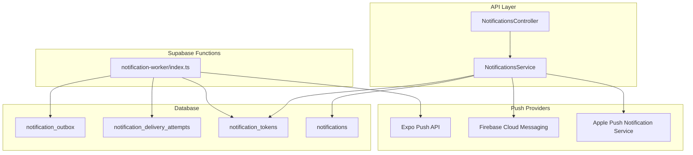
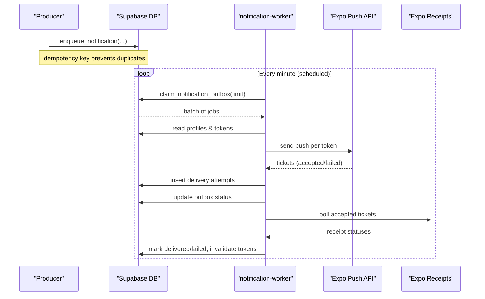
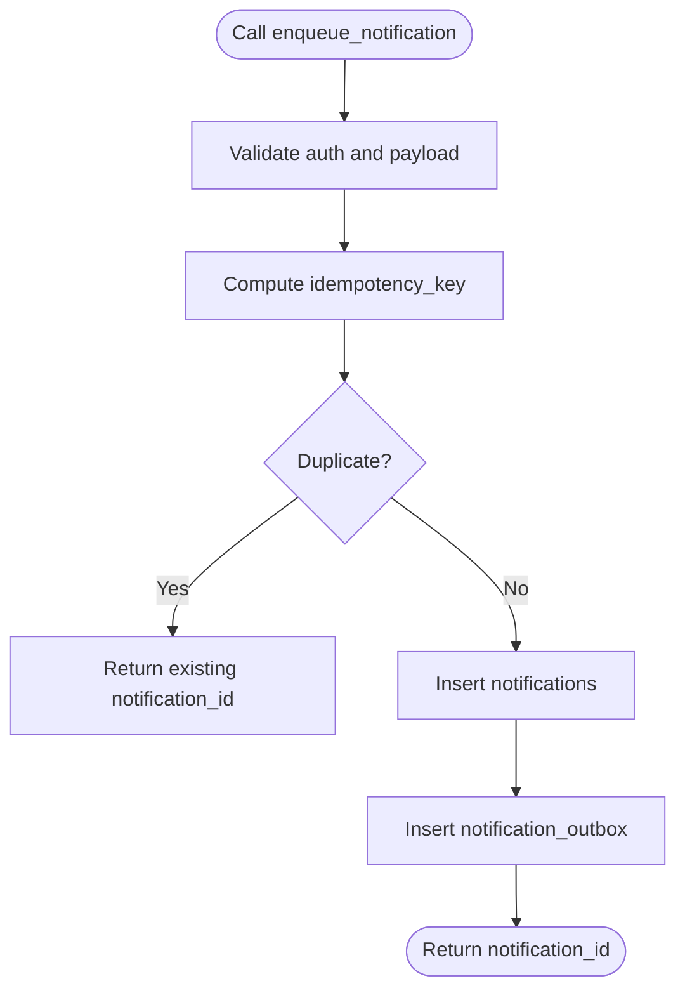
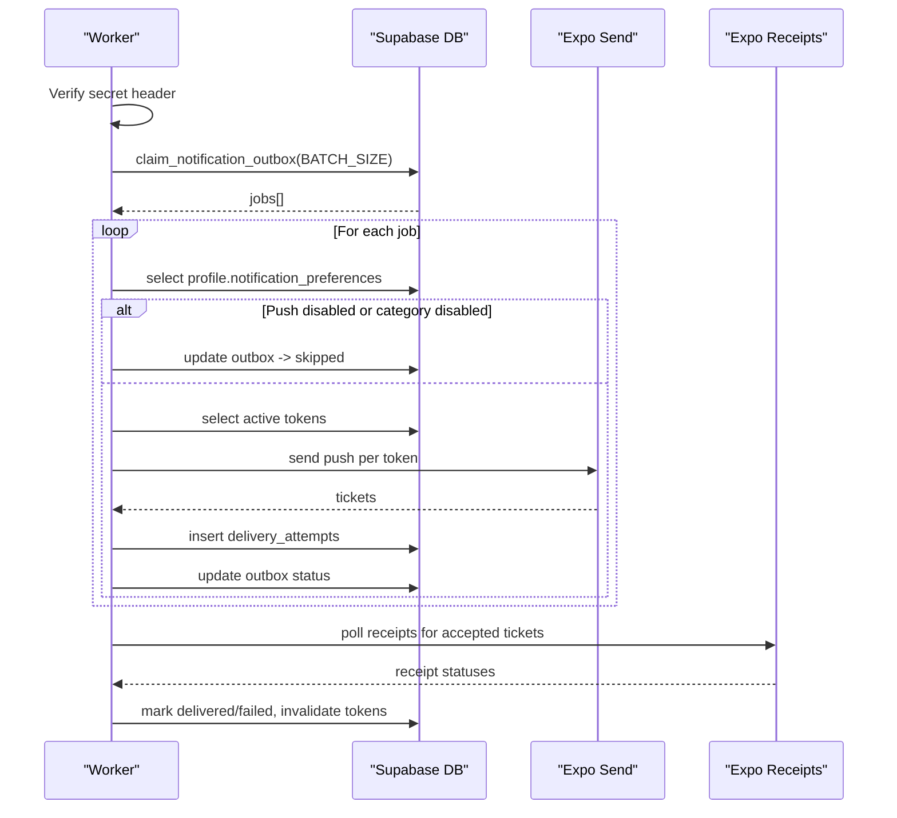
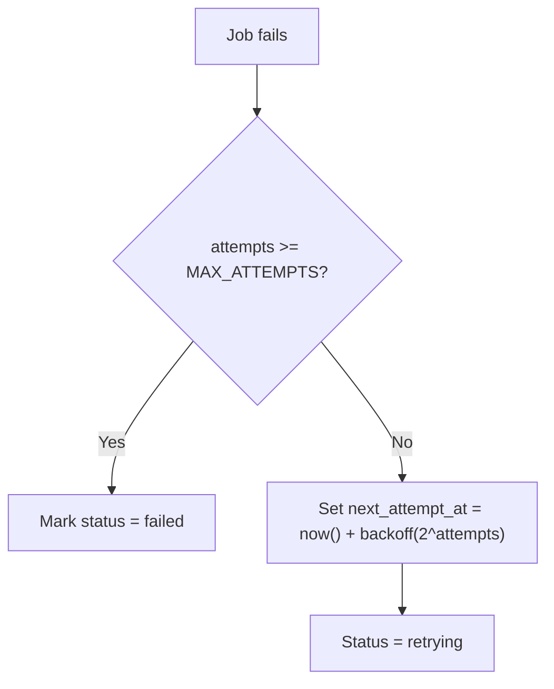
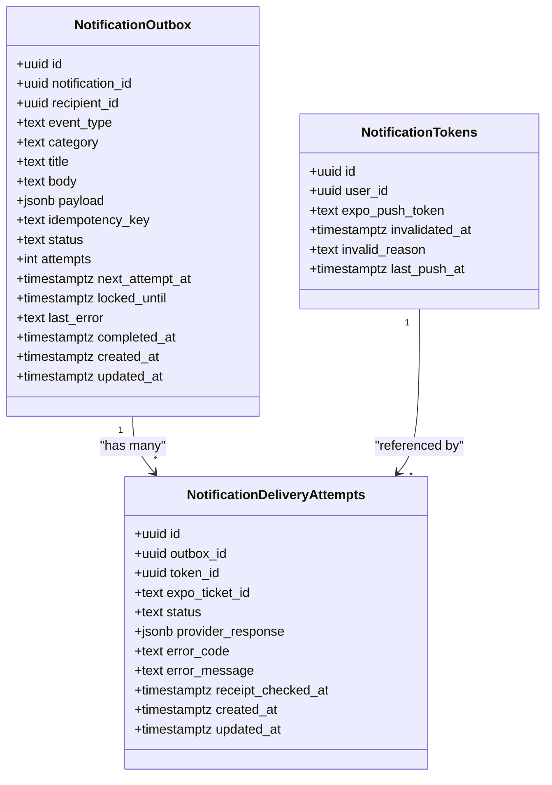
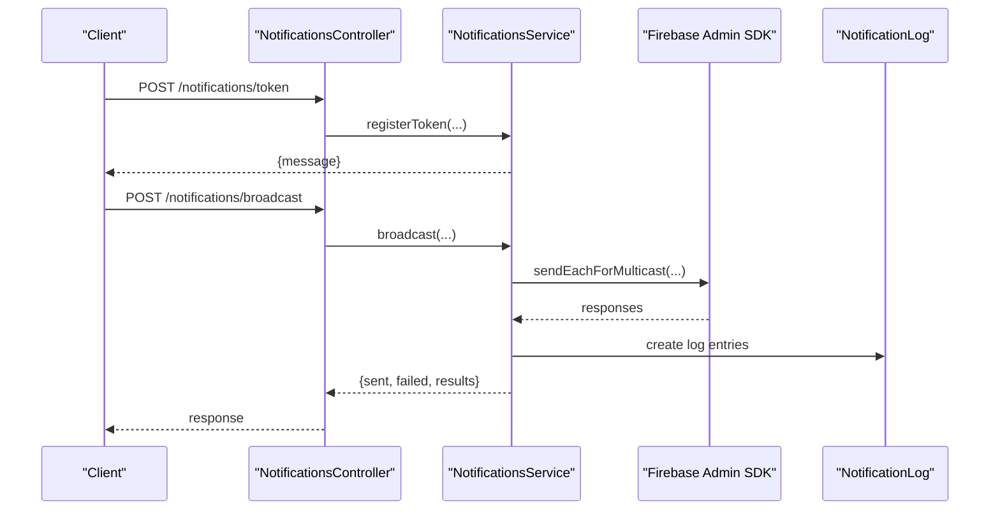
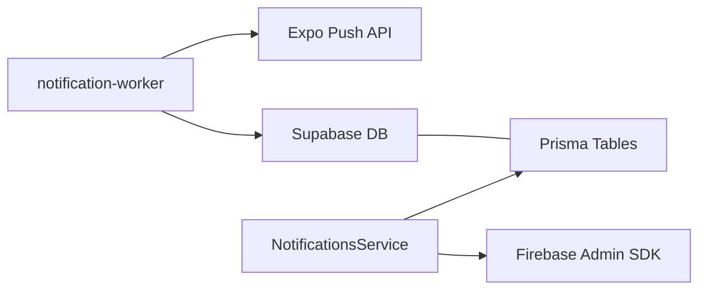

# Server-Side Notification Worker

<cite>
**Referenced Files in This Document**
- [index.ts](file://supabase/functions/notification-worker/index.ts)
- [README.md](file://supabase/functions/notification-worker/README.md)
- [20260713090000_notification_delivery_pipeline.sql](file://supabase/migrations/20260713090000_notification_delivery_pipeline.sql)
- [20260729120000_pharmacist_customer_notifications.sql](file://supabase/migrations/20260729120000_pharmacist_customer_notifications.sql)
- [notifications.controller.ts](file://apps/api/src/modules/notifications/notifications.controller.ts)
- [notifications.service.ts](file://apps/api/src/modules/notifications/notifications.service.ts)
</cite>

## Table of Contents
1. [Introduction](#introduction)
2. [Project Structure](#project-structure)
3. [Core Components](#core-components)
4. [Architecture Overview](#architecture-overview)
5. [Detailed Component Analysis](#detailed-component-analysis)
6. [Dependency Analysis](#dependency-analysis)
7. [Performance Considerations](#performance-considerations)
8. [Troubleshooting Guide](#troubleshooting-guide)
9. [Conclusion](#conclusion)
10. [Appendices](#appendices)

## Introduction
This document explains the server-side notification worker implementation that delivers push notifications at scale. It covers the message queuing system, batch processing, delivery optimization, integration with Firebase Cloud Messaging (FCM) and Apple Push Notification Service (APNs), credential management, rate limiting, retry mechanisms, analytics tracking, scalability considerations, monitoring, debugging techniques, and API endpoints for triggering notifications and webhook integrations.

The system uses a durable outbox pattern to decouple producers from delivery, ensuring reliable, idempotent, and auditable push delivery via Expo’s push service. An additional API-based path integrates directly with FCM/APNs through Firebase Admin SDK for targeted or broadcast messaging.

## Project Structure
The notification system spans three main areas:
- Supabase Edge Function worker that claims and processes outbox jobs, interacts with Expo Push, and records receipts.
- Database schema and stored procedures that implement the outbox queue, idempotency, and claim semantics.
- API module that registers device tokens and sends direct FCM/APNs messages for specific use cases.

**Diagram sources**
- [notifications.controller.ts:7-59](file://apps/api/src/modules/notifications/notifications.controller.ts#L7-L59)
- [notifications.service.ts:20-229](file://apps/api/src/modules/notifications/notifications.service.ts#L20-L229)
- [index.ts:37-126](file://supabase/functions/notification-worker/index.ts#L37-L126)
- [20260713090000_notification_delivery_pipeline.sql:11-49](file://supabase/migrations/20260713090000_notification_delivery_pipeline.sql#L11-L49)

**Section sources**
- [notifications.controller.ts:7-59](file://apps/api/src/modules/notifications/notifications.controller.ts#L7-L59)
- [notifications.service.ts:20-229](file://apps/api/src/modules/notifications/notifications.service.ts#L20-L229)
- [index.ts:37-126](file://supabase/functions/notification-worker/index.ts#L37-L126)
- [20260713090000_notification_delivery_pipeline.sql:11-49](file://supabase/migrations/20260713090000_notification_delivery_pipeline.sql#L11-L49)

## Core Components
- Outbox Queue and Claiming: A database-backed outbox table stores pending notifications with idempotency keys, status, and scheduling metadata. A stored procedure atomically claims eligible rows with locking and updates attempts and lock windows.
- Worker Process: A Deno-based Supabase Edge Function authenticates via a secret header, claims batches, checks recipient preferences, resolves device tokens, sends pushes via Expo, records delivery attempts, and polls receipts to mark final delivery states.
- Token Management: Device tokens are stored and filtered by validity; invalidation is updated on provider feedback (e.g., DeviceNotRegistered).
- Direct FCM/APNs Path: The API service initializes Firebase Admin SDK using environment credentials and sends single or multicast messages, logging outcomes and deactivating invalid tokens.

Key responsibilities:
- Reliable enqueueing with idempotency.
- Batched claiming and sending to limit load.
- Exponential backoff retries with capped delay.
- Preference-aware routing to skip disabled channels/categories.
- Provider-specific receipt handling and token cleanup.
- Auditability via attempt logs and receipts.

**Section sources**
- [20260713090000_notification_delivery_pipeline.sql:50-78](file://supabase/migrations/20260713090000_notification_delivery_pipeline.sql#L50-L78)
- [index.ts:37-126](file://supabase/functions/notification-worker/index.ts#L37-L126)
- [notifications.service.ts:30-48](file://apps/api/src/modules/notifications/notifications.service.ts#L30-L48)
- [notifications.service.ts:104-211](file://apps/api/src/modules/notifications/notifications.service.ts#L104-L211)

## Architecture Overview
The architecture separates concerns into durable queuing, robust delivery, and optional direct messaging:

- Producers call stored procedures to enqueue notifications with idempotency keys.
- The worker periodically claims a batch of due jobs, respects user preferences, and dispatches to Expo Push.
- Delivery attempts and receipts are recorded to track success/failure and to invalidate dead tokens.
- For certain flows, the API service sends directly to FCM/APNs using Firebase Admin SDK, logging results and cleaning up invalid tokens.

**Diagram sources**
- [20260713090000_notification_delivery_pipeline.sql:50-78](file://supabase/migrations/20260713090000_notification_delivery_pipeline.sql#L50-L78)
- [index.ts:37-126](file://supabase/functions/notification-worker/index.ts#L37-L126)

## Detailed Component Analysis

### Outbox Queue and Stored Procedures
- Enqueue function enforces authentication, validates payload, computes an idempotency key, inserts both a user-facing notification record and an outbox job, and returns the notification ID.
- Claim function selects due or stale processing jobs with row-level locking and updates them to processing with a lock window and incremented attempts.
- Batch enqueue helper allows managers to enqueue multiple recipients atomically with scoped idempotency namespaces.

**Diagram sources**
- [20260713090000_notification_delivery_pipeline.sql:50-69](file://supabase/migrations/20260713090000_notification_delivery_pipeline.sql#L50-L69)

**Section sources**
- [20260713090000_notification_delivery_pipeline.sql:50-94](file://supabase/migrations/20260713090000_notification_delivery_pipeline.sql#L50-L94)

### Worker Processing Flow
- Authentication: Requires a secret header; otherwise returns unauthorized.
- Claiming: Uses the stored procedure to fetch a bounded batch of jobs.
- Preferences: Reads profile preferences to skip push if disabled or category disabled.
- Tokens: Resolves active device tokens for the recipient.
- Sending: Sends push to all tokens via Expo, records each attempt with ticket info.
- Status Update: Marks outbox as sent/retrying/failed based on acceptance and attempt count.
- Receipts: Polls accepted tickets and marks final delivery state; invalidates tokens on DeviceNotRegistered.

**Diagram sources**
- [index.ts:37-126](file://supabase/functions/notification-worker/index.ts#L37-L126)

**Section sources**
- [index.ts:37-126](file://supabase/functions/notification-worker/index.ts#L37-L126)

### Retry and Backoff Strategy
- Each job tracks attempts and next_attempt_at.
- On failure, next_attempt_at is set using exponential backoff capped at a maximum interval.
- If attempts reach a configured maximum, the job is marked failed; otherwise it remains retrying until scheduled again.

**Diagram sources**
- [index.ts:23-25](file://supabase/functions/notification-worker/index.ts#L23-L25)
- [index.ts:84-99](file://supabase/functions/notification-worker/index.ts#L84-L99)

**Section sources**
- [index.ts:23-25](file://supabase/functions/notification-worker/index.ts#L23-L25)
- [index.ts:84-99](file://supabase/functions/notification-worker/index.ts#L84-L99)

### Analytics and Auditing
- Delivery attempts are recorded with provider responses, error codes, and messages.
- Receipt polling updates final delivery status and timestamps.
- Invalid tokens are flagged with reasons and timestamps for future filtering.

**Diagram sources**
- [20260713090000_notification_delivery_pipeline.sql:11-49](file://supabase/migrations/20260713090000_notification_delivery_pipeline.sql#L11-L49)

**Section sources**
- [20260713090000_notification_delivery_pipeline.sql:11-49](file://supabase/migrations/20260713090000_notification_delivery_pipeline.sql#L11-L49)
- [index.ts:102-123](file://supabase/functions/notification-worker/index.ts#L102-L123)

### Direct FCM/APNs Integration (API Service)
- Initializes Firebase Admin SDK using project ID, client email, and private key from environment variables.
- Supports single and multicast messaging with platform-specific settings for Android and iOS.
- Logs outcomes and deactivates tokens on registration errors.

**Diagram sources**
- [notifications.controller.ts:7-59](file://apps/api/src/modules/notifications/notifications.controller.ts#L7-L59)
- [notifications.service.ts:30-48](file://apps/api/src/modules/notifications/notifications.service.ts#L30-L48)
- [notifications.service.ts:104-211](file://apps/api/src/modules/notifications/notifications.service.ts#L104-L211)

**Section sources**
- [notifications.controller.ts:7-59](file://apps/api/src/modules/notifications/notifications.controller.ts#L7-L59)
- [notifications.service.ts:30-48](file://apps/api/src/modules/notifications/notifications.service.ts#L30-L48)
- [notifications.service.ts:104-211](file://apps/api/src/modules/notifications/notifications.service.ts#L104-L211)

### Pharmacist Customer Notifications
- Specialized stored procedures allow pharmacists to notify customers about order updates and prescription reviews.
- They enforce role-based access, validate entity existence, compute idempotency keys, and route through the same outbox pipeline.

**Section sources**
- [20260729120000_pharmacist_customer_notifications.sql:11-105](file://supabase/migrations/20260729120000_pharmacist_customer_notifications.sql#L11-L105)
- [20260729120000_pharmacist_customer_notifications.sql:111-202](file://supabase/migrations/20260729120000_pharmacist_customer_notifications.sql#L111-L202)

## Dependency Analysis
- Worker depends on:
  - Supabase DB functions for claiming and updating outbox.
  - Profiles and tokens tables for preference and device resolution.
  - Expo Push API for delivery and receipts.
- API service depends on:
  - Firebase Admin SDK for FCM/APNs.
  - Prisma-managed tables for tokens and logs.

**Diagram sources**
- [index.ts:37-126](file://supabase/functions/notification-worker/index.ts#L37-L126)
- [notifications.service.ts:30-48](file://apps/api/src/modules/notifications/notifications.service.ts#L30-L48)
- [notifications.service.ts:104-211](file://apps/api/src/modules/notifications/notifications.service.ts#L104-L211)

**Section sources**
- [index.ts:37-126](file://supabase/functions/notification-worker/index.ts#L37-L126)
- [notifications.service.ts:30-48](file://apps/api/src/modules/notifications/notifications.service.ts#L30-L48)
- [notifications.service.ts:104-211](file://apps/api/src/modules/notifications/notifications.service.ts#L104-L211)

## Performance Considerations
- Batch size: The worker claims up to a configurable batch size per invocation to balance throughput and latency.
- Locking: Row-level locking prevents duplicate processing during claim.
- Backoff: Exponential backoff reduces pressure on providers during transient failures.
- Multicasting: The API service uses multicast messaging to reduce overhead when sending to many tokens.
- Receipt polling: Batched receipt checks minimize provider calls while ensuring eventual consistency.

[No sources needed since this section provides general guidance]

## Troubleshooting Guide
Common issues and resolutions:
- Unauthorized worker calls: Ensure the scheduled caller includes the required secret header and that the secret matches the environment variable.
- No active tokens: Jobs may be skipped if no valid tokens exist for the recipient; ensure devices register tokens and keep them active.
- Provider rejections: Delivery attempts capture error codes and messages; review notification_delivery_attempts for diagnostics.
- Device not registered: Tokens are automatically invalidated on DeviceNotRegistered; re-register tokens on the client side.
- Firebase initialization failures: Confirm environment variables for project ID, client email, and private key are set correctly in the API service.

**Section sources**
- [index.ts:37-41](file://supabase/functions/notification-worker/index.ts#L37-L41)
- [index.ts:55-65](file://supabase/functions/notification-worker/index.ts#L55-L65)
- [index.ts:102-123](file://supabase/functions/notification-worker/index.ts#L102-L123)
- [notifications.service.ts:30-48](file://apps/api/src/modules/notifications/notifications.service.ts#L30-L48)

## Conclusion
The notification system combines a durable outbox queue with a robust worker that handles batching, retries, preferences, and provider feedback. It supports both Expo-based push delivery and direct FCM/APNs messaging via Firebase Admin SDK. The design emphasizes reliability, auditability, and scalability, with clear paths for monitoring and troubleshooting in production.

[No sources needed since this section summarizes without analyzing specific files]

## Appendices

### API Endpoints for Triggering Notifications
- Driver token registration: POST /notifications/token (DriverAuthGuard)
- Driver notification history: GET /notifications/history?limit=... (DriverAuthGuard)
- Admin broadcast: POST /notifications/broadcast (AdminAuthGuard)
- Admin notification log: GET /notifications/admin/history?limit=... (AdminAuthGuard)

**Section sources**
- [notifications.controller.ts:7-59](file://apps/api/src/modules/notifications/notifications.controller.ts#L7-L59)

### Webhook Integrations
- The worker is invoked via authenticated HTTP POST requests from a scheduler. The scheduler must include the required secret header and run at least once per minute.

**Section sources**
- [README.md:1-10](file://supabase/functions/notification-worker/README.md#L1-L10)

### Credential Management
- Worker secret: Set via environment secrets; used to authenticate incoming worker calls.
- Firebase credentials: Configured via environment variables in the API service to initialize Firebase Admin SDK for FCM/APNs.

**Section sources**
- [README.md:1-10](file://supabase/functions/notification-worker/README.md#L1-L10)
- [notifications.service.ts:30-48](file://apps/api/src/modules/notifications/notifications.service.ts#L30-L48)

### Rate Limiting and Scalability
- Worker batch size limits per invocation to control load.
- Exponential backoff mitigates bursts during failures.
- Multicast messaging reduces API calls for large audiences.
- Row-level locking ensures safe concurrent claiming.

[No sources needed since this section provides general guidance]