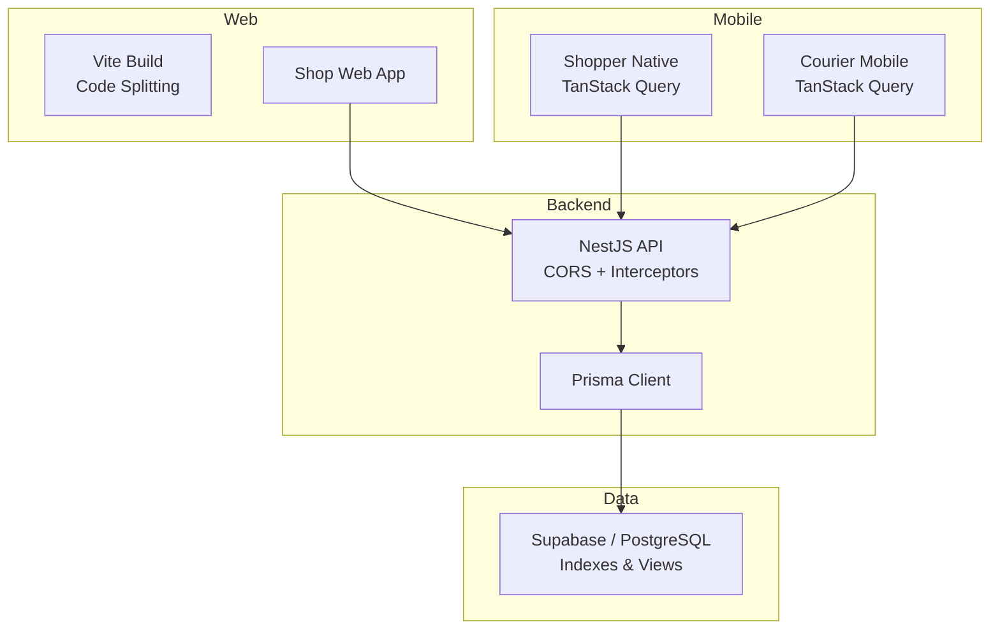
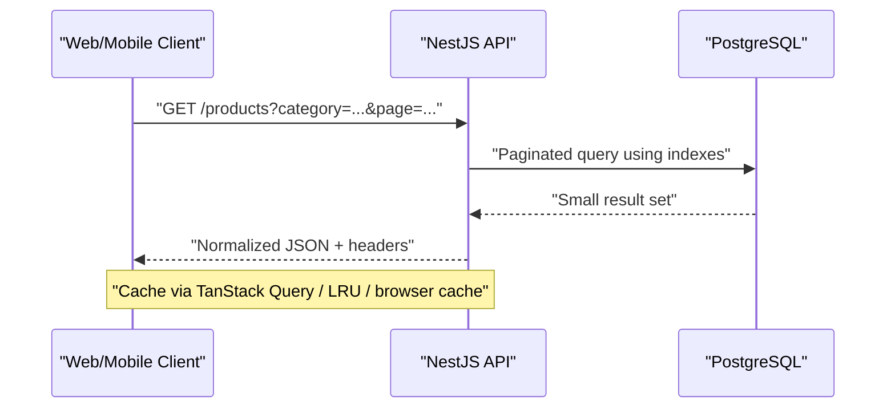
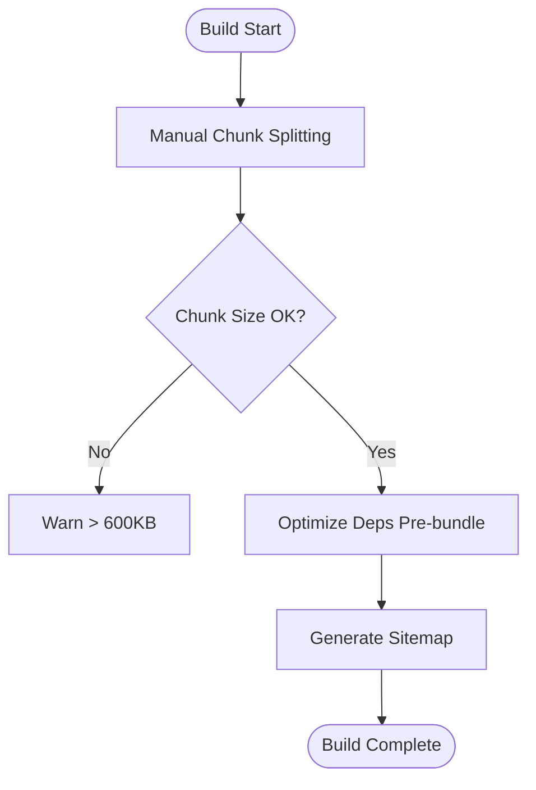
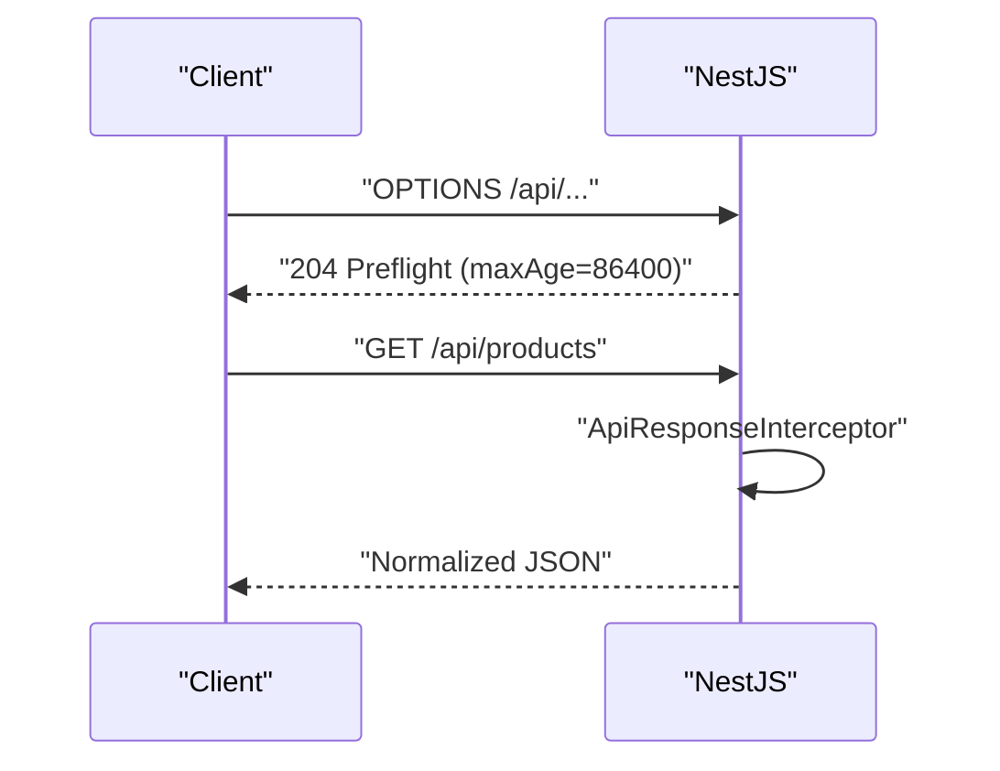
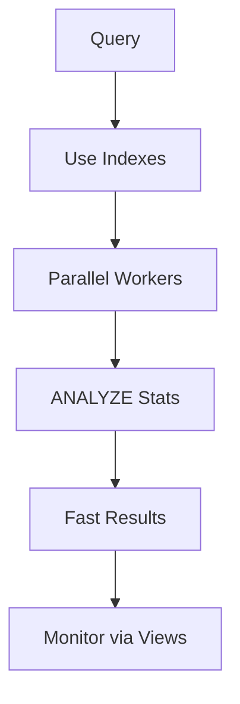
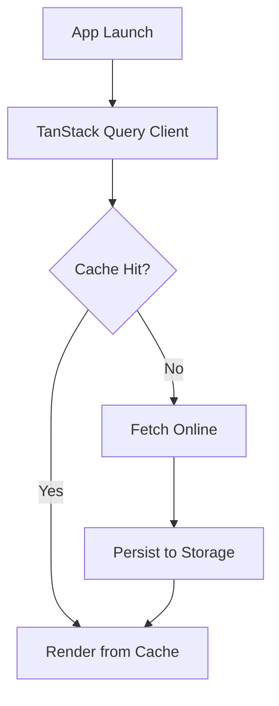
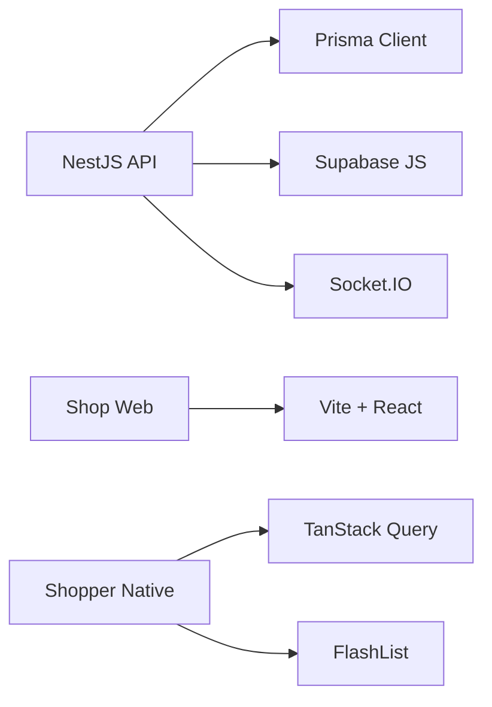

# Performance Optimization

<cite>
**Referenced Files in This Document**
- [PERFORMANCE_OPTIMIZATION_GUIDE.md](file://PERFORMANCE_OPTIMIZATION_GUIDE.md)
- [vite.config.ts](file://apps\shopper-web\vite.config.ts)
- [OPTIMIZATION_SETUP.md](file://apps\shopper-web\OPTIMIZATION_SETUP.md)
- [performance_indexes.sql](file://database\performance_indexes.sql)
- [main.ts](file://apps\api\src\main.ts)
- [package.json (API)](file://apps\api\package.json)
- [queryClient.ts (Shopper Native)](file://apps\shopper-native\src\lib\queryClient.ts)
- [queryClient.ts (Courier Mobile)](file://apps\courier-mobile\src\lib\queryClient.ts)
- [package.json (Shopper Native)](file://apps\shopper-native\package.json)
</cite>

## Table of Contents
1. Introduction
2. Project Structure
3. Core Components
4. Architecture Overview
5. Detailed Component Analysis
6. Dependency Analysis
7. Performance Considerations
8. Troubleshooting Guide
9. Conclusion
10. Appendices

## Introduction
This document provides a comprehensive performance optimization guide for the United Pharmacy system across frontend, backend, mobile, and data layers. It consolidates existing optimizations and configurations found in the repository and presents actionable strategies for code splitting, lazy loading, image optimization, bundle size reduction, database query tuning, caching, API response optimization, mobile performance considerations, profiling and monitoring, CDN/content delivery, and scalability.

## Project Structure
The system is a multi-app monorepo with:
- Web app (React + Vite) under apps/shopper-web
- Backend API (NestJS) under apps/api
- Mobile apps (Expo/React Native) under apps/shopper-native and apps/courier-mobile
- Shared packages under packages/*
- Database migrations and indexes under database/*

**Diagram sources**
- [vite.config.ts:28-204](file://apps\shopper-web\vite.config.ts#L28-L204)
- [main.ts:7-35](file://apps\api\src\main.ts#L7-L35)
- [queryClient.ts (Shopper Native):1-62](file://apps\shopper-native\src\lib\queryClient.ts#L1-L62)
- [queryClient.ts (Courier Mobile):1-27](file://apps\courier-mobile\src\lib\queryClient.ts#L1-L27)
- [performance_indexes.sql:1-243](file://database\performance_indexes.sql#L1-L243)

**Section sources**
- [vite.config.ts:28-204](file://apps\shopper-web\vite.config.ts#L28-L204)
- [main.ts:7-35](file://apps\api\src\main.ts#L7-L35)
- [performance_indexes.sql:1-243](file://database\performance_indexes.sql#L1-L243)

## Core Components
- Frontend build and bundling: Vite configuration defines manual chunking to isolate React core, router, UI libraries, charts, icons, data layer, state management, forms, and optional heavy libs; includes dependency pre-bundling and sitemap generation post-build.
- Backend runtime: NestJS bootstrap configures CORS with explicit origins, allowed headers, credentials, and preflight caching; global interceptors and filters standardize responses and error handling.
- Database performance: Comprehensive indexes on products, categories, orders, order items; parallel workers settings; ANALYZE statistics; slow-query and index-usage views; maintenance functions.
- Mobile data layer: TanStack Query clients tuned for mobile with staleTime/gcTime policies, retry/backoff, offline-first modes, and persistence where applicable.

**Section sources**
- [vite.config.ts:75-199](file://apps\shopper-web\vite.config.ts#L75-L199)
- [main.ts:10-31](file://apps\api\src\main.ts#L10-L31)
- [performance_indexes.sql:10-143](file://database\performance_indexes.sql#L10-L143)
- [queryClient.ts (Shopper Native):32-57](file://apps\shopper-native\src\lib\queryClient.ts#L32-L57)
- [queryClient.ts (Courier Mobile):5-20](file://apps\courier-mobile\src\lib\queryClient.ts#L5-L20)

## Architecture Overview
End-to-end request flow optimized for performance:
- Web/Mobile client requests API with efficient queries and cached responses.
- API applies CORS, standardized response envelope, and exception filtering.
- Prisma executes optimized SQL leveraging indexes and statistics.
- Responses are small, paginated, and cache-friendly.

**Diagram sources**
- [main.ts:10-31](file://apps\api\src\main.ts#L10-L31)
- [performance_indexes.sql:10-66](file://database\performance_indexes.sql#L10-L66)
- [queryClient.ts (Shopper Native):32-57](file://apps\shopper-native\src\lib\queryClient.ts#L32-L57)

## Detailed Component Analysis

### Frontend Optimization (Shop Web)
- Code splitting and manual chunks:
  - React core, router, motion, UI libs (MUI/Radix), icons, charts, utilities, data layer, state, forms, and large optional libs are split into dedicated chunks to reduce initial payload and improve caching.
- Bundle budgeting:
  - Chunk warning limit set to 600 KB; guidance targets initial shell ≤ 250 KB gzipped.
- Dev server and aliases:
  - Aliases centralize imports; optimizeDeps includes shared packages for faster dev builds.
- Sitemap generation:
  - Post-build plugin generates sitemaps to aid SEO and discoverability.

**Diagram sources**
- [vite.config.ts:81-199](file://apps\shopper-web\vite.config.ts#L81-L199)
- [vite.config.ts:7-26](file://apps\shopper-web\vite.config.ts#L7-L26)

**Section sources**
- [vite.config.ts:75-199](file://apps\shopper-web\vite.config.ts#L75-L199)
- [vite.config.ts:7-26](file://apps\shopper-web\vite.config.ts#L7-L26)

### Backend Optimization (NestJS API)
- CORS and preflight caching:
  - Explicit allowlist of origins, methods, headers, credentials enabled, and maxAge set to cache preflight responses for 24 hours to reduce OPTIONS overhead.
- Global interceptors/filters:
  - ApiResponseInterceptor normalizes payloads; HttpExceptionFilter centralizes error formatting.
- Runtime:
  - Listens on configurable port with environment fallback.

**Diagram sources**
- [main.ts:10-31](file://apps\api\src\main.ts#L10-L31)

**Section sources**
- [main.ts:10-31](file://apps\api\src\main.ts#L10-L31)

### Database Query Optimization
- Indexes:
  - Products: search main, category-specific, price asc/desc, full-text name (EN/AR), code/barcode, composite search+filters, in-stock, pagination, images, low stock.
  - Categories: name EN/AR, product count, sort order.
  - Orders: status+date, customer phone, QR token, driver assignment.
  - Order Items: order_id, product_id+date.
- Parallelism and stats:
  - Parallel workers set per table; ANALYZE run to update planner stats.
- Monitoring:
  - Views for slow queries and index usage; maintenance function to refresh category/product counts.

**Diagram sources**
- [performance_indexes.sql:10-143](file://database\performance_indexes.sql#L10-L143)
- [performance_indexes.sql:148-202](file://database\performance_indexes.sql#L148-L202)

**Section sources**
- [performance_indexes.sql:10-143](file://database\performance_indexes.sql#L10-L143)
- [performance_indexes.sql:148-202](file://database\performance_indexes.sql#L148-L202)

### Mobile Performance Considerations
- Shopper Native:
  - TanStack Query tuned for mobile: 5-minute stale time, 24-hour garbage collection, online network mode, limited retries for transient errors, terminal error detection for 4xx and specific codes.
- Courier Mobile:
  - Offline-first network mode for queries/mutations, persisted cache via Async Storage, exponential backoff with capped delays.
- Dependencies:
  - Uses Expo ecosystem, FlashList for performant lists, MMKV for fast storage, and other performance-oriented libraries.

**Diagram sources**
- [queryClient.ts (Shopper Native):32-57](file://apps\shopper-native\src\lib\queryClient.ts#L32-L57)
- [queryClient.ts (Courier Mobile):5-20](file://apps\courier-mobile\src\lib\queryClient.ts#L5-L20)

**Section sources**
- [queryClient.ts (Shopper Native):32-57](file://apps\shopper-native\src\lib\queryClient.ts#L32-L57)
- [queryClient.ts (Courier Mobile):5-20](file://apps\courier-mobile\src\lib\queryClient.ts#L5-L20)
- [package.json (Shopper Native):17-79](file://apps\shopper-native\package.json#L17-L79)

### API Response Optimization
- Standardized response envelope via interceptor ensures consistent structure and reduces parsing overhead on clients.
- Centralized exception filter prevents leaking internals and minimizes payload size by returning concise error objects.
- CORS preflight caching reduces repeated OPTIONS requests.

**Section sources**
- [main.ts:10-31](file://apps\api\src\main.ts#L10-L31)

### Caching Strategies Across Layers
- Browser/Service Worker:
  - Static assets and API responses can be cached via HTTP headers; configure CDN/cache-control for long-lived assets and short-lived API responses.
- Application Layer:
  - Shopper Web uses LRU-style in-memory caches with TTL for catalog pages; performance monitor tracks hit rates and load times.
- Mobile:
  - TanStack Query persists and reuses data; offline-first mode queues mutations and resumes when online.

**Section sources**
- [PERFORMANCE_OPTIMIZATION_GUIDE.md:46-50](file://PERFORMANCE_OPTIMIZATION_GUIDE.md#L46-L50)
- [OPTIMIZATION_SETUP.md:45-49](file://apps\shopper-web\OPTIMIZATION_SETUP.md#L45-L49)
- [queryClient.ts (Shopper Native):32-57](file://apps\shopper-native\src\lib\queryClient.ts#L32-L57)
- [queryClient.ts (Courier Mobile):5-20](file://apps\courier-mobile\src\lib\queryClient.ts#L5-L20)

### CDN and Content Delivery Optimization
- Configure CDN to cache static assets (images, fonts, JS/CSS bundles) with appropriate cache-control and immutable tags.
- Use CDN edge caching for public API endpoints that are safe to cache (e.g., catalogs with ETag/Last-Modified).
- Ensure CORS allows CDN domains and that preflight caching is effective.

[No sources needed since this section provides general guidance]

### Scalability Considerations
- Database:
  - Leverage provided indexes and parallel workers; regularly analyze tables and review slow queries via views.
- API:
  - Horizontal scaling behind a reverse proxy; ensure stateless services; use connection pooling for DB.
- Frontend:
  - Keep initial bundle small via manual chunking; lazy-load routes and heavy features; use virtualization for large lists.
- Mobile:
  - Prefer offline-first patterns; batch updates; minimize background work; use efficient list rendering (FlashList).

**Section sources**
- [performance_indexes.sql:133-143](file://database\performance_indexes.sql#L133-L143)
- [performance_indexes.sql:148-172](file://database\performance_indexes.sql#L148-L172)
- [vite.config.ts:81-199](file://apps\shopper-web\vite.config.ts#L81-L199)
- [package.json (Shopper Native):17-79](file://apps\shopper-native\package.json#L17-L79)

## Dependency Analysis
Key runtime dependencies influencing performance:
- API: NestJS platform-express, Socket.IO/WebSockets, Prisma, Supabase JS client, JWT/Bcrypt, Multer, Zod.
- Web: Vite, React, Tailwind, MUI/Radix, charting libs, data fetching (Supabase/TanStack/SWR), state managers.
- Mobile: Expo, React Native, TanStack Query, FlashList, MMKV, location/camera/video modules.

**Diagram sources**
- [package.json (API):14-35](file://apps\api\package.json#L14-L35)
- [vite.config.ts:75-199](file://apps\shopper-web\vite.config.ts#L75-L199)
- [package.json (Shopper Native):17-79](file://apps\shopper-native\package.json#L17-L79)

**Section sources**
- [package.json (API):14-35](file://apps\api\package.json#L14-L35)
- [package.json (Shopper Native):17-79](file://apps\shopper-native\package.json#L17-L79)

## Performance Considerations
- Frontend:
  - Maintain manual chunk boundaries; avoid importing heavy libs at top-level; prefer route-level lazy loading; use virtualized lists for large datasets.
- Backend:
  - Enforce pagination and field selection; return only necessary fields; leverage indexes; avoid N+1 queries; use Prisma relations efficiently.
- Database:
  - Keep indexes aligned with query patterns; monitor index usage; run ANALYZE after bulk changes; archive or partition historical data if needed.
- Mobile:
  - Tune staleTime/gcTime based on content volatility; use offlineFirst for resilient UX; compress images and defer non-critical tasks.

[No sources needed since this section provides general guidance]

## Troubleshooting Guide
- Slow product catalog loads:
  - Verify database indexes are created; check index usage via provided view; run ANALYZE; measure query plans with EXPLAIN ANALYZE.
- High memory or jank:
  - Reduce page sizes; ensure virtualization; audit large chunks; remove unused dependencies.
- Network issues:
  - Confirm CORS allowlist; check preflight caching; validate retry policies and terminal error handling on mobile.
- Monitoring:
  - Use built-in performance monitor to track load times and cache hit rates; review slow queries and index usage views.

**Section sources**
- [PERFORMANCE_OPTIMIZATION_GUIDE.md:145-179](file://PERFORMANCE_OPTIMIZATION_GUIDE.md#L145-L179)
- [OPTIMIZATION_SETUP.md:138-179](file://apps\shopper-web\OPTIMIZATION_SETUP.md#L138-L179)
- [performance_indexes.sql:148-172](file://database\performance_indexes.sql#L148-L172)

## Conclusion
The United Pharmacy system already incorporates strong performance foundations: targeted database indexes, efficient frontend chunking, robust mobile caching, and standardized API responses. By following the recommendations above—maintaining chunk budgets, optimizing queries, enabling CDN caching, and continuously monitoring—you can sustain sub-second interactions even as traffic and data volume grow.

[No sources needed since this section summarizes without analyzing specific files]

## Appendices

### A. Frontend Bundle and Lazy Loading Checklist
- Keep initial shell minimal; move heavy features to lazy routes.
- Group third-party libs via manualChunks to maximize cache reuse.
- Use virtualization for large lists; defer non-critical analytics.

**Section sources**
- [vite.config.ts:81-199](file://apps\shopper-web\vite.config.ts#L81-L199)

### B. Backend API Checklist
- Validate CORS origin list and preflight caching.
- Normalize responses and errors globally.
- Enforce pagination and selective field projection.

**Section sources**
- [main.ts:10-31](file://apps\api\src\main.ts#L10-L31)

### C. Database Maintenance Checklist
- Run provided indexes once; verify usage via views.
- Schedule periodic ANALYZE and update functions.
- Review slow queries and adjust indexes accordingly.

**Section sources**
- [performance_indexes.sql:10-143](file://database\performance_indexes.sql#L10-L143)
- [performance_indexes.sql:148-202](file://database\performance_indexes.sql#L148-L202)

### D. Mobile Data Strategy Checklist
- Set appropriate staleTime/gcTime per feature.
- Use offlineFirst for resilience; persist critical caches.
- Limit retries for terminal errors; debounce user inputs.

**Section sources**
- [queryClient.ts (Shopper Native):32-57](file://apps\shopper-native\src\lib\queryClient.ts#L32-L57)
- [queryClient.ts (Courier Mobile):5-20](file://apps\courier-mobile\src\lib\queryClient.ts#L5-L20)