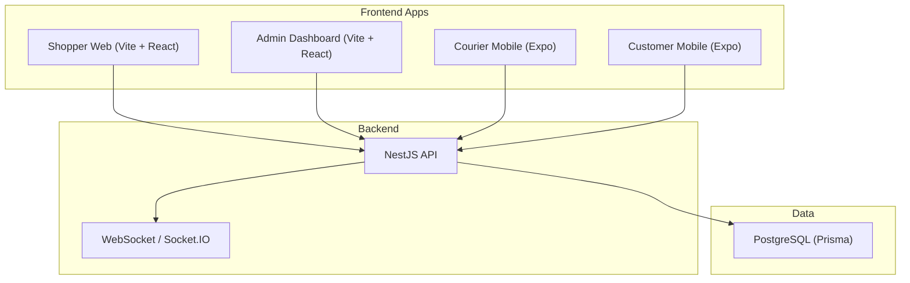
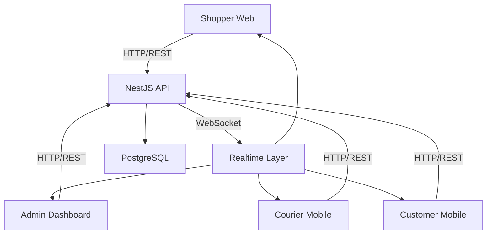
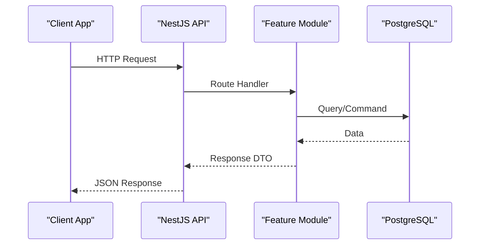
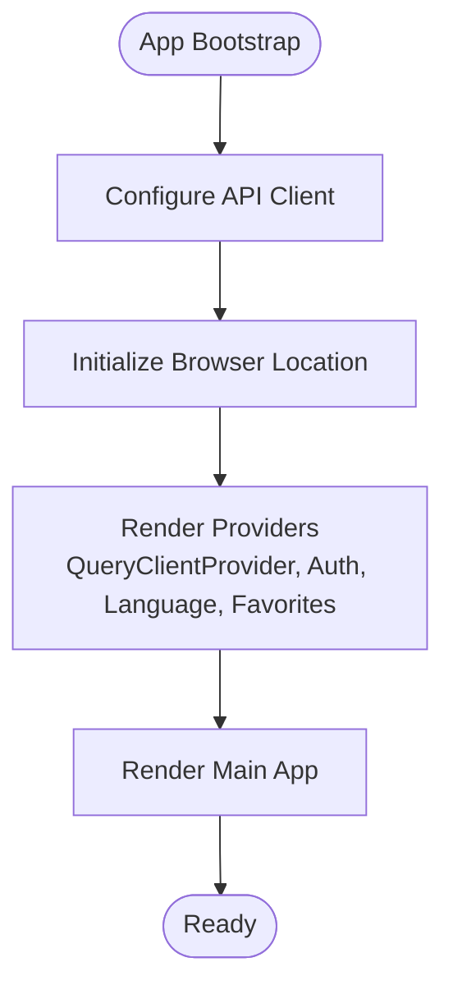
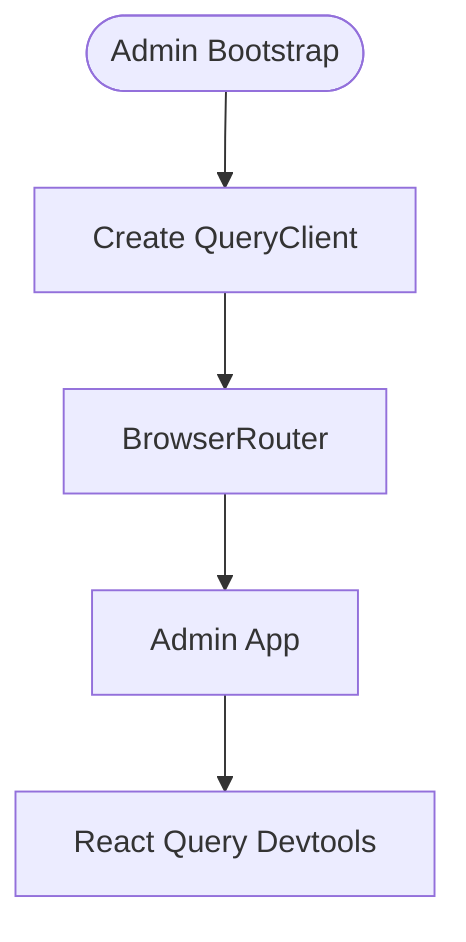
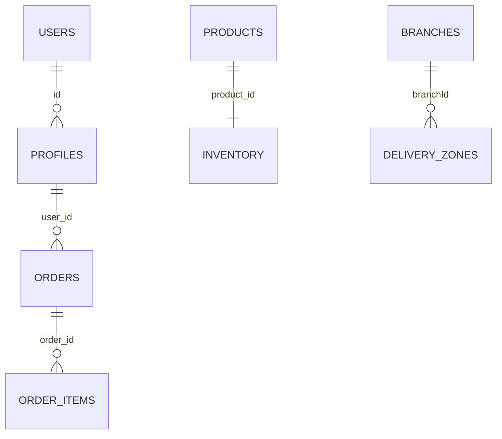
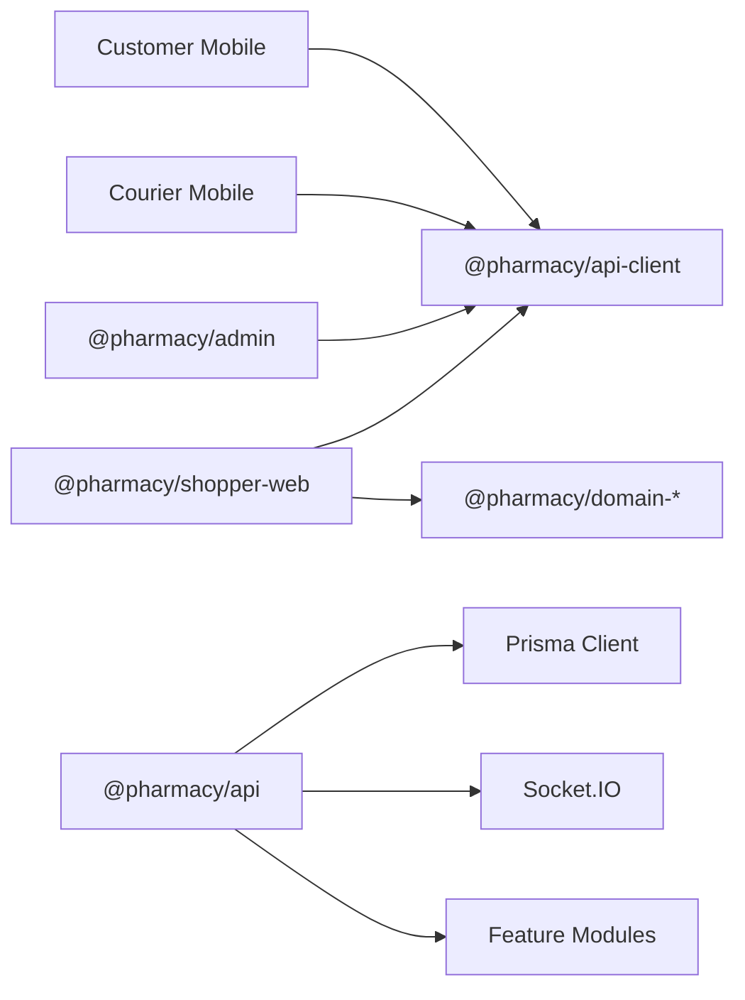

# Project Overview

<cite>
**Referenced Files in This Document**
- [README.md](file://README.md)
- [package.json](file://package.json)
- [apps/api/package.json](file://apps/api/package.json)
- [apps/api/src/main.ts](file://apps/api/src/main.ts)
- [apps/api/src/app.module.ts](file://apps/api/src/app.module.ts)
- [apps/api/prisma/schema.prisma](file://apps/api/prisma/schema.prisma)
- [apps/shopper-web/package.json](file://apps/shopper-web/package.json)
- [apps/shopper-web/src/main.tsx](file://apps/shopper-web/src/main.tsx)
- [apps/admin/package.json](file://apps/admin/package.json)
- [apps/admin/src/main.tsx](file://apps/admin/src/main.tsx)
</cite>

## Table of Contents
1. Introduction
2. Project Structure
3. Core Components
4. Architecture Overview
5. Detailed Component Analysis
6. Dependency Analysis
7. Performance Considerations
8. Troubleshooting Guide
9. Conclusion

## Introduction
United Pharmacy is a multi-platform pharmacy commerce ecosystem built as an npm workspaces monorepo. It delivers end-to-end pharmacy operations including product catalog management, prescription processing, order fulfillment, delivery logistics, and real-time tracking for shoppers, pharmacists, drivers, and administrators. The system comprises:
- A React-based shopper web application
- Mobile apps for customers and couriers (Expo/React Native)
- An admin dashboard for pharmacy operations
- A NestJS API service with WebSocket support
- A PostgreSQL database via Prisma
- Shared domain logic and contracts across packages

The monorepo centralizes shared backend access, domain workflows, search state, geo-aware assignment, and medical-first catalog helpers to ensure consistency and reusability across all applications.

**Section sources**
- [README.md:1-24](file://README.md#L1-L24)
- [package.json:9-26](file://package.json#L9-L26)

## Project Structure
The repository follows a feature-oriented monorepo layout:
- apps: platform-specific applications (shopper-web, admin, courier-mobile, customer-mobile, cashier-mobile, ops-dashboard)
- packages: shared libraries (api-client, domain modules, types, UI primitives, design tokens)
- database: SQL migrations and indexes
- supabase: serverless functions and migrations for background jobs and data pipelines

**Diagram sources**
- [apps/api/src/main.ts:7-35](file://apps/api/src/main.ts#L7-L35)
- [apps/api/src/app.module.ts:14-27](file://apps/api/src/app.module.ts#L14-L27)
- [apps/shopper-web/src/main.tsx:19-22](file://apps/shopper-web/src/main.tsx#L19-L22)
- [apps/admin/src/main.tsx:19-27](file://apps/admin/src/main.tsx#L19-L27)
- [apps/api/package.json:14-35](file://apps/api/package.json#L14-L35)
- [apps/api/prisma/schema.prisma:6-11](file://apps/api/prisma/schema.prisma#L6-L11)

**Section sources**
- [README.md:5-15](file://README.md#L5-L15)
- [package.json:9-26](file://package.json#L9-L26)

## Core Components
- Shopper Web App: Vite + React app that configures the shared API client, initializes location services, and renders the application shell with providers and query caching.
- Admin Dashboard: Vite + React app with TanStack Query and routing, used by pharmacy staff to manage branches, products, inventory, orders, drivers, and promotions.
- Courier Mobile: Expo-based mobile app for drivers to accept deliveries, track GPS, and receive notifications.
- Customer Mobile: Expo-based mobile app for customers to browse, order, and track deliveries.
- API Service: NestJS application exposing REST and WebSocket endpoints, integrating authentication, modules for branches, delivery, driver, notifications, admin, products, inventory, and customers.
- Database: PostgreSQL schema managed by Prisma, covering users/auth, profiles, products, inventory, orders, delivery zones, and related entities.

Business value proposition:
- Pharmacies: Centralized catalog and inventory management, streamlined prescription handling, operational dashboards, and analytics.
- Customers: Convenient browsing, ordering, and real-time delivery tracking across web and mobile.
- Drivers: Efficient assignment, navigation, and delivery workflow tools.
- Administrators: Cross-functional oversight of branches, staff, promotions, and performance metrics.

**Section sources**
- [apps/shopper-web/src/main.tsx:19-59](file://apps/shopper-web/src/main.tsx#L19-L59)
- [apps/admin/src/main.tsx:9-27](file://apps/admin/src/main.tsx#L9-L27)
- [apps/api/src/app.module.ts:14-27](file://apps/api/src/app.module.ts#L14-L27)
- [apps/api/prisma/schema.prisma:529-800](file://apps/api/prisma/schema.prisma#L529-L800)

## Architecture Overview
High-level architecture shows how frontend applications interact with the backend API and database, with real-time communication for live updates and tracking.

**Diagram sources**
- [apps/api/src/main.ts:13-28](file://apps/api/src/main.ts#L13-L28)
- [apps/api/package.json:14-35](file://apps/api/package.json#L14-L35)
- [apps/api/prisma/schema.prisma:6-11](file://apps/api/prisma/schema.prisma#L6-L11)

## Detailed Component Analysis

### API Service (NestJS)
- Bootstraps the application with CORS configured for production domains and localhost development.
- Registers global response interceptor and exception filter for consistent API behavior.
- Composes feature modules for branches, delivery, driver, notifications, admin, products, inventory, and customers.
- Integrates Prisma for PostgreSQL access and Socket.IO/WebSockets for real-time features.

**Diagram sources**
- [apps/api/src/main.ts:7-35](file://apps/api/src/main.ts#L7-L35)
- [apps/api/src/app.module.ts:14-27](file://apps/api/src/app.module.ts#L14-L27)
- [apps/api/package.json:14-35](file://apps/api/package.json#L14-L35)
- [apps/api/prisma/schema.prisma:6-11](file://apps/api/prisma/schema.prisma#L6-L11)

**Section sources**
- [apps/api/src/main.ts:7-35](file://apps/api/src/main.ts#L7-L35)
- [apps/api/src/app.module.ts:14-27](file://apps/api/src/app.module.ts#L14-L27)
- [apps/api/package.json:14-35](file://apps/api/package.json#L14-L35)

### Shopper Web Application
- Configures the shared API client with base URLs for primary and search APIs.
- Initializes browser location services and sets up React Query provider for data fetching and caching.
- Renders core providers (auth, language, favorites), error boundary, and UI toasts.

**Diagram sources**
- [apps/shopper-web/src/main.tsx:19-59](file://apps/shopper-web/src/main.tsx#L19-L59)

**Section sources**
- [apps/shopper-web/src/main.tsx:19-59](file://apps/shopper-web/src/main.tsx#L19-L59)
- [apps/shopper-web/package.json:1-26](file://apps/shopper-web/package.json#L1-L26)

### Admin Dashboard
- Sets up TanStack Query with default options for caching and retries.
- Wraps the app with React Router and devtools for debugging.

**Diagram sources**
- [apps/admin/src/main.tsx:9-27](file://apps/admin/src/main.tsx#L9-L27)

**Section sources**
- [apps/admin/src/main.tsx:9-27](file://apps/admin/src/main.tsx#L9-L27)
- [apps/admin/package.json:1-43](file://apps/admin/package.json#L1-L43)

### Domain and Shared Packages
- api-client: centralized backend access layer consumed by all apps.
- domain-core: shared workflow events and query conventions.
- domain-search: search state management using Zustand + TanStack Query.
- domain-location: geo-aware assignment and checkout quote logic.
- domain-catalog: medical-first product helpers.
- domain-orders, domain-prescriptions, domain-account, domain-cart, domain-checkout, domain-courier, domain-ops: encapsulated business logic per domain.

These packages enable consistent behavior across platforms and reduce duplication.

**Section sources**
- [README.md:17-24](file://README.md#L17-L24)

### Database Schema Highlights
- Authentication and user identity tables under auth schema.
- Public schema includes profiles, products, inventory, orders, order items, favorites, integration events, special orders, and delivery zones.
- Enums define roles (manager, pharmacist, driver, admin, customer) and order lifecycle states (pending, confirmed, preparing, ready, picked_up, delivered, cancelled).

**Diagram sources**
- [apps/api/prisma/schema.prisma:407-800](file://apps/api/prisma/schema.prisma#L407-L800)

**Section sources**
- [apps/api/prisma/schema.prisma:407-800](file://apps/api/prisma/schema.prisma#L407-L800)

## Dependency Analysis
- Frontend apps depend on shared packages (api-client, domain modules, ui libraries).
- The API depends on Prisma for database access, Socket.IO for real-time, and feature modules for domain logic.
- Monorepo scripts orchestrate build and start commands for API and web/native apps.

**Diagram sources**
- [package.json:9-26](file://package.json#L9-L26)
- [apps/api/package.json:14-35](file://apps/api/package.json#L14-L35)
- [apps/shopper-web/package.json:1-26](file://apps/shopper-web/package.json#L1-L26)
- [apps/admin/package.json:1-43](file://apps/admin/package.json#L1-L43)

**Section sources**
- [package.json:9-26](file://package.json#L9-L26)
- [apps/api/package.json:14-35](file://apps/api/package.json#L14-L35)

## Performance Considerations
- Use TanStack Query for efficient caching and refetch strategies in both web and admin apps.
- Enable CORS preflight caching to reduce OPTIONS requests in production.
- Leverage Prisma’s connection pooling and indexing for database performance.
- Keep WebSocket connections minimal and use event-driven updates for real-time features.
- Optimize frontend bundles with Vite and code splitting; monitor Core Web Vitals.

[No sources needed since this section provides general guidance]

## Troubleshooting Guide
- CORS issues: Ensure origins include production domains and localhost patterns; verify credentials and allowed headers.
- WebSocket connectivity: Confirm Socket.IO is enabled and clients connect to the correct endpoint.
- Database connectivity: Validate DATABASE_URL and DIRECT_URL environment variables; check Prisma schema alignment with migrations.
- API responses: Global interceptors and filters standardize error handling; inspect logs for stack traces and request IDs.

**Section sources**
- [apps/api/src/main.ts:13-31](file://apps/api/src/main.ts#L13-L31)
- [apps/api/package.json:14-35](file://apps/api/package.json#L14-L35)
- [apps/api/prisma/schema.prisma:6-11](file://apps/api/prisma/schema.prisma#L6-L11)

## Conclusion
United Pharmacy’s monorepo architecture unifies multiple platforms around shared domain logic and a robust NestJS API backed by PostgreSQL. It enables pharmacies to manage catalogs, prescriptions, orders, and deliveries while providing customers and drivers with seamless experiences across web and mobile. Real-time communication enhances operational visibility and customer satisfaction. The modular design supports scalability, maintainability, and continuous improvement across the entire ecosystem.

[No sources needed since this section summarizes without analyzing specific files]