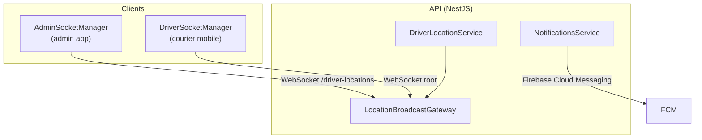
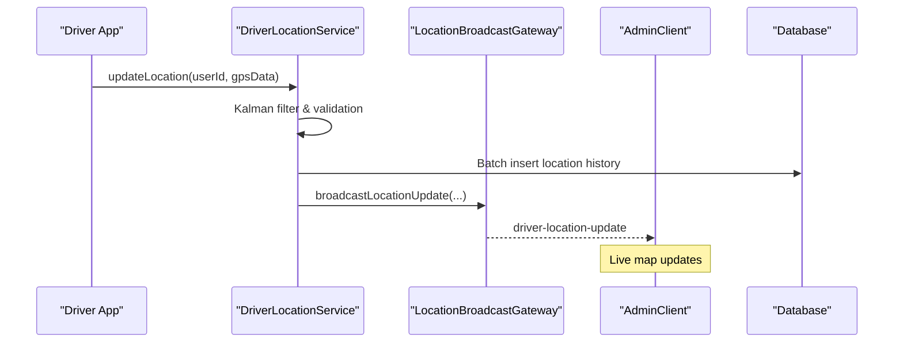
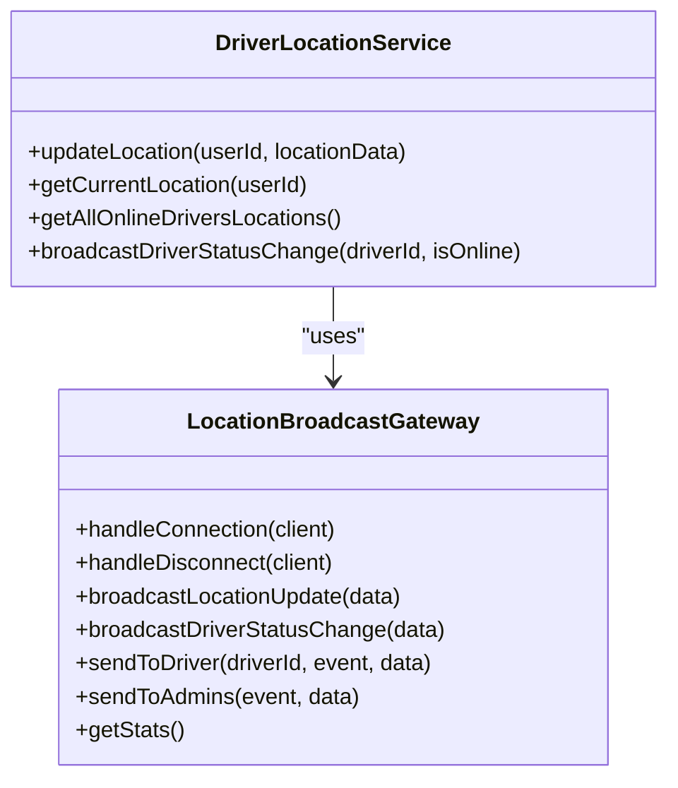
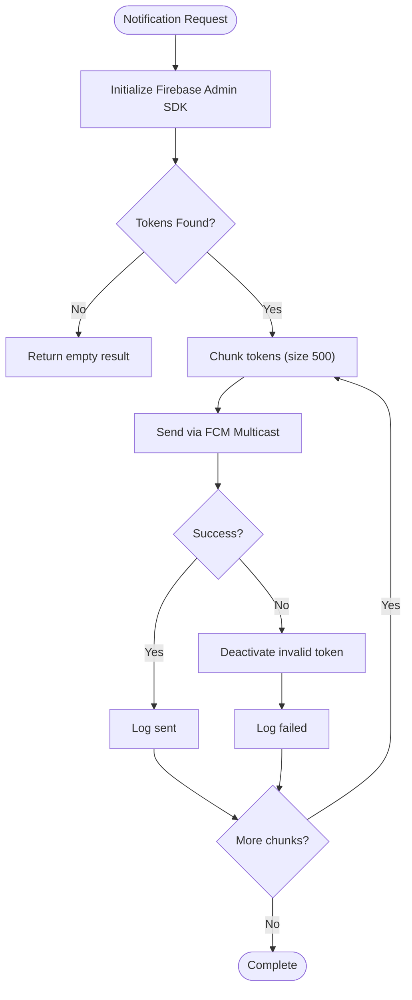
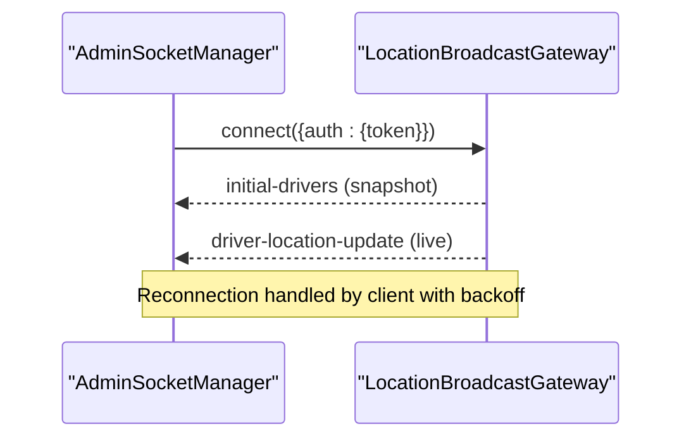
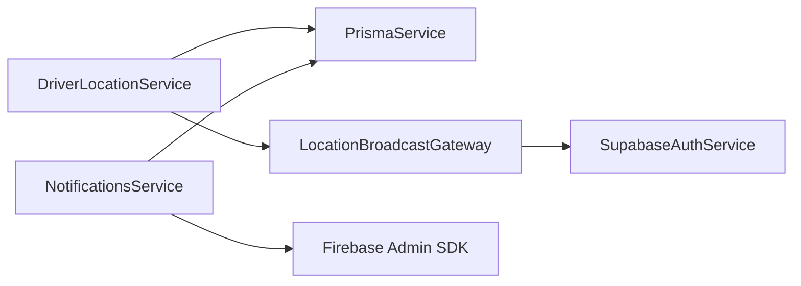

# Real-time Features

<cite>
**Referenced Files in This Document**
- [location-broadcast.gateway.ts](file://apps/api/src/modules/driver/location-broadcast.gateway.ts)
- [driver-location.service.ts](file://apps/api/src/modules/driver/driver-location.service.ts)
- [notifications.service.ts](file://apps/api/src/modules/notifications/notifications.service.ts)
- [socket.ts (Admin client)](file://apps/admin/src/lib/socket.ts)
- [socket.ts (Courier mobile client)](file://apps/courier-mobile/src/lib/socket.ts)
- [MapPage.tsx](file://apps/admin/src/pages/MapPage.tsx)
</cite>

## Table of Contents
1. [Introduction](#introduction)
2. [Project Structure](#project-structure)
3. [Core Components](#core-components)
4. [Architecture Overview](#architecture-overview)
5. [Detailed Component Analysis](#detailed-component-analysis)
6. [Dependency Analysis](#dependency-analysis)
7. [Performance Considerations](#performance-considerations)
8. [Troubleshooting Guide](#troubleshooting-guide)
9. [Conclusion](#conclusion)
10. [Appendices](#appendices)

## Introduction
This document explains the real-time features of the United Pharmacy system with a focus on:
- WebSocket implementation using Socket.io for live order tracking, real-time inventory updates, and instant messaging capabilities
- Notification system architecture including push notifications, SMS campaigns, and in-app notifications
- Driver location broadcasting system for real-time delivery tracking and route optimization
- Event-driven architecture patterns, message formats, and client-side reconnection strategies
- Performance considerations for high concurrency, message queuing, and offline synchronization
- Security measures for real-time communications and debugging techniques

The scope covers server-side gateways and services that power real-time flows, as well as client-side managers that connect to these services.

## Project Structure
Real-time functionality is implemented across:
- API layer (NestJS):
  - WebSocket gateway for driver locations and admin broadcasts
  - Driver location service with GPS filtering and batched persistence
  - Notifications service for push notifications via Firebase Admin SDK
- Client layers:
  - Admin web socket manager for connecting to the driver locations namespace
  - Courier mobile socket manager for receiving order and delivery events

**Diagram sources**
- [location-broadcast.gateway.ts:27-46](file://apps/api/src/modules/driver/location-broadcast.gateway.ts#L27-L46)
- [driver-location.service.ts:18-25](file://apps/api/src/modules/driver/driver-location.service.ts#L18-L25)
- [notifications.service.ts:20-48](file://apps/api/src/modules/notifications/notifications.service.ts#L20-L48)
- [socket.ts (Admin client):6-20](file://apps/admin/src/lib/socket.ts#L6-L20)
- [socket.ts (Courier mobile client):18-36](file://apps/courier-mobile/src/lib/socket.ts#L18-L36)

**Section sources**
- [location-broadcast.gateway.ts:27-46](file://apps/api/src/modules/driver/location-broadcast.gateway.ts#L27-L46)
- [driver-location.service.ts:18-25](file://apps/api/src/modules/driver/driver-location.service.ts#L18-L25)
- [notifications.service.ts:20-48](file://apps/api/src/modules/notifications/notifications.service.ts#L20-L48)
- [socket.ts (Admin client):6-20](file://apps/admin/src/lib/socket.ts#L6-L20)
- [socket.ts (Courier mobile client):18-36](file://apps/courier-mobile/src/lib/socket.ts#L18-L36)

## Core Components
- LocationBroadcastGateway
  - Exposes a Socket.io namespace for driver locations
  - Authenticates clients via access token
  - Manages rooms for targeted broadcasts (per-driver and admin room)
  - Emits driver location updates and status changes
- DriverLocationService
  - Validates and filters incoming GPS data using a Kalman filter
  - Persists location history in batches to reduce DB load
  - Updates current driver position and triggers WebSocket broadcasts
  - Provides endpoints to query online drivers and histories
- NotificationsService
  - Initializes Firebase Admin SDK for push notifications
  - Registers and deactivates device tokens per user/platform
  - Sends single or broadcast notifications with chunking for large audiences
  - Logs delivery outcomes and cleans invalid tokens
- AdminSocketManager (client)
  - Connects to the /driver-locations namespace with auth token
  - Reconnects with exponential backoff and reattaches listeners
- DriverSocketManager (client)
  - Connects to the API root with auth token
  - Listens for new orders, delivery status updates, and assignment events
  - Invalidates queries to refresh UI state

**Section sources**
- [location-broadcast.gateway.ts:58-93](file://apps/api/src/modules/driver/location-broadcast.gateway.ts#L58-L93)
- [driver-location.service.ts:30-127](file://apps/api/src/modules/driver/driver-location.service.ts#L30-L127)
- [notifications.service.ts:63-98](file://apps/api/src/modules/notifications/notifications.service.ts#L63-L98)
- [socket.ts (Admin client):10-36](file://apps/admin/src/lib/socket.ts#L10-L36)
- [socket.ts (Courier mobile client):24-69](file://apps/courier-mobile/src/lib/socket.ts#L24-L69)

## Architecture Overview
The real-time architecture combines event-driven services with persistent storage and push channels:
- Drivers send location updates to the API; the service filters and persists them, then broadcasts via WebSocket
- Admin clients subscribe to the driver locations namespace to visualize live driver positions
- Courier clients receive order and delivery events over WebSockets and refresh local state
- Push notifications are sent asynchronously through Firebase, with robust token management and logging

**Diagram sources**
- [driver-location.service.ts:30-127](file://apps/api/src/modules/driver/driver-location.service.ts#L30-L127)
- [location-broadcast.gateway.ts:120-127](file://apps/api/src/modules/driver/location-broadcast.gateway.ts#L120-L127)
- [socket.ts (Admin client):10-36](file://apps/admin/src/lib/socket.ts#L10-L36)

## Detailed Component Analysis

### Driver Location Broadcasting System
Responsibilities:
- Authenticate connections and initialize admin clients with current online drivers
- Broadcast driver location updates and status changes
- Manage rooms for targeted messages (per-driver and admin)

Key behaviors:
- Connection handling validates tokens and role-based access
- Initial snapshot of online drivers is emitted upon connection
- Batched location updates from the service trigger WebSocket broadcasts
- Rooms enable targeted communication (e.g., per-driver updates)

**Diagram sources**
- [location-broadcast.gateway.ts:27-46](file://apps/api/src/modules/driver/location-broadcast.gateway.ts#L27-L46)
- [location-broadcast.gateway.ts:120-195](file://apps/api/src/modules/driver/location-broadcast.gateway.ts#L120-L195)
- [driver-location.service.ts:18-25](file://apps/api/src/modules/driver/driver-location.service.ts#L18-L25)
- [driver-location.service.ts:223-245](file://apps/api/src/modules/driver/driver-location.service.ts#L223-L245)

**Section sources**
- [location-broadcast.gateway.ts:58-93](file://apps/api/src/modules/driver/location-broadcast.gateway.ts#L58-L93)
- [location-broadcast.gateway.ts:120-195](file://apps/api/src/modules/driver/location-broadcast.gateway.ts#L120-L195)
- [driver-location.service.ts:30-127](file://apps/api/src/modules/driver/driver-location.service.ts#L30-L127)
- [driver-location.service.ts:186-221](file://apps/api/src/modules/driver/driver-location.service.ts#L186-L221)

### Notifications System Architecture
Responsibilities:
- Initialize Firebase Admin SDK for push notifications
- Register and manage device tokens per user and platform
- Send single or broadcast notifications with chunking
- Log outcomes and deactivate invalid tokens

Message flow:
- Clients register tokens via an API endpoint (not shown here)
- Service sends notifications using FCM with platform-specific options
- Results are logged and invalid tokens are deactivated automatically

**Diagram sources**
- [notifications.service.ts:30-48](file://apps/api/src/modules/notifications/notifications.service.ts#L30-L48)
- [notifications.service.ts:166-211](file://apps/api/src/modules/notifications/notifications.service.ts#L166-L211)

**Section sources**
- [notifications.service.ts:63-98](file://apps/api/src/modules/notifications/notifications.service.ts#L63-L98)
- [notifications.service.ts:106-158](file://apps/api/src/modules/notifications/notifications.service.ts#L106-L158)
- [notifications.service.ts:166-211](file://apps/api/src/modules/notifications/notifications.service.ts#L166-L211)

### Client-Side Reconnection Strategies
Admin client:
- Connects to the /driver-locations namespace with an auth token
- Enables reconnection with configured delays and max delay
- Reattaches all listeners after reconnection to ensure continuity

Courier mobile client:
- Connects to the API root with an auth token
- Configures timeout and reconnection attempts
- Handles connect/disconnect/error events and resets reconnect counters
- Listens for order and delivery events to invalidate queries and update UI

**Diagram sources**
- [socket.ts (Admin client):10-36](file://apps/admin/src/lib/socket.ts#L10-L36)
- [location-broadcast.gateway.ts:58-93](file://apps/api/src/modules/driver/location-broadcast.gateway.ts#L58-L93)

**Section sources**
- [socket.ts (Admin client):10-36](file://apps/admin/src/lib/socket.ts#L10-L36)
- [socket.ts (Courier mobile client):24-69](file://apps/courier-mobile/src/lib/socket.ts#L24-L69)

### Event-Driven Patterns and Message Formats
Patterns:
- Publish-subscribe via Socket.io rooms and namespaces
- Event-driven updates from services to clients
- Batched persistence to decouple high-frequency updates from database writes

Common events observed:
- driver-location-update: Emitted when a driver’s location is updated
- driver-status-change: Emitted when a driver goes online/offline
- new-order: Emitted to courier clients when a new order becomes available
- delivery-status-update: Emitted to courier clients when delivery status changes
- order-assigned: Emitted to courier clients when an order is assigned

Note: These events are used by clients to update UI and invalidate cached data.

**Section sources**
- [location-broadcast.gateway.ts:120-143](file://apps/api/src/modules/driver/location-broadcast.gateway.ts#L120-L143)
- [socket.ts (Courier mobile client):51-69](file://apps/courier-mobile/src/lib/socket.ts#L51-L69)

## Dependency Analysis
Coupling and cohesion:
- DriverLocationService depends on PrismaService for persistence and LocationBroadcastGateway for real-time broadcasts
- LocationBroadcastGateway depends on SupabaseAuthService for token validation and maintains connection maps for rooms
- NotificationsService depends on Firebase Admin SDK and PrismaService for token management and logging
- Client socket managers depend on authentication stores and environment configuration

External integrations:
- Firebase Cloud Messaging for push notifications
- Supabase Auth for token verification
- Database (via Prisma) for persistence and token logs

Potential circular dependencies:
- Forward injection is used between DriverLocationService and LocationBroadcastGateway to avoid initialization cycles

**Diagram sources**
- [driver-location.service.ts:18-25](file://apps/api/src/modules/driver/driver-location.service.ts#L18-L25)
- [location-broadcast.gateway.ts:52-56](file://apps/api/src/modules/driver/location-broadcast.gateway.ts#L52-L56)
- [notifications.service.ts:20-48](file://apps/api/src/modules/notifications/notifications.service.ts#L20-L48)

**Section sources**
- [driver-location.service.ts:18-25](file://apps/api/src/modules/driver/driver-location.service.ts#L18-L25)
- [location-broadcast.gateway.ts:52-56](file://apps/api/src/modules/driver/location-broadcast.gateway.ts#L52-L56)
- [notifications.service.ts:20-48](file://apps/api/src/modules/notifications/notifications.service.ts#L20-L48)

## Performance Considerations
High-concurrency WebSocket handling:
- Use namespaces to isolate traffic (e.g., /driver-locations)
- Maintain minimal in-memory state (connected clients, driver sockets)
- Emit targeted updates via rooms to reduce fan-out overhead

GPS filtering and batching:
- Apply Kalman filtering to smooth noisy GPS data before persistence
- Batch location history inserts to reduce database write pressure
- Periodically process remaining batches on shutdown

Push notification scaling:
- Chunk multicast messages to handle large audiences efficiently
- Log results and deactivate invalid tokens to maintain list hygiene

Offline synchronization:
- Clients should cache critical state locally and reconcile on reconnect
- Use query invalidation to refresh data after reconnection

[No sources needed since this section provides general guidance]

## Troubleshooting Guide
Debugging real-time features:
- Verify client connection events and errors in browser/mobile console
- Check server logs for rejected connections due to missing or invalid tokens
- Validate CORS settings for the WebSocket namespace
- Inspect room memberships to ensure correct targeting of broadcasts

Common issues:
- Unauthenticated connections are rejected; ensure tokens are passed correctly
- Invalid or expired tokens cause disconnections; implement token refresh flows
- Large broadcast lists may time out; rely on chunking and background jobs where appropriate

Security measures:
- Enforce token-based authentication at connection time
- Restrict sensitive operations to authorized roles (e.g., admin-only dashboard)
- Validate input payloads and sanitize data before persistence

**Section sources**
- [location-broadcast.gateway.ts:58-93](file://apps/api/src/modules/driver/location-broadcast.gateway.ts#L58-L93)
- [driver-location.service.ts:30-44](file://apps/api/src/modules/driver/driver-location.service.ts#L30-L44)
- [notifications.service.ts:112-132](file://apps/api/src/modules/notifications/notifications.service.ts#L112-L132)

## Conclusion
The United Pharmacy system implements a robust real-time architecture combining Socket.io for live updates, Firebase for push notifications, and efficient data processing for driver location tracking. The design emphasizes security, scalability, and resilience through token-based authentication, room-based targeting, GPS filtering, batched persistence, and chunked broadcasts. Clients employ reconnection strategies and query invalidation to maintain consistent UI states across network disruptions.

[No sources needed since this section summarizes without analyzing specific files]

## Appendices

### Real-time Map Integration
- Admin map page consumes WebSocket events to render live driver positions
- Initial driver snapshot is provided on connection to populate the map immediately

**Section sources**
- [MapPage.tsx:85-85](file://apps/admin/src/pages/MapPage.tsx#L85-L85)
- [location-broadcast.gateway.ts:86-93](file://apps/api/src/modules/driver/location-broadcast.gateway.ts#L86-L93)