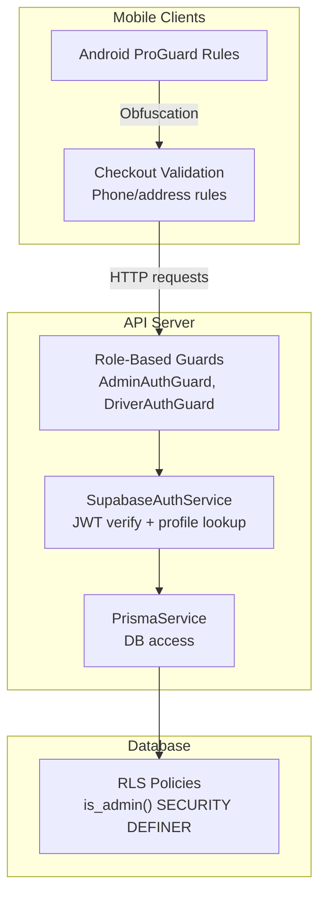
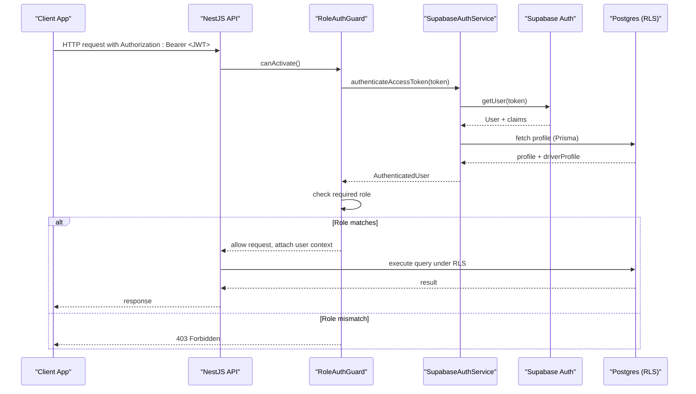
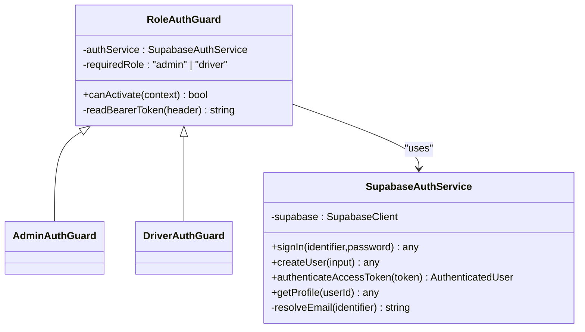
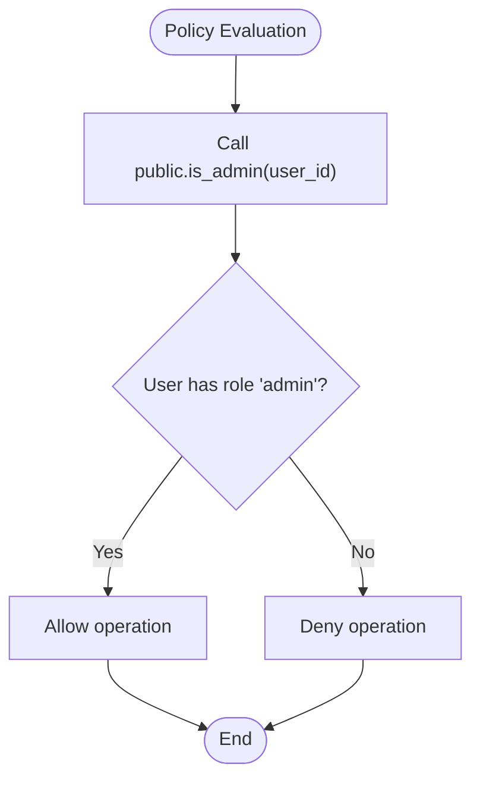
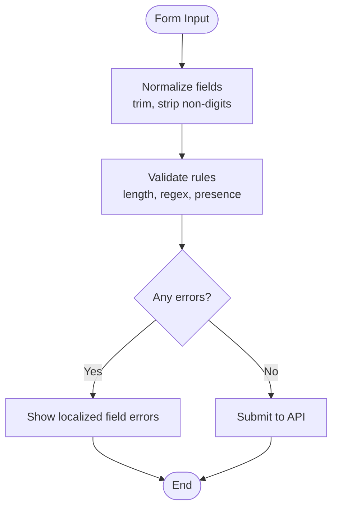
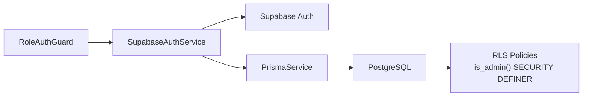

# Security Considerations

<cite>
**Referenced Files in This Document**
- [admin-auth.guard.ts](file://apps/api/src/auth/admin-auth.guard.ts)
- [driver-auth.guard.ts](file://apps/api/src/auth/driver-auth.guard.ts)
- [role-auth.guard.ts](file://apps/api/src/auth/role-auth.guard.ts)
- [supabase-auth.service.ts](file://apps/api/src/auth/supabase-auth.service.ts)
- [validation.ts (shopper-native checkout)](file://apps/shopper-native/src/features/checkout/validation.ts)
- [validation.ts (shopper-web checkout)](file://apps/shopper-web/src/app/checkout/validation.ts)
- [proguard-rules.pro](file://apps/shopper-native/android/app/proguard-rules.pro)
- [20260710_fix_is_admin_security_definer.sql](file://database/20260710_fix_is_admin_security_definer.sql)
</cite>

## Table of Contents
1. Introduction
2. Project Structure
3. Core Components
4. Architecture Overview
5. Detailed Component Analysis
6. Dependency Analysis
7. Performance Considerations
8. Troubleshooting Guide
9. Conclusion
10. Appendices

## Introduction
This document provides comprehensive security guidance for the United Pharmacy system, focusing on authentication and authorization, token handling, role-based access control, input validation, output encoding considerations, protection against common vulnerabilities, data encryption strategies, secure communications, API security, mobile security, development and production best practices, auditing, incident response, and compliance with healthcare privacy regulations. It is grounded in the repository’s current implementation and highlights areas that require additional hardening.

## Project Structure
The security-relevant components are primarily located in:
- API server (NestJS): Authentication guards and service for JWT verification via Supabase Auth, plus database-level admin checks.
- Mobile apps (React Native): Client-side input validation for checkout flows and Android code obfuscation configuration.
- Database migrations: Security-definer function to ensure correct privilege escalation for admin checks.

**Diagram sources**
- [role-auth.guard.ts:1-37](file://apps/api/src/auth/role-auth.guard.ts#L1-L37)
- [supabase-auth.service.ts:1-80](file://apps/api/src/auth/supabase-auth.service.ts#L1-L80)
- [20260710_fix_is_admin_security_definer.sql:1-34](file://database/20260710_fix_is_admin_security_definer.sql#L1-L34)
- [validation.ts (shopper-native checkout):1-78](file://apps/shopper-native/src/features/checkout/validation.ts#L1-L78)
- [proguard-rules.pro:1-15](file://apps/shopper-native/android/app/proguard-rules.pro#L1-L15)

**Section sources**
- [role-auth.guard.ts:1-37](file://apps/api/src/auth/role-auth.guard.ts#L1-L37)
- [supabase-auth.service.ts:1-80](file://apps/api/src/auth/supabase-auth.service.ts#L1-L80)
- [20260710_fix_is_admin_security_definer.sql:1-34](file://database/20260710_fix_is_admin_security_definer.sql#L1-L34)
- [validation.ts (shopper-native checkout):1-78](file://apps/shopper-native/src/features/checkout/validation.ts#L1-L78)
- [validation.ts (shopper-web checkout):1-70](file://apps/shopper-web/src/app/checkout/validation.ts#L1-L70)
- [proguard-rules.pro:1-15](file://apps/shopper-native/android/app/proguard-rules.pro#L1-L15)

## Core Components
- Role-based access control (RBAC) via NestJS guards enforcing required roles (admin, driver).
- JWT verification through Supabase Auth using a service account key; tokens are validated server-side before granting access.
- Database-level admin checks implemented as a SECURITY DEFINER function to safely evaluate RLS policies.
- Client-side input validation for checkout fields (name, phone, address), including Egyptian phone number format enforcement.
- Android app code obfuscation via ProGuard rules to reduce reverse-engineering risk.

Key responsibilities:
- Guard layer: Extracts and validates Authorization header, verifies JWT, attaches user context, enforces role.
- Auth service: Verifies tokens via Supabase, resolves email from identifier, retrieves profiles and related data.
- DB policy: Ensures admin checks run with elevated privileges without expanding permissions beyond intended scope.
- Input validation: Normalizes and validates sensitive inputs before submission.
- Mobile hardening: Obfuscates native code to deter tampering.

**Section sources**
- [role-auth.guard.ts:1-37](file://apps/api/src/auth/role-auth.guard.ts#L1-L37)
- [admin-auth.guard.ts:1-10](file://apps/api/src/auth/admin-auth.guard.ts#L1-L10)
- [driver-auth.guard.ts:1-10](file://apps/api/src/auth/driver-auth.guard.ts#L1-L10)
- [supabase-auth.service.ts:1-80](file://apps/api/src/auth/supabase-auth.service.ts#L1-L80)
- [20260710_fix_is_admin_security_definer.sql:1-34](file://database/20260710_fix_is_admin_security_definer.sql#L1-L34)
- [validation.ts (shopper-native checkout):1-78](file://apps/shopper-native/src/features/checkout/validation.ts#L1-L78)
- [validation.ts (shopper-web checkout):1-70](file://apps/shopper-web/src/app/checkout/validation.ts#L1-L70)
- [proguard-rules.pro:1-15](file://apps/shopper-native/android/app/proguard-rules.pro#L1-L15)

## Architecture Overview
The authentication flow uses JWTs issued by Supabase Auth. The API validates tokens server-side and enforces RBAC at the controller level. Database-level policies rely on a SECURITY DEFINER function for robust admin checks.

**Diagram sources**
- [role-auth.guard.ts:11-36](file://apps/api/src/auth/role-auth.guard.ts#L11-L36)
- [supabase-auth.service.ts:49-64](file://apps/api/src/auth/supabase-auth.service.ts#L49-L64)
- [20260710_fix_is_admin_security_definer.sql:20-31](file://database/20260710_fix_is_admin_security_definer.sql#L20-L31)

## Detailed Component Analysis

### Authentication and Authorization (RBAC)
- Guards enforce role requirements and validate bearer tokens.
- Admin and Driver guards extend a base role guard with specific roles.
- Token verification is delegated to Supabase Auth; invalid or expired tokens yield unauthorized responses.
- Profile resolution includes related entities (e.g., driver profile) for downstream business logic.

**Diagram sources**
- [role-auth.guard.ts:1-37](file://apps/api/src/auth/role-auth.guard.ts#L1-L37)
- [admin-auth.guard.ts:1-10](file://apps/api/src/auth/admin-auth.guard.ts#L1-L10)
- [driver-auth.guard.ts:1-10](file://apps/api/src/auth/driver-auth.guard.ts#L1-L10)
- [supabase-auth.service.ts:1-80](file://apps/api/src/auth/supabase-auth.service.ts#L1-L80)

**Section sources**
- [role-auth.guard.ts:1-37](file://apps/api/src/auth/role-auth.guard.ts#L1-L37)
- [admin-auth.guard.ts:1-10](file://apps/api/src/auth/admin-auth.guard.ts#L1-L10)
- [driver-auth.guard.ts:1-10](file://apps/api/src/auth/driver-auth.guard.ts#L1-L10)
- [supabase-auth.service.ts:1-80](file://apps/api/src/auth/supabase-auth.service.ts#L1-L80)

### Database-Level Access Control
- The admin check function is defined as SECURITY DEFINER to bypass row-level security when reading profiles during policy evaluation, preventing false negatives while not granting new privileges.
- This ensures consistent and safe admin checks across multiple tables’ RLS policies.

**Diagram sources**
- [20260710_fix_is_admin_security_definer.sql:20-31](file://database/20260710_fix_is_admin_security_definer.sql#L20-L31)

**Section sources**
- [20260710_fix_is_admin_security_definer.sql:1-34](file://database/20260710_fix_is_admin_security_definer.sql#L1-L34)

### Input Validation and Output Encoding
- Checkout validation normalizes phone numbers and enforces format constraints (Egyptian mobile numbers starting with 01).
- Both mobile and web clients implement similar validation logic to prevent malformed or unsafe inputs from reaching the backend.
- Output encoding should be enforced at the presentation layer (web/mobile) to mitigate XSS risks when rendering user-supplied content.

**Diagram sources**
- [validation.ts (shopper-native checkout):12-78](file://apps/shopper-native/src/features/checkout/validation.ts#L12-L78)
- [validation.ts (shopper-web checkout):4-69](file://apps/shopper-web/src/app/checkout/validation.ts#L4-L69)

**Section sources**
- [validation.ts (shopper-native checkout):1-78](file://apps/shopper-native/src/features/checkout/validation.ts#L1-L78)
- [validation.ts (shopper-web checkout):1-70](file://apps/shopper-web/src/app/checkout/validation.ts#L1-L70)

### Mobile Security Considerations
- Code obfuscation: ProGuard rules keep necessary classes while reducing reverse engineering surface.
- Secure storage: Ensure tokens and sensitive data are stored in platform-secured storage (e.g., Android Keystore-backed preferences or encrypted storage).
- Certificate pinning: Pin TLS certificates for API endpoints to prevent MITM attacks.
- Runtime checks: Implement jailbreak/root detection and integrity checks to detect tampered environments.

**Section sources**
- [proguard-rules.pro:1-15](file://apps/shopper-native/android/app/proguard-rules.pro#L1-L15)

## Dependency Analysis
The API’s auth stack depends on Supabase Auth for token verification and Prisma for profile retrieval. Database policies depend on the SECURITY DEFINER function for consistent admin checks.

**Diagram sources**
- [role-auth.guard.ts:1-37](file://apps/api/src/auth/role-auth.guard.ts#L1-L37)
- [supabase-auth.service.ts:1-80](file://apps/api/src/auth/supabase-auth.service.ts#L1-L80)
- [20260710_fix_is_admin_security_definer.sql:20-31](file://database/20260710_fix_is_admin_security_definer.sql#L20-L31)

**Section sources**
- [role-auth.guard.ts:1-37](file://apps/api/src/auth/role-auth.guard.ts#L1-L37)
- [supabase-auth.service.ts:1-80](file://apps/api/src/auth/supabase-auth.service.ts#L1-L80)
- [20260710_fix_is_admin_security_definer.sql:1-34](file://database/20260710_fix_is_admin_security_definer.sql#L1-L34)

## Performance Considerations
- Token verification: Leverage Supabase’s efficient getUser endpoint; cache profile lookups where appropriate to reduce DB load.
- Role checks: Keep role checks minimal and centralized in guards to avoid repeated validations.
- Database queries: Use Prisma relations efficiently and ensure indexes exist for frequently filtered columns (e.g., user id, role).
- Input validation: Perform lightweight client-side validation to reduce unnecessary network calls; always re-validate server-side.

[No sources needed since this section provides general guidance]

## Troubleshooting Guide
Common issues and resolutions:
- Invalid or missing Authorization header: Ensure clients send Authorization: Bearer <token>.
- Expired or invalid tokens: Re-authenticate users and refresh tokens; log failures for monitoring.
- Insufficient permissions: Verify user role assignment and RBAC configuration in guards.
- Profile not found: Confirm that Supabase user IDs map to existing profiles in the database.
- Admin checks failing: Ensure the SECURITY DEFINER function is deployed and search_path is set correctly.

**Section sources**
- [role-auth.guard.ts:30-36](file://apps/api/src/auth/role-auth.guard.ts#L30-L36)
- [supabase-auth.service.ts:49-64](file://apps/api/src/auth/supabase-auth.service.ts#L49-L64)
- [20260710_fix_is_admin_security_definer.sql:20-31](file://database/20260710_fix_is_admin_security_definer.sql#L20-L31)

## Conclusion
The United Pharmacy system implements a solid foundation for authentication and authorization using JWTs verified via Supabase Auth, role-based guards, and database-level admin checks. Input validation is present on both mobile and web clients, and Android code obfuscation is configured. To strengthen security further, adopt comprehensive output encoding, enforce strict HTTPS and certificate pinning on mobile, implement secure storage for tokens, and establish robust auditing and incident response procedures aligned with healthcare privacy regulations.

[No sources needed since this section summarizes without analyzing specific files]

## Appendices

### Compliance and Privacy Recommendations
- Data minimization: Collect only necessary personal and health-related data.
- Encryption at rest: Encrypt sensitive fields (e.g., medical records, payment info) using strong algorithms managed via a secrets manager.
- Encryption in transit: Enforce TLS 1.2+ across all services; prefer HSTS on web APIs.
- Audit logging: Log authentication events, access to sensitive data, and administrative actions with tamper-evident storage.
- Retention and deletion: Define clear retention policies and support secure deletion upon request.
- Regulatory alignment: Align with applicable healthcare privacy laws (e.g., HIPAA, GDPR) for consent, breach notification, and data subject rights.

[No sources needed since this section provides general guidance]