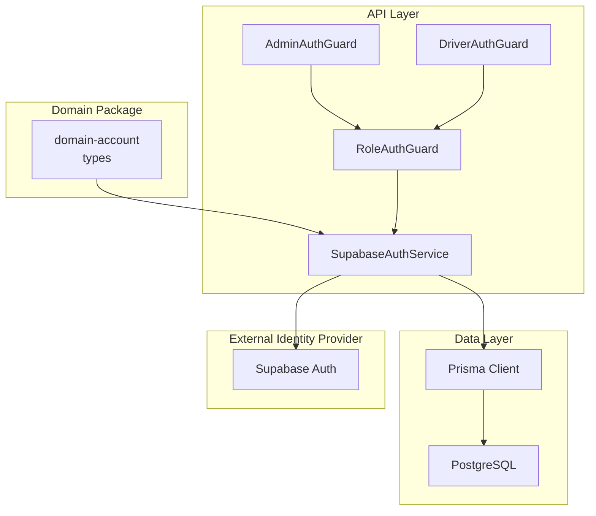
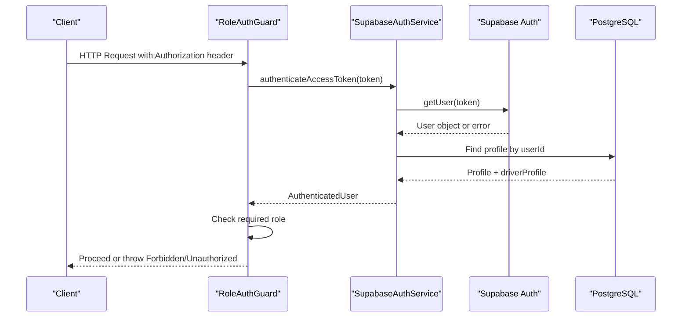
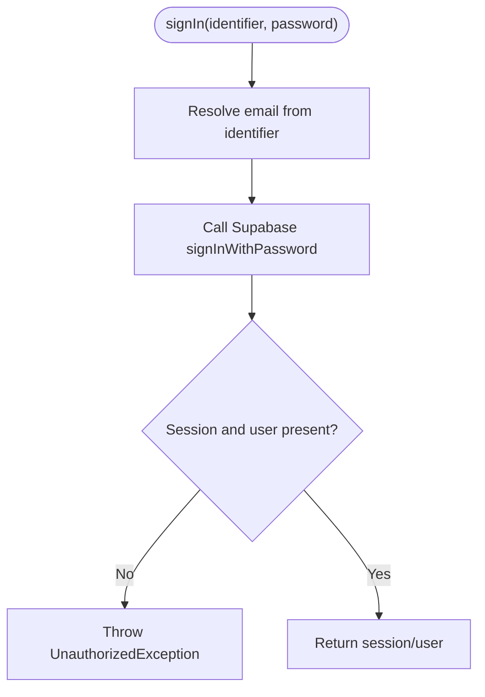
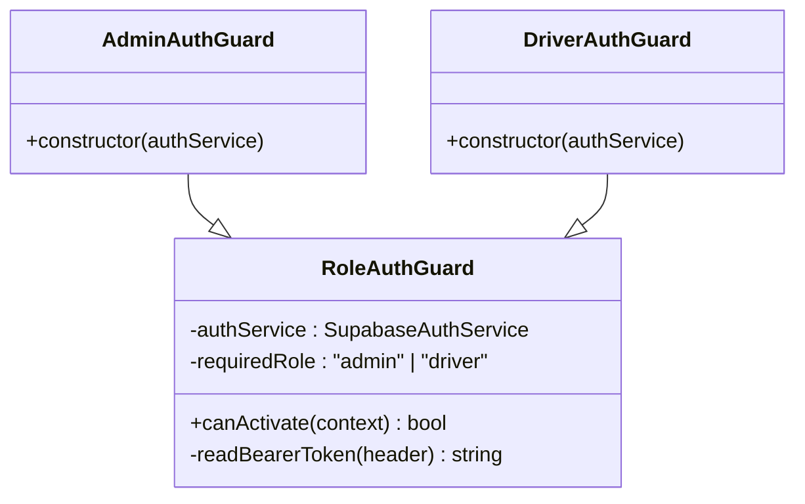
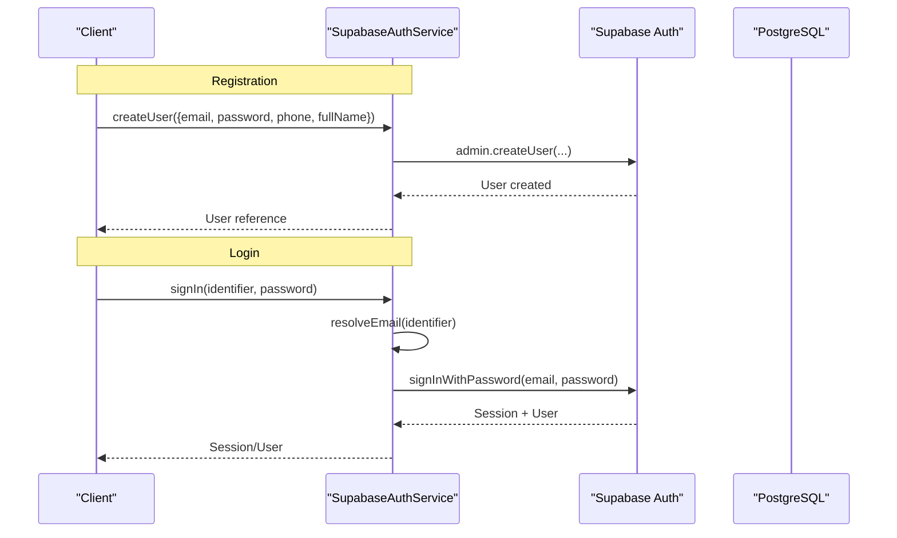
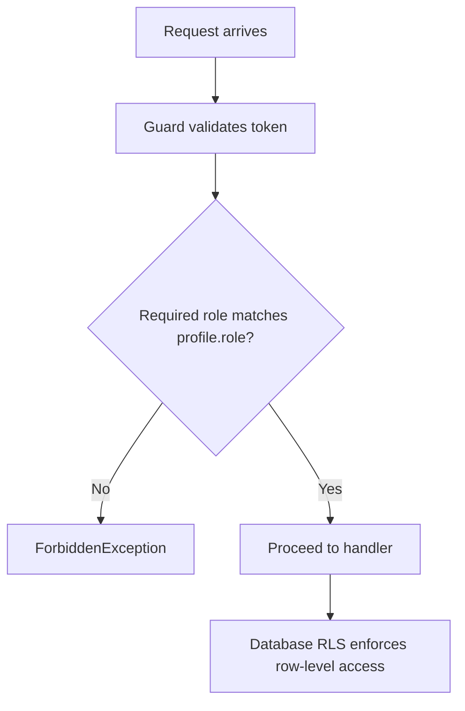
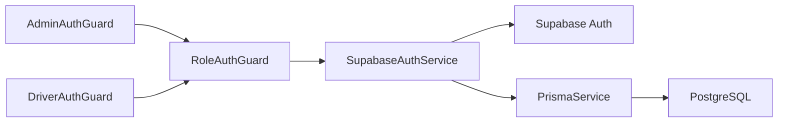

# Domain Account

<cite>
**Referenced Files in This Document**
- [package.json](file://packages/domain-account/package.json)
- [index.ts](file://packages/domain-account/src/index.ts)
- [supabase-auth.service.ts](file://apps/api/src/auth/supabase-auth.service.ts)
- [role-auth.guard.ts](file://apps/api/src/auth/role-auth.guard.ts)
- [admin-auth.guard.ts](file://apps/api/src/auth/admin-auth.guard.ts)
- [driver-auth.guard.ts](file://apps/api/src/auth/driver-auth.guard.ts)
- [schema.prisma](file://apps/api/prisma/schema.prisma)
- [20260626_profiles_is_active.sql](file://database/20260626_profiles_is_active.sql)
- [20260626_suspension_and_deletion.sql](file://database/20260626_suspension_and_deletion.sql)
- [20260705_fix_has_permission_rbac_crash.sql](file://database/20260705_fix_has_permission_rbac_crash.sql)
</cite>

## Table of Contents
1. Introduction
2. Project Structure
3. Core Components
4. Architecture Overview
5. Detailed Component Analysis
6. Dependency Analysis
7. Performance Considerations
8. Troubleshooting Guide
9. Conclusion

## Introduction
This document explains the domain-account functionality that manages user accounts and authentication for the United Pharmacy system. It covers the user entity model, profile management, role-based access control (RBAC), and authentication workflows including registration, login, password handling, and permissions. It also documents integration with Supabase Auth as the external identity provider and internal authorization mechanisms via NestJS guards and database row-level security (RLS).

## Project Structure
The domain-account capability spans a small TypeScript package that defines the account scope types and an API layer that implements authentication and authorization:

- packages/domain-account: Declares the domain package and exports type definitions for account scopes.
- apps/api/src/auth: Implements authentication service and role-based guards.
- apps/api/prisma/schema.prisma: Defines the application data models, including profiles and roles.
- database migrations: Provide RLS policies, suspension/deletion tracking, and permission helpers.



**Diagram sources**
- [supabase-auth.service.ts:1-80](file://apps/api/src/auth/supabase-auth.service.ts#L1-L80)
- [role-auth.guard.ts:1-37](file://apps/api/src/auth/role-auth.guard.ts#L1-L37)
- [admin-auth.guard.ts:1-10](file://apps/api/src/auth/admin-auth.guard.ts#L1-L10)
- [driver-auth.guard.ts:1-10](file://apps/api/src/auth/driver-auth.guard.ts#L1-L10)
- [schema.prisma:617-635](file://apps/api/prisma/schema.prisma#L617-L635)

**Section sources**
- [package.json:1-7](file://packages/domain-account/package.json#L1-L7)
- [index.ts:1-2](file://packages/domain-account/src/index.ts#L1-L2)

## Core Components
- SupabaseAuthService: Integrates with Supabase Auth to sign in users, create users, validate tokens, and resolve profiles from the application database.
- Role-based Guards: Enforce required roles (admin, driver) on protected routes by validating tokens and checking profile roles.
- User Model and Profiles: The Prisma schema defines profiles with roles and status fields; database migrations add activation flags, suspension/deletion logs, and RLS policies.

Key responsibilities:
- Authentication: Email or phone-based sign-in, token validation, and session resolution.
- Authorization: Role checks at the route level and fine-grained access via RLS policies.
- Profile Management: Read/update profiles, manage staff activation, and track suspensions/deletions.

**Section sources**
- [supabase-auth.service.ts:1-80](file://apps/api/src/auth/supabase-auth.service.ts#L1-L80)
- [role-auth.guard.ts:1-37](file://apps/api/src/auth/role-auth.guard.ts#L1-L37)
- [schema.prisma:617-635](file://apps/api/prisma/schema.prisma#L617-L635)
- [20260626_profiles_is_active.sql:1-10](file://database/20260626_profiles_is_active.sql#L1-L10)
- [20260626_suspension_and_deletion.sql:1-122](file://database/20260626_suspension_and_deletion.sql#L1-L122)

## Architecture Overview
Authentication and authorization flow:
- Clients send requests with Bearer tokens obtained from Supabase Auth.
- Role guards extract and validate tokens using SupabaseAuthService.
- On success, the authenticated user’s profile is attached to the request context.
- Protected endpoints enforce additional business logic and rely on database RLS for data-level security.



**Diagram sources**
- [role-auth.guard.ts:11-27](file://apps/api/src/auth/role-auth.guard.ts#L11-L27)
- [supabase-auth.service.ts:49-64](file://apps/api/src/auth/supabase-auth.service.ts#L49-L64)

## Detailed Component Analysis

### Authentication Service (SupabaseAuthService)
Responsibilities:
- Sign in with email or phone identifier.
- Create users via Supabase admin API with metadata.
- Validate access tokens and attach profile data.
- Resolve email from phone when needed.

Error handling:
- Throws unauthorized exceptions for invalid credentials or expired tokens.
- Ensures environment variables are present before initializing the client.



**Diagram sources**
- [supabase-auth.service.ts:26-33](file://apps/api/src/auth/supabase-auth.service.ts#L26-L33)
- [supabase-auth.service.ts:70-79](file://apps/api/src/auth/supabase-auth.service.ts#L70-L79)

**Section sources**
- [supabase-auth.service.ts:1-80](file://apps/api/src/auth/supabase-auth.service.ts#L1-L80)

### Role-Based Access Control (RoleAuthGuard and Specialized Guards)
Responsibilities:
- Extract Bearer token from Authorization header.
- Authenticate token and fetch profile.
- Enforce required role (admin or driver).
- Attach user context to request for downstream handlers.



**Diagram sources**
- [role-auth.guard.ts:1-37](file://apps/api/src/auth/role-auth.guard.ts#L1-L37)
- [admin-auth.guard.ts:1-10](file://apps/api/src/auth/admin-auth.guard.ts#L1-L10)
- [driver-auth.guard.ts:1-10](file://apps/api/src/auth/driver-auth.guard.ts#L1-L10)

**Section sources**
- [role-auth.guard.ts:1-37](file://apps/api/src/auth/role-auth.guard.ts#L1-L37)
- [admin-auth.guard.ts:1-10](file://apps/api/src/auth/admin-auth.guard.ts#L1-L10)
- [driver-auth.guard.ts:1-10](file://apps/api/src/auth/driver-auth.guard.ts#L1-L10)

### User Entity Model and Profile Management
Core entities:
- auth.users: Identity records managed by Supabase Auth.
- public.profiles: Application-level profile with role, status, and optional driver profile linkage.
- app_role enum: Defines allowed roles such as manager, pharmacist, driver, admin, customer.

Profile lifecycle:
- Activation flag (is_active) gates staff access.
- Suspension and deletion logs provide auditability and enforcement.
- RLS policies restrict read/write access based on ownership and manager/admin roles.

```mermaid
erDiagram
USERS ||--|| PROFILES : "id"
PROFILES ||--o{ ORDERS : "user_id"
PROFILES ||--o{ ORDERS : "assigned_driver_id"
PROFILES ||--|| DRIVER_PROFILE : "id"
USERS {
uuid id PK
string email
string phone
boolean is_anonymous
timestamp created_at
}
PROFILES {
uuid id PK
string full_name
string phone
string email
string username
string address
enum role
string status
boolean is_active
timestamp created_at
timestamp updated_at
}
DRIVER_PROFILE {
uuid id PK
... fields ...
}
ORDERS {
uuid id PK
uuid user_id FK
uuid assigned_driver_id FK
... fields ...
}
```

**Diagram sources**
- [schema.prisma:407-458](file://apps/api/prisma/schema.prisma#L407-L458)
- [schema.prisma:617-635](file://apps/api/prisma/schema.prisma#L617-L635)
- [schema.prisma:556-592](file://apps/api/prisma/schema.prisma#L556-L592)

**Section sources**
- [schema.prisma:617-635](file://apps/api/prisma/schema.prisma#L617-L635)
- [20260626_profiles_is_active.sql:1-10](file://database/20260626_profiles_is_active.sql#L1-L10)
- [20260626_suspension_and_deletion.sql:1-122](file://database/20260626_suspension_and_deletion.sql#L1-L122)

### Registration and Login Workflows
Registration:
- Create user via Supabase admin API with email, password, phone, and metadata.
- Confirm email automatically during creation.

Login:
- Accept email or phone as identifier; resolve to email if necessary.
- Authenticate via Supabase password flow and return session/user.



**Diagram sources**
- [supabase-auth.service.ts:26-47](file://apps/api/src/auth/supabase-auth.service.ts#L26-L47)
- [supabase-auth.service.ts:70-79](file://apps/api/src/auth/supabase-auth.service.ts#L70-L79)

**Section sources**
- [supabase-auth.service.ts:26-47](file://apps/api/src/auth/supabase-auth.service.ts#L26-L47)
- [supabase-auth.service.ts:70-79](file://apps/api/src/auth/supabase-auth.service.ts#L70-L79)

### Password Management
- Passwords are handled by Supabase Auth; the service uses signInWithPassword and admin.createUser flows.
- No direct password hashing or storage is performed in this service; all credential operations delegate to Supabase.

Security considerations:
- Ensure environment variables for Supabase URL and service role key are configured.
- Use HTTPS and secure token storage on clients.

**Section sources**
- [supabase-auth.service.ts:15-24](file://apps/api/src/auth/supabase-auth.service.ts#L15-L24)
- [supabase-auth.service.ts:26-47](file://apps/api/src/auth/supabase-auth.service.ts#L26-L47)

### Permission Systems and RBAC
- Role checks occur in guards for route-level protection (admin, driver).
- Database-level permissions use RLS policies:
  - Profiles: Owner or manager/admin can select/insert/update.
  - Suspensions and deletions: Restricted to managers/admins; users can view their own records.
  - Audit log: Managers/admins can insert; only admins can select.



**Diagram sources**
- [role-auth.guard.ts:11-27](file://apps/api/src/auth/role-auth.guard.ts#L11-L27)
- [20260705_fix_has_permission_rbac_crash.sql:35-44](file://database/20260705_fix_has_permission_rbac_crash.sql#L35-L44)
- [20260626_suspension_and_deletion.sql:57-122](file://database/20260626_suspension_and_deletion.sql#L57-L122)

**Section sources**
- [role-auth.guard.ts:11-27](file://apps/api/src/auth/role-auth.guard.ts#L11-L27)
- [20260705_fix_has_permission_rbac_crash.sql:35-44](file://database/20260705_fix_has_permission_rbac_crash.sql#L35-L44)
- [20260626_suspension_and_deletion.sql:57-122](file://database/20260626_suspension_and_deletion.sql#L57-L122)

### Examples of Operations
- User CRUD:
  - Create: Use SupabaseAuthService.createUser to register a new user with email, password, phone, and full name.
  - Read: Use SupabaseAuthService.getProfile to retrieve profile by userId.
  - Update: Update profile fields via Prisma within protected endpoints guarded by appropriate roles.
  - Delete: Suspend or delete accounts using database tables and RLS policies; log actions in admin_audit_log.

- Role assignments:
  - Set profile.role to values like admin, manager, pharmacist, driver, customer.
  - Enforce route-level access with AdminAuthGuard or DriverAuthGuard.

- Security policies:
  - Enable RLS on sensitive tables.
  - Use has_permission() helper to simplify policy checks; currently maps to manager check due to missing granular permission UI.

[No code snippets included; refer to section sources for implementation paths]

**Section sources**
- [supabase-auth.service.ts:35-68](file://apps/api/src/auth/supabase-auth.service.ts#L35-L68)
- [schema.prisma:617-635](file://apps/api/prisma/schema.prisma#L617-L635)
- [20260626_suspension_and_deletion.sql:1-122](file://database/20260626_suspension_and_deletion.sql#L1-L122)
- [20260705_fix_has_permission_rbac_crash.sql:35-44](file://database/20260705_fix_has_permission_rbac_crash.sql#L35-L44)

## Dependency Analysis
- SupabaseAuthService depends on:
  - Supabase Auth client for identity operations.
  - PrismaService for profile queries.
- Role guards depend on SupabaseAuthService to authenticate and authorize requests.
- Database RLS policies depend on profiles.role and helper functions like is_manager() and has_permission().



**Diagram sources**
- [supabase-auth.service.ts:1-80](file://apps/api/src/auth/supabase-auth.service.ts#L1-L80)
- [role-auth.guard.ts:1-37](file://apps/api/src/auth/role-auth.guard.ts#L1-L37)
- [admin-auth.guard.ts:1-10](file://apps/api/src/auth/admin-auth.guard.ts#L1-L10)
- [driver-auth.guard.ts:1-10](file://apps/api/src/auth/driver-auth.guard.ts#L1-L10)

**Section sources**
- [supabase-auth.service.ts:1-80](file://apps/api/src/auth/supabase-auth.service.ts#L1-L80)
- [role-auth.guard.ts:1-37](file://apps/api/src/auth/role-auth.guard.ts#L1-L37)

## Performance Considerations
- Token validation: Minimize repeated calls by caching validated user contexts where appropriate within request pipelines.
- Profile queries: Ensure indexes exist on frequently queried fields (e.g., profiles.id, profiles.role).
- RLS efficiency: Keep policies simple and avoid expensive subqueries; leverage helper functions like is_manager() and has_permission().
- Environment configuration: Validate Supabase credentials at startup to fail fast and avoid runtime errors.

[No sources needed since this section provides general guidance]

## Troubleshooting Guide
Common issues and resolutions:
- Invalid authorization header format:
  - Ensure requests include Authorization: Bearer <token>.
  - Role guard throws UnauthorizedException for malformed headers.

- Invalid or expired token:
  - Verify token validity and refresh if necessary.
  - SupabaseAuthService throws UnauthorizedException for invalid/expired tokens.

- Profile not found:
  - Ensure a corresponding profile exists in the database for the authenticated user.
  - SupabaseAuthService throws UnauthorizedException when profile is missing.

- Insufficient permissions:
  - Check that the user’s profile.role matches the required role enforced by guards.
  - Role guard throws ForbiddenException when role does not match.

- RLS crashes due to missing permission functions:
  - Apply migration that fixes has_permission() to avoid crashes on non-manager roles.

**Section sources**
- [role-auth.guard.ts:30-36](file://apps/api/src/auth/role-auth.guard.ts#L30-L36)
- [supabase-auth.service.ts:49-64](file://apps/api/src/auth/supabase-auth.service.ts#L49-L64)
- [20260705_fix_has_permission_rbac_crash.sql:35-44](file://database/20260705_fix_has_permission_rbac_crash.sql#L35-L44)

## Conclusion
The domain-account subsystem integrates Supabase Auth for identity management and NestJS guards for role-based authorization, backed by robust database RLS policies. Profiles define roles and status, while migrations provide activation controls, suspension/deletion logging, and safe permission helpers. This design ensures secure, scalable account management across the United Pharmacy platform.