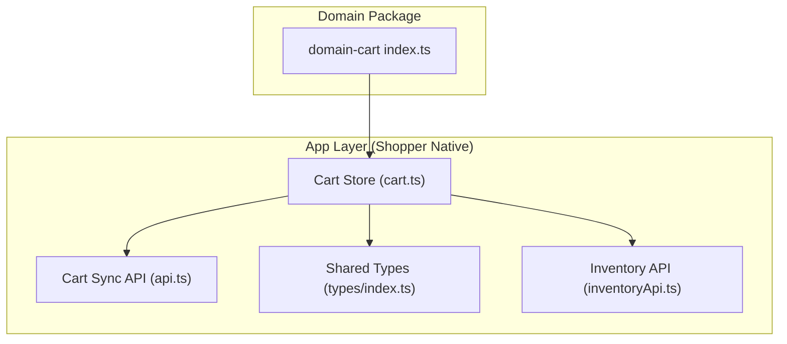
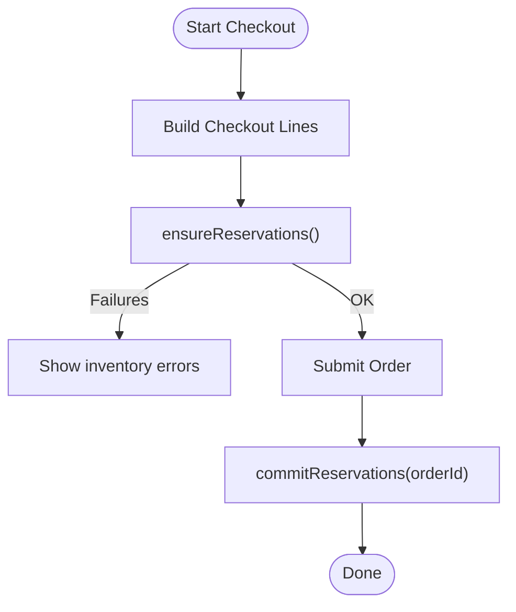
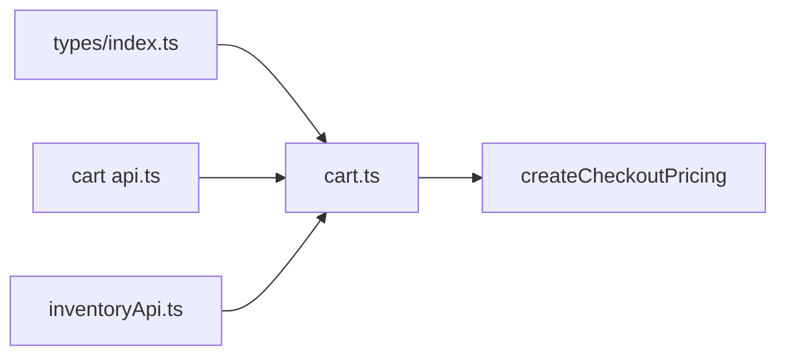

# Domain Cart

<cite>
**Referenced Files in This Document**
- [index.ts](file://packages/domain-cart/src/index.ts)
- [cart.ts](file://apps/shopper-native/src/stores/cart.ts)
- [api.ts](file://apps/shopper-native/src/features/cart/api.ts)
- [index.ts](file://packages/types/src/index.ts)
- [inventoryApi.ts](file://apps/shopper-native/src/features/inventory/api/inventoryApi.ts)
</cite>

## Table of Contents
1. Introduction
2. Project Structure
3. Core Components
4. Architecture Overview
5. Detailed Component Analysis
6. Dependency Analysis
7. Performance Considerations
8. Troubleshooting Guide
9. Conclusion
10. Appendices

## Introduction
This document explains the domain-cart package and its implementation for shopping cart operations and management across the application. It covers the cart entity structure, item addition/removal, quantity management, price calculations, persistence strategies, validation rules, discount application, tax handling, checkout integration, session management, cross-device synchronization, state management patterns, and data consistency guarantees.

## Project Structure
The domain-cart package defines shared types and mutation contracts used by client applications. The concrete cart store and persistence logic are implemented in the shopper-native app using a Zustand store with Supabase-backed persistence and inventory reservations.



**Diagram sources**
- [index.ts:1-2](file://packages/domain-cart/src/index.ts#L1-L2)
- [cart.ts:1-689](file://apps/shopper-native/src/stores/cart.ts#L1-L689)
- [api.ts:1-179](file://apps/shopper-native/src/features/cart/api.ts#L1-L179)
- [index.ts:102-130](file://packages/types/src/index.ts#L102-L130)
- [inventoryApi.ts:1-200](file://apps/shopper-native/src/features/inventory/api/inventoryApi.ts#L1-L200)

**Section sources**
- [index.ts:1-2](file://packages/domain-cart/src/index.ts#L1-L2)
- [cart.ts:1-689](file://apps/shopper-native/src/stores/cart.ts#L1-L689)
- [api.ts:1-179](file://apps/shopper-native/src/features/cart/api.ts#L1-L179)
- [index.ts:102-130](file://packages/types/src/index.ts#L102-L130)

## Core Components
- Domain contract: A small set of mutation types that describe allowed cart changes.
- Cart store: Central state holder for items, promo code, shipping fee, hydration status, user context, and reservation errors. Provides mutations for add/remove/update/clear, selectors for pricing and counts, and lifecycle methods to ensure and commit inventory reservations.
- Persistence layer: Supabase-backed sync for cart items with upserts, bulk replace, and deletion; local cache via storage utilities for offline support.
- Inventory integration: Pre-flight validation and reservation of stock per line item; release on removal or quantity change; commit to order upon successful placement.
- Pricing engine: Delegates subtotal, discounts, taxes, and shipping to a centralized checkout pricing function to keep totals authoritative.

Key responsibilities:
- Entity model: CartItem includes productId, quantity, product snapshot, and optional reservationId.
- Validation: Quantity clamped against product stock; server-side reserve_inventory enforces availability and idempotency.
- Price calculation: Subtotal derived from canonical pricing; promo eligibility checked centrally.
- Persistence: Local mirror + background server sync; merge strategy resolves conflicts between local and server carts.
- Checkout integration: Convert cart lines to checkout inputs; ensure reservations before submission; commit reservations after order creation.

**Section sources**
- [index.ts:1-2](file://packages/domain-cart/src/index.ts#L1-L2)
- [cart.ts:51-105](file://apps/shopper-native/src/stores/cart.ts#L51-L105)
- [cart.ts:117-127](file://apps/shopper-native/src/stores/cart.ts#L117-L127)
- [cart.ts:165-196](file://apps/shopper-native/src/stores/cart.ts#L165-L196)
- [cart.ts:664-685](file://apps/shopper-native/src/stores/cart.ts#L664-L685)
- [api.ts:32-179](file://apps/shopper-native/src/features/cart/api.ts#L32-L179)
- [index.ts:102-130](file://packages/types/src/index.ts#L102-L130)

## Architecture Overview
The cart architecture combines an optimistic UI with robust server synchronization and inventory controls.

```mermaid
sequenceDiagram
participant UI as "UI"
participant Store as "Cart Store"
participant Loc as "Local Storage"
participant Srv as "Supabase (cart_items)"
participant Inv as "Inventory Service"
participant Price as "Pricing Engine"
UI->>Store : addItem(product, qty)
Store->>Loc : update local mirror
Store->>Srv : upsertCartItem(userId, item)
Store->>Inv : validateInventory(productId, qty)
Inv-->>Store : available?
Store->>Inv : reserveInventory(...)
Inv-->>Store : reservationId
Store->>Store : attach reservationId to item
UI->>Store : pricing()
Store->>Price : createCheckoutPricing(lines, {promoCode, shippingFee})
Price-->>Store : CheckoutPricing
Store-->>UI : totals
Note over Store,Srv : Background sync is fire-and-forget; failures logged but do not block UI.
```

**Diagram sources**
- [cart.ts:198-367](file://apps/shopper-native/src/stores/cart.ts#L198-L367)
- [cart.ts:664-685](file://apps/shopper-native/src/stores/cart.ts#L664-L685)
- [api.ts:48-82](file://apps/shopper-native/src/features/cart/api.ts#L48-L82)
- [inventoryApi.ts:1-200](file://apps/shopper-native/src/features/inventory/api/inventoryApi.ts#L1-L200)

## Detailed Component Analysis

### Cart Entity Model
- CartItem: productId, quantity, product snapshot, optional reservationId.
- CartState: items array, promoCode, shippingFee, hydration flag, userId, lastReservationError.
- CartSnapshot/Line: Used when submitting checkout to capture immutable line details at time of purchase.

Complexity:
- Item lookup and updates are O(n) over items list; acceptable for typical cart sizes.
- Merge operation uses a Map keyed by productId for O(n) merge performance.

**Section sources**
- [cart.ts:51-105](file://apps/shopper-native/src/stores/cart.ts#L51-L105)
- [api.ts:15-30](file://apps/shopper-native/src/features/cart/api.ts#L15-L30)
- [index.ts:102-130](file://packages/types/src/index.ts#L102-L130)

### Item Addition and Removal
Addition flow:
- Update local state immediately (optimistic).
- Persist to server via upsertCartItem.
- Validate inventory and reserve stock; attach reservationId to item.
- On failure, revert quantity or remove item and surface error via lastReservationError.

Removal flow:
- Remove from local state and persist deletion.
- Release inventory reservation if present.

Quantity updates:
- Clamp to available stock; release previous reservation and re-reserve new quantity.
- If out-of-stock, remove item and show error.

**Section sources**
- [cart.ts:198-367](file://apps/shopper-native/src/stores/cart.ts#L198-L367)
- [cart.ts:369-449](file://apps/shopper-native/src/stores/cart.ts#L369-L449)
- [cart.ts:450-549](file://apps/shopper-native/src/stores/cart.ts#L450-L549)
- [api.ts:48-82](file://apps/shopper-native/src/features/cart/api.ts#L48-L82)

### Quantity Management and Stock Clamping
- clampQuantity ensures requested quantity does not exceed product.stock and is at least 1.
- When server validation indicates insufficient stock, local state is adjusted to available quantity or item removed.
- Reservation lifecycle tied to quantity changes to avoid phantom holds.

**Section sources**
- [cart.ts:111-115](file://apps/shopper-native/src/stores/cart.ts#L111-L115)
- [cart.ts:259-367](file://apps/shopper-native/src/stores/cart.ts#L259-L367)
- [cart.ts:450-549](file://apps/shopper-native/src/stores/cart.ts#L450-L549)

### Price Calculations, Discounts, and Taxes
- Subtotal and totals are computed by a centralized pricing engine via createCheckoutPricing.
- Promo codes are validated through isPromoCodeEligible; applied via promoCode field.
- Shipping fee is stored and passed into pricing.
- Tax and other charges are handled by the pricing engine; the cart store delegates to it to maintain a single source of truth.

**Section sources**
- [cart.ts:117-127](file://apps/shopper-native/src/stores/cart.ts#L117-L127)
- [cart.ts:664-685](file://apps/shopper-native/src/stores/cart.ts#L664-L685)

### Persistence Strategies and Cross-Device Sync
- Local mirror: Items persisted to storage for offline access and quick restore.
- Server sync: Upsert, delete, and bulk replace operations on cart_items table.
- Hydration: On sign-in, fetch server cart, merge with local using mergeCartItems (server product snapshots win; quantities merged as max capped by stock), then push merged result back to server.
- Idempotency: ReplaceUserCart uses upsert with unique constraints to be safe under retries.

**Section sources**
- [cart.ts:165-196](file://apps/shopper-native/src/stores/cart.ts#L165-L196)
- [api.ts:32-179](file://apps/shopper-native/src/features/cart/api.ts#L32-L179)

### Inventory Integration and Reservation Lifecycle
- Pre-flight validation: validateInventory checks availability before reserving.
- Reserve: reserveInventory creates a reservation with idempotency key and expiry; reservationId attached to cart line.
- Release: On removal or quantity change, releaseInventory frees the prior reservation.
- Commit: After order placement, commitInventory binds reservations to the order.

**Section sources**
- [cart.ts:259-367](file://apps/shopper-native/src/stores/cart.ts#L259-L367)
- [cart.ts:383-392](file://apps/shopper-native/src/stores/cart.ts#L383-L392)
- [cart.ts:434-449](file://apps/shopper-native/src/stores/cart.ts#L434-L449)
- [cart.ts:563-656](file://apps/shopper-native/src/stores/cart.ts#L563-L656)
- [inventoryApi.ts:1-200](file://apps/shopper-native/src/features/inventory/api/inventoryApi.ts#L1-L200)

### Checkout Flow Integration
- Conversion: toCheckoutLines maps cart items to checkout line inputs with productId, quantity, unitPrice, name, code.
- Eligibility: isPromoCodeEligible validates promo usage.
- Submission: Ensure reservations exist before submit; commit reservations after order creation.



**Diagram sources**
- [cart.ts:117-127](file://apps/shopper-native/src/stores/cart.ts#L117-L127)
- [cart.ts:563-656](file://apps/shopper-native/src/stores/cart.ts#L563-L656)

**Section sources**
- [cart.ts:117-127](file://apps/shopper-native/src/stores/cart.ts#L117-L127)
- [cart.ts:563-656](file://apps/shopper-native/src/stores/cart.ts#L563-L656)

### Session Management and State Consistency
- Anonymous sessions: Work fully offline; reservations deferred until sign-in or checkout.
- Authenticated sessions: Every mutation mirrored to server; reservations managed online.
- Hydration: Restores state from local cache on startup or sign-in; merges with server safely.
- Error surfaces: lastReservationError provides a single point for UI to display transient inventory issues.

**Section sources**
- [cart.ts:1-22](file://apps/shopper-native/src/stores/cart.ts#L1-L22)
- [cart.ts:165-196](file://apps/shopper-native/src/stores/cart.ts#L165-L196)
- [cart.ts:559-559](file://apps/shopper-native/src/stores/cart.ts#L559-L559)

## Dependency Analysis
The cart system depends on:
- Shared types for cart snapshots and checkout submissions.
- Supabase client for persistence.
- Inventory service for stock validation and reservations.
- Pricing engine for authoritative totals.



**Diagram sources**
- [index.ts:102-130](file://packages/types/src/index.ts#L102-L130)
- [cart.ts:1-689](file://apps/shopper-native/src/stores/cart.ts#L1-L689)
- [api.ts:1-179](file://apps/shopper-native/src/features/cart/api.ts#L1-L179)
- [inventoryApi.ts:1-200](file://apps/shopper-native/src/features/inventory/api/inventoryApi.ts#L1-L200)

**Section sources**
- [index.ts:102-130](file://packages/types/src/index.ts#L102-L130)
- [cart.ts:1-689](file://apps/shopper-native/src/stores/cart.ts#L1-L689)
- [api.ts:1-179](file://apps/shopper-native/src/features/cart/api.ts#L1-L179)
- [inventoryApi.ts:1-200](file://apps/shopper-native/src/features/inventory/api/inventoryApi.ts#L1-L200)

## Performance Considerations
- Optimistic UI: Immediate local updates reduce perceived latency.
- Background sync: Fire-and-forget server writes minimize blocking.
- Efficient merge: Map-based merge avoids repeated scans.
- Pre-validation: Avoids unnecessary reserve calls and reduces server errors.
- Selectors: Derived computations (pricing, counts) are memoized by the store framework.

[No sources needed since this section provides general guidance]

## Troubleshooting Guide
Common issues and resolutions:
- Insufficient stock: Occurs during add/update; local state reverts or clamps to available; lastReservationError surfaced for UI feedback.
- Product not found or invalid quantity: Parsed from server errors; handled gracefully without crashing.
- Network failures: Hydration falls back to local cache; background sync retries are idempotent.
- Reservation mismatches: Releasing old reservations before re-reserving prevents stale holds.

Operational tips:
- Monitor lastReservationError to detect transient inventory problems.
- Use ensureReservations before checkout to catch issues early.
- Leverage replaceUserCart’s idempotency when merging local and server carts.

**Section sources**
- [cart.ts:136-155](file://apps/shopper-native/src/stores/cart.ts#L136-L155)
- [cart.ts:259-367](file://apps/shopper-native/src/stores/cart.ts#L259-L367)
- [cart.ts:450-549](file://apps/shopper-native/src/stores/cart.ts#L450-L549)
- [cart.ts:563-656](file://apps/shopper-native/src/stores/cart.ts#L563-L656)

## Conclusion
The domain-cart package defines the mutation contract while the shopper-native implementation delivers a robust, user-friendly cart experience. It balances responsiveness with correctness through optimistic updates, authoritative pricing, strict inventory controls, and resilient persistence. The design supports anonymous and authenticated sessions, seamless cross-device synchronization, and reliable checkout flows with clear error handling.

[No sources needed since this section summarizes without analyzing specific files]

## Appendices

### Example Operations (Conceptual)
- Add item: Call addItem(product, qty); store updates locally, persists to server, validates and reserves stock, attaches reservationId.
- Update quantity: Call updateQty(productId, qty); store releases old reservation, validates and reserves new quantity, adjusts UI accordingly.
- Remove item: Call removeItem(productId); store deletes locally and on server, releases reservation if present.
- Clear cart: Call clearCart(); resets local state and clears server cart.
- Apply promo: Call setPromoCode(code); pricing reflects discount eligibility.
- Checkout: Build lines via toCheckoutLines, run ensureReservations, submit order, then commitReservations(orderId).

[No sources needed since this section provides conceptual examples]