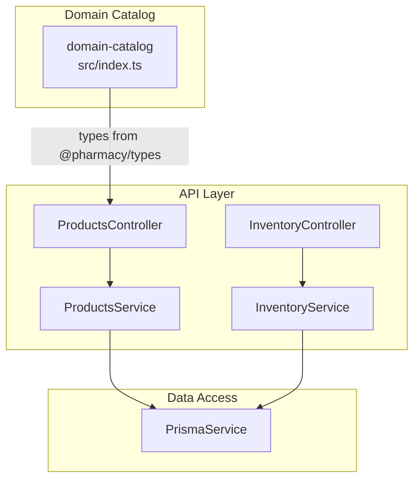
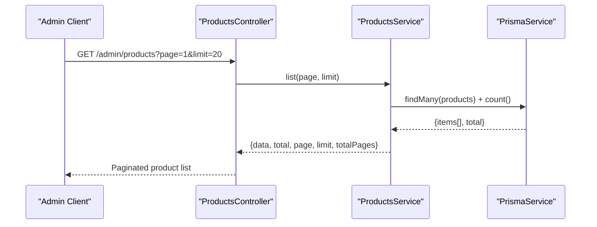
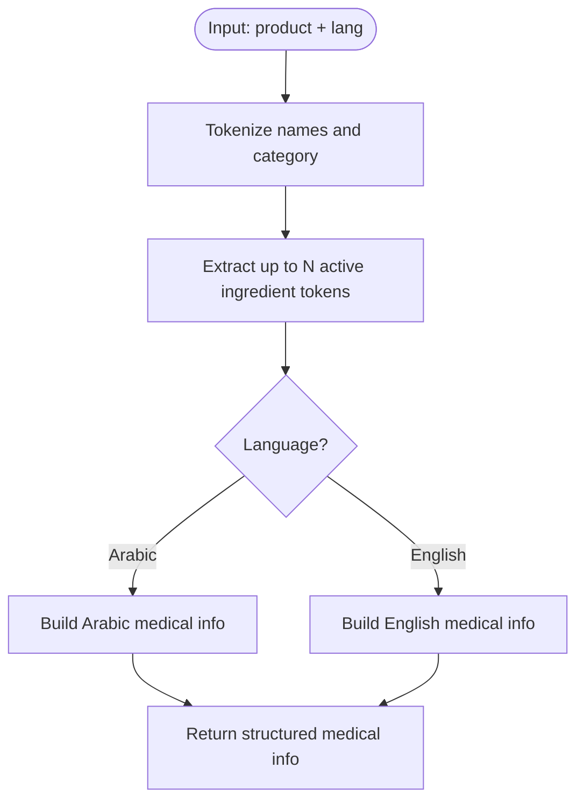
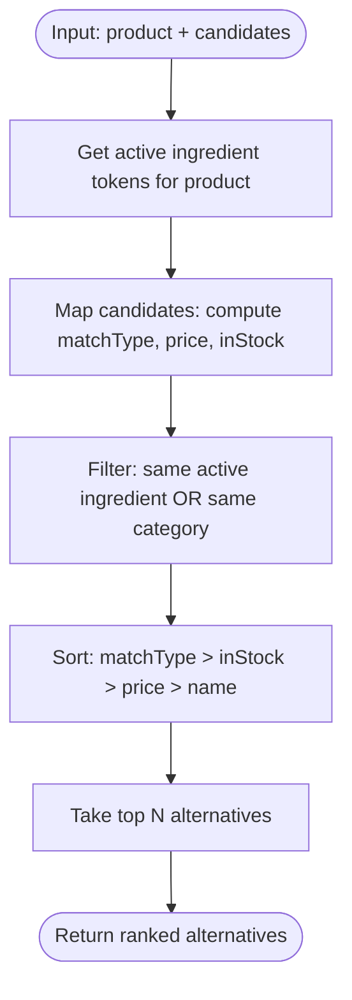
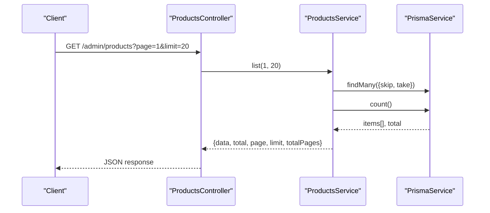
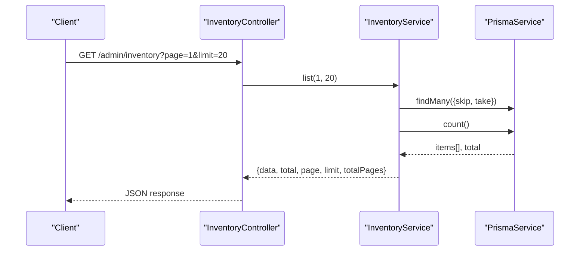
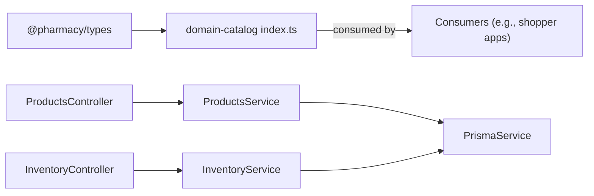

# Domain Catalog

<cite>
**Referenced Files in This Document**
- [index.ts](file://packages/domain-catalog/src/index.ts)
- [package.json](file://packages/domain-catalog/package.json)
- [products.controller.ts](file://apps/api/src/modules/products/products.controller.ts)
- [products.service.ts](file://apps/api/src/modules/products/products.service.ts)
- [inventory.controller.ts](file://apps/api/src/modules/inventory/inventory.controller.ts)
- [inventory.service.ts](file://apps/api/src/modules/inventory/inventory.service.ts)
</cite>

## Table of Contents
1. Introduction
2. Project Structure
3. Core Components
4. Architecture Overview
5. Detailed Component Analysis
6. Dependency Analysis
7. Performance Considerations
8. Troubleshooting Guide
9. Conclusion

## Introduction
This document explains the domain-catalog package and its integration with the API layer to manage products, categories, pricing signals, stock availability, and search-related utilities for the pharmacy system. It covers:
- Product entities and category relationships
- Pricing strategies as surfaced by catalog data
- Stock management and availability checks
- Search and ranking helpers for alternatives
- Integration points between catalog items and inventory levels
- Examples of product listing and inventory listing workflows

## Project Structure
The domain-catalog package provides pure utility functions for product search and alternative ranking. The API module exposes admin endpoints to list products and inventory via Prisma.

**Diagram sources**
- [index.ts:1-126](file://packages/domain-catalog/src/index.ts#L1-L126)
- [products.controller.ts:1-15](file://apps/api/src/modules/products/products.controller.ts#L1-L15)
- [products.service.ts:1-27](file://apps/api/src/modules/products/products.service.ts#L1-L27)
- [inventory.controller.ts:1-15](file://apps/api/src/modules/inventory/inventory.controller.ts#L1-L15)
- [inventory.service.ts:1-27](file://apps/api/src/modules/inventory/inventory.service.ts#L1-L27)

**Section sources**
- [package.json:1-7](file://packages/domain-catalog/package.json#L1-L7)
- [index.ts:1-126](file://packages/domain-catalog/src/index.ts#L1-L126)
- [products.controller.ts:1-15](file://apps/api/src/modules/products/products.controller.ts#L1-L15)
- [products.service.ts:1-27](file://apps/api/src/modules/products/products.service.ts#L1-L27)
- [inventory.controller.ts:1-15](file://apps/api/src/modules/inventory/inventory.controller.ts#L1-L15)
- [inventory.service.ts:1-27](file://apps/api/src/modules/inventory/inventory.service.ts#L1-L27)

## Core Components
- Domain catalog utilities: tokenization, medical info builder, and alternative product ranking based on active ingredients and category match.
- Products API: paginated listing of products through an admin endpoint.
- Inventory API: paginated listing of inventory records through an admin endpoint.

Key responsibilities:
- Tokenize product names (Arabic/English) to extract active ingredient hints.
- Build localized medical guidance using product names and extracted tokens.
- Rank alternative products by matching active ingredients, stock status, price, and name.
- Provide admin-only endpoints to list products and inventory with pagination.

**Section sources**
- [index.ts:25-36](file://packages/domain-catalog/src/index.ts#L25-L36)
- [index.ts:38-84](file://packages/domain-catalog/src/index.ts#L38-L84)
- [index.ts:86-125](file://packages/domain-catalog/src/index.ts#L86-L125)
- [products.controller.ts:5-13](file://apps/api/src/modules/products/products.controller.ts#L5-L13)
- [products.service.ts:8-24](file://apps/api/src/modules/products/products.service.ts#L8-L24)
- [inventory.controller.ts:5-13](file://apps/api/src/modules/inventory/inventory.controller.ts#L5-L13)
- [inventory.service.ts:8-24](file://apps/api/src/modules/inventory/inventory.service.ts#L8-L24)

## Architecture Overview
The catalog utilities operate independently of persistence and are consumed by higher layers that need search or recommendation logic. The API layer uses Prisma to read products and inventory and returns paginated results.

**Diagram sources**
- [products.controller.ts:5-13](file://apps/api/src/modules/products/products.controller.ts#L5-L13)
- [products.service.ts:8-24](file://apps/api/src/modules/products/products.service.ts#L8-L24)

## Detailed Component Analysis

### Domain Catalog Utilities
- Tokenization: Normalizes text, splits into tokens, filters stopwords and short tokens.
- Active ingredient extraction: Produces a small set of candidate tokens from bilingual names and category context.
- Medical info builder: Generates localized usage instructions, dosage guidance, safety warnings, and general disclaimers; includes extracted active ingredients.
- Alternative ranking: Scores candidates by same active ingredient match, stock availability, price, and alphabetical order; limits results.

**Diagram sources**
- [index.ts:25-36](file://packages/domain-catalog/src/index.ts#L25-L36)
- [index.ts:38-84](file://packages/domain-catalog/src/index.ts#L38-L84)

Alternative ranking flow:

**Diagram sources**
- [index.ts:86-125](file://packages/domain-catalog/src/index.ts#L86-L125)

**Section sources**
- [index.ts:25-36](file://packages/domain-catalog/src/index.ts#L25-L36)
- [index.ts:38-84](file://packages/domain-catalog/src/index.ts#L38-L84)
- [index.ts:86-125](file://packages/domain-catalog/src/index.ts#L86-L125)

### Products API
- Endpoint: GET /admin/products?page=&limit=
- Behavior: Returns paginated product list with metadata (total, page, limit, totalPages).
- Security: Protected by admin guard.

**Diagram sources**
- [products.controller.ts:5-13](file://apps/api/src/modules/products/products.controller.ts#L5-L13)
- [products.service.ts:8-24](file://apps/api/src/modules/products/products.service.ts#L8-L24)

**Section sources**
- [products.controller.ts:1-15](file://apps/api/src/modules/products/products.controller.ts#L1-L15)
- [products.service.ts:1-27](file://apps/api/src/modules/products/products.service.ts#L1-L27)

### Inventory API
- Endpoint: GET /admin/inventory?page=&limit=
- Behavior: Returns paginated inventory records with metadata.
- Security: Protected by admin guard.

**Diagram sources**
- [inventory.controller.ts:5-13](file://apps/api/src/modules/inventory/inventory.controller.ts#L5-L13)
- [inventory.service.ts:8-24](file://apps/api/src/modules/inventory/inventory.service.ts#L8-L24)

**Section sources**
- [inventory.controller.ts:1-15](file://apps/api/src/modules/inventory/inventory.controller.ts#L1-L15)
- [inventory.service.ts:1-27](file://apps/api/src/modules/inventory/inventory.service.ts#L1-L27)

## Dependency Analysis
- Domain catalog depends only on shared types from @pharmacy/types and is stateless.
- API modules depend on NestJS decorators, guards, and PrismaService for data access.
- No circular dependencies observed between catalog utilities and API modules.

**Diagram sources**
- [index.ts:1-5](file://packages/domain-catalog/src/index.ts#L1-L5)
- [products.controller.ts:1-15](file://apps/api/src/modules/products/products.controller.ts#L1-L15)
- [products.service.ts:1-27](file://apps/api/src/modules/products/products.service.ts#L1-L27)
- [inventory.controller.ts:1-15](file://apps/api/src/modules/inventory/inventory.controller.ts#L1-L15)
- [inventory.service.ts:1-27](file://apps/api/src/modules/inventory/inventory.service.ts#L1-L27)

**Section sources**
- [index.ts:1-5](file://packages/domain-catalog/src/index.ts#L1-L5)
- [products.controller.ts:1-15](file://apps/api/src/modules/products/products.controller.ts#L1-L15)
- [products.service.ts:1-27](file://apps/api/src/modules/products/products.service.ts#L1-L27)
- [inventory.controller.ts:1-15](file://apps/api/src/modules/inventory/inventory.controller.ts#L1-L15)
- [inventory.service.ts:1-27](file://apps/api/src/modules/inventory/inventory.service.ts#L1-L27)

## Performance Considerations
- Pagination: Both products and inventory endpoints use skip/take to avoid large result sets. Ensure appropriate page sizes for client needs.
- Count queries: Each listing performs a separate count query; consider caching totals if traffic is high.
- Tokenization cost: Ingredient tokenization runs per product in alternative ranking; batch processing can reduce overhead when generating recommendations at scale.
- Sorting: Ranking sorts by multiple keys; keep candidate sets small to minimize CPU usage.

[No sources needed since this section provides general guidance]

## Troubleshooting Guide
- Authentication failures: Admin endpoints require admin guard; ensure requests include valid admin credentials.
- Empty listings: Verify database has products/inventory rows and that page/limit parameters are valid.
- Incorrect alternatives: Confirm input products have populated names and categories; check that candidate lists include relevant fields for ranking.
- Language output issues: Ensure language parameter is one of the supported values when building medical info.

**Section sources**
- [products.controller.ts:5-13](file://apps/api/src/modules/products/products.controller.ts#L5-L13)
- [inventory.controller.ts:5-13](file://apps/api/src/modules/inventory/inventory.controller.ts#L5-L13)
- [index.ts:38-84](file://packages/domain-catalog/src/index.ts#L38-L84)
- [index.ts:86-125](file://packages/domain-catalog/src/index.ts#L86-L125)

## Conclusion
The domain-catalog package provides focused, reusable utilities for product search and alternative ranking, while the API layer offers secure, paginated access to products and inventory. Together they support core catalog operations such as listing, filtering via search helpers, and integrating product data with inventory levels for availability-aware experiences.

[No sources needed since this section summarizes without analyzing specific files]