# Domain Checkout

<cite>
**Referenced Files in This Document**
- [index.ts](file://packages/domain-checkout/src/index.ts)
- [types.ts](file://apps/shopper-native/src/features/checkout/types.ts)
- [api.ts](file://apps/shopper-native/src/features/checkout/api.ts)
- [validation.ts](file://apps/shopper-native/src/features/checkout/validation.ts)
- [schema.ts](file://apps/shopper-native/src/features/checkout/schema.ts)
- [resilience.ts](file://apps/shopper-native/src/features/checkout/resilience.ts)
- [errors.ts](file://apps/shopper-native/src/features/checkout/errors.ts)
- [manualPayment.ts](file://apps/shopper-native/src/features/checkout/manualPayment.ts)
- [pricing.ts](file://apps/shopper-native/src/features/checkout/pricing.ts)
</cite>

## Table of Contents
1. Introduction
2. Project Structure
3. Core Components
4. Architecture Overview
5. Detailed Component Analysis
6. Dependency Analysis
7. Performance Considerations
8. Troubleshooting Guide
9. Conclusion
10. Appendices

## Introduction
This document describes the domain-checkout functionality that manages the checkout workflow and payment processing across the application. It covers checkout session management, payment method handling, order finalization, transaction processing, validation rules, error handling, resilience mechanisms, and integration with the backend via a Supabase Edge Function. It also includes examples for initiating checkout, processing payments, confirming orders, and handling failures, along with security and compliance considerations for payment processing.

## Project Structure
The checkout domain is implemented primarily within the shopper-native feature layer and exposed through a small public surface in the domain-checkout package. The key files include:
- Domain types and contracts (payment methods, form inputs, pricing, conflicts, coupon results)
- Validation utilities and Zod schema for UI forms
- Pricing engine for subtotal, discount, tax, shipping, and total calculations
- API client to call the create-order Edge Function with retries and deduplication
- Resilience helpers for retrying transient errors, deduplicating in-flight requests, and persisting drafts
- Error taxonomy and formatting utilities
- Manual wallet payment detection helper

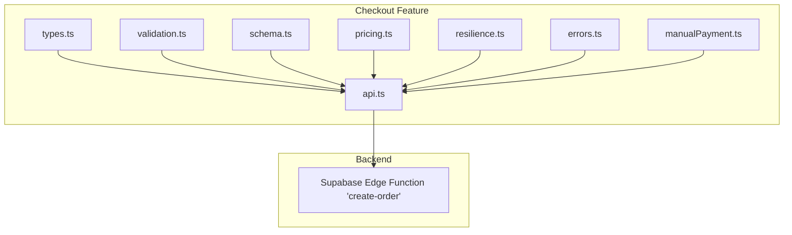

**Diagram sources**
- [types.ts:6-97](file://apps/shopper-native/src/features/checkout/types.ts#L6-L97)
- [validation.ts:18-73](file://apps/shopper-native/src/features/checkout/validation.ts#L18-L73)
- [schema.ts:18-73](file://apps/shopper-native/src/features/checkout/schema.ts#L18-L73)
- [pricing.ts:31-83](file://apps/shopper-native/src/features/checkout/pricing.ts#L31-L83)
- [resilience.ts:53-116](file://apps/shopper-native/src/features/checkout/resilience.ts#L53-L116)
- [errors.ts:17-37](file://apps/shopper-native/src/features/checkout/errors.ts#L17-L37)
- [manualPayment.ts:3-7](file://apps/shopper-native/src/features/checkout/manualPayment.ts#L3-L7)
- [api.ts:140-153](file://apps/shopper-native/src/features/checkout/api.ts#L140-L153)

**Section sources**
- [index.ts:1-2](file://packages/domain-checkout/src/index.ts#L1-L2)
- [types.ts:6-97](file://apps/shopper-native/src/features/checkout/types.ts#L6-L97)
- [api.ts:1-261](file://apps/shopper-native/src/features/checkout/api.ts#L1-L261)

## Core Components
- Types and Contracts: Defines payment methods, form inputs, line items, pricing structures, address snapshots, submit commands, and result shapes. Also defines coupon validation outcomes and invalid reasons.
- Validation: Normalizes phone numbers and validates required fields with bilingual messages. Provides a helper to detect if any field has errors.
- Schema: Zod-based schema mirroring validation rules for React Hook Form integration.
- Pricing Engine: Computes item counts, subtotals, discounts (server coupon or legacy promo), taxes, shipping, and totals with rounding rules.
- API Client: Ensures user profile exists, invokes the create-order Edge Function with timeouts, maps backend errors to typed errors, and returns structured results including conflicts and idempotent replay flags.
- Resilience: Implements exponential backoff retry, in-flight request deduplication keyed by idempotency key, and draft persistence with staleness checks.
- Errors: Centralized error class with code, retryability, conflict details, and formatting utility.
- Manual Payment Helper: Identifies manual wallet payment methods requiring additional proof or transfer number.

**Section sources**
- [types.ts:6-164](file://apps/shopper-native/src/features/checkout/types.ts#L6-L164)
- [validation.ts:14-78](file://apps/shopper-native/src/features/checkout/validation.ts#L14-L78)
- [schema.ts:18-73](file://apps/shopper-native/src/features/checkout/schema.ts#L18-L73)
- [pricing.ts:23-83](file://apps/shopper-native/src/features/checkout/pricing.ts#L23-L83)
- [api.ts:58-153](file://apps/shopper-native/src/features/checkout/api.ts#L58-L153)
- [resilience.ts:24-116](file://apps/shopper-native/src/features/checkout/resilience.ts#L24-L116)
- [errors.ts:7-49](file://apps/shopper-native/src/features/checkout/errors.ts#L7-L49)
- [manualPayment.ts:3-7](file://apps/shopper-native/src/features/checkout/manualPayment.ts#L3-L7)

## Architecture Overview
The checkout flow is initiated from the UI, validated locally, priced, and then submitted via the API client. The client ensures the user profile exists, wraps the request with retry and deduplication, calls the create-order Edge Function, and maps responses and errors into a consistent shape. The backend handles order creation, payment processing, and conflict resolution.

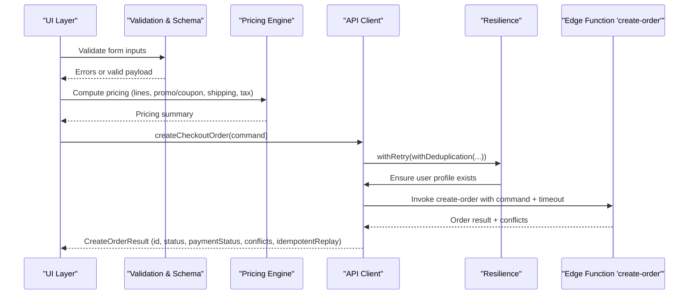

**Diagram sources**
- [validation.ts:18-73](file://apps/shopper-native/src/features/checkout/validation.ts#L18-L73)
- [schema.ts:18-73](file://apps/shopper-native/src/features/checkout/schema.ts#L18-L73)
- [pricing.ts:31-83](file://apps/shopper-native/src/features/checkout/pricing.ts#L31-L83)
- [api.ts:140-261](file://apps/shopper-native/src/features/checkout/api.ts#L140-L261)
- [resilience.ts:53-116](file://apps/shopper-native/src/features/checkout/resilience.ts#L53-L116)

## Detailed Component Analysis

### Checkout Types and Data Model
- Payment Methods: cod, instapay, vodafone, online, banquemisr.
- Form Inputs: fullName, phone, city, streetName, buildingNumber, floor, apartmentNumber, note, promoCode.
- Line Items: productId, quantity, unitPrice, name, optional code and reservationId.
- Pricing: itemCount, subtotal, discount, tax, shipping, total, lines.
- Address Snapshot: formatted string plus structured fields and optional coordinates.
- Submit Command: idempotencyKey, customer info, address, payment details (method, label, POS flag, transferNumber, paymentProofUrl), expectedPricing, cartLines.
- Result: orderId, createdAt, status, paymentStatus, paymentReference, idempotentReplay, conflicts.
- Coupon Validation: detailed success/failure payloads with discount type/value/amount and min order constraints.

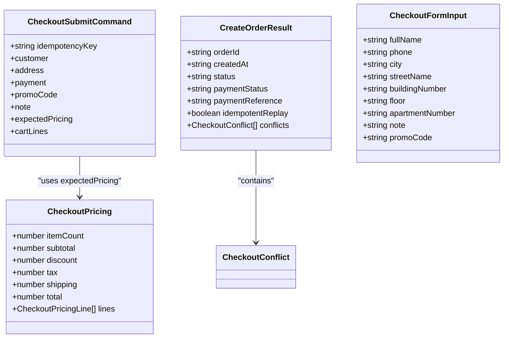

**Diagram sources**
- [types.ts:13-97](file://apps/shopper-native/src/features/checkout/types.ts#L13-L97)
- [types.ts:99-107](file://apps/shopper-native/src/features/checkout/types.ts#L99-L107)
- [types.ts:34-46](file://apps/shopper-native/src/features/checkout/types.ts#L34-L46)

**Section sources**
- [types.ts:6-164](file://apps/shopper-native/src/features/checkout/types.ts#L6-L164)

### Validation Rules
- Phone normalization strips non-digits and caps length; validated against Egyptian mobile regex starting with 01.
- Required fields: fullName (min length), city (non-empty), streetName (min length), buildingNumber (non-empty), apartmentNumber (non-empty).
- Optional floor validated for max length.
- Bilingual error messages provided for Arabic and English.

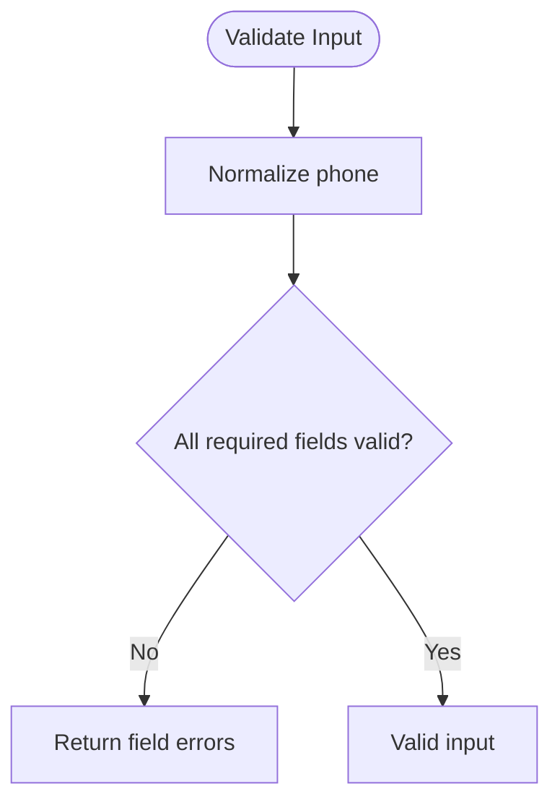

**Diagram sources**
- [validation.ts:14-73](file://apps/shopper-native/src/features/checkout/validation.ts#L14-L73)

**Section sources**
- [validation.ts:14-78](file://apps/shopper-native/src/features/checkout/validation.ts#L14-L78)
- [schema.ts:18-73](file://apps/shopper-native/src/features/checkout/schema.ts#L18-L73)

### Pricing Engine
- Rounds all monetary values to two decimal places.
- Computes per-line totals and aggregates to subtotal.
- Applies server coupon amount first if present; otherwise applies legacy promo code UNITED10 for 10% off subtotal.
- Calculates tax on discounted subtotal using configured tax rate.
- Adds shipping fee and computes final total.

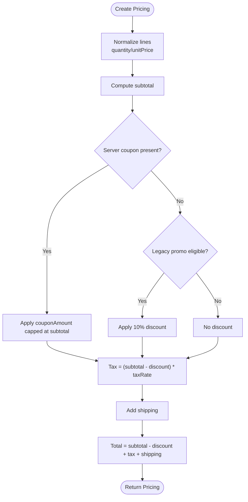

**Diagram sources**
- [pricing.ts:23-83](file://apps/shopper-native/src/features/checkout/pricing.ts#L23-L83)

**Section sources**
- [pricing.ts:23-83](file://apps/shopper-native/src/features/checkout/pricing.ts#L23-L83)

### API Client and Order Finalization
- Ensures user profile exists before submission; upserts missing profiles with safe defaults.
- Invokes create-order Edge Function with an abort controller timeout.
- Maps HTTP, relay, fetch errors to typed CheckoutRequestError with codes and retryability.
- Returns structured result including order metadata, payment status, reference, idempotent replay flag, and conflicts.

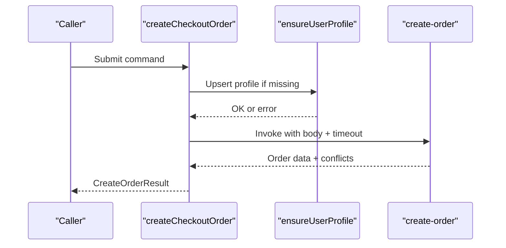

**Diagram sources**
- [api.ts:58-153](file://apps/shopper-native/src/features/checkout/api.ts#L58-L153)
- [api.ts:155-261](file://apps/shopper-native/src/features/checkout/api.ts#L155-L261)

**Section sources**
- [api.ts:1-261](file://apps/shopper-native/src/features/checkout/api.ts#L1-L261)

### Resilience: Retry, Deduplication, Drafts
- Retry: Exponential backoff with jitter; only retries when error is marked retryable or is a network/timeout error.
- Deduplication: In-flight map keyed by idempotency key prevents duplicate submissions during concurrent calls.
- Drafts: Persist partial form state to AsyncStorage with staleness check; supports recovery after crash or background kill.

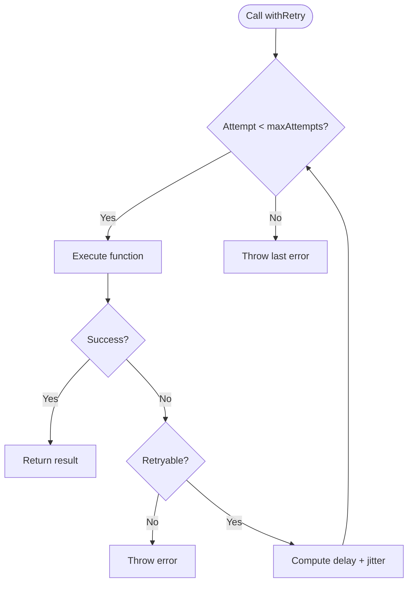

**Diagram sources**
- [resilience.ts:35-91](file://apps/shopper-native/src/features/checkout/resilience.ts#L35-L91)

**Section sources**
- [resilience.ts:24-191](file://apps/shopper-native/src/features/checkout/resilience.ts#L24-L191)

### Error Handling and Taxonomy
- Centralized error class carries code, retryability, conflicts, and catalog refresh hint.
- Mapping from backend HTTP/relay/fetch errors to specific codes: TIMEOUT, NETWORK, AUTH, FUNCTION_ERROR, BAD_RESPONSE, RESERVATION_EXPIRED, UNKNOWN.
- Formatting utility provides user-friendly messages based on language.

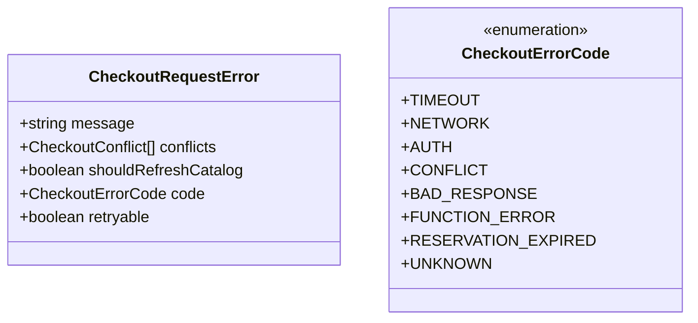

**Diagram sources**
- [errors.ts:7-37](file://apps/shopper-native/src/features/checkout/errors.ts#L7-L37)

**Section sources**
- [errors.ts:7-49](file://apps/shopper-native/src/features/checkout/errors.ts#L7-L49)

### Payment Method Handling
- Supported methods include cash-on-delivery, InstaPay, Vodafone Cash, online payment, and Banque Misr.
- Manual wallet payments (InstaPay, Vodafone) require additional fields like transferNumber and optional paymentProofUrl.
- Helper identifies manual wallet methods to gate UI prompts and validations.

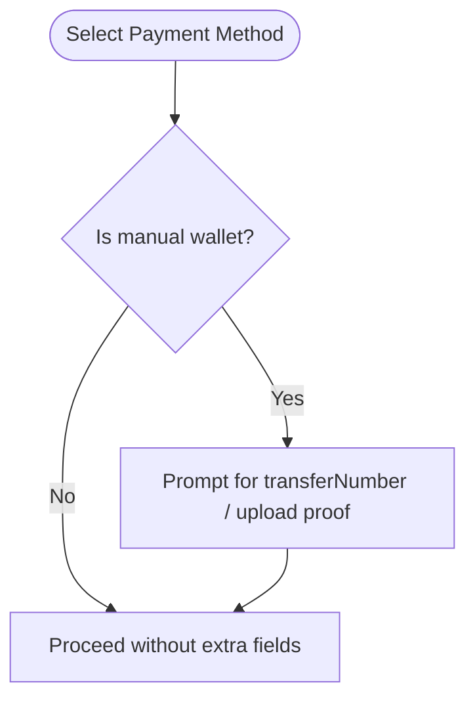

**Diagram sources**
- [manualPayment.ts:3-7](file://apps/shopper-native/src/features/checkout/manualPayment.ts#L3-L7)
- [types.ts:6-11](file://apps/shopper-native/src/features/checkout/types.ts#L6-L11)
- [types.ts:78-86](file://apps/shopper-native/src/features/checkout/types.ts#L78-L86)

**Section sources**
- [manualPayment.ts:3-7](file://apps/shopper-native/src/features/checkout/manualPayment.ts#L3-L7)
- [types.ts:6-11](file://apps/shopper-native/src/features/checkout/types.ts#L6-L11)
- [types.ts:78-86](file://apps/shopper-native/src/features/checkout/types.ts#L78-L86)

### Checkout State Machine
While not explicitly modeled as a formal state machine in code, the checkout process follows a clear sequence:
- Details: Collect and validate customer and address information.
- Review: Confirm pricing, applied discounts, and selected payment method.
- Submit: Send command to backend with idempotency key; handle conflicts and finalize order.

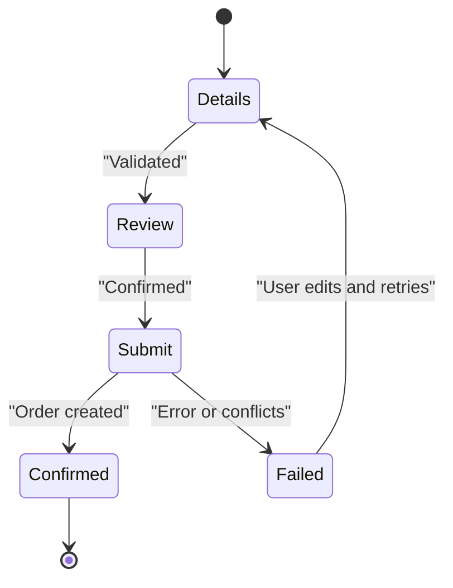

[No sources needed since this diagram shows conceptual workflow, not actual code structure]

## Dependency Analysis
- The API client depends on resilience utilities for retry and deduplication, and on error types for consistent error propagation.
- Validation and schema are used by UI layers to ensure correct input before pricing and submission.
- Pricing depends on line items and options (promo code, shipping, tax rate, coupon amount).
- Manual payment helper influences UI behavior and command construction.

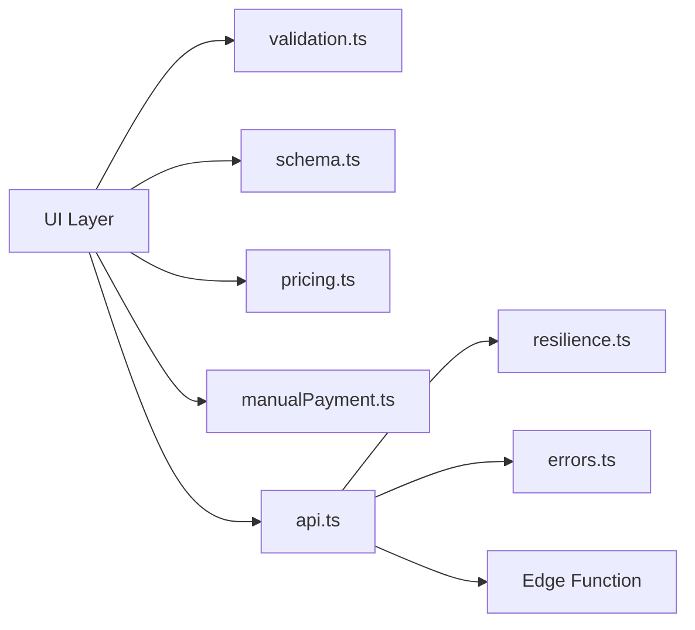

**Diagram sources**
- [api.ts:140-153](file://apps/shopper-native/src/features/checkout/api.ts#L140-L153)
- [resilience.ts:53-116](file://apps/shopper-native/src/features/checkout/resilience.ts#L53-L116)
- [errors.ts:17-37](file://apps/shopper-native/src/features/checkout/errors.ts#L17-L37)

**Section sources**
- [api.ts:140-261](file://apps/shopper-native/src/features/checkout/api.ts#L140-L261)
- [resilience.ts:53-116](file://apps/shopper-native/src/features/checkout/resilience.ts#L53-L116)
- [errors.ts:17-37](file://apps/shopper-native/src/features/checkout/errors.ts#L17-L37)

## Performance Considerations
- Use idempotency keys to prevent duplicate submissions and enable safe retries.
- Leverage in-flight deduplication to avoid redundant network calls during rapid user interactions.
- Apply exponential backoff with jitter to reduce load spikes and improve resilience under transient failures.
- Keep timeouts reasonable to fail fast on slow networks while allowing backend processing time.
- Persist drafts to allow recovery without re-entering data, reducing churn and improving UX.

[No sources needed since this section provides general guidance]

## Troubleshooting Guide
Common issues and resolutions:
- Network errors: Indicated by NETWORK code; retry automatically; verify connectivity and DNS.
- Timeouts: TIMEOUT code; increase timeout or investigate backend latency; consider retry strategy.
- Authentication failures: AUTH code; ensure user session is valid; profile upsert may be required.
- Reservation expired: RESERVATION_EXPIRED code; refresh catalog and update cart; resubmit.
- Bad response: BAD_RESPONSE code; log and report; retry once.
- Function errors: FUNCTION_ERROR code; inspect backend logs; retry if transient.

Use the error formatter to display user-friendly messages and capture context for diagnostics.

**Section sources**
- [errors.ts:7-49](file://apps/shopper-native/src/features/checkout/errors.ts#L7-L49)
- [api.ts:174-217](file://apps/shopper-native/src/features/checkout/api.ts#L174-L217)

## Conclusion
The checkout domain provides a robust, resilient, and secure workflow for order creation and payment processing. It combines strict validation, precise pricing, fault-tolerant networking, and clear error semantics to deliver a reliable user experience. By leveraging idempotency, retries, and draft persistence, it minimizes failures and improves recoverability. Security and compliance are supported through authenticated backend calls, minimal sensitive data exposure, and careful handling of payment proofs and identifiers.

[No sources needed since this section summarizes without analyzing specific files]

## Appendices

### Examples

- Initiate checkout:
  - Validate form inputs and compute pricing before submission.
  - Prepare a command with idempotencyKey, customer, address, payment, expectedPricing, and cartLines.

- Process payment:
  - For manual wallets, collect transferNumber and optionally paymentProofUrl.
  - Submit via createCheckoutOrder; handle retries and deduplication automatically.

- Confirm order:
  - On success, use orderId, status, paymentStatus, and paymentReference to update UI and navigate.
  - If conflicts exist, prompt user to review cart and adjust quantities or items.

- Handle failure scenarios:
  - NETWORK/TIMEOUT: Show retry option; preserve draft.
  - AUTH: Prompt login; ensure profile exists.
  - RESERVATION_EXPIRED: Refresh catalog; update cart; resubmit.
  - FUNCTION_ERROR/BAD_RESPONSE: Log and retry once; escalate if persistent.

[No sources needed since this section provides general guidance]

### Security and Compliance Considerations
- Authentication: All order creation calls are authenticated via Supabase sessions; ensure tokens are valid and refreshed as needed.
- Idempotency: Always generate unique idempotency keys per submission attempt to prevent duplicates and support safe retries.
- Sensitive Data: Avoid storing raw payment credentials; use transferNumber and paymentProofUrl only when necessary and ensure secure storage and transmission.
- Least Privilege: Only expose required fields to the client; rely on backend for business logic and validation.
- Auditability: Capture error contexts and outcomes for monitoring and debugging without logging sensitive data.
- Compliance: Follow applicable regulations for handling personal and financial data; encrypt data in transit and at rest where required.

[No sources needed since this section provides general guidance]