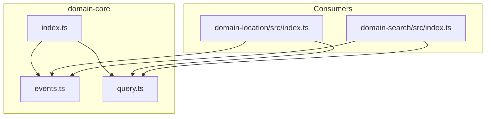
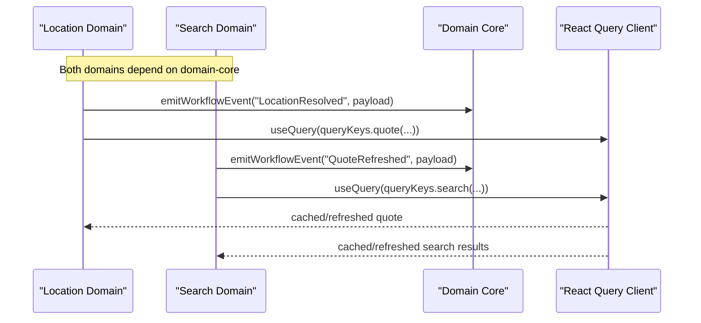
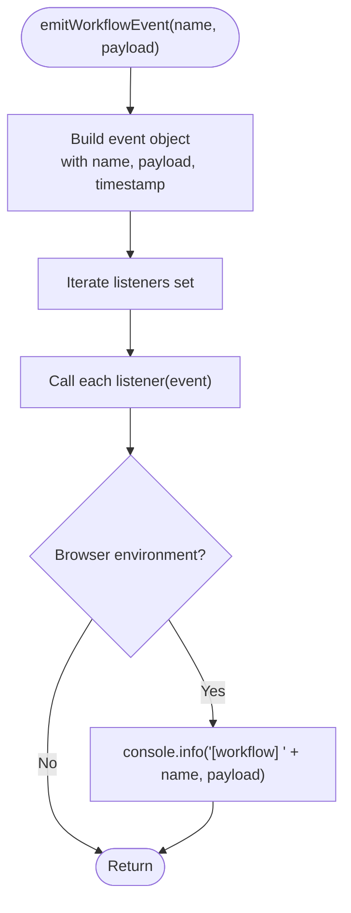
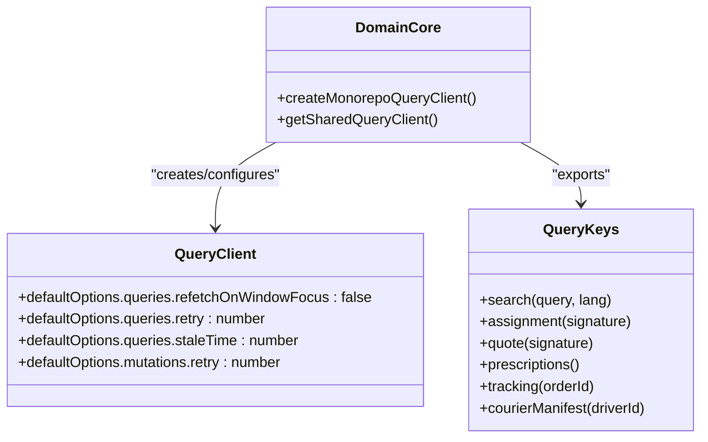
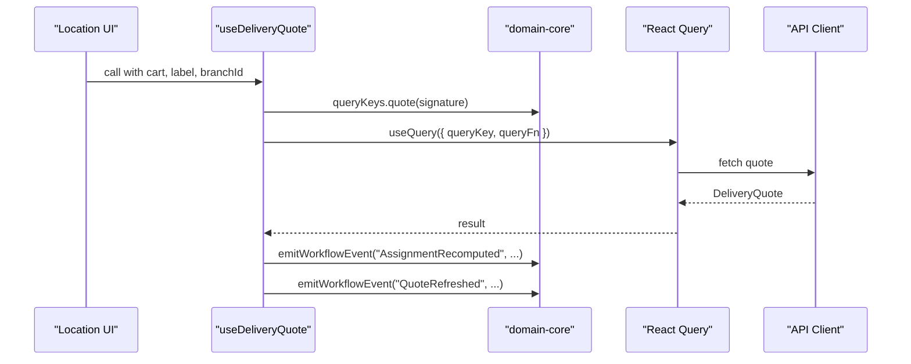
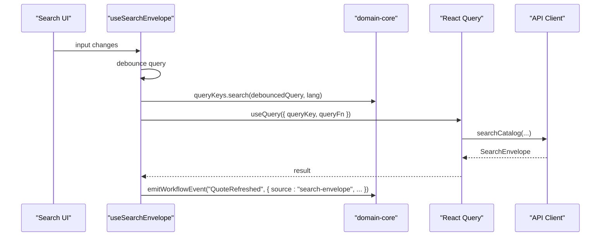
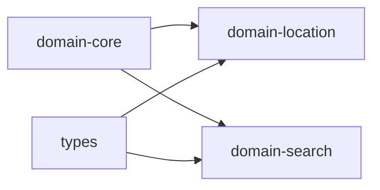

# Domain Core

<cite>
**Referenced Files in This Document**
- [package.json](file://packages/domain-core/package.json)
- [index.ts](file://packages/domain-core/src/index.ts)
- [events.ts](file://packages/domain-core/src/events.ts)
- [query.ts](file://packages/domain-core/src/query.ts)
- [domain-location index.ts](file://packages/domain-location/src/index.ts)
- [domain-search index.ts](file://packages/domain-search/src/index.ts)
- [types index.ts](file://packages/types/src/index.ts)
</cite>

## Table of Contents
1. Introduction
2. Project Structure
3. Core Components
4. Architecture Overview
5. Detailed Component Analysis
6. Dependency Analysis
7. Performance Considerations
8. Troubleshooting Guide
9. Conclusion

## Introduction
The domain-core package is the foundational layer for shared business rules and utilities across the United Pharmacy ecosystem. It centralizes cross-cutting concerns such as workflow eventing, query key conventions, and a shared React Query client configuration. Other domain packages (for example, location and search) consume these primitives to coordinate behavior, cache data consistently, and emit standardized events that other parts of the system can observe.

This document explains:
- The core business abstractions exposed by domain-core
- How they are used by other domain packages
- Validation and consistency patterns enabled by shared types and keys
- Integration points and error handling considerations

## Project Structure
At its core, domain-core exposes two primary modules:
- Workflow events: a simple pub/sub mechanism with typed event names and payloads
- Query utilities: shared query key factories and a singleton React Query client for consistent caching behavior

**Diagram sources**
- [index.ts:1-3](file://packages/domain-core/src/index.ts#L1-L3)
- [events.ts:1-52](file://packages/domain-core/src/events.ts#L1-L52)
- [query.ts:1-36](file://packages/domain-core/src/query.ts#L1-L36)
- [domain-location index.ts:1-145](file://packages/domain-location/src/index.ts#L1-L145)
- [domain-search index.ts:1-90](file://packages/domain-search/src/index.ts#L1-L90)

**Section sources**
- [package.json:1-7](file://packages/domain-core/package.json#L1-L7)
- [index.ts:1-3](file://packages/domain-core/src/index.ts#L1-L3)

## Core Components
- Workflow events:
  - Typed event names for common cross-domain milestones (e.g., cart updates, location resolution, assignment recomputation, quote refresh, order submission, prescription lifecycle, courier status changes)
  - A lightweight emitter and subscriber registry to decouple domains
- Query utilities:
  - Centralized query key factories for search, assignment, quotes, prescriptions, tracking, and courier manifests
  - A shared React Query client with sensible defaults for refetching, retries, and staleness

These components provide:
- Consistent event vocabulary across domains
- Predictable cache keys to avoid duplicate or stale queries
- A single source of truth for query client configuration

**Section sources**
- [events.ts:1-52](file://packages/domain-core/src/events.ts#L1-L52)
- [query.ts:1-36](file://packages/domain-core/src/query.ts#L1-L36)

## Architecture Overview
The domain-core package sits at the center of inter-domain communication and data fetching strategy. Consumers import typed event names and query keys from domain-core and use them to:
- Emit workflow events when state transitions occur
- Build deterministic query keys for API calls
- Share a configured React Query client for consistent caching and retry behavior

**Diagram sources**
- [domain-location index.ts:114-145](file://packages/domain-location/src/index.ts#L114-L145)
- [domain-search index.ts:38-90](file://packages/domain-search/src/index.ts#L38-L90)
- [events.ts:27-51](file://packages/domain-core/src/events.ts#L27-L51)
- [query.ts:3-36](file://packages/domain-core/src/query.ts#L3-L36)

## Detailed Component Analysis

### Workflow Events
Purpose:
- Provide a strongly-typed event bus for cross-domain coordination
- Standardize event names and payload shape to ensure consumers can rely on consistent semantics

Key elements:
- Event name constants and derived type for exhaustive matching
- Event structure with name, optional payload, and timestamp
- Emitter function that invokes all registered listeners and logs to console in browser environments
- Subscriber function that returns an unsubscribe handle

Usage pattern:
- Domains emit events after meaningful state changes (e.g., location resolved, quote refreshed)
- Observers subscribe once and react to events without tight coupling

**Diagram sources**
- [events.ts:27-44](file://packages/domain-core/src/events.ts#L27-L44)

**Section sources**
- [events.ts:1-52](file://packages/domain-core/src/events.ts#L1-L52)

### Query Utilities
Purpose:
- Define canonical query keys for shared data shapes across domains
- Provide a shared React Query client with consistent defaults for performance and reliability

Key elements:
- Query key factories for search, assignment, quote, prescriptions, tracking, and courier manifest
- Singleton creation and retrieval of a shared QueryClient with:
  - Disabled refetch on window focus
  - Limited retries for queries and mutations
  - Stale time to reduce network churn

**Diagram sources**
- [query.ts:3-36](file://packages/domain-core/src/query.ts#L3-L36)

**Section sources**
- [query.ts:1-36](file://packages/domain-core/src/query.ts#L1-L36)

### Integration with Location Domain
Highlights:
- Uses domain-core query keys to build deterministic cache keys based on cart signature and coordinates
- Emits workflow events for location resolution and quote refresh
- Coordinates with API client to fetch delivery quotes and triggers downstream events

**Diagram sources**
- [domain-location index.ts:114-145](file://packages/domain-location/src/index.ts#L114-L145)
- [query.ts:3-10](file://packages/domain-core/src/query.ts#L3-L10)
- [events.ts:27-44](file://packages/domain-core/src/events.ts#L27-L44)

**Section sources**
- [domain-location index.ts:1-145](file://packages/domain-location/src/index.ts#L1-L145)

### Integration with Search Domain
Highlights:
- Uses domain-core query keys to cache search envelopes per language and query
- Emits workflow events when search results update to inform other domains
- Debounces user input to reduce unnecessary requests

**Diagram sources**
- [domain-search index.ts:38-90](file://packages/domain-search/src/index.ts#L38-L90)
- [query.ts:3-10](file://packages/domain-core/src/query.ts#L3-L10)
- [events.ts:27-44](file://packages/domain-core/src/events.ts#L27-L44)

**Section sources**
- [domain-search index.ts:1-90](file://packages/domain-search/src/index.ts#L1-L90)

### Shared Types and Contracts
While domain-core focuses on events and query utilities, it integrates tightly with shared types and contracts used across domains:
- Types define canonical shapes for coordinates, cart snapshots, search envelopes, delivery quotes, prescriptions, and tracking
- Contracts standardize API responses and error shapes

These shared definitions enable:
- Strongly-typed event payloads and query parameters
- Consistent validation and transformation logic in consumers
- Clear boundaries between domains while sharing a common vocabulary

**Section sources**
- [types index.ts:1-191](file://packages/types/src/index.ts#L1-L191)

## Dependency Analysis
- domain-core has no runtime dependencies beyond React Query; it provides primitives consumed by other domains
- domain-location depends on domain-core for:
  - Query key generation for quotes and assignments
  - Workflow events to signal state changes
- domain-search depends on domain-core for:
  - Query key generation for search envelopes
  - Workflow events to broadcast search-driven updates

**Diagram sources**
- [domain-location index.ts:1-145](file://packages/domain-location/src/index.ts#L1-L145)
- [domain-search index.ts:1-90](file://packages/domain-search/src/index.ts#L1-L90)
- [types index.ts:1-191](file://packages/types/src/index.ts#L1-L191)

**Section sources**
- [domain-location index.ts:1-145](file://packages/domain-location/src/index.ts#L1-L145)
- [domain-search index.ts:1-90](file://packages/domain-search/src/index.ts#L1-L90)
- [types index.ts:1-191](file://packages/types/src/index.ts#L1-L191)

## Performance Considerations
- Query client defaults:
  - Refetch disabled on window focus reduces unnecessary revalidation
  - Limited retries minimize network chatter
  - Stale time balances freshness with reduced load
- Deterministic query keys:
  - Rounding coordinates and normalizing signatures prevent cache fragmentation
  - Language-aware search keys avoid collisions
- Event emission:
  - Lightweight listener iteration keeps overhead minimal
  - Optional console logging aids debugging without impacting production paths

[No sources needed since this section provides general guidance]

## Troubleshooting Guide
Common issues and resolutions:
- Duplicate or missing cache entries:
  - Ensure consumers use domain-core query key factories consistently
  - Verify that inputs (language, query, coordinates) are normalized before building keys
- Unexpected re-renders or excessive network calls:
  - Check that the shared QueryClient is created once via the provided factory
  - Confirm that refetch and retry settings match application needs
- Events not observed:
  - Ensure subscribers are registered before events are emitted
  - Use the returned unsubscribe function to clean up listeners during unmount

**Section sources**
- [query.ts:12-36](file://packages/domain-core/src/query.ts#L12-L36)
- [events.ts:25-51](file://packages/domain-core/src/events.ts#L25-L51)

## Conclusion
The domain-core package establishes a stable foundation for the United Pharmacy ecosystem by providing:
- A typed, extensible workflow event system for cross-domain coordination
- Canonical query key factories and a shared React Query client for consistent data fetching and caching
- Clear integration points for other domains to emit and observe meaningful state changes

By centralizing these concerns, domain-core enables other packages to focus on domain-specific logic while maintaining consistency, performance, and observability across the entire application.