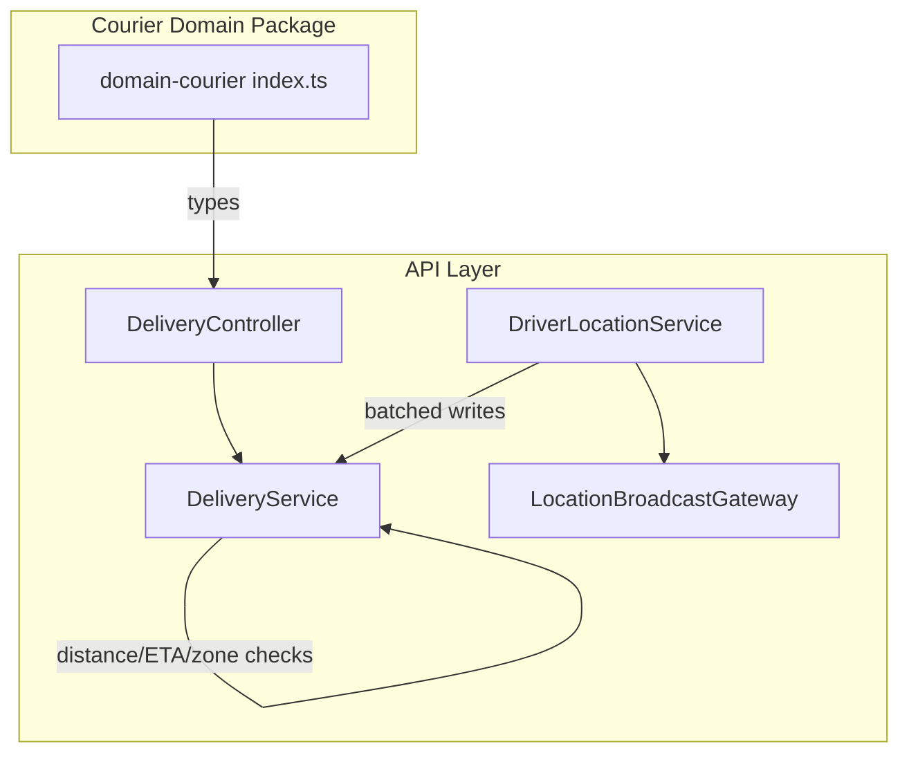
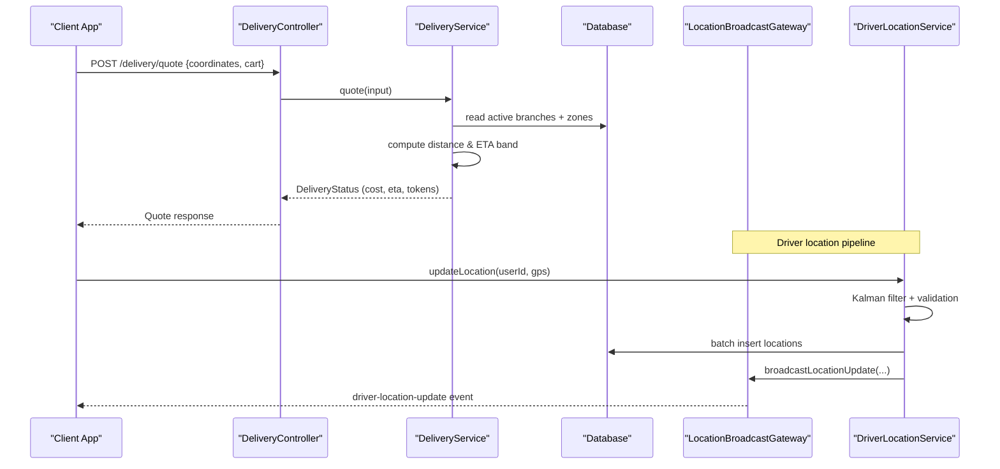
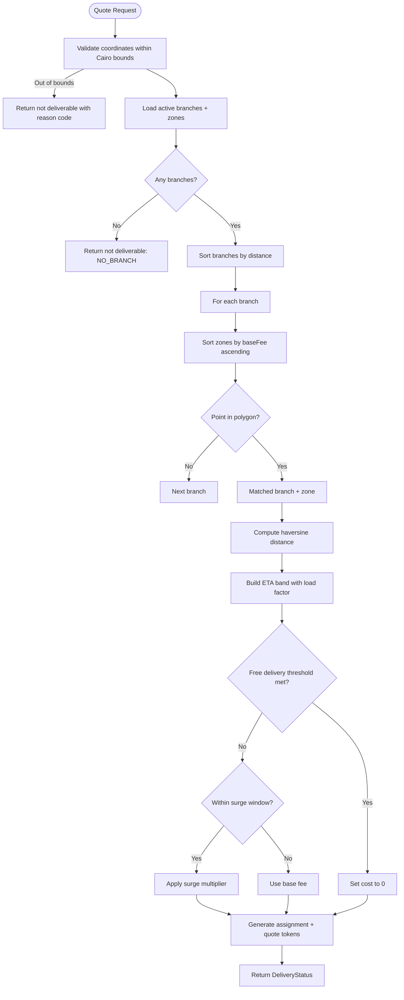
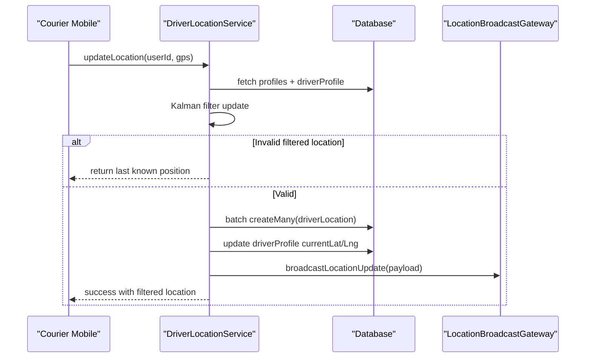
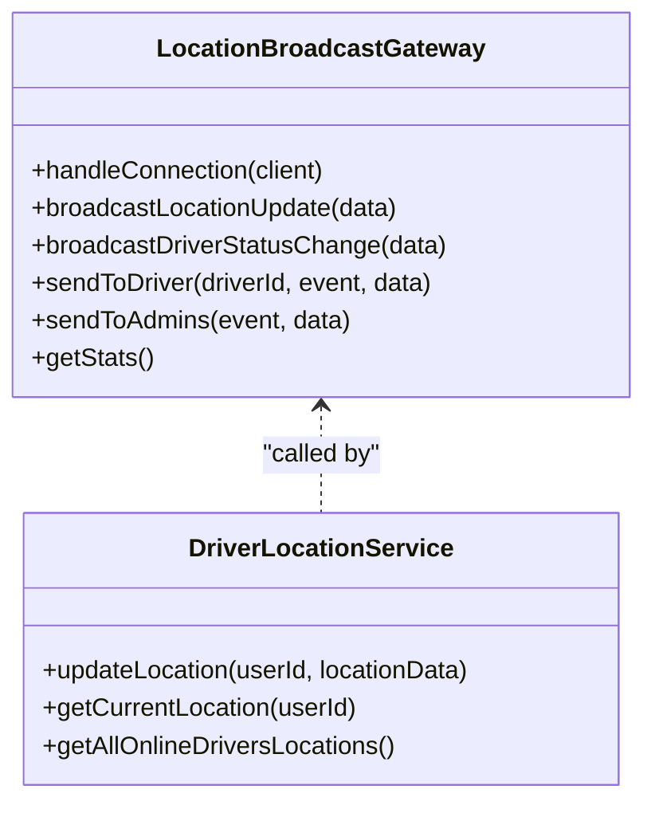
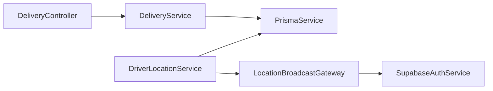

# Domain Courier

<cite>
**Referenced Files in This Document**
- [index.ts](file://packages/domain-courier/src/index.ts)
- [package.json](file://packages/domain-courier/package.json)
- [delivery.controller.ts](file://apps/api/src/modules/delivery/delivery.controller.ts)
- [delivery.service.ts](file://apps/api/src/modules/delivery/delivery.service.ts)
- [driver-location.service.ts](file://apps/api/src/modules/driver/driver-location.service.ts)
- [location-broadcast.gateway.ts](file://apps/api/src/modules/driver/location-broadcast.gateway.ts)
</cite>

## Table of Contents
1. Introduction
2. Project Structure
3. Core Components
4. Architecture Overview
5. Detailed Component Analysis
6. Dependency Analysis
7. Performance Considerations
8. Troubleshooting Guide
9. Conclusion

## Introduction
This document explains the domain-courier functionality that powers delivery logistics and courier operations. It covers delivery quoting and assignment preparation, route-related distance calculations, driver management via location tracking, and real-time updates through WebSockets. It also documents the delivery state considerations, capacity planning signals (branch load factor and surge pricing), and integration points with mapping services for zone containment and ETA estimation. Examples are provided as step-by-step flows to illustrate delivery creation, assignment preparation, and status tracking.

## Project Structure
The courier domain spans a small TypeScript package exposing types and the API layer implementing core logic:
- packages/domain-courier: lightweight package exporting courier workflow area types used by other parts of the system.
- apps/api: NestJS module providing:
  - Delivery service/controller for quoting and assignment token generation.
  - Driver location service for GPS filtering, persistence, and broadcasting.
  - WebSocket gateway for real-time driver location and status updates.

**Diagram sources**
- [index.ts:1-2](file://packages/domain-courier/src/index.ts#L1-L2)
- [delivery.controller.ts:1-17](file://apps/api/src/modules/delivery/delivery.controller.ts#L1-L17)
- [delivery.service.ts:1-240](file://apps/api/src/modules/delivery/delivery.service.ts#L1-L240)
- [driver-location.service.ts:1-352](file://apps/api/src/modules/driver/driver-location.service.ts#L1-L352)
- [location-broadcast.gateway.ts:1-214](file://apps/api/src/modules/driver/location-broadcast.gateway.ts#L1-L214)

**Section sources**
- [index.ts:1-2](file://packages/domain-courier/src/index.ts#L1-L2)
- [package.json:1-7](file://packages/domain-courier/package.json#L1-L7)
- [delivery.controller.ts:1-17](file://apps/api/src/modules/delivery/delivery.controller.ts#L1-L17)

## Core Components
- Delivery Service: Computes quotes, validates geographic boundaries, matches nearest branch and zone, calculates distance and ETA bands, applies free delivery and surge pricing, and generates assignment and quote tokens.
- Driver Location Service: Validates driver identity and online status, filters noisy GPS using a Kalman filter, persists locations in batches, updates current position, and broadcasts real-time updates.
- Location Broadcast Gateway: Manages authenticated WebSocket connections, emits driver location updates and status changes, and supports room-based subscriptions for admin dashboards and driver clients.

Key responsibilities:
- Delivery quoting and assignment preparation: nearest branch selection, polygon containment, ETA banding, cost computation with surge and free-delivery rules.
- Driver management: online/offline gating, GPS filtering, batched persistence, and live broadcast.
- Real-time tracking: WebSocket events for location and status changes.

**Section sources**
- [delivery.service.ts:58-239](file://apps/api/src/modules/delivery/delivery.service.ts#L58-L239)
- [driver-location.service.ts:7-127](file://apps/api/src/modules/driver/driver-location.service.ts#L7-L127)
- [location-broadcast.gateway.ts:27-143](file://apps/api/src/modules/driver/location-broadcast.gateway.ts#L27-L143)

## Architecture Overview
The delivery flow starts at the controller, which validates input and delegates to the delivery service for quoting and assignment tokenization. The driver subsystem handles high-frequency GPS updates with filtering and batching, then publishes real-time updates via a WebSocket gateway.

**Diagram sources**
- [delivery.controller.ts:6-14](file://apps/api/src/modules/delivery/delivery.controller.ts#L6-L14)
- [delivery.service.ts:62-233](file://apps/api/src/modules/delivery/delivery.service.ts#L62-L233)
- [driver-location.service.ts:30-127](file://apps/api/src/modules/driver/driver-location.service.ts#L30-L127)
- [location-broadcast.gateway.ts:124-143](file://apps/api/src/modules/driver/location-broadcast.gateway.ts#L124-L143)

## Detailed Component Analysis

### Delivery Quoting and Assignment Preparation
Responsibilities:
- Validate coordinates against a bounding box.
- Retrieve active branches and their zones.
- Sort branches by distance from the user’s coordinates.
- For each branch, sort zones by base fee and test point-in-polygon containment.
- Compute haversine distance and ETA band based on traffic model and branch load factor.
- Apply free delivery threshold and surge multiplier if within surge window.
- Generate assignment and quote tokens for downstream assignment workflows.

**Diagram sources**
- [delivery.service.ts:62-233](file://apps/api/src/modules/delivery/delivery.service.ts#L62-L233)

**Section sources**
- [delivery.service.ts:6-56](file://apps/api/src/modules/delivery/delivery.service.ts#L6-L56)
- [delivery.service.ts:62-233](file://apps/api/src/modules/delivery/delivery.service.ts#L62-L233)

### Driver Management and Real-Time Location Updates
Responsibilities:
- Authenticate and authorize driver profile; ensure driver is online.
- Filter incoming GPS data using a Kalman filter to remove outliers and unrealistic speeds.
- Persist filtered locations in batches to reduce database load.
- Update driver’s current position and last seen timestamp immediately.
- Broadcast location updates and status changes via WebSocket to subscribed clients.

**Diagram sources**
- [driver-location.service.ts:30-127](file://apps/api/src/modules/driver/driver-location.service.ts#L30-L127)
- [location-broadcast.gateway.ts:124-143](file://apps/api/src/modules/driver/location-broadcast.gateway.ts#L124-L143)

**Section sources**
- [driver-location.service.ts:7-127](file://apps/api/src/modules/driver/driver-location.service.ts#L7-L127)
- [driver-location.service.ts:129-221](file://apps/api/src/modules/driver/driver-location.service.ts#L129-L221)
- [driver-location.service.ts:223-352](file://apps/api/src/modules/driver/driver-location.service.ts#L223-L352)
- [location-broadcast.gateway.ts:27-143](file://apps/api/src/modules/driver/location-broadcast.gateway.ts#L27-L143)

### WebSocket Gateway for Live Tracking
Responsibilities:
- Manage authenticated connections and rooms for admin and driver clients.
- Emit initial list of online drivers upon connection.
- Broadcast driver location updates and status changes.
- Provide utilities to send targeted messages to driver rooms or admin room.

**Diagram sources**
- [location-broadcast.gateway.ts:27-214](file://apps/api/src/modules/driver/location-broadcast.gateway.ts#L27-L214)
- [driver-location.service.ts:186-245](file://apps/api/src/modules/driver/driver-location.service.ts#L186-L245)

**Section sources**
- [location-broadcast.gateway.ts:58-143](file://apps/api/src/modules/driver/location-broadcast.gateway.ts#L58-L143)
- [location-broadcast.gateway.ts:145-214](file://apps/api/src/modules/driver/location-broadcast.gateway.ts#L145-L214)

### Delivery State Considerations
While explicit order states are managed elsewhere, the delivery service exposes a DeliveryStatus object that includes:
- Deliverability flag and reason codes (e.g., OUT_OF_CAIRO, NO_BRANCH, OUT_OF_ZONE, OK).
- Cost breakdown including base fee, surge multiplier, and free delivery application.
- ETA band (min/max minutes) derived from distance and branch load factor.
- Assignment and quote tokens for subsequent assignment and confirmation steps.

These fields provide a consistent contract for UI and downstream systems to render delivery readiness, pricing, and next actions.

**Section sources**
- [delivery.service.ts:62-233](file://apps/api/src/modules/delivery/delivery.service.ts#L62-L233)

### Capacity Planning and Route Optimization Signals
- Branch load factor influences ETA band scaling to reflect congestion or workload.
- Surge windows and multipliers adjust pricing dynamically during peak hours.
- Nearest branch selection minimizes distance and improves delivery speed.
- Zone polygon containment ensures deliveries are restricted to operational areas.

These mechanisms collectively support capacity-aware routing and pricing without requiring an external optimizer.

**Section sources**
- [delivery.service.ts:121-200](file://apps/api/src/modules/delivery/delivery.service.ts#L121-L200)

### Integration with Mapping Services and Notifications
- Mapping integration:
  - Point-in-polygon checks validate whether a coordinate falls within a branch’s delivery zone.
  - Haversine distance computes straight-line distance for ETA and cost decisions.
  - Branch map embed sources are included in responses for UI rendering.
- Notification integration:
  - Real-time driver location and status updates are broadcast via WebSocket events for live tracking dashboards and mobile apps.
  - Admin and driver-specific rooms enable targeted messaging.

**Section sources**
- [delivery.service.ts:131-200](file://apps/api/src/modules/delivery/delivery.service.ts#L131-L200)
- [location-broadcast.gateway.ts:86-143](file://apps/api/src/modules/driver/location-broadcast.gateway.ts#L86-L143)

## Dependency Analysis
High-level dependencies:
- DeliveryController depends on DeliveryService for business logic.
- DeliveryService depends on Prisma for reading branches/zones and uses geometry helpers for distance and containment.
- DriverLocationService depends on Prisma for profile and location records and on LocationBroadcastGateway for real-time events.
- LocationBroadcastGateway depends on SupabaseAuthService for socket authentication and on DriverLocationService to fetch initial driver lists.

**Diagram sources**
- [delivery.controller.ts:1-14](file://apps/api/src/modules/delivery/delivery.controller.ts#L1-L14)
- [delivery.service.ts:1-5](file://apps/api/src/modules/delivery/delivery.service.ts#L1-L5)
- [driver-location.service.ts:1-6](file://apps/api/src/modules/driver/driver-location.service.ts#L1-L6)
- [location-broadcast.gateway.ts:1-14](file://apps/api/src/modules/driver/location-broadcast.gateway.ts#L1-L14)

**Section sources**
- [delivery.controller.ts:1-14](file://apps/api/src/modules/delivery/delivery.controller.ts#L1-L14)
- [delivery.service.ts:1-5](file://apps/api/src/modules/delivery/delivery.service.ts#L1-L5)
- [driver-location.service.ts:1-6](file://apps/api/src/modules/driver/driver-location.service.ts#L1-L6)
- [location-broadcast.gateway.ts:1-14](file://apps/api/src/modules/driver/location-broadcast.gateway.ts#L1-L14)

## Performance Considerations
- Batched location writes: DriverLocationService accumulates up to a configurable batch size and flushes periodically to reduce database write pressure.
- GPS filtering: Kalman filtering reduces noise and prevents invalid spikes from polluting history and ETA calculations.
- Efficient branch/zone matching: Sorting by distance and base fee minimizes unnecessary checks and ensures optimal matching.
- WebSocket scalability: Room-based subscriptions limit broadcast scope and reduce payload fan-out.

[No sources needed since this section provides general guidance]

## Troubleshooting Guide
Common issues and resolutions:
- Out-of-area deliveries: If coordinates fall outside the supported region, the quote returns a not deliverable status with a specific reason code. Verify customer address and branch coverage.
- No active branches: Ensure at least one branch is active and has configured zones.
- Out-of-zone: Even within the city, a coordinate may be outside any branch’s polygon. Update zone polygons or adjust branch coverage.
- Driver offline: Location updates require the driver to be online; otherwise, requests are rejected. Confirm driver status before sending GPS updates.
- Excessive GPS noise: If filtered out frequently, check device accuracy and motion patterns; consider tuning filter parameters or improving sensor quality.
- WebSocket auth failures: Ensure tokens are correctly passed in handshake headers or query params; non-admin roles are rejected for the admin namespace.

**Section sources**
- [delivery.service.ts:71-179](file://apps/api/src/modules/delivery/delivery.service.ts#L71-L179)
- [driver-location.service.ts:30-73](file://apps/api/src/modules/driver/driver-location.service.ts#L30-L73)
- [location-broadcast.gateway.ts:61-81](file://apps/api/src/modules/driver/location-broadcast.gateway.ts#L61-L81)

## Conclusion
The domain-courier functionality integrates delivery quoting, assignment tokenization, driver location management, and real-time tracking into a cohesive system. It leverages simple yet effective algorithms for distance calculation, zone containment, and ETA banding, while ensuring robustness through GPS filtering and batched persistence. The WebSocket gateway enables live visibility for customers and admins. Together, these components form a solid foundation for scalable delivery logistics and courier operations.