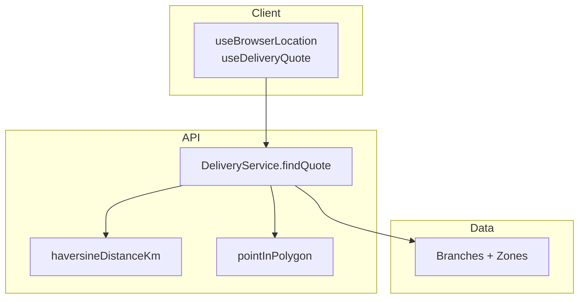
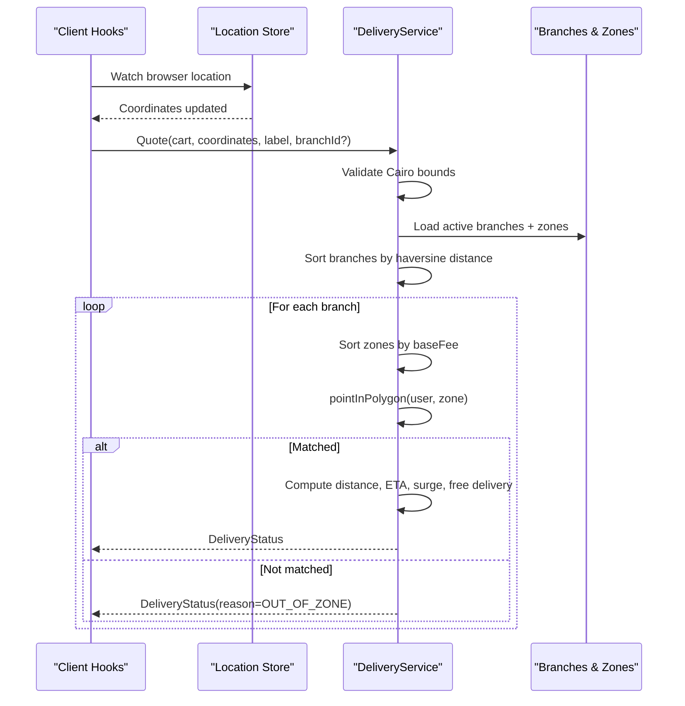
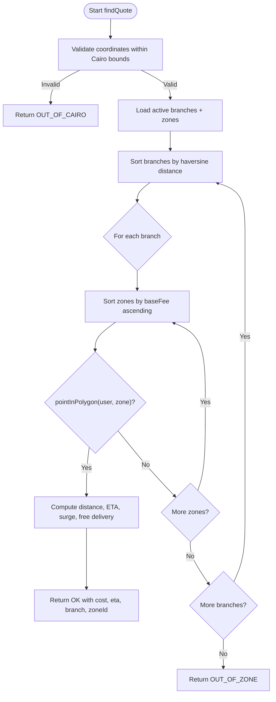
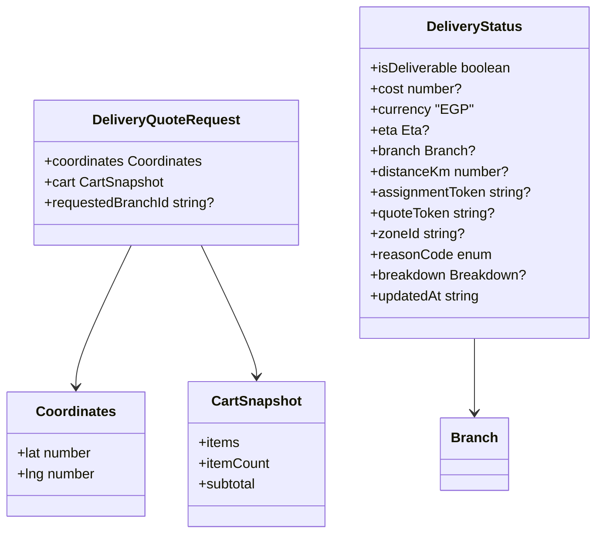
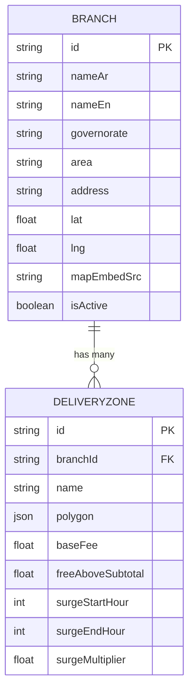
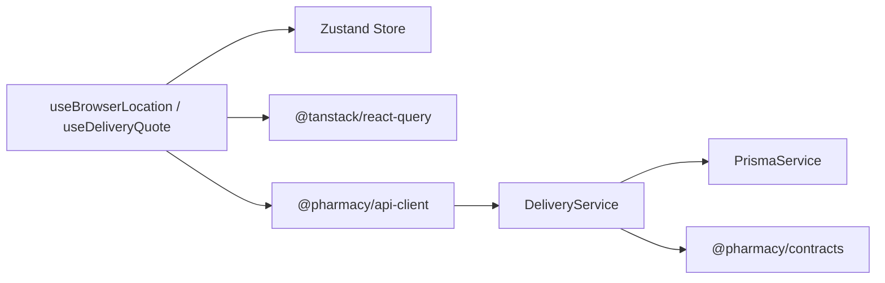

# Domain Location

<cite>
**Referenced Files in This Document**
- [index.ts](file://packages/domain-location/src/index.ts)
- [delivery.service.ts](file://apps/api/src/modules/delivery/delivery.service.ts)
- [delivery.ts](file://packages/contracts/src/delivery.ts)
- [seed.ts](file://apps/api/prisma/seed.ts)
</cite>

## Table of Contents
1. [Introduction](#introduction)
2. [Project Structure](#project-structure)
3. [Core Components](#core-components)
4. [Architecture Overview](#architecture-overview)
5. [Detailed Component Analysis](#detailed-component-analysis)
6. [Dependency Analysis](#dependency-analysis)
7. [Performance Considerations](#performance-considerations)
8. [Troubleshooting Guide](#troubleshooting-guide)
9. [Conclusion](#conclusion)

## Introduction
This document explains the domain-location package and its supporting backend services that provide geographic calculations, location-based filtering, geofencing logic, branch proximity algorithms, and delivery zone management. It covers coordinate systems, mapping integrations, validation rules, examples of distance computations and zone checks, and performance optimizations for large-scale operations including caching strategies.

## Project Structure
The domain-location capability spans a client-side React hook layer and an API service:
- Client-side (domain-location): coordinates capture, persistence, signature building for cacheable queries, and delivery quote retrieval.
- Server-side (delivery service): distance computation, geofencing via polygon containment, branch selection by proximity, ETA estimation, surge pricing, and free-delivery thresholds.
- Contracts: shared schemas for cart snapshots, coordinates, and delivery status.
- Seed data: defines branches and concentric delivery zones with fee tiers and surge windows.

**Diagram sources**
- [index.ts:78-144](file://packages/domain-location/src/index.ts#L78-L144)
- [delivery.service.ts:6-47](file://apps/api/src/modules/delivery/delivery.service.ts#L6-L47)
- [delivery.service.ts:62-233](file://apps/api/src/modules/delivery/delivery.service.ts#L62-L233)
- [seed.ts:23-40](file://apps/api/prisma/seed.ts#L23-L40)

**Section sources**
- [index.ts:10-144](file://packages/domain-location/src/index.ts#L10-L144)
- [delivery.service.ts:6-233](file://apps/api/src/modules/delivery/delivery.service.ts#L6-L233)
- [delivery.ts:1-67](file://packages/contracts/src/delivery.ts#L1-L67)
- [seed.ts:1-177](file://apps/api/prisma/seed.ts#L1-L177)

## Core Components
- Coordinates and permissions store: persists current coordinates, permission state, selected area, and selected branch; exposes setters and selectors.
- Browser location watcher: uses Geolocation API to watch position updates, rounds coordinates for stability, and emits workflow events on resolution or denial.
- Delivery quote query: builds a stable signature from cart items, coordinates, optional label, and requested branch; triggers a cached query to fetch delivery status.
- Delivery service: validates coordinates against Cairo bounds, selects nearest active branch, matches user location to smallest applicable delivery zone, computes distance, ETA band, surge multiplier, and final cost with free-delivery threshold.

Key behaviors:
- Coordinate rounding reduces repeated network calls due to GPS jitter.
- Nearest branch is chosen first to minimize fees and travel time.
- Smallest matching zone wins to ensure lowest applicable fee.
- Surge pricing applies within configured hour windows.
- Free delivery applies when cart subtotal meets threshold.

**Section sources**
- [index.ts:10-47](file://packages/domain-location/src/index.ts#L10-L47)
- [index.ts:78-144](file://packages/domain-location/src/index.ts#L78-L144)
- [delivery.service.ts:39-47](file://apps/api/src/modules/delivery/delivery.service.ts#L39-L47)
- [delivery.service.ts:62-233](file://apps/api/src/modules/delivery/delivery.service.ts#L62-L233)

## Architecture Overview
The system integrates client-side location capture with server-side geospatial logic to produce a delivery quote. The flow ensures efficient caching, accurate distance calculation, robust geofencing, and transparent pricing rules.

**Diagram sources**
- [index.ts:78-144](file://packages/domain-location/src/index.ts#L78-L144)
- [delivery.service.ts:62-233](file://apps/api/src/modules/delivery/delivery.service.ts#L62-L233)
- [seed.ts:127-163](file://apps/api/prisma/seed.ts#L127-L163)

## Detailed Component Analysis

### Client-Side Location Capture and Caching
- Coordinates are captured via navigator.geolocation.watchPosition with bounded accuracy and caching intervals.
- Coordinates are rounded to four decimal places to stabilize cache keys and reduce redundant requests.
- A persistent store keeps coordinates, permission state, selected area, and selected branch across sessions.
- A stable signature combines cart item IDs and quantities, coordinates, optional label, and optional requested branch ID to derive a deterministic query key.

Examples:
- Distance computation example: When coordinates update, the next quote request uses the rounded lat/lng to avoid churn.
- Zone checking example: If no coordinates are available, the signature indicates “no-coordinates,” and the query remains disabled until location resolves.

**Section sources**
- [index.ts:21-47](file://packages/domain-location/src/index.ts#L21-L47)
- [index.ts:49-70](file://packages/domain-location/src/index.ts#L49-L70)
- [index.ts:78-112](file://packages/domain-location/src/index.ts#L78-L112)
- [index.ts:114-144](file://packages/domain-location/src/index.ts#L114-L144)

### Delivery Service: Branch Proximity and Geofencing
- Cairo bounding box validation rejects out-of-service areas early.
- Active branches are loaded with their zones.
- Candidates are sorted by haversine distance to prioritize the nearest branch.
- Zones per branch are sorted by baseFee ascending so the smallest (nearest) matching zone wins.
- Point-in-polygon check determines if the user falls within a zone.
- Distance is computed between user and matched branch.
- ETA band is derived from distance and branch load factor.
- Surge multiplier is applied based on configured start/end hours.
- Free delivery applies when cart subtotal meets threshold.

**Diagram sources**
- [delivery.service.ts:62-233](file://apps/api/src/modules/delivery/delivery.service.ts#L62-L233)

**Section sources**
- [delivery.service.ts:6-47](file://apps/api/src/modules/delivery/delivery.service.ts#L6-L47)
- [delivery.service.ts:62-233](file://apps/api/src/modules/delivery/delivery.service.ts#L62-L233)

### Data Models and Validation
- CartSnapshot describes items, counts, and subtotal used for free-delivery threshold checks.
- Coordinates schema defines latitude and longitude constraints.
- DeliveryQuoteRequest binds coordinates, cart snapshot, and optional requested branch.
- DeliveryStatus encodes deliverability, cost, currency, ETA, branch info, distance, tokens, zone id, reason code, breakdown, and timestamp.

**Diagram sources**
- [delivery.ts:1-67](file://packages/contracts/src/delivery.ts#L1-L67)

**Section sources**
- [delivery.ts:1-67](file://packages/contracts/src/delivery.ts#L1-L67)

### Seed Data: Branches and Delivery Zones
- Branches include identifiers, names, governorate, area, address, coordinates, map embed source, and activation flag.
- Each branch has multiple concentric zones generated from a circle approximation around the branch coordinates.
- Fee tiers define radius-to-base-fee mapping and free-delivery threshold.
- Surge windows and multipliers are seeded per zone.

**Diagram sources**
- [seed.ts:52-125](file://apps/api/prisma/seed.ts#L52-L125)
- [seed.ts:127-163](file://apps/api/prisma/seed.ts#L127-L163)

**Section sources**
- [seed.ts:1-177](file://apps/api/prisma/seed.ts#L1-L177)

## Dependency Analysis
- Client hooks depend on:
  - Zustand store for location state persistence.
  - TanStack Query for caching and deduplication of quote requests.
  - API client to call quote endpoint.
  - Workflow event emitter to signal location and quote changes.
- Delivery service depends on:
  - Prisma for reading branches and zones.
  - Contracts for input/output schemas and geometry utilities.
  - Local math functions for distance and ETA.

**Diagram sources**
- [index.ts:1-144](file://packages/domain-location/src/index.ts#L1-L144)
- [delivery.service.ts:1-5](file://apps/api/src/modules/delivery/delivery.service.ts#L1-L5)
- [delivery.ts:1-67](file://packages/contracts/src/delivery.ts#L1-L67)

**Section sources**
- [index.ts:1-144](file://packages/domain-location/src/index.ts#L1-L144)
- [delivery.service.ts:1-5](file://apps/api/src/modules/delivery/delivery.service.ts#L1-L5)
- [delivery.ts:1-67](file://packages/contracts/src/delivery.ts#L1-L67)

## Performance Considerations
- Coordinate rounding: Reduces cache-busting due to GPS jitter by rounding to ~11 meters precision before computing signatures.
- Query key stability: Signature includes cart item signature, coordinates, label, and optional branch ID to maximize cache hits.
- Nearest-first sorting: Minimizes average distance and fee by evaluating closest branches first.
- Zone ordering: Sorting zones by baseFee ensures the smallest matching zone is evaluated first, reducing unnecessary checks.
- Early exits: Out-of-Cairo and no-branch cases return quickly without expensive computations.
- ETA model: Simple linear drive-time model with buffer and load factor scaling avoids heavy routing lookups.
- Caching strategy: TanStack Query caches quotes keyed by signature; consider increasing maximumAge or staleTime for frequent updates.
- Batch reads: Loading all active branches and zones in one query reduces round-trips.

[No sources needed since this section provides general guidance]

## Troubleshooting Guide
Common issues and resolutions:
- No coordinates: Ensure browser geolocation is enabled and not denied; the store tracks permission state and disables quote queries until coordinates are available.
- Out of Cairo: Requests outside the defined bounding box return a specific reason code; verify user location or adjust bounds if expanding service area.
- Out of zone: If no polygon contains the user, the service returns a reason code indicating out-of-zone; confirm zone polygons and branch coverage.
- Unexpected errors: Inspect logs and ensure database connectivity and seed data integrity.

Operational tips:
- Use the reason codes in the response to guide UI messaging and fallbacks.
- Monitor quote token and assignment token usage for analytics and debugging.
- Validate coordinates format and ranges before sending to the API.

**Section sources**
- [delivery.service.ts:74-91](file://apps/api/src/modules/delivery/delivery.service.ts#L74-L91)
- [delivery.service.ts:150-179](file://apps/api/src/modules/delivery/delivery.service.ts#L150-L179)
- [delivery.ts:34-43](file://packages/contracts/src/delivery.ts#L34-L43)

## Conclusion
The domain-location package and its backend services implement a robust, efficient, and scalable approach to location-based delivery quoting. By combining precise distance calculations, geofencing via polygon containment, nearest-branch selection, and clear pricing rules with strong caching and validation, the system delivers accurate quotes while minimizing computational overhead. The design supports future enhancements such as expanded service areas, advanced ETA models, and richer zone definitions.