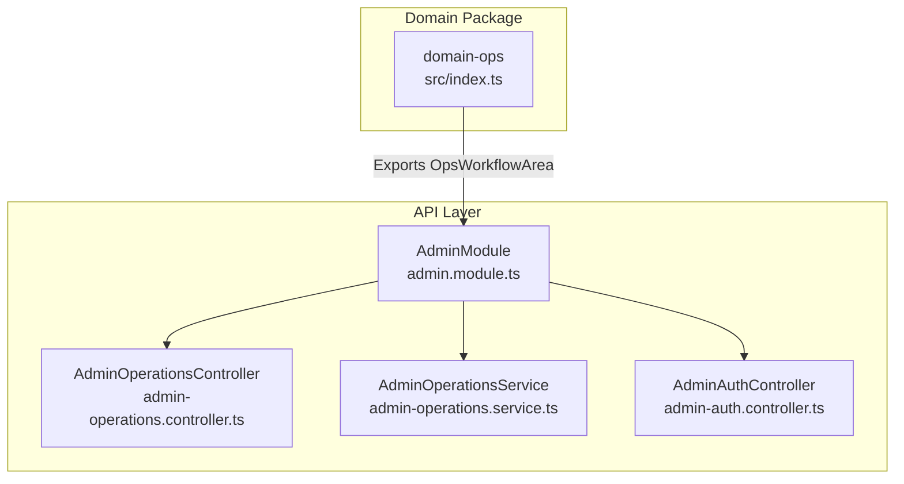
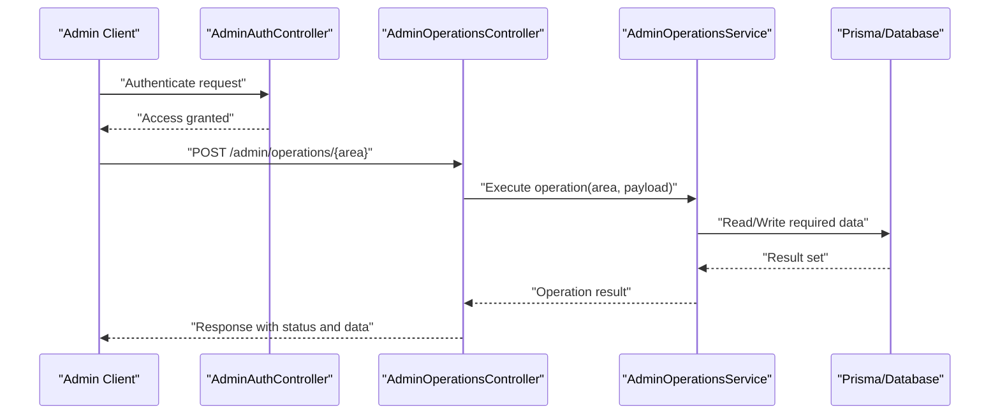
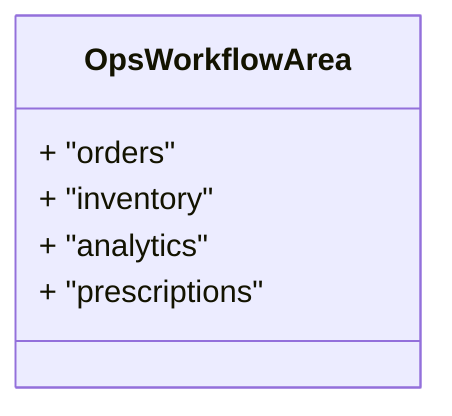
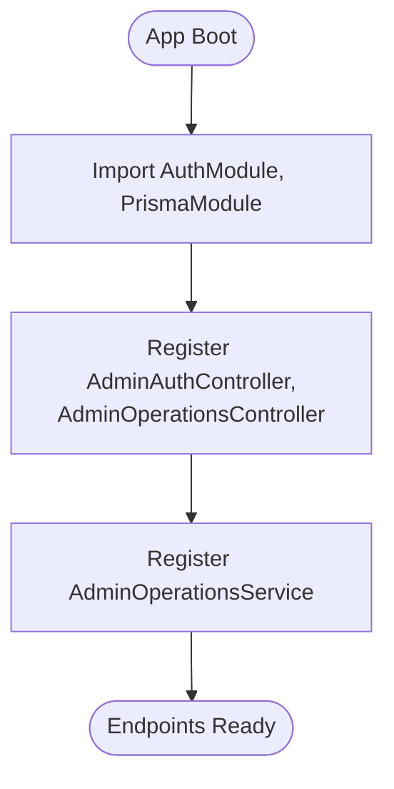
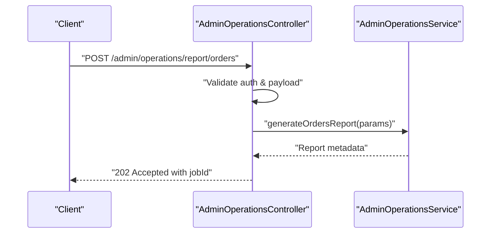
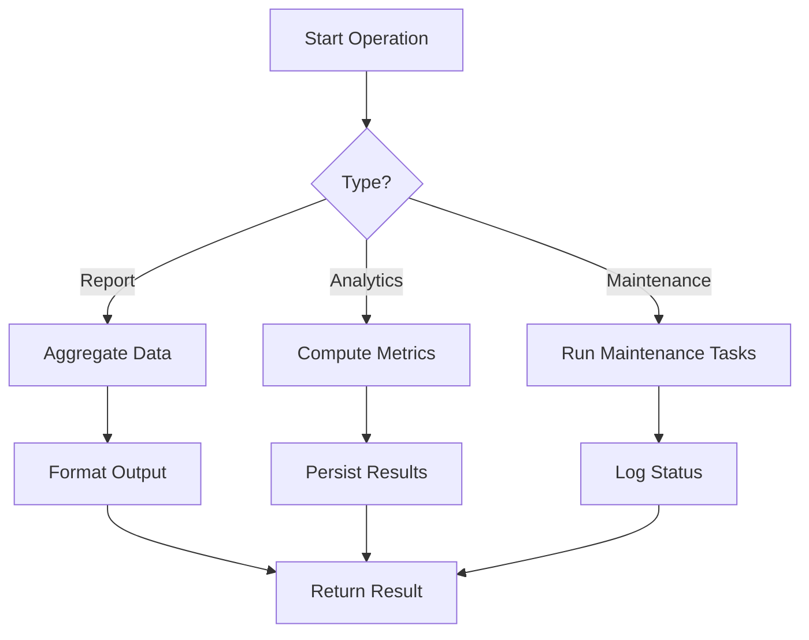
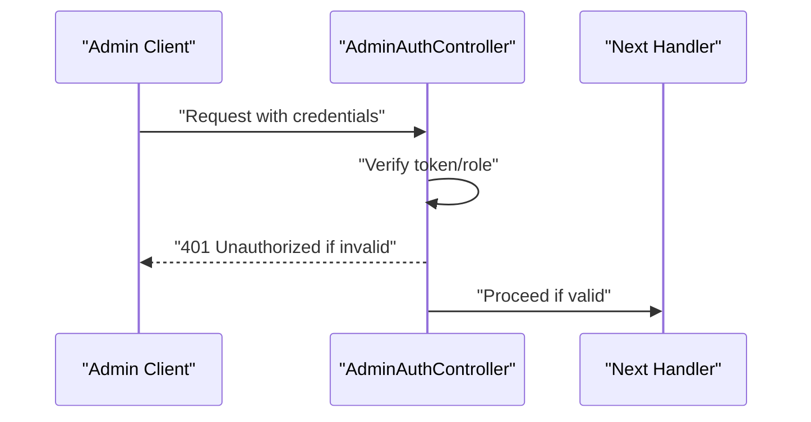
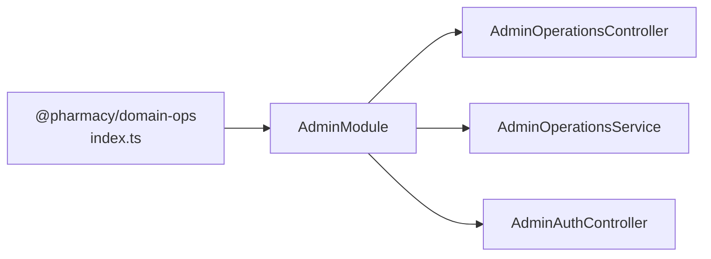

# Domain Operations

<cite>
**Referenced Files in This Document**
- [package.json](file://packages/domain-ops/package.json)
- [index.ts](file://packages/domain-ops/src/index.ts)
- [admin.module.ts](file://apps/api/src/modules/admin/admin.module.ts)
- [admin-auth.controller.ts](file://apps/api/src/modules/admin/admin-auth.controller.ts)
- [admin-operations.controller.ts](file://apps/api/src/modules/admin/admin-operations.controller.ts)
- [admin-operations.service.ts](file://apps/api/src/modules/admin/admin-operations.service.ts)
</cite>

## Table of Contents
1. Introduction
2. Project Structure
3. Core Components
4. Architecture Overview
5. Detailed Component Analysis
6. Dependency Analysis
7. Performance Considerations
8. Troubleshooting Guide
9. Conclusion

## Introduction
This document describes the domain-ops package and its role within the system’s operational workflows and administrative functionality. It explains how operational tasks, reporting generation, analytics processing, and system maintenance are orchestrated through the API layer and related modules. It also covers batch processing patterns, monitoring integration points, and automated workflows for system administration.

## Project Structure
The domain-ops package is a small, focused module that defines operational workflow areas used across the system. The operational surface area is exposed via the API’s admin module, which provides controllers and services to execute administrative operations.

**Diagram sources**
- [index.ts:1-2](file://packages/domain-ops/src/index.ts#L1-L2)
- [admin.module.ts:1-13](file://apps/api/src/modules/admin/admin.module.ts#L1-L13)

**Section sources**
- [package.json:1-7](file://packages/domain-ops/package.json#L1-L7)
- [index.ts:1-2](file://packages/domain-ops/src/index.ts#L1-L2)
- [admin.module.ts:1-13](file://apps/api/src/modules/admin/admin.module.ts#L1-L13)

## Core Components
- Operational Workflow Area Type: A shared type that enumerates supported operational domains (orders, inventory, analytics, prescriptions). Consumers use this to scope or route operations consistently.
- Admin Module: Orchestrates authentication and operational endpoints under a single module, integrating with Prisma for data access.
- Admin Operations Controller: Exposes HTTP endpoints for administrative actions such as running reports, triggering analytics jobs, and performing maintenance tasks.
- Admin Operations Service: Encapsulates business logic for operational tasks, including batch processing, report generation, and health checks.

Key responsibilities:
- Define and enforce operational boundaries via the OpsWorkflowArea type.
- Provide secure, authenticated endpoints for administrators.
- Implement reusable operational workflows (reports, analytics, maintenance).
- Integrate with database and external systems where needed.

**Section sources**
- [index.ts:1-2](file://packages/domain-ops/src/index.ts#L1-L2)
- [admin.module.ts:1-13](file://apps/api/src/modules/admin/admin.module.ts#L1-L13)
- [admin-operations.controller.ts](file://apps/api/src/modules/admin/admin-operations.controller.ts)
- [admin-operations.service.ts](file://apps/api/src/modules/admin/admin-operations.service.ts)

## Architecture Overview
The operational architecture centers on an authenticated admin interface that delegates work to service-layer components. These services coordinate with the database and any external integrations to perform tasks like generating reports, processing analytics, and executing maintenance routines.

**Diagram sources**
- [admin-auth.controller.ts](file://apps/api/src/modules/admin/admin-auth.controller.ts)
- [admin-operations.controller.ts](file://apps/api/src/modules/admin/admin-operations.controller.ts)
- [admin-operations.service.ts](file://apps/api/src/modules/admin/admin-operations.service.ts)

## Detailed Component Analysis

### Operational Workflow Areas
The OpsWorkflowArea type standardizes the operational domains handled by the system. This ensures consistent routing and validation when invoking administrative tasks.

**Diagram sources**
- [index.ts:1-2](file://packages/domain-ops/src/index.ts#L1-L2)

**Section sources**
- [index.ts:1-2](file://packages/domain-ops/src/index.ts#L1-L2)

### Admin Module Orchestration
The AdminModule wires together authentication, controllers, and services. It imports shared modules (auth and Prisma) and registers controllers and providers for operational endpoints.

**Diagram sources**
- [admin.module.ts:1-13](file://apps/api/src/modules/admin/admin.module.ts#L1-L13)

**Section sources**
- [admin.module.ts:1-13](file://apps/api/src/modules/admin/admin.module.ts#L1-L13)

### Admin Operations Controller
The controller exposes endpoints for administrative operations. Typical flows include:
- Validating input parameters and authorization.
- Delegating execution to the service layer.
- Returning standardized responses with success/failure status.

Example operational tasks:
- Generate daily sales report for orders.
- Rebuild inventory indexes.
- Trigger analytics aggregation job.
- Run prescription queue reconciliation.

**Diagram sources**
- [admin-operations.controller.ts](file://apps/api/src/modules/admin/admin-operations.controller.ts)
- [admin-operations.service.ts](file://apps/api/src/modules/admin/admin-operations.service.ts)

**Section sources**
- [admin-operations.controller.ts](file://apps/api/src/modules/admin/admin-operations.controller.ts)
- [admin-operations.service.ts](file://apps/api/src/modules/admin/admin-operations.service.ts)

### Admin Operations Service
The service encapsulates operational logic:
- Batch processing: Processes large datasets in chunks to avoid memory pressure.
- Report generation: Aggregates data from multiple sources and formats outputs.
- Analytics processing: Computes metrics and updates summary tables.
- System maintenance: Performs cleanup, index rebuilds, and consistency checks.

**Diagram sources**
- [admin-operations.service.ts](file://apps/api/src/modules/admin/admin-operations.service.ts)

**Section sources**
- [admin-operations.service.ts](file://apps/api/src/modules/admin/admin-operations.service.ts)

### Authentication Guard for Admin Endpoints
Authentication is enforced via the admin auth controller, ensuring only authorized users can invoke operational endpoints.

**Diagram sources**
- [admin-auth.controller.ts](file://apps/api/src/modules/admin/admin-auth.controller.ts)

**Section sources**
- [admin-auth.controller.ts](file://apps/api/src/modules/admin/admin-auth.controller.ts)

## Dependency Analysis
The domain-ops package contributes a shared type consumed by the API layer. The AdminModule depends on authentication and database modules to provide operational capabilities.

**Diagram sources**
- [index.ts:1-2](file://packages/domain-ops/src/index.ts#L1-L2)
- [admin.module.ts:1-13](file://apps/api/src/modules/admin/admin.module.ts#L1-L13)

**Section sources**
- [index.ts:1-2](file://packages/domain-ops/src/index.ts#L1-L2)
- [admin.module.ts:1-13](file://apps/api/src/modules/admin/admin.module.ts#L1-L13)

## Performance Considerations
- Batch Processing: Process large datasets in bounded batches to control memory usage and improve throughput.
- Database Access: Use efficient queries, appropriate indexing, and transactions to minimize lock contention.
- Idempotency: Ensure operations are idempotent to support retries without side effects.
- Asynchronous Jobs: Offload heavy tasks to background jobs where possible to keep API latency low.
- Monitoring: Emit metrics and logs for long-running operations to enable observability and alerting.

[No sources needed since this section provides general guidance]

## Troubleshooting Guide
Common issues and resolutions:
- Authentication failures: Verify tokens and roles; ensure admin routes are protected and configured correctly.
- Timeouts during report generation: Increase timeouts for long-running jobs or split into smaller batches.
- Database errors: Check connection settings, permissions, and query performance; review error logs for stack traces.
- Inconsistent state after partial failures: Implement compensating actions and rollback strategies.

**Section sources**
- [admin-auth.controller.ts](file://apps/api/src/modules/admin/admin-auth.controller.ts)
- [admin-operations.controller.ts](file://apps/api/src/modules/admin/admin-operations.controller.ts)
- [admin-operations.service.ts](file://apps/api/src/modules/admin/admin-operations.service.ts)

## Conclusion
The domain-ops package defines the operational workflow areas that unify how administrative tasks are scoped and executed. The API’s admin module provides secure endpoints and service-layer logic to orchestrate reporting, analytics, and maintenance operations. By following the patterns outlined here—batch processing, robust error handling, and clear separation of concerns—you can extend operational capabilities while maintaining reliability and performance.

[No sources needed since this section summarizes without analyzing specific files]