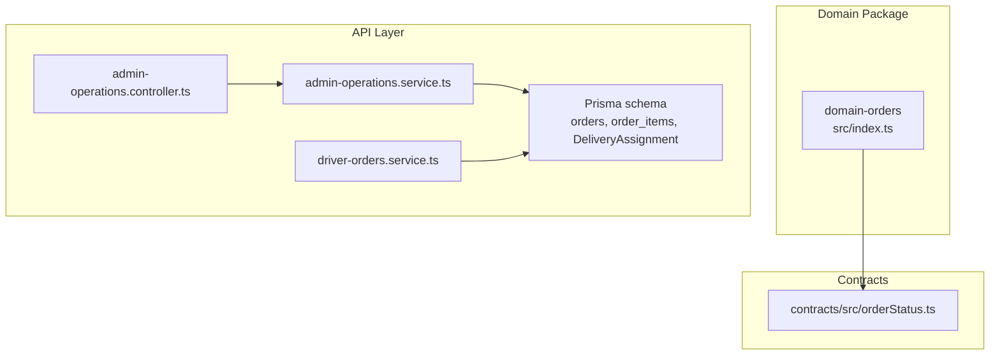
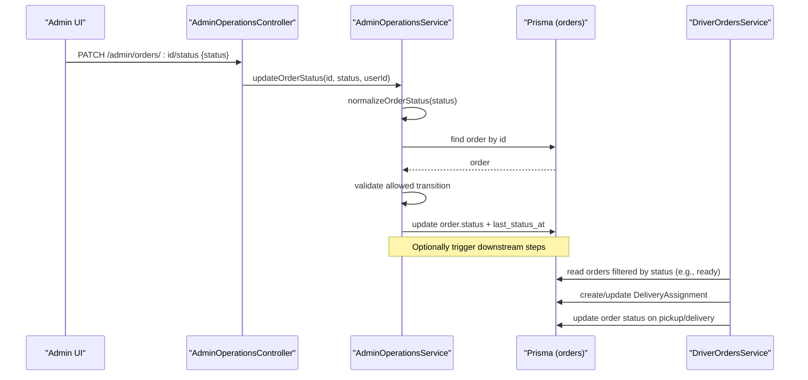
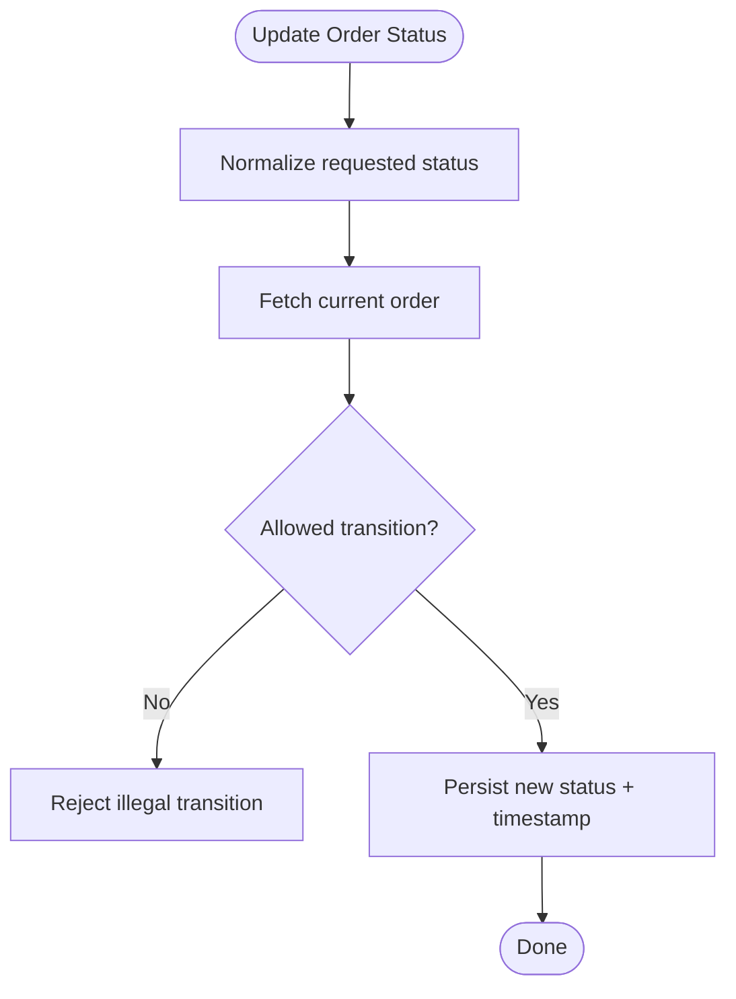
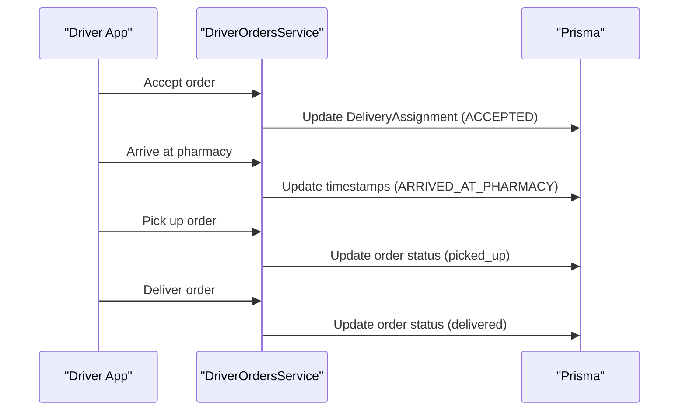
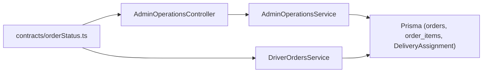

# Domain Orders

<cite>
**Referenced Files in This Document**
- [index.ts](file://packages/domain-orders/src/index.ts)
- [package.json](file://packages/domain-orders/package.json)
- [schema.prisma](file://apps/api/prisma/schema.prisma)
- [orderStatus.ts](file://packages/contracts/src/orderStatus.ts)
- [admin-operations.controller.ts](file://apps/api/src/modules/admin/admin-operations.controller.ts)
- [admin-operations.service.ts](file://apps/api/src/modules/admin/admin-operations.service.ts)
- [driver-orders.service.ts](file://apps/api/src/modules/driver/driver-orders.service.ts)
- [api.ts](file://apps/admin/src/lib/api.ts)
</cite>

## Table of Contents
1. [Introduction](#introduction)
2. [Project Structure](#project-structure)
3. [Core Components](#core-components)
4. [Architecture Overview](#architecture-overview)
5. [Detailed Component Analysis](#detailed-component-analysis)
6. [Dependency Analysis](#dependency-analysis)
7. [Performance Considerations](#performance-considerations)
8. [Troubleshooting Guide](#troubleshooting-guide)
9. [Conclusion](#conclusion)

## Introduction
This document describes the domain-orders package and its role in the United Pharmacy system’s order lifecycle. It explains how orders are created, transition through statuses, integrate with payment processing, inventory reservation, and delivery fulfillment. It also documents the order entity model, state machine rules, business constraints, and the contract interfaces used across the platform.

## Project Structure
The domain-orders package is a lightweight domain boundary that exposes shared type definitions for order-related states. The core order data model and lifecycle logic live in the API layer (NestJS modules), while contracts define cross-cutting types consumed by clients and services.

**Diagram sources**
- [index.ts:1-2](file://packages/domain-orders/src/index.ts#L1-L2)
- [orderStatus.ts](file://packages/contracts/src/orderStatus.ts)
- [admin-operations.controller.ts:63-65](file://apps/api/src/modules/admin/admin-operations.controller.ts#L63-L65)
- [admin-operations.service.ts:42-42](file://apps/api/src/modules/admin/admin-operations.service.ts#L42-L42)
- [driver-orders.service.ts:560-601](file://apps/api/src/modules/driver/driver-orders.service.ts#L560-L601)
- [schema.prisma:556-592](file://apps/api/prisma/schema.prisma#L556-L592)

**Section sources**
- [package.json:1-7](file://packages/domain-orders/package.json#L1-L7)
- [index.ts:1-2](file://packages/domain-orders/src/index.ts#L1-L2)

## Core Components
- Order entity and relationships:
  - orders: central aggregate capturing customer details, totals, status, payment fields, timestamps, and links to items and delivery assignment.
  - order_items: line-level details with product snapshot and pricing.
  - DeliveryAssignment: tracks driver assignment, pickup/delivery timestamps, proof, earnings, and delivery workflow status.
- Status enums:
  - order_status defines canonical order lifecycle states.
  - DeliveryStatus defines delivery workflow states.
- Contract types:
  - Shared order status types exposed via contracts for consistent usage across apps.

Key responsibilities:
- Admin operations validate and enforce allowed transitions for order status updates.
- Driver operations coordinate acceptance, pickup, and delivery events, updating both order and delivery assignment records.
- Database schema enforces referential integrity and indexes for efficient queries.

**Section sources**
- [schema.prisma:540-592](file://apps/api/prisma/schema.prisma#L540-L592)
- [schema.prisma:879-934](file://apps/api/prisma/schema.prisma#L879-L934)
- [schema.prisma:753-763](file://apps/api/prisma/schema.prisma#L753-L763)
- [schema.prisma:1050-1065](file://apps/api/prisma/schema.prisma#L1050-L1065)
- [orderStatus.ts](file://packages/contracts/src/orderStatus.ts)

## Architecture Overview
Order management spans three layers:
- Domain package: provides minimal shared types for order UI state.
- Contracts: define reusable status types consumed by multiple applications.
- API layer: implements business logic, validation, and persistence using Prisma.

**Diagram sources**
- [admin-operations.controller.ts:63-65](file://apps/api/src/modules/admin/admin-operations.controller.ts#L63-L65)
- [admin-operations.service.ts:266-275](file://apps/api/src/modules/admin/admin-operations.service.ts#L266-L275)
- [driver-orders.service.ts:212-212](file://apps/api/src/modules/driver/driver-orders.service.ts#L212-L212)
- [driver-orders.service.ts:560-601](file://apps/api/src/modules/driver/driver-orders.service.ts#L560-L601)
- [schema.prisma:556-592](file://apps/api/prisma/schema.prisma#L556-L592)

## Detailed Component Analysis

### Order Entity Model
- orders
  - Identifiers: id, external_ref, qr_token, idempotency_key
  - Customer: name, phone, address, lat/lng
  - Financials: subtotal, shipping_fee, discount_total, tax_total, total, payment_method, payment_status, payment_reference
  - Lifecycle: status, last_status_at, created_at, updated_at
  - Associations: user_id, assigned_driver_id, order_items[], DeliveryAssignment?
- order_items
  - Links order to products with quantity, unit_price, line_total, and product_snapshot
- DeliveryAssignment
  - Tracks driverId, pharmacy location, timestamps for each milestone, proof fields, earnings breakdown, and delivery status

Complexity notes:
- Queries typically filter by status and timestamps; indexes on status and created_at optimize listing and dashboards.
- Referential integrity enforced via foreign keys between orders and order_items/DeliveryAssignment.

**Section sources**
- [schema.prisma:540-592](file://apps/api/prisma/schema.prisma#L540-L592)
- [schema.prisma:879-934](file://apps/api/prisma/schema.prisma#L879-L934)

### State Machine and Business Rules
- Canonical order statuses: pending, confirmed, preparing, ready, picked_up, delivered, cancelled
- Allowed transitions enforced in admin service:
  - Normalization of incoming status values
  - Validation against current order status
  - Update of order.status and last_status_at
- Driver-side transitions:
  - Reads orders in specific statuses (e.g., ready)
  - Updates order status upon pickup/delivery milestones
  - Coordinates DeliveryAssignment lifecycle (ASSIGNED -> ACCEPTED -> ... -> DELIVERED/CANCELLED)

**Diagram sources**
- [admin-operations.service.ts:42-42](file://apps/api/src/modules/admin/admin-operations.service.ts#L42-L42)
- [admin-operations.service.ts:266-275](file://apps/api/src/modules/admin/admin-operations.service.ts#L266-L275)
- [schema.prisma:753-763](file://apps/api/prisma/schema.prisma#L753-L763)

**Section sources**
- [admin-operations.service.ts:209-210](file://apps/api/src/modules/admin/admin-operations.service.ts#L209-L210)
- [admin-operations.service.ts:266-275](file://apps/api/src/modules/admin/admin-operations.service.ts#L266-L275)
- [driver-orders.service.ts:560-601](file://apps/api/src/modules/driver/driver-orders.service.ts#L560-L601)
- [schema.prisma:753-763](file://apps/api/prisma/schema.prisma#L753-L763)

### Order Creation Flow
- Entry points:
  - Admin UI calls API endpoints to list or update orders.
  - Frontend client code references order endpoints for administrative tasks.
- Typical creation path (conceptual):
  - Create orders and order_items
  - Set initial status to pending
  - Persist totals and payment placeholders
  - Trigger downstream processes (payment intent, inventory reservation) based on business rules

Note: The exact creation endpoint is not shown here; the documented paths illustrate consumption and status updates.

**Section sources**
- [api.ts:58-64](file://apps/admin/src/lib/api.ts#L58-L64)

### Payment Processing Integration
- Payment fields on orders:
  - payment_method, payment_status, payment_reference
- Business rule:
  - Payment status is tracked alongside order status; transitions may depend on successful payment confirmation.
- Integration points:
  - External payment providers update payment_status and payment_reference
  - Subsequent order transitions proceed after payment success

**Section sources**
- [schema.prisma:556-592](file://apps/api/prisma/schema.prisma#L556-L592)

### Inventory Reservation
- Inventory model:
  - on_hand and reserved quantities per product
- Reservation strategy:
  - On order confirmation/preparation, reserve required quantities
  - Release reservations on cancellation or failure
- Consistency:
  - Ensure reserved does not exceed on_hand
  - Adjust on_hand when releasing or completing fulfillment

**Section sources**
- [schema.prisma:529-536](file://apps/api/prisma/schema.prisma#L529-L536)

### Fulfillment and Delivery Workflow
- DeliveryAssignment captures:
  - Assignment timestamps (assignedAt, acceptedAt, arrivedPharmacyAt, pickedUpAt, arrivedCustomerAt, deliveredAt)
  - Proof fields (photo, signature, notes)
  - Earnings breakdown and delivery status
- Driver service updates:
  - Reads orders eligible for pickup (e.g., ready)
  - Updates order status at key milestones (picked_up, delivered)
  - Manages DeliveryAssignment lifecycle and status transitions

**Diagram sources**
- [driver-orders.service.ts:212-212](file://apps/api/src/modules/driver/driver-orders.service.ts#L212-L212)
- [driver-orders.service.ts:560-601](file://apps/api/src/modules/driver/driver-orders.service.ts#L560-L601)
- [schema.prisma:879-934](file://apps/api/prisma/schema.prisma#L879-L934)

**Section sources**
- [driver-orders.service.ts:212-212](file://apps/api/src/modules/driver/driver-orders.service.ts#L212-L212)
- [driver-orders.service.ts:560-601](file://apps/api/src/modules/driver/driver-orders.service.ts#L560-L601)
- [schema.prisma:879-934](file://apps/api/prisma/schema.prisma#L879-L934)

### Cancellation Handling
- Order cancellation:
  - Transition to cancelled status via admin operations
  - Release any reserved inventory
  - Cancel or refund payments as applicable
- Delivery cancellation:
  - Update DeliveryAssignment status to CANCELLED with reason
  - Record cancellation timestamp

**Section sources**
- [admin-operations.service.ts:266-275](file://apps/api/src/modules/admin/admin-operations.service.ts#L266-L275)
- [schema.prisma:879-934](file://apps/api/prisma/schema.prisma#L879-L934)

### Contract Interfaces and Data Models
- Shared order status types:
  - Defined in contracts for consistent usage across frontend and backend
- Domain package:
  - Exposes minimal types for order UI state management

**Section sources**
- [orderStatus.ts](file://packages/contracts/src/orderStatus.ts)
- [index.ts:1-2](file://packages/domain-orders/src/index.ts#L1-L2)

## Dependency Analysis
- Admin controller depends on admin service for validation and persistence.
- Admin service depends on Prisma for order reads/writes and uses normalization helpers.
- Driver service depends on Prisma for order and delivery assignment updates.
- Contracts provide shared types consumed by multiple modules.

**Diagram sources**
- [admin-operations.controller.ts:63-65](file://apps/api/src/modules/admin/admin-operations.controller.ts#L63-L65)
- [admin-operations.service.ts:266-275](file://apps/api/src/modules/admin/admin-operations.service.ts#L266-L275)
- [driver-orders.service.ts:560-601](file://apps/api/src/modules/driver/driver-orders.service.ts#L560-L601)
- [orderStatus.ts](file://packages/contracts/src/orderStatus.ts)

**Section sources**
- [admin-operations.controller.ts:63-65](file://apps/api/src/modules/admin/admin-operations.controller.ts#L63-L65)
- [admin-operations.service.ts:266-275](file://apps/api/src/modules/admin/admin-operations.service.ts#L266-L275)
- [driver-orders.service.ts:560-601](file://apps/api/src/modules/driver/driver-orders.service.ts#L560-L601)
- [orderStatus.ts](file://packages/contracts/src/orderStatus.ts)

## Performance Considerations
- Indexes:
  - orders(status, created_at) supports efficient filtering and sorting for dashboards and queues.
  - DeliveryAssignment(driverId, status) optimizes driver-specific queries.
- Query patterns:
  - Use status-based filters to reduce scan scope.
  - Paginate listings to avoid large result sets.
- Concurrency:
  - Ensure idempotent updates for status changes to prevent duplicate transitions.
  - Use transactions where order and inventory updates must be consistent.

[No sources needed since this section provides general guidance]

## Troubleshooting Guide
Common issues and resolutions:
- Illegal status transition:
  - Symptom: Error when updating order status.
  - Cause: Requested status not allowed from current state.
  - Resolution: Verify current order status and ensure next status is permitted by business rules.
- Missing or invalid driver assignment:
  - Symptom: Driver cannot pick up order.
  - Cause: Order not in expected status or assignment missing.
  - Resolution: Confirm order status is ready and DeliveryAssignment exists and is accepted.
- Payment mismatch:
  - Symptom: Order stuck before fulfillment.
  - Cause: payment_status not reflecting completion.
  - Resolution: Sync payment provider status and update payment fields accordingly.

**Section sources**
- [admin-operations.service.ts:266-275](file://apps/api/src/modules/admin/admin-operations.service.ts#L266-L275)
- [driver-orders.service.ts:212-212](file://apps/api/src/modules/driver/driver-orders.service.ts#L212-L212)
- [schema.prisma:556-592](file://apps/api/prisma/schema.prisma#L556-L592)

## Conclusion
The domain-orders package encapsulates shared types for order management, while the API layer implements the full order lifecycle: creation, status transitions, payment tracking, inventory reservation, and delivery fulfillment. The Prisma schema defines robust entities and relationships, and the admin and driver services enforce business rules and coordinate workflows. Using contracts ensures consistency across applications. Adhering to the defined state machine and integration points enables reliable, scalable order processing for United Pharmacy.