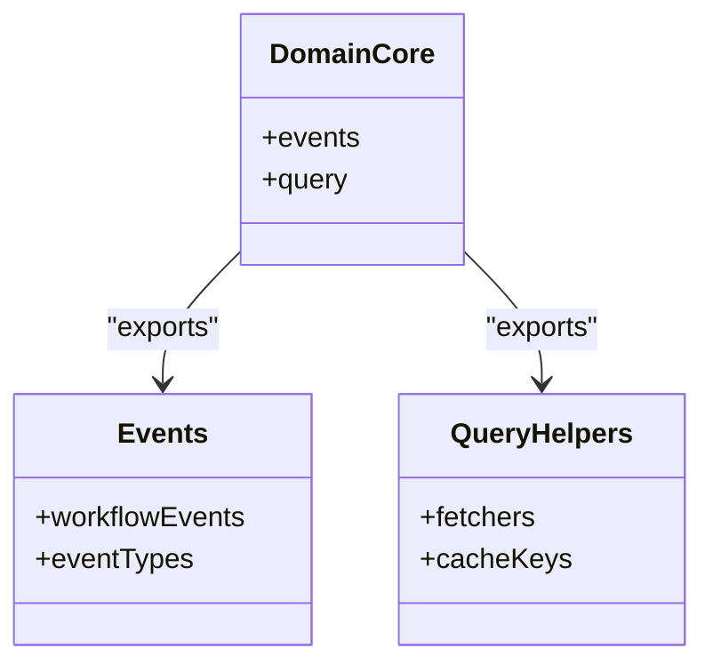
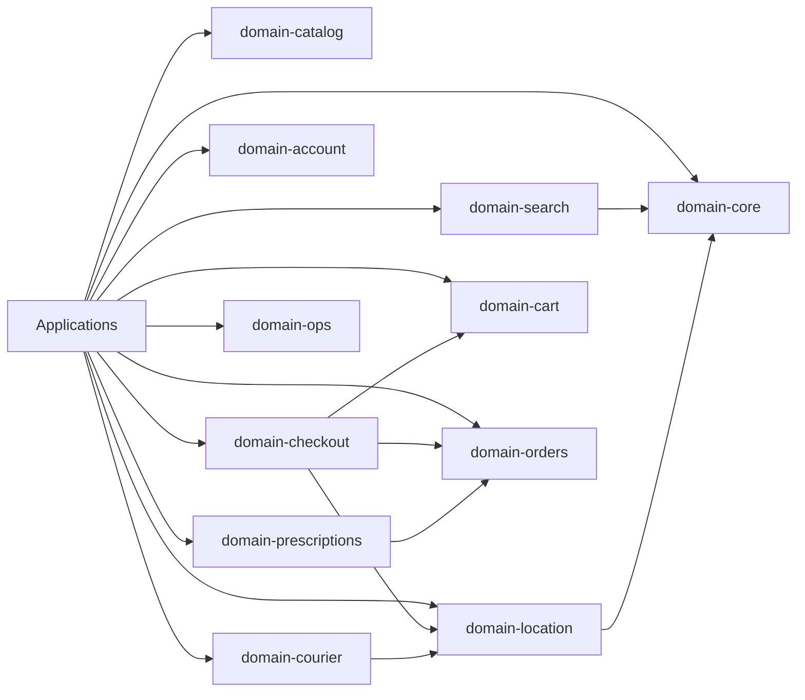
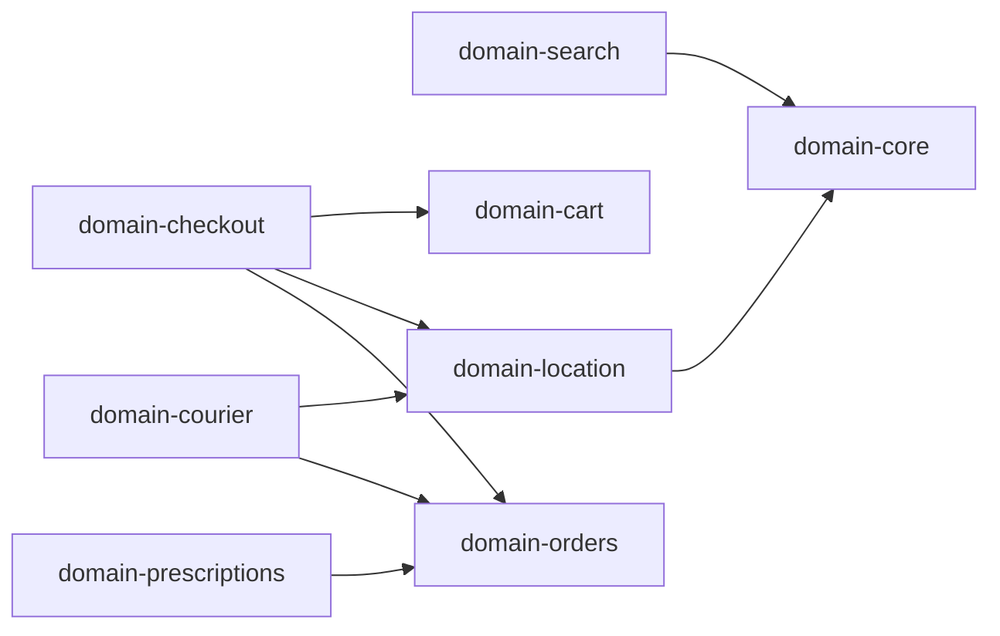

# Domain Packages

<cite>
**Referenced Files in This Document**
- [README.md](file://README.md)
- [domain-core/src/index.ts](file://packages/domain-core/src/index.ts)
- [domain-core/src/events.ts](file://packages/domain-core/src/events.ts)
- [domain-core/src/query.ts](file://packages/domain-core/src/query.ts)
- [domain-orders/src/index.ts](file://packages/domain-orders/src/index.ts)
- [domain-catalog/src/index.ts](file://packages/domain-catalog/src/index.ts)
- [domain-cart/src/index.ts](file://packages/domain-cart/src/index.ts)
- [domain-checkout/src/index.ts](file://packages/domain-checkout/src/index.ts)
- [domain-account/src/index.ts](file://packages/domain-account/src/index.ts)
- [domain-prescriptions/src/index.ts](file://packages/domain-prescriptions/src/index.ts)
- [domain-location/src/index.ts](file://packages/domain-location/src/index.ts)
- [domain-search/src/index.ts](file://packages/domain-search/src/index.ts)
- [domain-courier/src/index.ts](file://packages/domain-courier/src/index.ts)
- [domain-ops/src/index.ts](file://packages/domain-ops/src/index.ts)
</cite>

## Table of Contents
1. Introduction
2. Project Structure
3. Core Components
4. Architecture Overview
5. Detailed Component Analysis
6. Dependency Analysis
7. Performance Considerations
8. Troubleshooting Guide
9. Conclusion
10. Appendices

## Introduction
This document provides comprehensive documentation for the domain packages that encapsulate business logic and core functionality across the United Pharmacy ecosystem. The domain layer is organized into focused packages, each owning a bounded context such as orders, catalog, cart, checkout, account, prescriptions, location, search, courier, and operations. These packages expose stable interfaces to applications (web, mobile, admin, API) while centralizing shared rules in domain-core.

The repository uses an npm workspaces monorepo layout where:
- Shared backend access is centralized behind packages/api-client.
- Shared workflow events and query conventions live in packages/domain-core.
- Search state is centralized in packages/domain-search with Zustand + TanStack Query.
- Geo-aware assignment and checkout quote logic live in packages/domain-location.
- Medical-first product helpers live in packages/domain-catalog.

These principles guide how domain packages are structured, consumed, and extended.

**Section sources**
- [README.md:1-24](file://README.md#L1-L24)

## Project Structure
At a high level, the domain packages reside under packages/domain-* and are consumed by apps and services. Each package typically exposes a small, cohesive surface via its index file. The following diagram shows the logical placement of domain packages relative to the rest of the monorepo.

```mermaid
graph TB
subgraph "Apps"
WEB["shopper-web"]
ADMIN["admin"]
MOBILE["customer-mobile / cashier-mobile / courier-mobile"]
OPS["ops-dashboard"]
end
subgraph "Shared Layers"
API_CLIENT["api-client"]
TYPES["types"]
UI_WEB["ui-web"]
UI_NATIVE["ui-native"]
end
subgraph "Domain Layer"
CORE["domain-core"]
ORDERS["domain-orders"]
CATALOG["domain-catalog"]
CART["domain-cart"]
CHECKOUT["domain-checkout"]
ACCOUNT["domain-account"]
PRESCRIPTIONS["domain-prescriptions"]
LOCATION["domain-location"]
SEARCH["domain-search"]
COURIER["domain-courier"]
OPS_DOMAIN["domain-ops"]
end
WEB --> API_CLIENT
ADMIN --> API_CLIENT
MOBILE --> API_CLIENT
OPS --> API_CLIENT
WEB --> CORE
WEB --> SEARCH
WEB --> LOCATION
WEB --> CATALOG
WEB --> CART
WEB --> CHECKOUT
WEB --> ORDERS
WEB --> ACCOUNT
WEB --> PRESCRIPTIONS
WEB --> COURIER
WEB --> OPS_DOMAIN
ADMIN --> CORE
ADMIN --> ORDERS
ADMIN --> CATALOG
ADMIN --> OPS_DOMAIN
MOBILE --> CORE
MOBILE --> SEARCH
MOBILE --> LOCATION
MOBILE --> CART
MOBILE --> CHECKOUT
MOBILE --> ORDERS
MOBILE --> ACCOUNT
MOBILE --> PRESCRIPTIONS
MOBILE --> COURIER
```

**Diagram sources**
- [README.md:6-24](file://README.md#L6-L24)

**Section sources**
- [README.md:6-24](file://README.md#L6-L24)

## Core Components
The core domain package defines shared workflow events and query conventions used across other domains. It acts as the foundation for consistent event-driven communication and data fetching patterns.

Key responsibilities:
- Centralized event definitions for cross-domain workflows.
- Standardized query helpers and conventions for consistent data access.
- Reusable primitives for domain interactions.

**Diagram sources**
- [domain-core/src/index.ts](file://packages/domain-core/src/index.ts)
- [domain-core/src/events.ts](file://packages/domain-core/src/events.ts)
- [domain-core/src/query.ts](file://packages/domain-core/src/query.ts)

**Section sources**
- [domain-core/src/index.ts](file://packages/domain-core/src/index.ts)
- [domain-core/src/events.ts](file://packages/domain-core/src/events.ts)
- [domain-core/src/query.ts](file://packages/domain-core/src/query.ts)

## Architecture Overview
The domain layer follows Domain-Driven Design principles:
- Bounded contexts per package (orders, catalog, cart, checkout, account, prescriptions, location, search, courier, ops).
- Clear separation between domain logic and application/UI layers.
- Stable interfaces exposed from each domain package for reuse across apps.
- Shared infrastructure in domain-core for events and queries.

[No sources needed since this diagram shows conceptual architecture, not specific code structure]

## Detailed Component Analysis

### domain-core
Purpose:
- Provides shared workflow events and query conventions used throughout the ecosystem.
- Ensures consistent event naming and data-fetching patterns across domains.

Interfaces and exports:
- Event types and constants for cross-domain communication.
- Query helpers and cache key strategies.

Usage example:
- Import events and query helpers to standardize domain interactions in apps or other domains.

Extension points:
- Add new workflow events to align with existing patterns.
- Extend query helpers with new caching or retry strategies.

**Section sources**
- [domain-core/src/index.ts](file://packages/domain-core/src/index.ts)
- [domain-core/src/events.ts](file://packages/domain-core/src/events.ts)
- [domain-core/src/query.ts](file://packages/domain-core/src/query.ts)

### domain-orders
Purpose:
- Encapsulates order lifecycle management, including creation, status transitions, and fulfillment coordination.

Entity relationships:
- Orders relate to customers, items (from catalog), delivery assignments (courier), and payments (via checkout).

Business rules:
- Validate order state transitions.
- Enforce branch/zone constraints during assignment.

Interfaces exposed:
- Order creation and mutation methods.
- Status querying and timeline retrieval.

Integration pattern:
- Consume domain-core events for order lifecycle updates.
- Use domain-location for zone-based assignment and pricing.

**Section sources**
- [domain-orders/src/index.ts](file://packages/domain-orders/src/index.ts)

### domain-catalog
Purpose:
- Manages products and categories with medical-first helpers tailored for pharmacy use cases.

Entity relationships:
- Products belong to categories; may include variants, pricing, and inventory references.

Business rules:
- Product availability checks.
- Category-based filtering and recommendations.

Interfaces exposed:
- Product and category retrieval APIs.
- Helpers for medical-specific attributes and filters.

Integration pattern:
- Used by cart and checkout to validate items and compute totals.

**Section sources**
- [domain-catalog/src/index.ts](file://packages/domain-catalog/src/index.ts)

### domain-cart
Purpose:
- Handles shopping cart operations such as adding/removing items, applying promotions, and computing line-item totals.

Entity relationships:
- Cart items reference catalog products and optional prescription associations.

Business rules:
- Item eligibility validation.
- Promotion application and discount calculations.

Interfaces exposed:
- Cart mutation methods (add, remove, update quantities).
- Cart summary and totals computation.

Integration pattern:
- Consumes domain-catalog for item details and domain-checkout for finalization.

**Section sources**
- [domain-cart/src/index.ts](file://packages/domain-cart/src/index.ts)

### domain-checkout
Purpose:
- Orchestrates the checkout workflow, including quoting, payment preparation, and order handoff.

Entity relationships:
- Checkout depends on cart contents, location-based quotes, and order creation.

Business rules:
- Quote calculation using location and cart data.
- Validation of shipping addresses and delivery windows.

Interfaces exposed:
- Quote computation and checkout initiation.
- Order submission and confirmation handling.

Integration pattern:
- Uses domain-location for distance and zone logic.
- Triggers domain-orders to create finalized orders.

**Section sources**
- [domain-checkout/src/index.ts](file://packages/domain-checkout/src/index.ts)

### domain-account
Purpose:
- Manages user accounts, profiles, roles, and permissions relevant to pharmacy workflows.

Entity relationships:
- Accounts link to customers, staff, drivers, and pharmacists depending on role.

Business rules:
- Role-based access control for sensitive operations.
- Profile validation and update policies.

Interfaces exposed:
- Account creation, profile updates, and role checks.

Integration pattern:
- Used by all apps to enforce permissions and personalize experiences.

**Section sources**
- [domain-account/src/index.ts](file://packages/domain-account/src/index.ts)

### domain-prescriptions
Purpose:
- Handles prescription processing, including submission, review, and approval workflows.

Entity relationships:
- Prescriptions associate with customers and can influence order composition.

Business rules:
- Prescription validity checks and pharmacist review steps.
- Compliance and audit logging.

Interfaces exposed:
- Submission endpoints and status tracking.
- Review actions and approvals.

Integration pattern:
- Integrates with domain-orders to include prescribed items in orders.

**Section sources**
- [domain-prescriptions/src/index.ts](file://packages/domain-prescriptions/src/index.ts)

### domain-location
Purpose:
- Provides geographic calculations, distance computations, and zone-based logic for delivery and quoting.

Entity relationships:
- Locations relate to branches, zones, and customer addresses.

Business rules:
- Distance-based delivery fees and time estimates.
- Zone eligibility checks for service areas.

Interfaces exposed:
- Distance calculation and zone determination.
- Location-based quoting helpers.

Integration pattern:
- Used by checkout for quotes and by courier for assignment optimization.

**Section sources**
- [domain-location/src/index.ts](file://packages/domain-location/src/index.ts)

### domain-search
Purpose:
- Centralizes search state and indexing strategies using Zustand and TanStack Query.

Entity relationships:
- Search results reference catalog entities and may incorporate filters from location and account context.

Business rules:
- Query normalization and result ranking.
- Cache invalidation and synchronization.

Interfaces exposed:
- Search hooks and store utilities.
- Indexing and reindexing triggers.

Integration pattern:
- Consumed by shopper web and mobile for product discovery.

**Section sources**
- [domain-search/src/index.ts](file://packages/domain-search/src/index.ts)

### domain-courier
Purpose:
- Manages delivery logistics, including driver assignment, route considerations, and delivery status updates.

Entity relationships:
- Couriers assigned to orders based on location and availability.

Business rules:
- Assignment algorithms considering distance and workload.
- Delivery status transitions and notifications.

Interfaces exposed:
- Assignment and dispatch methods.
- Delivery tracking and status reporting.

Integration pattern:
- Uses domain-location for distance and zone logic; integrates with domain-orders for fulfillment.

**Section sources**
- [domain-courier/src/index.ts](file://packages/domain-courier/src/index.ts)

### domain-ops
Purpose:
- Encapsulates operational workflows for administration and platform management tasks.

Entity relationships:
- Operations interact with orders, catalog, accounts, and system metrics.

Business rules:
- Audit logging and compliance checks.
- Batch operations and maintenance tasks.

Interfaces exposed:
- Operational commands and reporting utilities.

Integration pattern:
- Used by admin dashboard and internal tools to manage platform health and data integrity.

**Section sources**
- [domain-ops/src/index.ts](file://packages/domain-ops/src/index.ts)

## Dependency Analysis
The domain packages have clear dependency boundaries:
- domain-core is foundational and has no intra-domain dependencies.
- domain-search and domain-location depend on domain-core for shared conventions.
- domain-checkout depends on domain-cart, domain-location, and domain-orders.
- domain-courier depends on domain-location and domain-orders.
- domain-prescriptions integrates with domain-orders.

**Diagram sources**
- [domain-core/src/index.ts](file://packages/domain-core/src/index.ts)
- [domain-search/src/index.ts](file://packages/domain-search/src/index.ts)
- [domain-location/src/index.ts](file://packages/domain-location/src/index.ts)
- [domain-cart/src/index.ts](file://packages/domain-cart/src/index.ts)
- [domain-checkout/src/index.ts](file://packages/domain-checkout/src/index.ts)
- [domain-orders/src/index.ts](file://packages/domain-orders/src/index.ts)
- [domain-prescriptions/src/index.ts](file://packages/domain-prescriptions/src/index.ts)
- [domain-courier/src/index.ts](file://packages/domain-courier/src/index.ts)

**Section sources**
- [domain-core/src/index.ts](file://packages/domain-core/src/index.ts)
- [domain-search/src/index.ts](file://packages/domain-search/src/index.ts)
- [domain-location/src/index.ts](file://packages/domain-location/src/index.ts)
- [domain-cart/src/index.ts](file://packages/domain-cart/src/index.ts)
- [domain-checkout/src/index.ts](file://packages/domain-checkout/src/index.ts)
- [domain-orders/src/index.ts](file://packages/domain-orders/src/index.ts)
- [domain-prescriptions/src/index.ts](file://packages/domain-prescriptions/src/index.ts)
- [domain-courier/src/index.ts](file://packages/domain-courier/src/index.ts)

## Performance Considerations
- Prefer memoization and caching in domain-search to reduce redundant queries.
- Use domain-location’s distance computations judiciously; batch requests when possible.
- Keep domain-checkout operations idempotent to avoid duplicate order creation.
- Leverage domain-core’s query helpers for consistent cache keys and invalidation strategies.
- Avoid heavy synchronous work in UI threads; offload to workers or background tasks where applicable.

[No sources needed since this section provides general guidance]

## Troubleshooting Guide
Common issues and resolutions:
- Event mismatches: Ensure event names and payloads conform to domain-core definitions.
- Stale search results: Verify cache key consistency and trigger reindexing when catalog changes.
- Incorrect quotes: Validate location inputs and zone mappings before checkout.
- Assignment failures: Check courier availability and distance thresholds in domain-courier.
- Prescription errors: Confirm prescription validity and required fields before submission.

[No sources needed since this section provides general guidance]

## Conclusion
The domain packages provide a robust, modular foundation for the United Pharmacy ecosystem. By adhering to domain-driven design principles and leveraging shared infrastructure in domain-core, applications can maintain clear boundaries, consistent behavior, and extensibility. Each package exposes focused interfaces that enable integration across web, mobile, and admin platforms while supporting custom business logic through well-defined extension points.

[No sources needed since this section summarizes without analyzing specific files]

## Appendices

### Integration Patterns and Usage Examples
- Using domain-core events:
  - Import event types and emit standardized workflow events to coordinate cross-domain actions.
- Using domain-search:
  - Subscribe to search state and leverage hooks to fetch and display results efficiently.
- Using domain-location:
  - Compute distances and determine zones to inform delivery options and pricing.
- Using domain-checkout:
  - Prepare quotes and finalize orders by composing cart and location data.
- Using domain-courier:
  - Assign drivers based on proximity and workload, then track delivery progress.

[No sources needed since this section provides general guidance]