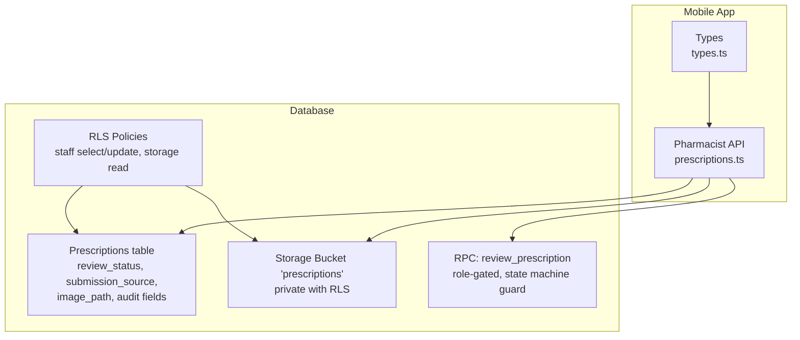
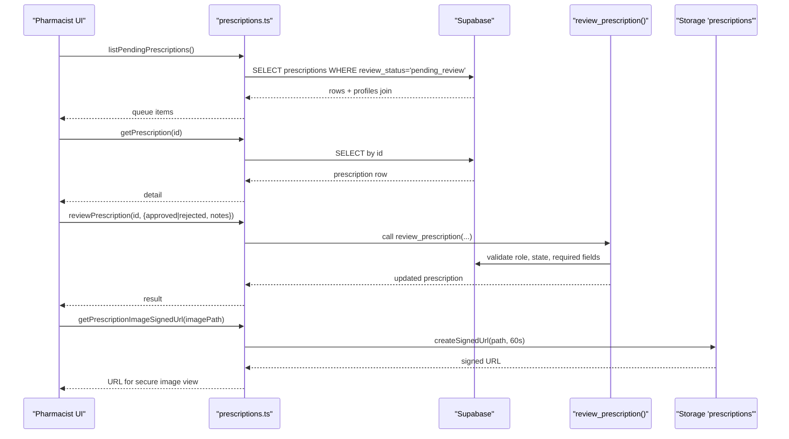
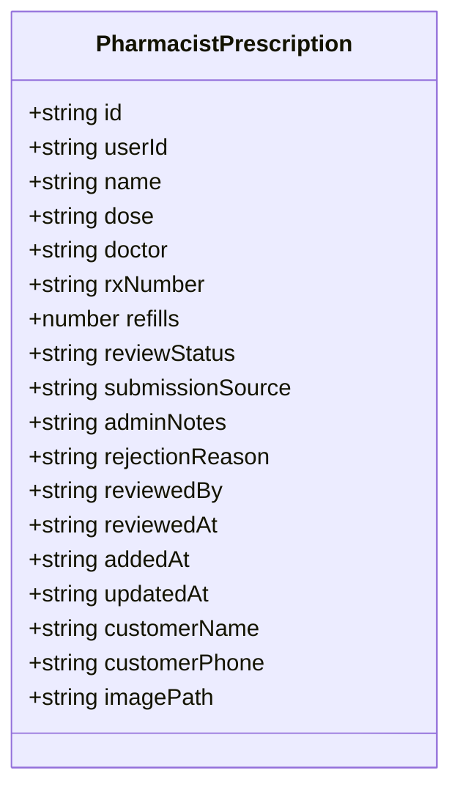
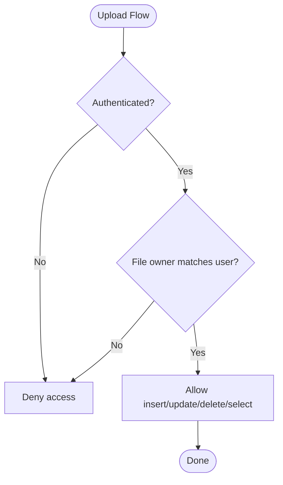
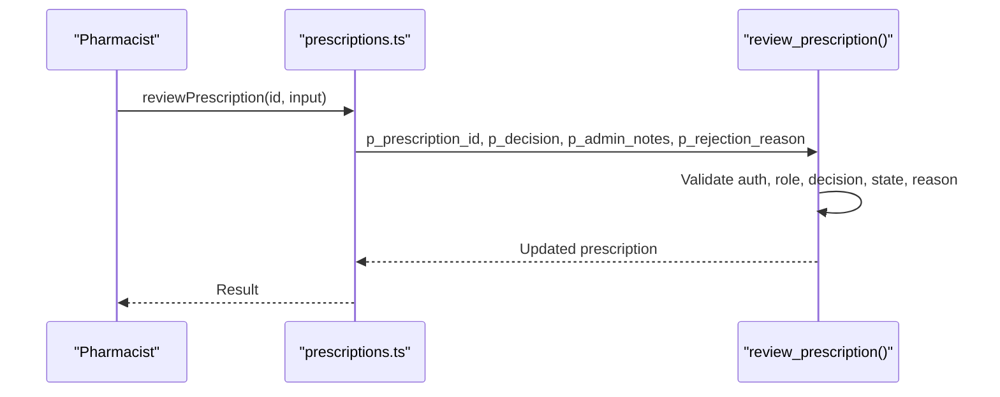
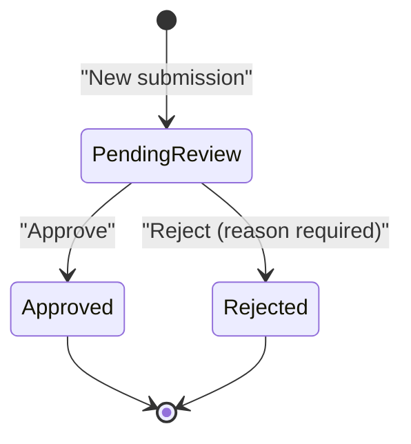
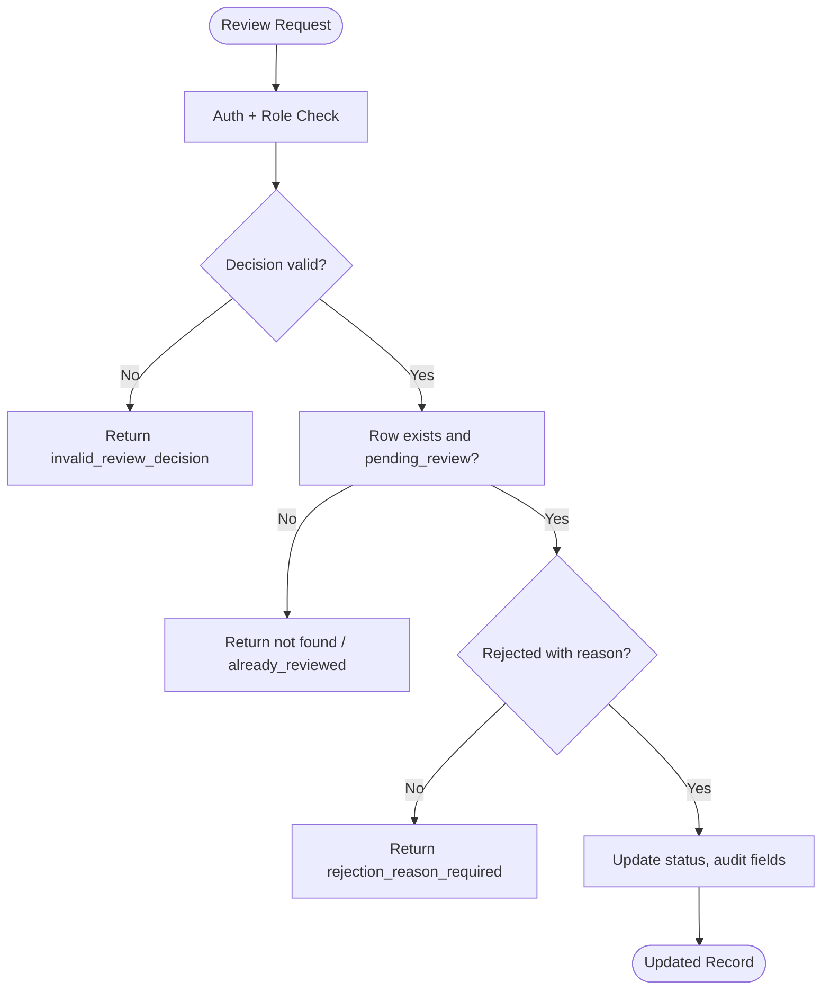
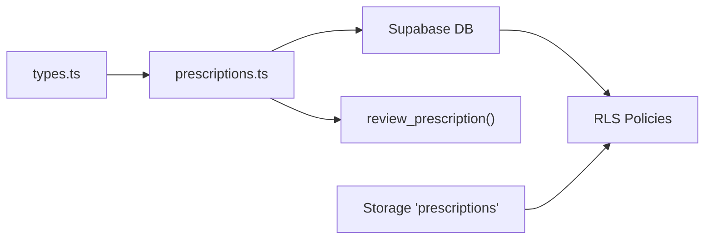

# Domain Prescriptions

<cite>
**Referenced Files in This Document**
- [package.json](file://packages/domain-prescriptions/package.json)
- [prescriptions.ts](file://apps/shopper-native/src/features/pharmacist/api/prescriptions.ts)
- [types.ts](file://apps/shopper-native/src/features/pharmacist/api/types.ts)
- [20260705120000_prescriptions_admin_review.sql](file://supabase/migrations/20260705120000_prescriptions_admin_review.sql)
- [20260809120000_prescription_review_rpc.sql](file://supabase/migrations/20260809120000_prescription_review_rpc.sql)
- [20260817100000_prescription_image_upload.sql](file://supabase/migrations/20260817100000_prescription_image_upload.sql)
</cite>

## Table of Contents
1. [Introduction](#introduction)
2. [Project Structure](#project-structure)
3. [Core Components](#core-components)
4. [Architecture Overview](#architecture-overview)
5. [Detailed Component Analysis](#detailed-component-analysis)
6. [Dependency Analysis](#dependency-analysis)
7. [Performance Considerations](#performance-considerations)
8. [Troubleshooting Guide](#troubleshooting-guide)
9. [Conclusion](#conclusion)
10. [Appendices](#appendices)

## Introduction
This document describes the domain-prescriptions functionality that manages prescription processing and pharmaceutical workflows across customer submission, pharmacist review, and approval/rejection handling. It covers the entity model, upload handling for prescription images, the pharmacist review process, and the secure backend RPC used to enforce regulatory compliance and safety checks during review.

## Project Structure
The domain-prescriptions capability is implemented primarily in the mobile application’s pharmacist feature and enforced by database migrations and Row Level Security (RLS). The package metadata indicates a dedicated domain module, while the runtime logic resides in the native app under the pharmacist feature API layer.

**Diagram sources**
- [prescriptions.ts:1-175](file://apps/shopper-native/src/features/pharmacist/api/prescriptions.ts#L1-L175)
- [types.ts:80-111](file://apps/shopper-native/src/features/pharmacist/api/types.ts#L80-L111)
- [20260705120000_prescriptions_admin_review.sql:18-75](file://supabase/migrations/20260705120000_prescriptions_admin_review.sql#L18-L75)
- [20260809120000_prescription_review_rpc.sql:1-59](file://supabase/migrations/20260809120000_prescription_review_rpc.sql#L1-L59)
- [20260817100000_prescription_image_upload.sql:9-77](file://supabase/migrations/20260817100000_prescription_image_upload.sql#L9-L77)

**Section sources**
- [package.json:1-7](file://packages/domain-prescriptions/package.json#L1-L7)
- [prescriptions.ts:1-175](file://apps/shopper-native/src/features/pharmacist/api/prescriptions.ts#L1-L175)
- [types.ts:80-111](file://apps/shopper-native/src/features/pharmacist/api/types.ts#L80-L111)
- [20260705120000_prescriptions_admin_review.sql:18-75](file://supabase/migrations/20260705120000_prescriptions_admin_review.sql#L18-L75)
- [20260809120000_prescription_review_rpc.sql:1-59](file://supabase/migrations/20260809120000_prescription_review_rpc.sql#L1-L59)
- [20260817100000_prescription_image_upload.sql:9-77](file://supabase/migrations/20260817100000_prescription_image_upload.sql#L9-L77)

## Core Components
- Prescription entity model:
  - Fields include identifiers, drug name, dose, prescriber, Rx number, refills, review status, submission source, audit fields (reviewed_by, reviewed_at), timestamps, and optional image path.
  - Denormalized customer details are joined from profiles for display.
- Pharmacist API:
  - List pending prescriptions (oldest first).
  - List all prescriptions with filtering and pagination.
  - Fetch single prescription detail.
  - Review prescription via a role-gated RPC.
  - Count pending prescriptions for dashboard metrics.
  - Generate short-lived signed URLs for viewing prescription images securely.
- Types:
  - Enumerations for review status and submission source.
  - Interfaces for prescription items and review inputs.

**Section sources**
- [types.ts:80-111](file://apps/shopper-native/src/features/pharmacist/api/types.ts#L80-L111)
- [prescriptions.ts:24-77](file://apps/shopper-native/src/features/pharmacist/api/prescriptions.ts#L24-L77)
- [prescriptions.ts:80-175](file://apps/shopper-native/src/features/pharmacist/api/prescriptions.ts#L80-L175)

## Architecture Overview
The workflow enforces strict separation between customer-facing submissions and staff-side review. Data access is governed by RLS policies ensuring only authorized roles can view or update prescription records. The review action is centralized in a server-side function to guarantee state transitions and validation rules.

**Diagram sources**
- [prescriptions.ts:80-175](file://apps/shopper-native/src/features/pharmacist/api/prescriptions.ts#L80-L175)
- [20260809120000_prescription_review_rpc.sql:1-59](file://supabase/migrations/20260809120000_prescription_review_rpc.sql#L1-L59)
- [20260817100000_prescription_image_upload.sql:16-77](file://supabase/migrations/20260817100000_prescription_image_upload.sql#L16-L77)

## Detailed Component Analysis

### Prescription Entity Model
- Core fields:
  - Identification and linkage: id, user_id
  - Clinical info: name, dose, doctor, rx_number, refills
  - Workflow: review_status, submission_source, admin_notes, rejection_reason, reviewed_by, reviewed_at
  - Timestamps: added_at, updated_at
  - Attachment: image_path (optional)
  - Customer context: customerName, customerPhone (from profiles join)
- Validation constraints:
  - review_status restricted to pending_review, approved, rejected
  - submission_source restricted to manual, whatsapp, scan
  - Role-based access enforced via RLS for staff operations

**Diagram sources**
- [types.ts:80-111](file://apps/shopper-native/src/features/pharmacist/api/types.ts#L80-L111)
- [prescriptions.ts:24-77](file://apps/shopper-native/src/features/pharmacist/api/prescriptions.ts#L24-L77)

**Section sources**
- [types.ts:80-111](file://apps/shopper-native/src/features/pharmacist/api/types.ts#L80-L111)
- [20260705120000_prescriptions_admin_review.sql:18-41](file://supabase/migrations/20260705120000_prescriptions_admin_review.sql#L18-L41)
- [20260817100000_prescription_image_upload.sql:9-14](file://supabase/migrations/20260817100000_prescription_image_upload.sql#L9-L14)

### Upload Handling (Prescription Images)
- Storage bucket:
  - Private bucket named “prescriptions” created and secured.
- Access control:
  - Customers can upload, update, read, and delete their own files only.
  - Staff (admin/manager/pharmacist) can read all files for review.
- Secure preview:
  - Short-lived signed URLs generated for pharmacists to view documents safely.

**Diagram sources**
- [20260817100000_prescription_image_upload.sql:21-77](file://supabase/migrations/20260817100000_prescription_image_upload.sql#L21-L77)

**Section sources**
- [20260817100000_prescription_image_upload.sql:9-77](file://supabase/migrations/20260817100000_prescription_image_upload.sql#L9-L77)
- [prescriptions.ts:161-175](file://apps/shopper-native/src/features/pharmacist/api/prescriptions.ts#L161-L175)

### Pharmacist Review Process
- Queue management:
  - Pending reviews listed oldest-first; full list supports filtering by status and pagination.
- Single detail retrieval:
  - Fetches complete prescription record including denormalized customer info.
- Review mutation:
  - Centralized RPC enforces:
    - Authentication and role check (admin/manager/pharmacist)
    - Valid decision values (approved/rejected)
    - State guard (only pending_review can be reviewed)
    - Rejection requires a reason
  - Updates audit fields and returns the revised record.

**Diagram sources**
- [prescriptions.ts:131-148](file://apps/shopper-native/src/features/pharmacist/api/prescriptions.ts#L131-L148)
- [20260809120000_prescription_review_rpc.sql:1-59](file://supabase/migrations/20260809120000_prescription_review_rpc.sql#L1-L59)

**Section sources**
- [prescriptions.ts:80-148](file://apps/shopper-native/src/features/pharmacist/api/prescriptions.ts#L80-L148)
- [20260809120000_prescription_review_rpc.sql:1-59](file://supabase/migrations/20260809120000_prescription_review_rpc.sql#L1-L59)

### Approval Workflows and Regulatory Compliance
- Status transitions:
  - New submissions enter pending_review.
  - Approved: moves out of review queue; may proceed to fulfillment.
  - Rejected: requires documented reason; stays visible for audit.
- Auditability:
  - reviewed_by and reviewed_at capture who and when.
  - Admin notes support contextual decisions.
- Access control:
  - RLS policies restrict staff-only visibility and updates.
  - Storage policies ensure only owners can manage their uploads; staff can read for review.

**Diagram sources**
- [20260705120000_prescriptions_admin_review.sql:18-41](file://supabase/migrations/20260705120000_prescriptions_admin_review.sql#L18-L41)
- [20260809120000_prescription_review_rpc.sql:17-54](file://supabase/migrations/20260809120000_prescription_review_rpc.sql#L17-L54)

**Section sources**
- [20260705120000_prescriptions_admin_review.sql:18-75](file://supabase/migrations/20260705120000_prescriptions_admin_review.sql#L18-L75)
- [20260809120000_prescription_review_rpc.sql:1-59](file://supabase/migrations/20260809120000_prescription_review_rpc.sql#L1-L59)

### Patient Safety Checks and Validation Rules
- Server-side validations enforced by the review RPC:
  - Requires authentication and appropriate role.
  - Restricts decision to approved or rejected.
  - Ensures only pending_review prescriptions can be reviewed.
  - Enforces non-empty rejection reason when rejecting.
- Data integrity:
  - Enumerated columns constrain statuses and sources.
  - Indexes optimize queue queries and listing performance.

**Diagram sources**
- [20260809120000_prescription_review_rpc.sql:17-54](file://supabase/migrations/20260809120000_prescription_review_rpc.sql#L17-L54)

**Section sources**
- [20260809120000_prescription_review_rpc.sql:1-59](file://supabase/migrations/20260809120000_prescription_review_rpc.sql#L1-L59)
- [20260705120000_prescriptions_admin_review.sql:18-41](file://supabase/migrations/20260705120000_prescriptions_admin_review.sql#L18-L41)

### Integration with Pharmacy Systems and Healthcare Regulations
- Role-based access:
  - Only admin/manager/pharmacist can view or update prescription records.
- Secure document handling:
  - Private storage bucket with per-user upload/read/write/delete policies.
  - Signed URLs for temporary, secure access to sensitive documents.
- Audit trail:
  - Review actions recorded with reviewer identity and timestamp.
  - Notes and reasons retained for compliance and traceability.

**Section sources**
- [20260705120000_prescriptions_admin_review.sql:57-75](file://supabase/migrations/20260705120000_prescriptions_admin_review.sql#L57-L75)
- [20260817100000_prescription_image_upload.sql:21-77](file://supabase/migrations/20260817100000_prescription_image_upload.sql#L21-L77)
- [20260809120000_prescription_review_rpc.sql:17-54](file://supabase/migrations/20260809120000_prescription_review_rpc.sql#L17-L54)

## Dependency Analysis
- Frontend dependency:
  - Pharmacist API module depends on Supabase client and types.
- Backend dependency:
  - Database schema defines constraints and indexes.
  - RLS policies gate access at table and storage levels.
  - RPC centralizes business rules and state transitions.

**Diagram sources**
- [types.ts:80-111](file://apps/shopper-native/src/features/pharmacist/api/types.ts#L80-L111)
- [prescriptions.ts:80-175](file://apps/shopper-native/src/features/pharmacist/api/prescriptions.ts#L80-L175)
- [20260705120000_prescriptions_admin_review.sql:57-75](file://supabase/migrations/20260705120000_prescriptions_admin_review.sql#L57-L75)
- [20260817100000_prescription_image_upload.sql:21-77](file://supabase/migrations/20260817100000_prescription_image_upload.sql#L21-L77)
- [20260809120000_prescription_review_rpc.sql:1-59](file://supabase/migrations/20260809120000_prescription_review_rpc.sql#L1-L59)

**Section sources**
- [prescriptions.ts:80-175](file://apps/shopper-native/src/features/pharmacist/api/prescriptions.ts#L80-L175)
- [20260705120000_prescriptions_admin_review.sql:57-75](file://supabase/migrations/20260705120000_prescriptions_admin_review.sql#L57-L75)
- [20260817100000_prescription_image_upload.sql:21-77](file://supabase/migrations/20260817100000_prescription_image_upload.sql#L21-L77)
- [20260809120000_prescription_review_rpc.sql:1-59](file://supabase/migrations/20260809120000_prescription_review_rpc.sql#L1-L59)

## Performance Considerations
- Query optimization:
  - Index on review_status and added_at accelerates queue listing and sorting.
- Pagination:
  - Range queries limit data transfer for large lists.
- Secure previews:
  - Short-lived signed URLs reduce exposure window for sensitive documents.

[No sources needed since this section provides general guidance]

## Troubleshooting Guide
Common issues and resolutions:
- Missing authentication or insufficient privilege:
  - Ensure the user is authenticated and has an admin/manager/pharmacist role before calling review functions.
- Invalid review decision:
  - Use only approved or rejected for review decisions.
- Attempting to review non-pending prescriptions:
  - Only pending_review entries can be reviewed; verify current status before invoking the RPC.
- Rejection without reason:
  - Provide a non-empty rejection reason when rejecting.
- Storage access errors:
  - Confirm file ownership for customers and role permissions for staff when accessing the storage bucket.

**Section sources**
- [20260809120000_prescription_review_rpc.sql:17-54](file://supabase/migrations/20260809120000_prescription_review_rpc.sql#L17-L54)
- [20260817100000_prescription_image_upload.sql:21-77](file://supabase/migrations/20260817100000_prescription_image_upload.sql#L21-L77)

## Conclusion
The domain-prescriptions implementation provides a secure, auditable, and compliant workflow for managing prescription submissions and pharmacist reviews. It leverages role-based access, server-side validation, and private storage to protect sensitive patient information while enabling efficient pharmacy operations.

[No sources needed since this section summarizes without analyzing specific files]

## Appendices

### Example Workflows

- Submitting a prescription:
  - Customer creates a new prescription entry; it enters pending_review.
  - If attaching a document, upload to the private storage bucket under the user’s folder.
  - System records submission source and timestamps.

- Reviewing a prescription:
  - Pharmacist opens the review queue and selects a pending item.
  - Reviews clinical details and attached image via signed URL.
  - Approves or rejects with required reason if rejecting; system updates audit fields.

- Handling rejections:
  - Rejected prescriptions remain visible for audit and follow-up.
  - Reasons are stored for traceability and potential customer communication.

[No sources needed since this section provides conceptual examples]