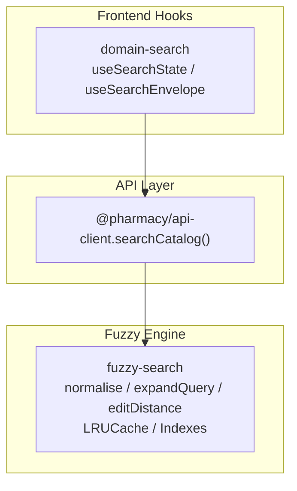
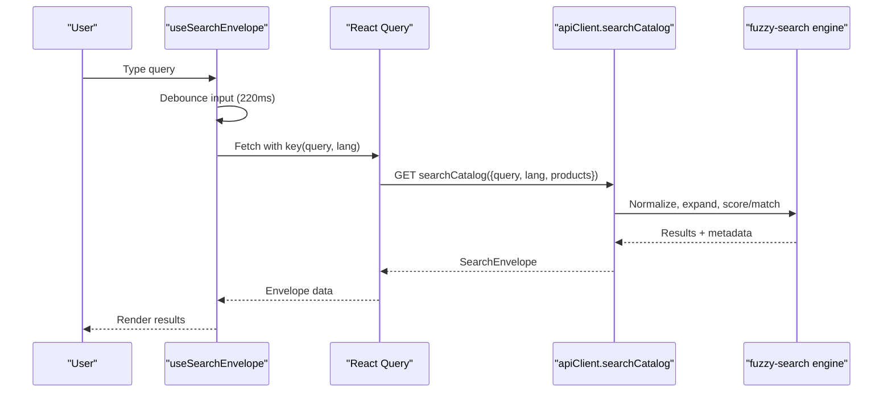
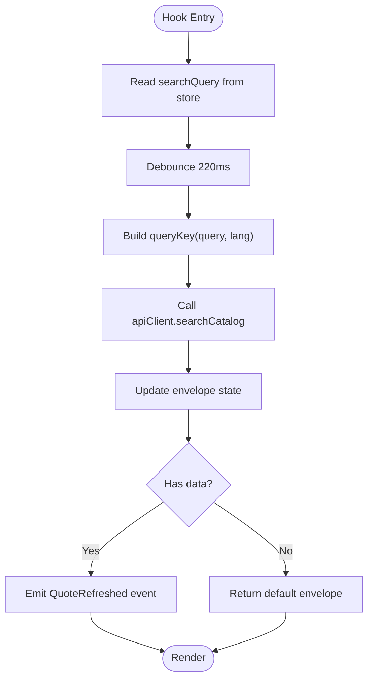
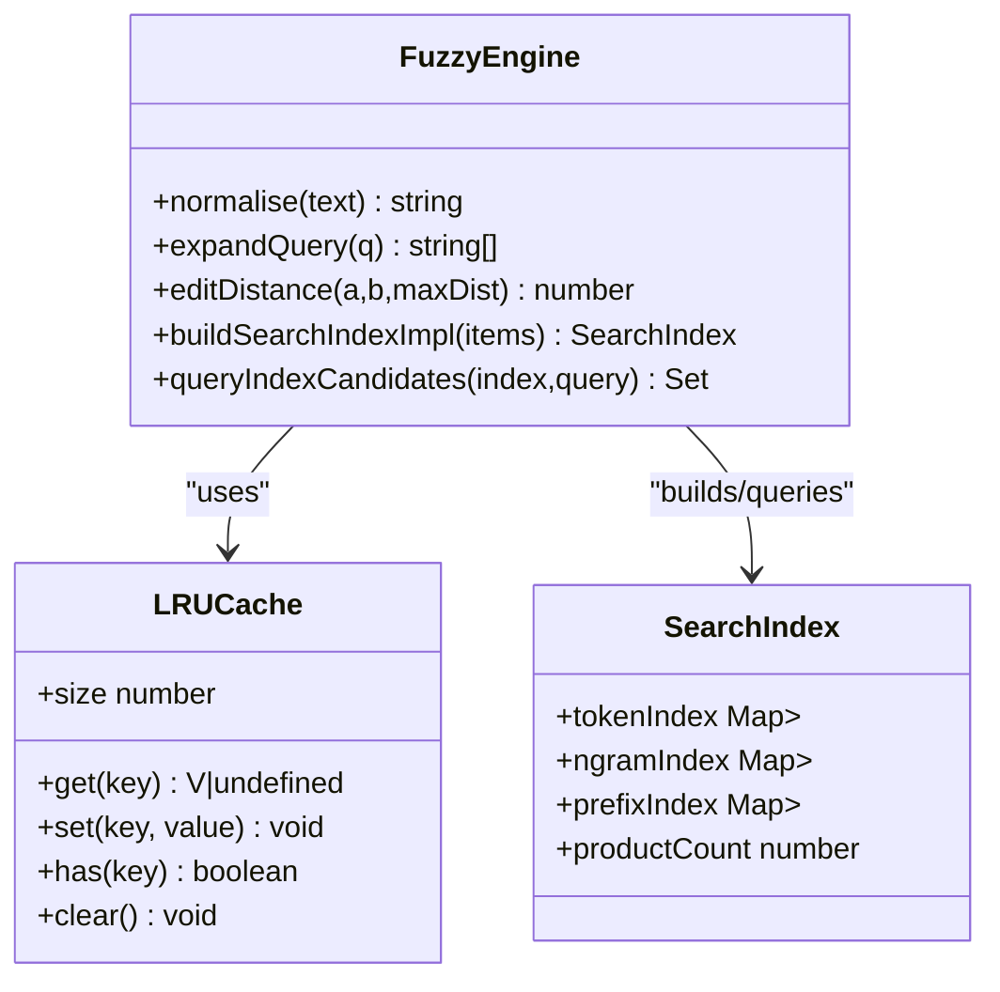
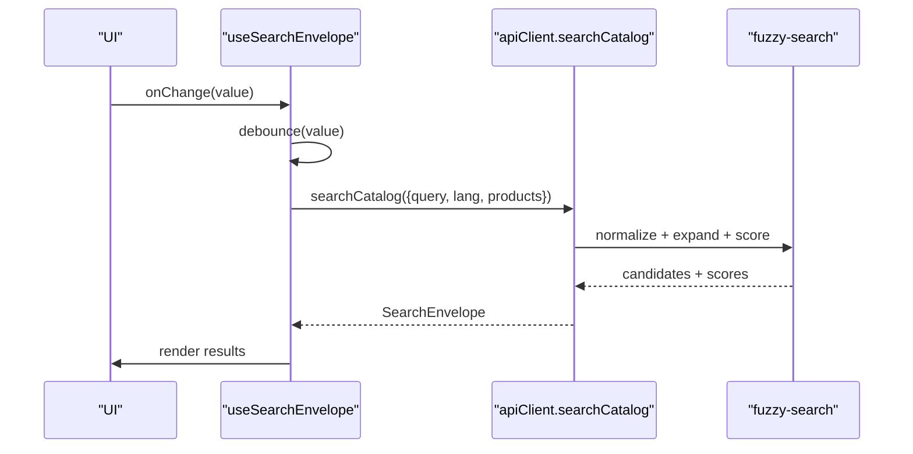
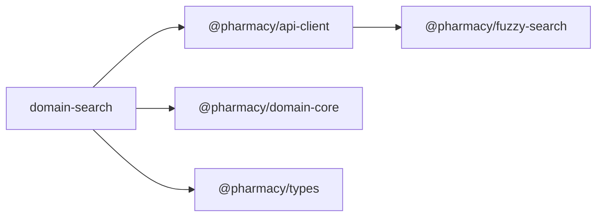

# Domain Search

<cite>
**Referenced Files in This Document**
- [index.ts](file://packages/domain-search/src/index.ts)
- [package.json](file://packages/domain-search/package.json)
- [index.ts](file://packages/fuzzy-search/src/index.ts)
- [package.json](file://packages/fuzzy-search/package.json)
</cite>

## Table of Contents
1. [Introduction](#introduction)
2. [Project Structure](#project-structure)
3. [Core Components](#core-components)
4. [Architecture Overview](#architecture-overview)
5. [Detailed Component Analysis](#detailed-component-analysis)
6. [Dependency Analysis](#dependency-analysis)
7. [Performance Considerations](#performance-considerations)
8. [Troubleshooting Guide](#troubleshooting-guide)
9. [Conclusion](#conclusion)
10. [Appendices](#appendices)

## Introduction
This document explains the domain-search package and its companion fuzzy-search engine used by the United Pharmacy system to deliver fast, bilingual (Arabic/English) search experiences for pharmacy catalogs. It covers query processing, Arabic normalization, fuzzy matching, result ranking concepts, index management, performance optimization, and integration patterns with full-text search engines and caching strategies.

The domain-search package provides React hooks that manage user input, debounce queries, and fetch a search envelope from an API client. The fuzzy-search package implements production-grade Arabic normalization, bidirectional pharmaceutical synonym expansion, Levenshtein-based fuzzy matching, token-level inverted indexing, n-gram prefix lookups, and LRU caching to optimize repeated operations.

## Project Structure
At a high level:
- packages/domain-search: React hooks and state for search UI and envelope fetching.
- packages/fuzzy-search: In-memory search primitives (normalization, dictionary, indexes, caches).

**Diagram sources**
- [index.ts:34-89](file://packages/domain-search/src/index.ts#L34-L89)
- [index.ts:1-90](file://packages/fuzzy-search/src/index.ts#L1-L90)

**Section sources**
- [package.json:1-7](file://packages/domain-search/package.json#L1-L7)
- [package.json:1-12](file://packages/fuzzy-search/package.json#L1-L12)

## Core Components
- Search state and debounced query handling via React hooks in domain-search.
- Search envelope retrieval through an API client method.
- Fuzzy search engine providing normalization, synonym expansion, edit distance, and indexed candidate retrieval.

Key responsibilities:
- Debounce user input to reduce network calls.
- Build stable query keys for caching.
- Normalize text for Arabic and English.
- Expand queries using a bilingual pharmaceutical dictionary.
- Compute fuzzy scores and match decisions.
- Maintain LRU caches at hot paths.

**Section sources**
- [index.ts:9-36](file://packages/domain-search/src/index.ts#L9-L36)
- [index.ts:38-89](file://packages/domain-search/src/index.ts#L38-L89)
- [index.ts:47-69](file://packages/fuzzy-search/src/index.ts#L47-L69)
- [index.ts:117-141](file://packages/fuzzy-search/src/index.ts#L117-L141)
- [index.ts:743-768](file://packages/fuzzy-search/src/index.ts#L743-L768)
- [index.ts:778-800](file://packages/fuzzy-search/src/index.ts#L778-L800)

## Architecture Overview
The search flow integrates UI state, API calls, and fuzzy logic:

**Diagram sources**
- [index.ts:38-89](file://packages/domain-search/src/index.ts#L38-L89)
- [index.ts:117-141](file://packages/fuzzy-search/src/index.ts#L117-L141)
- [index.ts:743-768](file://packages/fuzzy-search/src/index.ts#L743-L768)

## Detailed Component Analysis

### Search State and Envelope Hook (domain-search)
- Maintains current and committed search queries.
- Debounces input to minimize requests.
- Uses React Query with a deterministic key based on query and language.
- Emits a workflow event when results refresh.

**Diagram sources**
- [index.ts:34-89](file://packages/domain-search/src/index.ts#L34-L89)

**Section sources**
- [index.ts:9-36](file://packages/domain-search/src/index.ts#L9-L36)
- [index.ts:38-89](file://packages/domain-search/src/index.ts#L38-L89)

### Fuzzy Search Engine (fuzzy-search)
Capabilities:
- Arabic normalization: removes diacritics, unifies hamza variants, converts taa marbuta and alef maqsura, strips tatweel, normalizes punctuation and whitespace.
- Bidirectional pharmaceutical dictionary: maps Arabic terms to English synonyms and vice versa; expands multi-token queries.
- Edit distance: Levenshtein with early exit and reusable buffers for performance.
- Indexing structures: token index, 3-character n-gram index, short-prefix index for fast candidate retrieval.
- LRU caches: normalization cache and general-purpose LRU cache for hot paths.

**Diagram sources**
- [index.ts:47-69](file://packages/fuzzy-search/src/index.ts#L47-L69)
- [index.ts:92-100](file://packages/fuzzy-search/src/index.ts#L92-L100)
- [index.ts:117-141](file://packages/fuzzy-search/src/index.ts#L117-L141)
- [index.ts:743-768](file://packages/fuzzy-search/src/index.ts#L743-L768)
- [index.ts:778-800](file://packages/fuzzy-search/src/index.ts#L778-L800)

**Section sources**
- [index.ts:117-141](file://packages/fuzzy-search/src/index.ts#L117-L141)
- [index.ts:155-732](file://packages/fuzzy-search/src/index.ts#L155-L732)
- [index.ts:743-768](file://packages/fuzzy-search/src/index.ts#L743-L768)
- [index.ts:778-800](file://packages/fuzzy-search/src/index.ts#L778-L800)

### Query Processing Pipeline
End-to-end steps:
1. User types into the search field.
2. Input is debounced to reduce request frequency.
3. A stable query key is generated using the trimmed query and language code.
4. The API client performs a search catalog call with query, language, and optional product list.
5. The fuzzy engine normalizes text, expands synonyms, and computes matches/scores.
6. Results are returned as a search envelope and emitted as a workflow event.

**Diagram sources**
- [index.ts:38-89](file://packages/domain-search/src/index.ts#L38-L89)
- [index.ts:117-141](file://packages/fuzzy-search/src/index.ts#L117-L141)
- [index.ts:743-768](file://packages/fuzzy-search/src/index.ts#L743-L768)

**Section sources**
- [index.ts:38-89](file://packages/domain-search/src/index.ts#L38-L89)
- [index.ts:117-141](file://packages/fuzzy-search/src/index.ts#L117-L141)
- [index.ts:743-768](file://packages/fuzzy-search/src/index.ts#L743-L768)

## Dependency Analysis
- domain-search depends on:
  - React and React Query for state and caching.
  - Zustand for lightweight local state.
  - @pharmacy/api-client for search endpoint invocation.
  - @pharmacy/domain-core for workflow events and query keys.
  - @pharmacy/types for shared types like LanguageCode, SearchEnvelope, SearchResultItem.
- fuzzy-search is self-contained and exposes pure functions and classes for normalization, dictionary expansion, edit distance, and indexing utilities.

**Diagram sources**
- [index.ts:1-7](file://packages/domain-search/src/index.ts#L1-L7)
- [index.ts:1-90](file://packages/fuzzy-search/src/index.ts#L1-L90)

**Section sources**
- [index.ts:1-7](file://packages/domain-search/src/index.ts#L1-L7)
- [index.ts:1-90](file://packages/fuzzy-search/src/index.ts#L1-L90)

## Performance Considerations
- Debouncing reduces network load and avoids redundant computations during rapid typing.
- Deterministic query keys enable effective React Query caching and deduplication.
- Arabic normalization is cached to avoid repeated regex work on identical inputs.
- Bidirectional dictionary expansion improves recall without scanning entire catalogs.
- Edit distance uses early termination and reusable buffers to minimize allocations.
- Token-level and n-gram indexes allow O(1)/O(k) candidate retrieval instead of linear scans.
- LRU caches limit memory growth while keeping frequently accessed values hot.

[No sources needed since this section provides general guidance]

## Troubleshooting Guide
Common issues and mitigations:
- Stale or incorrect results: ensure the query key includes both the trimmed query and language code so different locales do not collide.
- Excessive network calls: verify debounce delay and confirm that the hook recomputes only when the debounced value changes.
- Poor Arabic matching: confirm that inputs are normalized before comparison and that dictionary expansions are applied to multi-token queries.
- Memory pressure: monitor LRU cache sizes and consider tuning capacities if memory usage grows too large under heavy usage.
- Missing suggestions or facets: validate that the API response envelope contains expected fields and that downstream consumers handle empty arrays gracefully.

**Section sources**
- [index.ts:38-89](file://packages/domain-search/src/index.ts#L38-L89)
- [index.ts:47-69](file://packages/fuzzy-search/src/index.ts#L47-L69)
- [index.ts:117-141](file://packages/fuzzy-search/src/index.ts#L117-L141)

## Conclusion
The domain-search package provides a robust foundation for search in the United Pharmacy system by combining efficient UI state management, reliable caching, and a powerful bilingual fuzzy search engine. Its design emphasizes performance through debouncing, deterministic caching keys, Arabic normalization, synonym expansion, and indexed candidate retrieval. Integrating with full-text search engines can further enhance scalability and relevance, while caching strategies ensure responsive interactions even under load.

[No sources needed since this section summarizes without analyzing specific files]

## Appendices

### Example Queries and Expected Behavior
- Exact match: Searching for a known product name returns direct matches first.
- Typo tolerance: Slight misspellings still return relevant results due to edit distance thresholds.
- Cross-script search: An Arabic term can find English-keyed products via the bidirectional dictionary, and vice versa.
- Category intent: Broad terms like “painkiller” or “antibiotic” retrieve relevant items across multiple brands.

[No sources needed since this section provides conceptual examples]

### Integration with Full-Text Search Engines
- Use the fuzzy engine for pre-filtering and candidate generation, then pass candidates to a full-text search backend for precise scoring and faceting.
- Keep language codes consistent between frontend hooks and backend services to ensure correct tokenization and stemming.
- Cache search envelopes per query+lang combination to reduce backend load.

[No sources needed since this section provides conceptual guidance]

### Caching Strategies
- Frontend: React Query caches envelopes keyed by query and language; debounce prevents thrashing.
- In-memory: LRU caches for normalization and frequent operations reduce CPU overhead.
- Backend: Consider server-side caches for expensive aggregations and result sets.

[No sources needed since this section provides conceptual guidance]