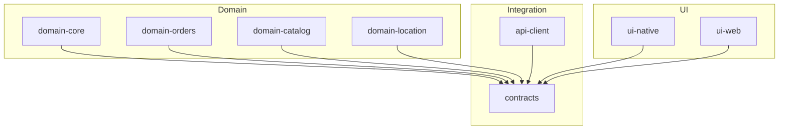
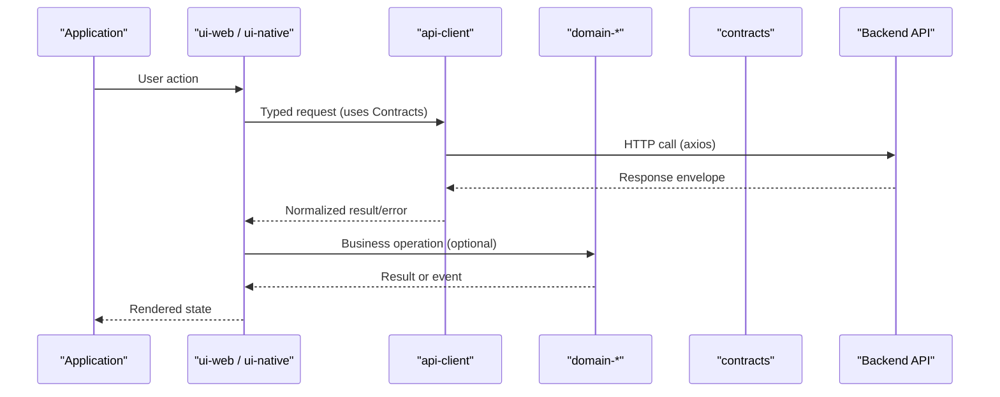
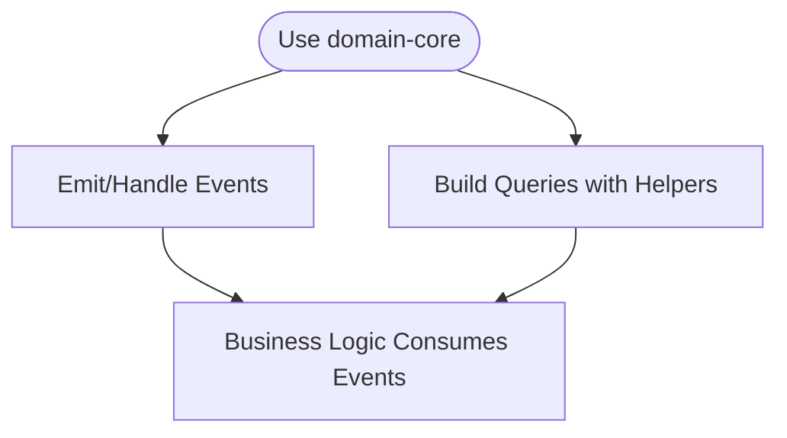
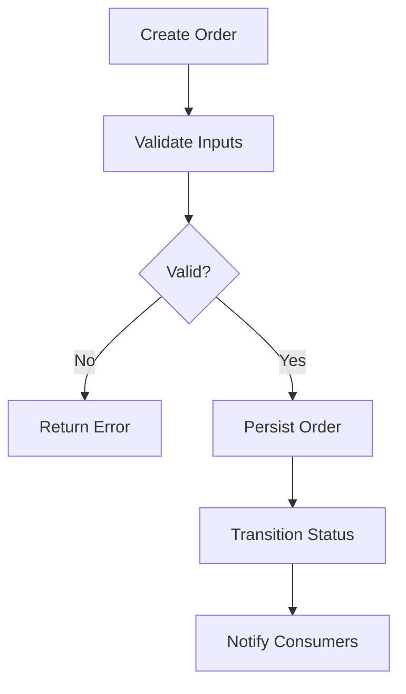
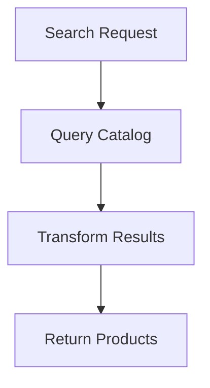
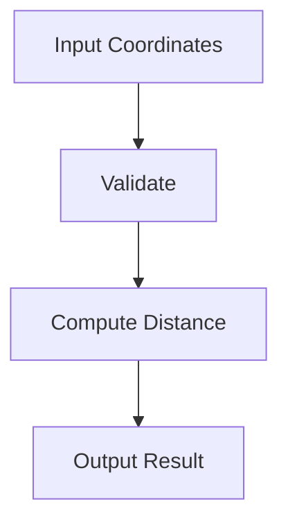
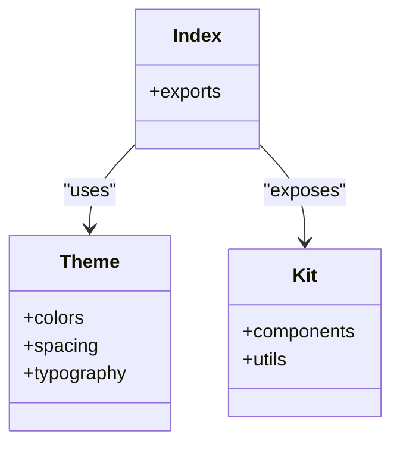
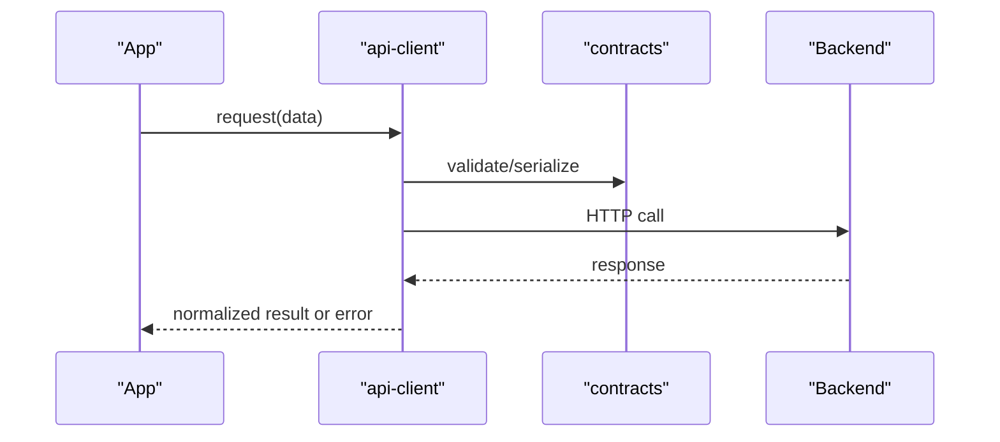
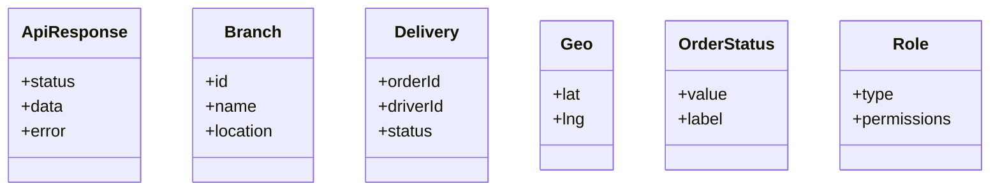
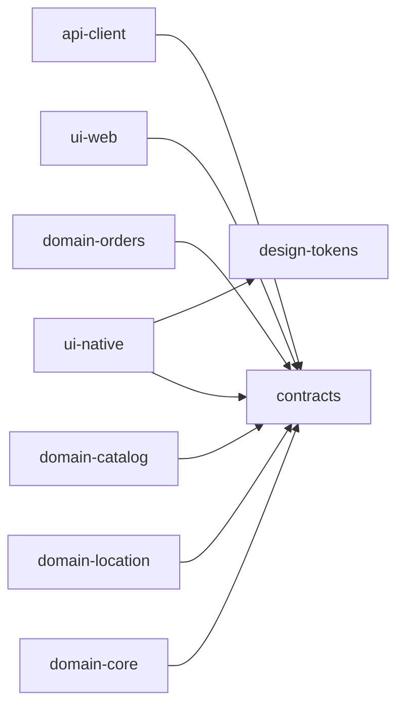

# Shared Packages

<cite>
**Referenced Files in This Document**
- [domain-core package.json](file://packages/domain-core/package.json)
- [domain-core index.ts](file://packages/domain-core/src/index.ts)
- [domain-core events.ts](file://packages/domain-core/src/events.ts)
- [domain-core query.ts](file://packages/domain-core/src/query.ts)
- [domain-orders package.json](file://packages/domain-orders/package.json)
- [domain-orders index.ts](file://packages/domain-orders/src/index.ts)
- [domain-catalog package.json](file://packages/domain-catalog/package.json)
- [domain-catalog index.ts](file://packages/domain-catalog/src/index.ts)
- [domain-location package.json](file://packages/domain-location/package.json)
- [domain-location index.ts](file://packages/domain-location/src/index.ts)
- [ui-native package.json](file://packages/ui-native/package.json)
- [ui-native index.ts](file://packages/ui-native/src/index.ts)
- [ui-native theme.tsx](file://packages/ui-native/src/theme.tsx)
- [ui-native kit.ts](file://packages/ui-native/src/kit.ts)
- [ui-web package.json](file://packages/ui-web/package.json)
- [ui-web index.ts](file://packages/ui-web/src/index.ts)
- [api-client package.json](file://packages/api-client/package.json)
- [api-client index.ts](file://packages/api-client/src/index.ts)
- [contracts index.ts](file://packages/contracts/src/index.ts)
- [contracts apiResponse.ts](file://packages/contracts/src/apiResponse.ts)
- [contracts branch.ts](file://packages/contracts/src/branch.ts)
- [contracts delivery.ts](file://packages/contracts/src/delivery.ts)
- [contracts geo.ts](file://packages/contracts/src/geo.ts)
- [contracts orderStatus.ts](file://packages/contracts/src/orderStatus.ts)
- [contracts role.ts](file://packages/contracts/src/role.ts)
</cite>

## Table of Contents
1. [Introduction](#introduction)
2. [Project Structure](#project-structure)
3. [Core Components](#core-components)
4. [Architecture Overview](#architecture-overview)
5. [Detailed Component Analysis](#detailed-component-analysis)
6. [Dependency Analysis](#dependency-analysis)
7. [Performance Considerations](#performance-considerations)
8. [Troubleshooting Guide](#troubleshooting-guide)
9. [Conclusion](#conclusion)
10. [Appendices](#appendices)

## Introduction
This document describes the shared packages that power the United Pharmacy ecosystem. It focuses on domain packages (domain-core, domain-orders, domain-catalog, domain-location), UI packages (ui-web, ui-native), and the api-client package that centralizes backend communication. It also documents the contracts and interfaces that ensure consistency across applications, along with usage examples, integration patterns, and extension points.

## Project Structure
The shared packages live under packages and are organized by concern:
- Domain layer: business rules and models for core, orders, catalog, location
- UI layer: component libraries for web and native platforms
- API client: centralized HTTP client and error handling
- Contracts: shared types and response shapes used by clients and services

**Diagram sources**
- [domain-core package.json:1-7](file://packages/domain-core/package.json#L1-L7)
- [domain-orders package.json:1-7](file://packages/domain-orders/package.json#L1-L7)
- [domain-catalog package.json:1-7](file://packages/domain-catalog/package.json#L1-L7)
- [domain-location package.json:1-7](file://packages/domain-location/package.json#L1-L7)
- [ui-native package.json:1-38](file://packages/ui-native/package.json#L1-L38)
- [ui-web package.json:1-7](file://packages/ui-web/package.json#L1-L7)
- [api-client package.json:1-21](file://packages/api-client/package.json#L1-L21)
- [contracts index.ts:1-200](file://packages/contracts/src/index.ts#L1-L200)

**Section sources**
- [domain-core package.json:1-7](file://packages/domain-core/package.json#L1-L7)
- [domain-orders package.json:1-7](file://packages/domain-orders/package.json#L1-L7)
- [domain-catalog package.json:1-7](file://packages/domain-catalog/package.json#L1-L7)
- [domain-location package.json:1-7](file://packages/domain-location/package.json#L1-L7)
- [ui-native package.json:1-38](file://packages/ui-native/package.json#L1-L38)
- [ui-web package.json:1-7](file://packages/ui-web/package.json#L1-L7)
- [api-client package.json:1-21](file://packages/api-client/package.json#L1-L21)
- [contracts index.ts:1-200](file://packages/contracts/src/index.ts#L1-L200)

## Core Components
- domain-core: foundational utilities such as event definitions and query helpers to standardize cross-cutting concerns across domains.
- domain-orders: encapsulates order processing logic and lifecycle operations.
- domain-catalog: product management capabilities including listing, details, and search-related operations.
- domain-location: geographic calculations and location-based utilities used by delivery and routing features.
- ui-native: React Native component library with theming, design tokens, and platform-specific components.
- ui-web: Web component library exposing a consistent UI surface for browser apps.
- api-client: centralized HTTP client built on axios with typed requests and unified error handling using contracts.
- contracts: shared TypeScript types and response envelopes consumed by both UI and domain layers.

**Section sources**
- [domain-core index.ts:1-200](file://packages/domain-core/src/index.ts#L1-L200)
- [domain-core events.ts:1-200](file://packages/domain-core/src/events.ts#L1-L200)
- [domain-core query.ts:1-200](file://packages/domain-core/src/query.ts#L1-L200)
- [domain-orders index.ts:1-200](file://packages/domain-orders/src/index.ts#L1-L200)
- [domain-catalog index.ts:1-200](file://packages/domain-catalog/src/index.ts#L1-L200)
- [domain-location index.ts:1-200](file://packages/domain-location/src/index.ts#L1-L200)
- [ui-native index.ts:1-200](file://packages/ui-native/src/index.ts#L1-L200)
- [ui-native theme.tsx:1-200](file://packages/ui-native/src/theme.tsx#L1-L200)
- [ui-native kit.ts:1-200](file://packages/ui-native/src/kit.ts#L1-L200)
- [ui-web index.ts:1-200](file://packages/ui-web/src/index.ts#L1-L200)
- [api-client index.ts:1-200](file://packages/api-client/src/index.ts#L1-L200)
- [contracts index.ts:1-200](file://packages/contracts/src/index.ts#L1-L200)

## Architecture Overview
The architecture separates concerns into domain logic, UI, and API integration. Contracts define the shared schema between frontend and backend. The api-client uses these contracts to type requests and responses. Domain packages implement business rules and may emit events or use query helpers from domain-core. UI packages consume domain APIs via the api-client and render consistent experiences using design tokens and themed components.

**Diagram sources**
- [api-client package.json:1-21](file://packages/api-client/package.json#L1-L21)
- [api-client index.ts:1-200](file://packages/api-client/src/index.ts#L1-L200)
- [contracts index.ts:1-200](file://packages/contracts/src/index.ts#L1-L200)
- [ui-native package.json:1-38](file://packages/ui-native/package.json#L1-L38)
- [ui-web package.json:1-7](file://packages/ui-web/package.json#L1-L7)

## Detailed Component Analysis

### domain-core
Purpose:
- Provides shared events and query helpers to standardize cross-domain interactions.
- Acts as a foundation for other domain packages to emit and handle events consistently.

Key responsibilities:
- Event definitions and emission utilities
- Query helpers for common data access patterns
- Centralized exports for reuse across domains

Usage example:
- Import event types and emitter helpers to publish domain events.
- Use query helpers to build consistent queries across modules.

Extension points:
- Add new event types and handlers in the events module.
- Extend query helpers for new data access patterns.

**Diagram sources**
- [domain-core index.ts:1-200](file://packages/domain-core/src/index.ts#L1-L200)
- [domain-core events.ts:1-200](file://packages/domain-core/src/events.ts#L1-L200)
- [domain-core query.ts:1-200](file://packages/domain-core/src/query.ts#L1-L200)

**Section sources**
- [domain-core index.ts:1-200](file://packages/domain-core/src/index.ts#L1-L200)
- [domain-core events.ts:1-200](file://packages/domain-core/src/events.ts#L1-L200)
- [domain-core query.ts:1-200](file://packages/domain-core/src/query.ts#L1-L200)

### domain-orders
Purpose:
- Encapsulates order processing logic, lifecycle transitions, and validation rules.

Key responsibilities:
- Order creation, updates, and status transitions
- Validation against business rules
- Integration with contracts for consistent payloads

Usage example:
- Create an order using validated inputs.
- Transition order status through defined states.

Extension points:
- Add new order statuses and transitions.
- Integrate additional validation rules.

**Diagram sources**
- [domain-orders index.ts:1-200](file://packages/domain-orders/src/index.ts#L1-L200)
- [contracts orderStatus.ts:1-200](file://packages/contracts/src/orderStatus.ts#L1-L200)

**Section sources**
- [domain-orders index.ts:1-200](file://packages/domain-orders/src/index.ts#L1-L200)
- [contracts orderStatus.ts:1-200](file://packages/contracts/src/orderStatus.ts#L1-L200)

### domain-catalog
Purpose:
- Manages product catalog operations including listing, retrieval, and search-related functionality.

Key responsibilities:
- Product entity modeling
- Catalog queries and transformations
- Consistent contract usage for product data

Usage example:
- Fetch products with filters and pagination.
- Transform catalog entries for UI consumption.

Extension points:
- Add new product attributes and filters.
- Implement advanced search strategies.

**Diagram sources**
- [domain-catalog index.ts:1-200](file://packages/domain-catalog/src/index.ts#L1-L200)

**Section sources**
- [domain-catalog index.ts:1-200](file://packages/domain-catalog/src/index.ts#L1-L200)

### domain-location
Purpose:
- Provides geographic calculations and location-based utilities for delivery and routing.

Key responsibilities:
- Distance and coordinate computations
- Location normalization and validation
- Integration with delivery workflows

Usage example:
- Compute distances between branches and customers.
- Validate and normalize coordinates before storage.

Extension points:
- Add new geospatial algorithms or providers.
- Extend validation rules for locations.

**Diagram sources**
- [domain-location index.ts:1-200](file://packages/domain-location/src/index.ts#L1-L200)
- [contracts geo.ts:1-200](file://packages/contracts/src/geo.ts#L1-L200)

**Section sources**
- [domain-location index.ts:1-200](file://packages/domain-location/src/index.ts#L1-L200)
- [contracts geo.ts:1-200](file://packages/contracts/src/geo.ts#L1-L200)

### ui-native
Purpose:
- React Native component library providing reusable UI primitives, theming, and design tokens.

Key responsibilities:
- Themed components and layout primitives
- Design token integration
- Platform-specific adaptations

Usage example:
- Import components and apply themes from design tokens.
- Customize appearance via theme overrides.

Extension points:
- Add new components and tokens.
- Extend theme configuration for brand variants.

**Diagram sources**
- [ui-native index.ts:1-200](file://packages/ui-native/src/index.ts#L1-L200)
- [ui-native theme.tsx:1-200](file://packages/ui-native/src/theme.tsx#L1-L200)
- [ui-native kit.ts:1-200](file://packages/ui-native/src/kit.ts#L1-L200)

**Section sources**
- [ui-native package.json:1-38](file://packages/ui-native/package.json#L1-L38)
- [ui-native index.ts:1-200](file://packages/ui-native/src/index.ts#L1-L200)
- [ui-native theme.tsx:1-200](file://packages/ui-native/src/theme.tsx#L1-L200)
- [ui-native kit.ts:1-200](file://packages/ui-native/src/kit.ts#L1-L200)

### ui-web
Purpose:
- Web component library offering a consistent UI surface for browser applications.

Key responsibilities:
- Reusable web components
- Theming and styling conventions
- Integration with design tokens

Usage example:
- Import components and apply consistent styles across pages.

Extension points:
- Add new web components and utilities.
- Extend theme and style tokens.

**Section sources**
- [ui-web package.json:1-7](file://packages/ui-web/package.json#L1-L7)
- [ui-web index.ts:1-200](file://packages/ui-web/src/index.ts#L1-L200)

### api-client
Purpose:
- Centralized HTTP client for backend communication with typed requests and unified error handling.

Key responsibilities:
- Axios-based HTTP calls
- Request/response normalization using contracts
- Error mapping and retry strategies

Usage example:
- Call endpoints with typed parameters and receive normalized results.
- Handle errors uniformly across applications.

Extension points:
- Add new endpoints and response types.
- Implement interceptors for logging or retries.

**Diagram sources**
- [api-client package.json:1-21](file://packages/api-client/package.json#L1-L21)
- [api-client index.ts:1-200](file://packages/api-client/src/index.ts#L1-L200)
- [contracts index.ts:1-200](file://packages/contracts/src/index.ts#L1-L200)

**Section sources**
- [api-client package.json:1-21](file://packages/api-client/package.json#L1-L21)
- [api-client index.ts:1-200](file://packages/api-client/src/index.ts#L1-L200)

### contracts
Purpose:
- Shared TypeScript types and response envelopes ensuring consistency across applications and services.

Key responsibilities:
- Define API response structures
- Model entities like branches, deliveries, roles, and order statuses
- Provide geo types for location calculations

Usage example:
- Import types to type-check requests and responses.
- Enforce consistent payloads across UI and backend integrations.

Extension points:
- Add new types and response envelopes.
- Version contracts when evolving APIs.

**Diagram sources**
- [contracts apiResponse.ts:1-200](file://packages/contracts/src/apiResponse.ts#L1-L200)
- [contracts branch.ts:1-200](file://packages/contracts/src/branch.ts#L1-L200)
- [contracts delivery.ts:1-200](file://packages/contracts/src/delivery.ts#L1-L200)
- [contracts geo.ts:1-200](file://packages/contracts/src/geo.ts#L1-L200)
- [contracts orderStatus.ts:1-200](file://packages/contracts/src/orderStatus.ts#L1-L200)
- [contracts role.ts:1-200](file://packages/contracts/src/role.ts#L1-L200)

**Section sources**
- [contracts index.ts:1-200](file://packages/contracts/src/index.ts#L1-L200)
- [contracts apiResponse.ts:1-200](file://packages/contracts/src/apiResponse.ts#L1-L200)
- [contracts branch.ts:1-200](file://packages/contracts/src/branch.ts#L1-L200)
- [contracts delivery.ts:1-200](file://packages/contracts/src/delivery.ts#L1-L200)
- [contracts geo.ts:1-200](file://packages/contracts/src/geo.ts#L1-L200)
- [contracts orderStatus.ts:1-200](file://packages/contracts/src/orderStatus.ts#L1-L200)
- [contracts role.ts:1-200](file://packages/contracts/src/role.ts#L1-L200)

## Dependency Analysis
- api-client depends on contracts for typed requests and responses.
- ui-native depends on design-tokens for theming and has peer dependencies for React Native ecosystem.
- Domain packages depend on contracts for shared types and may rely on domain-core for events and query helpers.
- UI packages consume api-client and contracts to interact with backend services.

**Diagram sources**
- [api-client package.json:1-21](file://packages/api-client/package.json#L1-L21)
- [ui-native package.json:1-38](file://packages/ui-native/package.json#L1-L38)
- [contracts index.ts:1-200](file://packages/contracts/src/index.ts#L1-L200)

**Section sources**
- [api-client package.json:1-21](file://packages/api-client/package.json#L1-L21)
- [ui-native package.json:1-38](file://packages/ui-native/package.json#L1-L38)
- [contracts index.ts:1-200](file://packages/contracts/src/index.ts#L1-L200)

## Performance Considerations
- Prefer memoization and caching in UI components to reduce re-renders.
- Batch API requests where possible to minimize network overhead.
- Use lazy loading for heavy components and routes.
- Optimize domain calculations by avoiding unnecessary recomputations.
- Leverage contracts to avoid runtime type checks in hot paths.

[No sources needed since this section provides general guidance]

## Troubleshooting Guide
Common issues and resolutions:
- Network errors: Ensure api-client is configured with correct base URL and headers; inspect error mappings from contracts.
- Type mismatches: Verify that contracts match backend schema; update contracts if backend evolves.
- Theming inconsistencies: Confirm ui-native theme tokens are applied correctly; check peer dependency versions.
- Domain validation failures: Review domain rules and input validation; add logs around event emissions.

**Section sources**
- [api-client index.ts:1-200](file://packages/api-client/src/index.ts#L1-L200)
- [contracts apiResponse.ts:1-200](file://packages/contracts/src/apiResponse.ts#L1-L200)
- [ui-native theme.tsx:1-200](file://packages/ui-native/src/theme.tsx#L1-L200)

## Conclusion
The shared packages provide a cohesive foundation for the United Pharmacy ecosystem. Domain packages encapsulate business logic, UI packages deliver consistent user experiences, and the api-client ensures reliable backend communication. Contracts enforce consistency across applications. By following the integration patterns and extension points outlined here, teams can scale features while maintaining quality and coherence.

[No sources needed since this section summarizes without analyzing specific files]

## Appendices
- Usage examples:
  - domain-core: import events and query helpers to standardize cross-domain operations.
  - domain-orders: create and transition orders using validated inputs.
  - domain-catalog: fetch and transform product listings.
  - domain-location: compute distances and validate coordinates.
  - ui-native: use themed components and design tokens.
  - ui-web: compose pages with consistent web components.
  - api-client: make typed requests and handle errors uniformly.
  - contracts: import types to ensure payload consistency.

[No sources needed since this section lists general usage patterns]