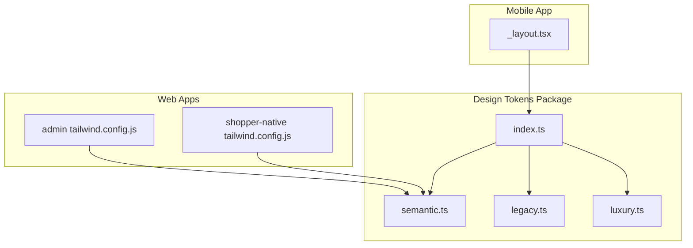
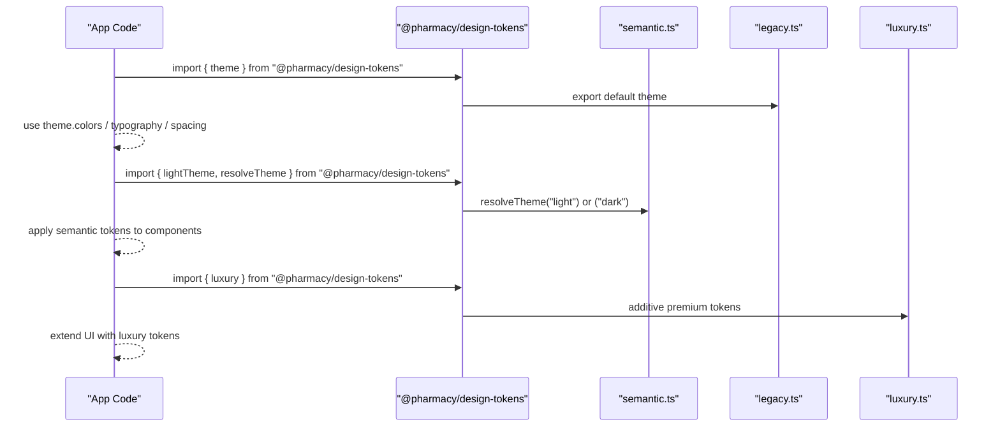
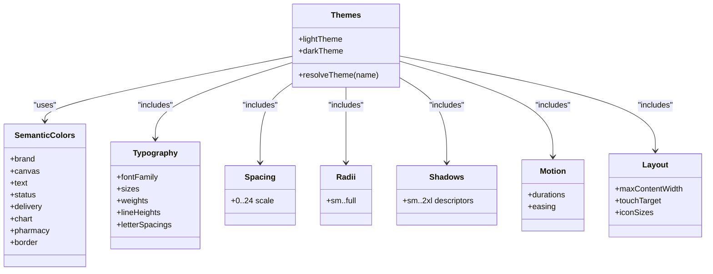
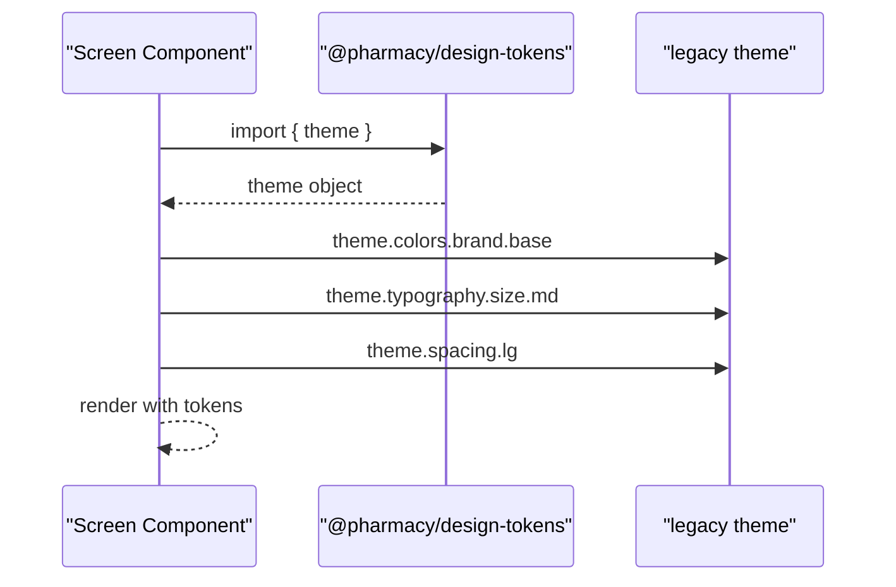
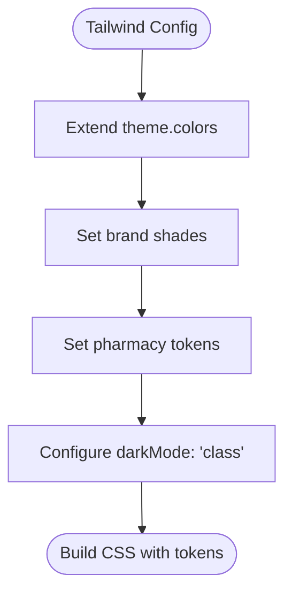
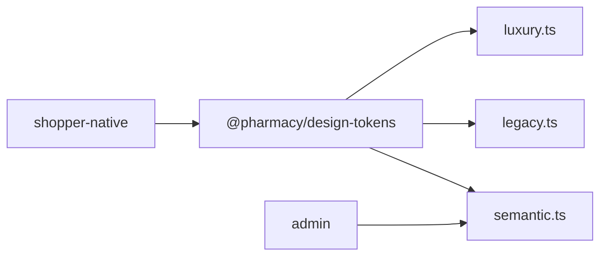

# Design Tokens System

<cite>
**Referenced Files in This Document**
- [packages/design-tokens/package.json](file://packages/design-tokens/package.json)
- [packages/design-tokens/src/index.ts](file://packages/design-tokens/src/index.ts)
- [packages/design-tokens/src/semantic.ts](file://packages/design-tokens/src/semantic.ts)
- [packages/design-tokens/src/legacy.ts](file://packages/design-tokens/src/legacy.ts)
- [packages/design-tokens/src/luxury.ts](file://packages/design-tokens/src/luxury.ts)
- [apps/shopper-native/app/(customer)/(tabs)/_layout.tsx](file://apps/shopper-native/app/(customer)/(tabs)/_layout.tsx)
- [apps/admin/tailwind.config.js](file://apps/admin/tailwind.config.js)
- [apps/shopper-native/tailwind.config.js](file://apps/shopper-native/tailwind.config.js)
</cite>

## Table of Contents
1. Introduction
2. Project Structure
3. Core Components
4. Architecture Overview
5. Detailed Component Analysis
6. Dependency Analysis
7. Performance Considerations
8. Troubleshooting Guide
9. Conclusion
10. Appendices

## Introduction
This document explains the design tokens system that centralizes visual and layout values across web and mobile applications. It covers color palettes, typography scales, spacing units, radii, shadows, motion, responsive layout tokens, and how both React (web) and React Native (mobile) consume these tokens. It also provides guidance on extending the system, creating custom themes, and maintaining consistency across platforms.

## Project Structure
The design tokens are published as a private package consumed by multiple apps:
- Package entry exports semantic tokens, legacy theme compatibility, and an additive “luxury” extension for premium surfaces and component sizing.
- Mobile app imports the default legacy theme for backward compatibility.
- Web apps configure Tailwind with brand colors aligned to the token palette.

**Diagram sources**
- [packages/design-tokens/src/index.ts:1-20](file://packages/design-tokens/src/index.ts#L1-L20)
- [packages/design-tokens/src/semantic.ts:1-369](file://packages/design-tokens/src/semantic.ts#L1-L369)
- [packages/design-tokens/src/legacy.ts:1-566](file://packages/design-tokens/src/legacy.ts#L1-L566)
- [packages/design-tokens/src/luxury.ts:1-204](file://packages/design-tokens/src/luxury.ts#L1-L204)
- [apps/shopper-native/app/(customer)/(tabs)/_layout.tsx:35-38](file://apps/shopper-native/app/(customer)/(tabs)/_layout.tsx#L35-L38)
- [apps/admin/tailwind.config.js:1-35](file://apps/admin/tailwind.config.js#L1-L35)
- [apps/shopper-native/tailwind.config.js:1-34](file://apps/shopper-native/tailwind.config.js#L1-L34)

**Section sources**
- [packages/design-tokens/package.json:1-20](file://packages/design-tokens/package.json#L1-L20)
- [packages/design-tokens/src/index.ts:1-20](file://packages/design-tokens/src/index.ts#L1-L20)
- [apps/shopper-native/app/(customer)/(tabs)/_layout.tsx:35-38](file://apps/shopper-native/app/(customer)/(tabs)/_layout.tsx#L35-L38)
- [apps/admin/tailwind.config.js:1-35](file://apps/admin/tailwind.config.js#L1-L35)
- [apps/shopper-native/tailwind.config.js:1-34](file://apps/shopper-native/tailwind.config.js#L1-L34)

## Core Components
- Semantic theme (light/dark): A platform-neutral set of semantic colors, typography, spacing, radii, shadows, motion, and layout tokens. Provides lightTheme, darkTheme, and a resolver function.
- Legacy theme: Backward-compatible theme object used by existing code paths; includes extensive color palettes, typography, spacing, radius, shadows, animation, gradients, z-index, and layout constants.
- Luxury extension: Additive tokens for premium surfaces, commerce-focused typography roles, spacing aliases, radius, motion, interaction states, sizing, and shadows. Does not modify core semantic tokens.

Key responsibilities:
- Centralize values so all apps share consistent visuals.
- Provide type-safe tokens for TypeScript consumers.
- Maintain backward compatibility while enabling new semantic usage.

**Section sources**
- [packages/design-tokens/src/semantic.ts:1-369](file://packages/design-tokens/src/semantic.ts#L1-L369)
- [packages/design-tokens/src/legacy.ts:1-566](file://packages/design-tokens/src/legacy.ts#L1-L566)
- [packages/design-tokens/src/luxury.ts:1-204](file://packages/design-tokens/src/luxury.ts#L1-L204)

## Architecture Overview
The tokens package exposes three layers:
- Semantic layer: Platform-neutral tokens for colors, typography, spacing, radii, shadows, motion, and layout. Exposes lightTheme, darkTheme, and resolveTheme.
- Legacy layer: Full theme object for backward compatibility with existing components and screens.
- Luxury layer: Additive tokens for premium UI experiences without altering shared semantics.

Consumers:
- Mobile app imports the default legacy theme for immediate compatibility.
- Web apps align Tailwind configuration with semantic brand colors.

**Diagram sources**
- [packages/design-tokens/src/index.ts:1-20](file://packages/design-tokens/src/index.ts#L1-L20)
- [packages/design-tokens/src/semantic.ts:330-369](file://packages/design-tokens/src/semantic.ts#L330-L369)
- [packages/design-tokens/src/legacy.ts:544-566](file://packages/design-tokens/src/legacy.ts#L544-L566)
- [packages/design-tokens/src/luxury.ts:190-204](file://packages/design-tokens/src/luxury.ts#L190-L204)

## Detailed Component Analysis

### Semantic Theme (semantic.ts)
- Colors: Organized into semantic groups (brand, canvas, text, status, delivery, chart, pharmacy, border). Light and dark variants are provided.
- Typography: Platform-neutral font family and numeric sizes, weights, line heights, letter spacings.
- Spacing: 4-point grid scale with named steps.
- Radii: Named corner radius tokens.
- Shadows: Elevation levels described in a renderer-agnostic way.
- Motion: Durations and easing curves.
- Layout: Max content width, touch target size, icon sizes.
- Theme resolution: Functions to select light or dark theme at runtime.

**Diagram sources**
- [packages/design-tokens/src/semantic.ts:4-71](file://packages/design-tokens/src/semantic.ts#L4-L71)
- [packages/design-tokens/src/semantic.ts:214-325](file://packages/design-tokens/src/semantic.ts#L214-L325)
- [packages/design-tokens/src/semantic.ts:339-369](file://packages/design-tokens/src/semantic.ts#L339-L369)

**Section sources**
- [packages/design-tokens/src/semantic.ts:1-369](file://packages/design-tokens/src/semantic.ts#L1-L369)

### Legacy Theme (legacy.ts)
- Comprehensive color palettes and semantic groupings for backgrounds, surfaces, text, borders, success/warning/error/info, hero, glass, overlays.
- Typography with font names, sizes, weights, and letter spacing.
- Spacing scale with named aliases.
- Radius scale including pill alias.
- Shadow system using box-shadow strings and elevation for Android stacking.
- Animation durations, spring configs, and easing curves.
- Gradients and category gradients.
- Z-index scale.
- Layout constants for tab bar, header, sheet radius, input/button heights, page padding, and max width.
- Default theme export for backward compatibility.

Usage example (React Native):
- Import the default theme and access colors, typography, spacing, etc., in components.

**Section sources**
- [packages/design-tokens/src/legacy.ts:6-566](file://packages/design-tokens/src/legacy.ts#L6-L566)
- [apps/shopper-native/app/(customer)/(tabs)/_layout.tsx:35-38](file://apps/shopper-native/app/(customer)/(tabs)/_layout.tsx#L35-L38)

### Luxury Extension (luxury.ts)
- Surface hierarchy for light and dark modes with base, s1–s4, overlay, and sheet.
- Commerce-oriented typography roles (navLabel, screenTitle, productName, price variants, button sizes, body, caption, badge, metric).
- Spacing scale with semantic aliases (screenH, cardH/V, sectionGap, rowGap, chipGap).
- Radius scale with component-specific values (card, input, button, sheet, badge, chip).
- Motion system with durations, springs, and easings.
- Interaction states (pressed/hover tints, focus ring, disabled opacity).
- Sizing tokens for buttons, inputs, tabs, headers, product cards, avatars, icons.
- Shadow system tailored for native-like elevation and focus glow.
- Combined export for easy consumption.

**Section sources**
- [packages/design-tokens/src/luxury.ts:1-204](file://packages/design-tokens/src/luxury.ts#L1-L204)

### Token Consumption in Apps

#### React Native (Mobile)
- The mobile app imports the default legacy theme and uses it throughout screens and layouts.
- Example usage pattern:
  - Import theme from the tokens package.
  - Access colors, typography, spacing, and other tokens in styles.

**Diagram sources**
- [packages/design-tokens/src/legacy.ts:544-566](file://packages/design-tokens/src/legacy.ts#L544-L566)
- [apps/shopper-native/app/(customer)/(tabs)/_layout.tsx:35-38](file://apps/shopper-native/app/(customer)/(tabs)/_layout.tsx#L35-L38)

**Section sources**
- [apps/shopper-native/app/(customer)/(tabs)/_layout.tsx:35-38](file://apps/shopper-native/app/(customer)/(tabs)/_layout.tsx#L35-L38)

#### Web (Tailwind Configuration)
- Web apps configure Tailwind with brand colors aligned to the semantic palette.
- Admin app defines brand and pharmacy colors matching the token values.
- Mobile web config sets dark mode to class and extends Tailwind with brand colors.

**Diagram sources**
- [apps/admin/tailwind.config.js:1-35](file://apps/admin/tailwind.config.js#L1-L35)
- [apps/shopper-native/tailwind.config.js:1-34](file://apps/shopper-native/tailwind.config.js#L1-L34)

**Section sources**
- [apps/admin/tailwind.config.js:1-35](file://apps/admin/tailwind.config.js#L1-L35)
- [apps/shopper-native/tailwind.config.js:1-34](file://apps/shopper-native/tailwind.config.js#L1-L34)

## Dependency Analysis
- The tokens package is referenced by mobile apps via file protocol dependencies.
- The mobile app imports the default legacy theme directly from the package.
- Web apps reference semantic brand colors in their Tailwind configurations.

**Diagram sources**
- [packages/design-tokens/src/index.ts:1-20](file://packages/design-tokens/src/index.ts#L1-L20)
- [apps/shopper-native/app/(customer)/(tabs)/_layout.tsx:35-38](file://apps/shopper-native/app/(customer)/(tabs)/_layout.tsx#L35-L38)
- [apps/admin/tailwind.config.js:1-35](file://apps/admin/tailwind.config.js#L1-L35)

**Section sources**
- [packages/design-tokens/package.json:1-20](file://packages/design-tokens/package.json#L1-L20)
- [packages/design-tokens/src/index.ts:1-20](file://packages/design-tokens/src/index.ts#L1-L20)
- [apps/shopper-native/app/(customer)/(tabs)/_layout.tsx:35-38](file://apps/shopper-native/app/(customer)/(tabs)/_layout.tsx#L35-L38)
- [apps/admin/tailwind.config.js:1-35](file://apps/admin/tailwind.config.js#L1-L35)

## Performance Considerations
- Prefer semantic tokens over hard-coded values to reduce duplication and improve maintainability.
- Use the luxury extension only where premium UI is required to avoid unnecessary complexity in shared components.
- Keep Tailwind configurations minimal and aligned with token values to prevent style drift.
- Avoid excessive shadow usage; choose appropriate elevation levels based on context.

## Troubleshooting Guide
- If mobile screens do not reflect theme changes, ensure they import the correct theme from the tokens package and that the build process picks up updated tokens.
- If web styles appear inconsistent, verify Tailwind’s brand color definitions match the semantic token values.
- For dark mode issues on web, confirm that dark mode is configured to class-based toggling to avoid media query conflicts.

**Section sources**
- [apps/shopper-native/tailwind.config.js:1-34](file://apps/shopper-native/tailwind.config.js#L1-L34)
- [apps/admin/tailwind.config.js:1-35](file://apps/admin/tailwind.config.js#L1-L35)

## Conclusion
The design tokens system provides a unified foundation for visual consistency across web and mobile. By adopting semantic tokens, leveraging the legacy theme for compatibility, and optionally extending with luxury tokens, teams can maintain a cohesive design language while evolving the system safely. Aligning app-level configurations (like Tailwind) with token values ensures long-term consistency and reduces maintenance overhead.

## Appendices

### Token Naming Conventions
- Colors: Grouped semantically (brand, canvas, text, status, delivery, chart, pharmacy, border).
- Typography: Named sizes, weights, line heights, and letter spacings.
- Spacing: Numeric scale aligned to a 4-point grid with semantic aliases in luxury.
- Radii: Named tokens for common corner radii.
- Shadows: Elevation levels with renderer-agnostic descriptors.
- Motion: Durations and easing curves grouped by purpose.
- Layout: Responsive widths, touch targets, and icon sizes.

**Section sources**
- [packages/design-tokens/src/semantic.ts:4-71](file://packages/design-tokens/src/semantic.ts#L4-L71)
- [packages/design-tokens/src/semantic.ts:214-325](file://packages/design-tokens/src/semantic.ts#L214-L325)
- [packages/design-tokens/src/luxury.ts:36-90](file://packages/design-tokens/src/luxury.ts#L36-L90)

### Versioning Strategy
- The tokens package version is managed in its package manifest.
- Changes should be additive when possible (e.g., luxury extension) to preserve backward compatibility.
- Semantic tokens should evolve carefully to avoid breaking changes in consuming apps.

**Section sources**
- [packages/design-tokens/package.json:1-20](file://packages/design-tokens/package.json#L1-L20)
- [packages/design-tokens/src/luxury.ts:1-9](file://packages/design-tokens/src/luxury.ts#L1-L9)

### Extending the Design System
- Add new semantic tokens in semantic.ts if they are platform-neutral and broadly applicable.
- Create additive extensions in a dedicated module (like luxury.ts) to avoid modifying shared tokens.
- Update app-level configurations (e.g., Tailwind) to incorporate new tokens consistently.

**Section sources**
- [packages/design-tokens/src/luxury.ts:1-204](file://packages/design-tokens/src/luxury.ts#L1-L204)
- [apps/admin/tailwind.config.js:1-35](file://apps/admin/tailwind.config.js#L1-L35)

### Creating Custom Themes
- Use resolveTheme to switch between light and dark themes at runtime.
- Build custom themes by composing semantic tokens with app-specific overrides where necessary.
- Ensure accessibility by validating contrast ratios for text and interactive elements.

**Section sources**
- [packages/design-tokens/src/semantic.ts:339-369](file://packages/design-tokens/src/semantic.ts#L339-L369)

### Examples of Token Usage

#### React Native (Mobile)
- Import the default theme and use it in styles:
  - Colors: theme.colors.brand.base
  - Typography: theme.typography.size.md
  - Spacing: theme.spacing.lg

**Section sources**
- [packages/design-tokens/src/legacy.ts:544-566](file://packages/design-tokens/src/legacy.ts#L544-L566)
- [apps/shopper-native/app/(customer)/(tabs)/_layout.tsx:35-38](file://apps/shopper-native/app/(customer)/(tabs)/_layout.tsx#L35-L38)

#### React (Web)
- Configure Tailwind with brand colors aligned to semantic tokens:
  - Set brand shades in theme.extend.colors
  - Define pharmacy tokens for admin UI
  - Enable class-based dark mode

**Section sources**
- [apps/admin/tailwind.config.js:1-35](file://apps/admin/tailwind.config.js#L1-L35)
- [apps/shopper-native/tailwind.config.js:1-34](file://apps/shopper-native/tailwind.config.js#L1-L34)