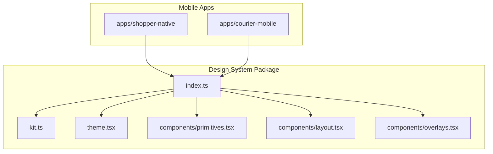
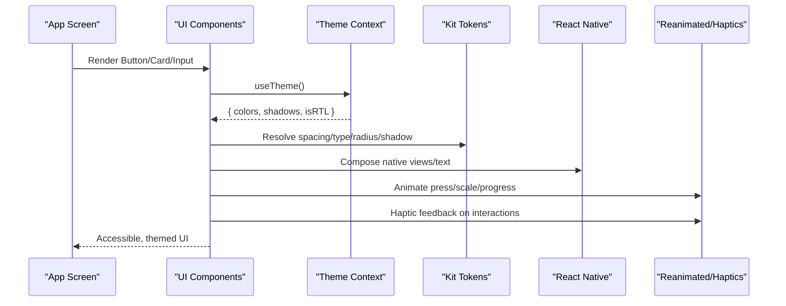
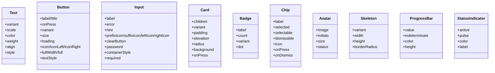
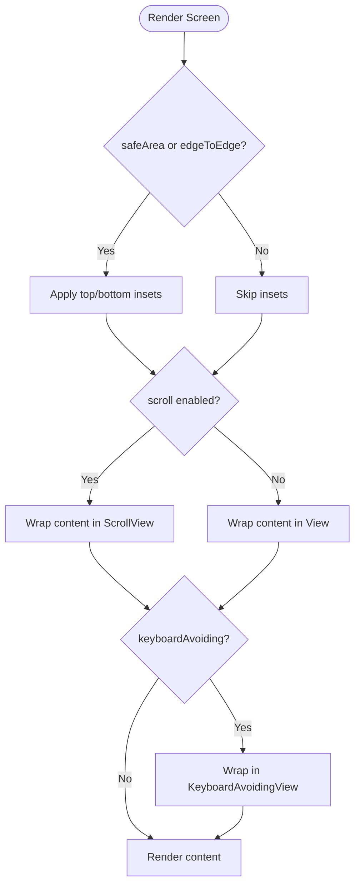
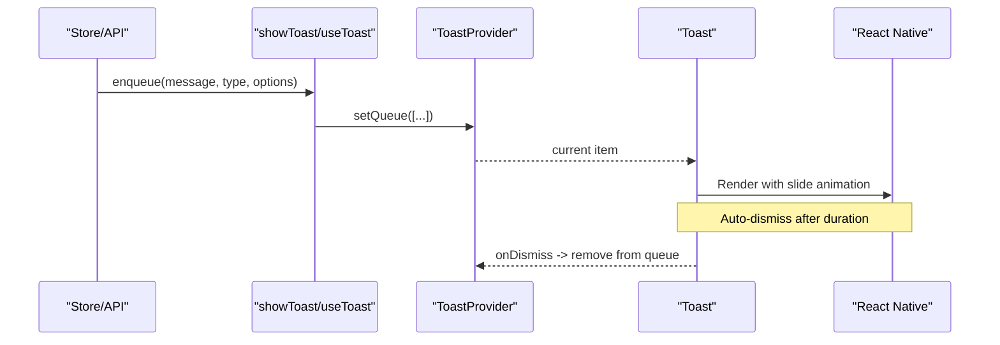
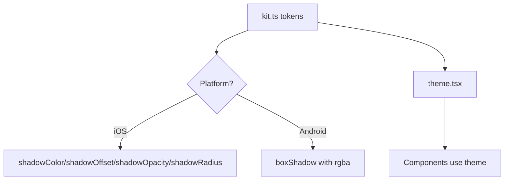
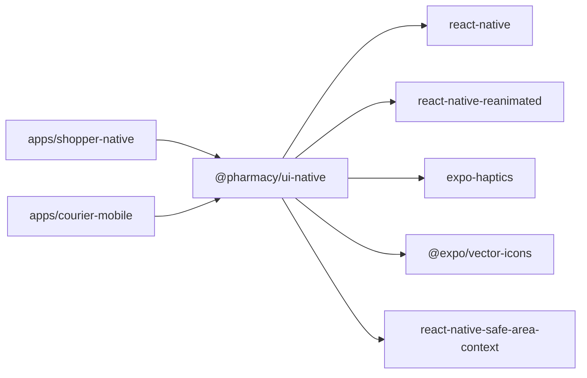

# Mobile Components Library

<cite>
**Referenced Files in This Document**
- [index.ts](file://packages/ui-native/src/index.ts)
- [kit.ts](file://packages/ui-native/src/kit.ts)
- [primitives.tsx](file://packages/ui-native/src/components/primitives.tsx)
- [layout.tsx](file://packages/ui-native/src/components/layout.tsx)
- [overlays.tsx](file://packages/ui-native/src/components/overlays.tsx)
- [theme.tsx](file://packages/ui-native/src/theme.tsx)
- [package.json](file://apps/shopper-native/package.json)
- [package.json](file://apps/courier-mobile/package.json)
</cite>

## Table of Contents
1. [Introduction](#introduction)
2. [Project Structure](#project-structure)
3. [Core Components](#core-components)
4. [Architecture Overview](#architecture-overview)
5. [Detailed Component Analysis](#detailed-component-analysis)
6. [Dependency Analysis](#dependency-analysis)
7. [Performance Considerations](#performance-considerations)
8. [Troubleshooting Guide](#troubleshooting-guide)
9. [Conclusion](#conclusion)
10. [Appendices](#appendices)

## Introduction
This document describes the mobile components library built with React Native and Expo, focusing on platform-aware primitives, layout utilities, overlays, theming, and styling via NativeWind/Tailwind. It explains component APIs, props, gesture handling, animations, accessibility, and performance considerations for iOS and Android. It also highlights platform-specific behaviors and optimization strategies to help you build fast, accessible, and consistent mobile experiences across apps that consume this library.

## Project Structure
The library is published as a design-system package consumed by multiple mobile apps (shopper-native, courier-mobile). The package exposes:
- A unified kit of tokens (spacing, colors, typography, shadows)
- Primitive UI controls (Text, Button, Input, Card, Badge, Chip, Avatar, Skeleton, ProgressBar, StatusIndicator)
- Layout helpers (Screen, Section, Row, Stack, Spacer, EmptyState, ErrorState, LoadingOverlay, IconButton, SegmentedToggle)
- Overlays (Toast, Modal, BottomSheet, Dialog)
- Theme context and exports

**Diagram sources**
- [index.ts:1-9](file://packages/ui-native/src/index.ts#L1-L9)
- [kit.ts:1-109](file://packages/ui-native/src/kit.ts#L1-L109)
- [primitives.tsx:1-170](file://packages/ui-native/src/components/primitives.tsx#L1-L170)
- [layout.tsx:1-50](file://packages/ui-native/src/components/layout.tsx#L1-L50)
- [overlays.tsx:1-82](file://packages/ui-native/src/components/overlays.tsx#L1-L82)

**Section sources**
- [index.ts:1-9](file://packages/ui-native/src/index.ts#L1-L9)
- [package.json:1-104](file://apps/shopper-native/package.json#L1-L104)
- [package.json:1-66](file://apps/courier-mobile/package.json#L1-L66)

## Core Components
- Text: Theme-aware text with variants, scales, semantic colors, RTL alignment, and font weights.
- PressableScale: Animated press target with spring scale and optional haptic feedback.
- Button: Accessible action button with variants, sizes, loading state, icons, and RTL support.
- Card: Surface container with elevation, padding, radius, background, and optional press behavior.
- Input: Labelled input with focus/hint/error states, clear/password toggles, and animated error shake.
- Badge: Semantic status badge with count display and dot mode.
- Chip: Selectable/dismissible compact control with selection state and icons.
- Avatar: Image avatar with initials fallback, skeleton loading, and status indicator.
- Skeleton: Reanimated shimmer placeholder for loading states.
- ProgressBar: Determinate or indeterminate progress bar with animation.
- StatusIndicator: Online/offline dot with optional pulse animation.
- Screen: Safe-area aware screen root with optional scrolling and keyboard avoidance.
- EmptyState/ErrorState: Presentational states with actions and live-region announcements.
- Section/Row/Stack/Spacer: Layout building blocks with RTL awareness.
- IconButton: Circular icon button with tone options and haptics.
- SegmentedToggle: Radio-group style segmented control with haptic feedback.
- ToastProvider/useToast/showToast: Global toast queue with imperative API.
- Modal: Center/bottom modal with backdrop and animations.
- BottomSheet: Gesture-driven bottom sheet with snap points and handle area.
- Dialog: Blocking confirmation dialog with async confirm and loading state.

Styling approach:
- Use theme tokens from kit and theme context for consistent colors, spacing, and typography.
- NativeWind/Tailwind classes can be applied alongside native styles where supported by your app configuration.
- Platform differences are handled internally (e.g., shadow generation, RTL direction).

Accessibility:
- Most components expose accessibilityRole, accessibilityLabel, accessibilityState, and live regions where appropriate.
- Inputs provide hints/errors via accessibilityHint and live region for errors.
- Buttons and interactive elements include disabled/busy states for assistive technologies.

**Section sources**
- [primitives.tsx:36-170](file://packages/ui-native/src/components/primitives.tsx#L36-L170)
- [layout.tsx:20-50](file://packages/ui-native/src/components/layout.tsx#L20-L50)
- [overlays.tsx:16-82](file://packages/ui-native/src/components/overlays.tsx#L16-L82)
- [kit.ts:15-109](file://packages/ui-native/src/kit.ts#L15-L109)

## Architecture Overview
The library centralizes design tokens and provides composable primitives that apps use to build screens. Theming is provided via a context that resolves colors, fonts, and platform-specific values. Animations and gestures are powered by react-native-reanimated and expo-haptics. Overlays manage global state for toasts and modals.

**Diagram sources**
- [primitives.tsx:57-107](file://packages/ui-native/src/components/primitives.tsx#L57-L107)
- [layout.tsx:20-47](file://packages/ui-native/src/components/layout.tsx#L20-L47)
- [overlays.tsx:31-75](file://packages/ui-native/src/components/overlays.tsx#L31-L75)
- [kit.ts:21-109](file://packages/ui-native/src/kit.ts#L21-L109)

## Detailed Component Analysis

### Primitives: Text, Button, Input, Card, Badge, Chip, Avatar, Skeleton, ProgressBar, StatusIndicator
- Text supports variants and scales, semantic color mapping, and RTL alignment.
- Button includes loading state, icon placement, and accessibility labels/states.
- Input handles focus, password visibility, clear action, and animated error shake.
- Card offers elevation levels and optional press behavior.
- Badge hides zero counts and supports dot mode.
- Chip supports selection and dismissal with haptic feedback.
- Avatar shows image, initials fallback, skeleton overlay, and status dot.
- Skeleton uses Reanimated opacity loop for shimmer effect.
- ProgressBar animates width and translation for indeterminate mode.
- StatusIndicator pulses when active and indicates online/offline.

**Diagram sources**
- [primitives.tsx:36-170](file://packages/ui-native/src/components/primitives.tsx#L36-L170)

**Section sources**
- [primitives.tsx:36-170](file://packages/ui-native/src/components/primitives.tsx#L36-L170)

### Layout: Screen, Section, Row, Stack, Spacer, EmptyState, ErrorState, LoadingOverlay, IconButton, SegmentedToggle
- Screen manages safe areas, scrolling, and keyboard avoidance; supports edge-to-edge modes.
- Section organizes titles/subtitles/actions with RTL-aware layout.
- Row/Stack/Spacer provide flexible layouts with gap and alignment.
- EmptyState/ErrorState present messages with actions and live regions.
- LoadingOverlay renders a full-screen progress indicator.
- IconButton wraps icon buttons with haptics and tones.
- SegmentedToggle implements radio-group semantics with haptic feedback.

**Diagram sources**
- [layout.tsx:20-26](file://packages/ui-native/src/components/layout.tsx#L20-L26)

**Section sources**
- [layout.tsx:20-50](file://packages/ui-native/src/components/layout.tsx#L20-L50)

### Overlays: Toast, Modal, BottomSheet, Dialog
- ToastProvider maintains a FIFO queue; showToast provides an imperative API.
- Toast displays with slide-in/out animations and safe-area offsets.
- Modal supports center/bottom positioning, backdrop dismissal, and animations.
- BottomSheet uses PanResponder for drag gestures and snap points.
- Dialog wraps a Modal with async confirm flow and loading state.

**Diagram sources**
- [overlays.tsx:24-56](file://packages/ui-native/src/components/overlays.tsx#L24-L56)

**Section sources**
- [overlays.tsx:24-82](file://packages/ui-native/src/components/overlays.tsx#L24-L82)

### Theming and Tokens
- kit defines spacing, colors (light/dark), radii, shadows, typography scales, and font families.
- Shadows are generated per platform using Platform.select for iOS and Android.
- Theme context supplies resolved colors, shadows, and RTL flag to components.

**Diagram sources**
- [kit.ts:21-40](file://packages/ui-native/src/kit.ts#L21-L40)
- [kit.ts:42-109](file://packages/ui-native/src/kit.ts#L42-L109)

**Section sources**
- [kit.ts:21-109](file://packages/ui-native/src/kit.ts#L21-L109)
- [theme.tsx:1-200](file://packages/ui-native/src/theme.tsx#L1-L200)

## Dependency Analysis
The library depends on:
- React Native core primitives (View, Text, Pressable, TextInput, Image, Modal, ScrollView, KeyboardAvoidingView)
- react-native-reanimated for animations and shared values
- expo-haptics for tactile feedback
- @expo/vector-icons for icons
- react-native-safe-area-context for safe area insets
- Optional Tailwind/NativeWind integration at app level

Apps consuming the library:
- shopper-native and courier-mobile both import @pharmacy/ui-native and configure their own dependencies (e.g., maps, location, notifications).

**Diagram sources**
- [package.json:17-79](file://apps/shopper-native/package.json#L17-L79)
- [package.json:13-58](file://apps/courier-mobile/package.json#L13-L58)

**Section sources**
- [package.json:17-79](file://apps/shopper-native/package.json#L17-L79)
- [package.json:13-58](file://apps/courier-mobile/package.json#L13-L58)

## Performance Considerations
- Prefer reanimated for animations and shared values to keep work off the JS thread.
- Use Skeleton placeholders to avoid layout thrash during data loading.
- Minimize re-renders by memoizing lists and avoiding unnecessary prop changes.
- Leverage FlashList or optimized list components in apps for large datasets.
- Keep shadow/elevation calculations centralized in kit to reduce runtime overhead.
- Use haptics sparingly to avoid blocking interactions.
- For images, consider lazy loading and caching strategies within app layers.

[No sources needed since this section provides general guidance]

## Troubleshooting Guide
Common issues and resolutions:
- Missing haptic feedback: Ensure expo-haptics is installed and permissions are granted on platforms requiring it.
- Incorrect RTL alignment: Verify theme.isRTL and ensure components receive correct align props; check writingDirection usage in inputs and text.
- Toast not appearing: Confirm ToastProvider is mounted near the app root; verify enqueue calls are invoked.
- Modal backdrop not dismissing: Check dismissOnBackdrop prop and ensure onRequestClose/onDismiss handlers are wired.
- Keyboard overlapping inputs: Enable keyboardAvoiding on Screen or wrap content appropriately for iOS/Android.
- Animation jank: Avoid heavy computations inside animated styles; use shared values and derived styles.

**Section sources**
- [overlays.tsx:31-75](file://packages/ui-native/src/components/overlays.tsx#L31-L75)
- [layout.tsx:20-47](file://packages/ui-native/src/components/layout.tsx#L20-L47)
- [primitives.tsx:78-133](file://packages/ui-native/src/components/primitives.tsx#L78-L133)

## Conclusion
This mobile components library provides a cohesive, theme-driven set of primitives, layout tools, and overlays tailored for React Native and Expo. It emphasizes accessibility, platform-aware behavior, and smooth animations while offering a consistent API across apps. By leveraging the kit tokens, reanimated animations, and structured overlays, teams can build performant and accessible mobile experiences for both iOS and Android.

[No sources needed since this section summarizes without analyzing specific files]

## Appendices

### Usage Examples and Patterns
- Button with loading and haptics: Use variant, size, loading, and icon props; rely on PressableScale for scale animation and haptic feedback.
- Input with validation: Provide label, error, hint; leverage clearButton and password toggle; observe animated shake on error.
- Screen with safe area and keyboard avoidance: Wrap content in Screen with scroll and keyboardAvoiding flags.
- Toast from non-component code: Call showToast with message, type, and position options.
- Modal and BottomSheet: Use visible/onDismiss for Modal; configure snapPoints for BottomSheet.

[No sources needed since this section provides general guidance]

### Platform Differences
- Shadows: iOS uses native shadow properties; Android uses boxShadow with rgba conversion.
- Keyboard handling: iOS uses padding behavior; Android may require different approaches depending on configuration.
- RTL: Components compute textAlign and writingDirection based on theme.isRTL.

**Section sources**
- [kit.ts:21-40](file://packages/ui-native/src/kit.ts#L21-L40)
- [layout.tsx:20-26](file://packages/ui-native/src/components/layout.tsx#L20-L26)
- [primitives.tsx:57-68](file://packages/ui-native/src/components/primitives.tsx#L57-L68)