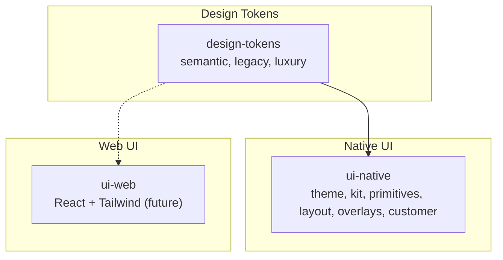
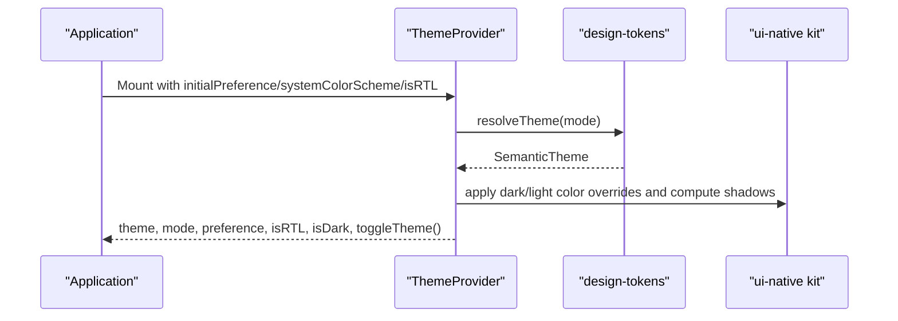
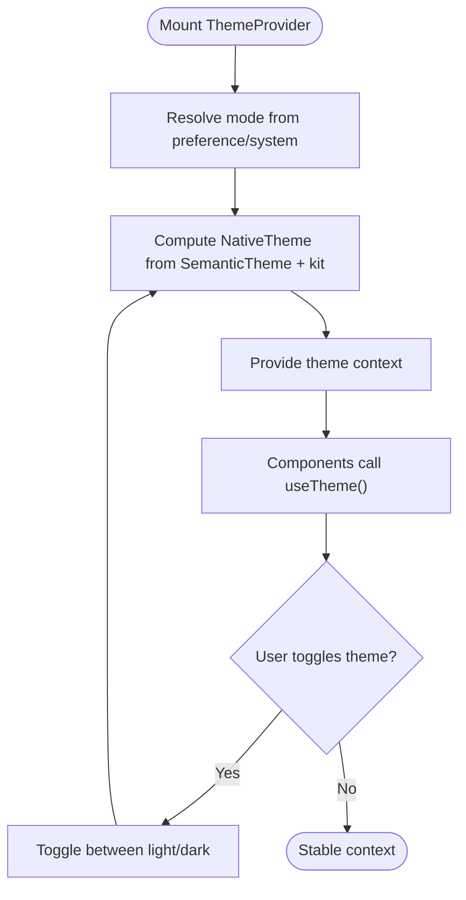
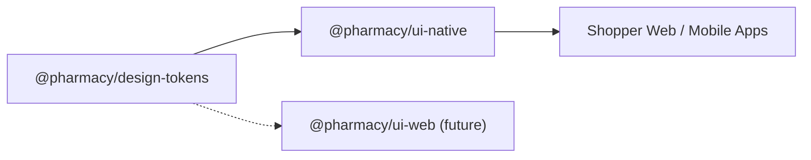

# UI Component Libraries

<cite>
**Referenced Files in This Document**
- [packages/ui-web/package.json](file://packages/ui-web/package.json)
- [packages/ui-web/src/index.ts](file://packages/ui-web/src/index.ts)
- [packages/ui-native/package.json](file://packages/ui-native/package.json)
- [packages/ui-native/src/index.ts](file://packages/ui-native/src/index.ts)
- [packages/ui-native/src/theme.tsx](file://packages/ui-native/src/theme.tsx)
- [packages/ui-native/src/kit.ts](file://packages/ui-native/src/kit.ts)
- [packages/design-tokens/package.json](file://packages/design-tokens/package.json)
- [packages/design-tokens/src/index.ts](file://packages/design-tokens/src/index.ts)
</cite>

## Table of Contents
1. Introduction
2. Project Structure
3. Core Components
4. Architecture Overview
5. Detailed Component Analysis
6. Dependency Analysis
7. Performance Considerations
8. Troubleshooting Guide
9. Conclusion
10. Appendices

## Introduction
This document describes the UI component libraries that provide consistent user interfaces across web and mobile applications. It covers:
- ui-web: A React-based package for web, currently exposing a minimal entry point and intended to be extended with Tailwind CSS–based components.
- ui-native: A React Native design system package providing theming, primitives, layout, overlays, and customer-specific UI composition.
- design-tokens: A platform-neutral token library centralizing semantic tokens, legacy compatibility, and theme resolution.

The goal is to enable consistent, accessible, and performant UIs across platforms by composing shared tokens and platform-appropriate components.

## Project Structure
At a high level:
- design-tokens defines semantic themes, legacy tokens, and default exports consumed by other packages.
- ui-native builds on design-tokens to provide a React Native ThemeProvider, useTheme hook, and a kit of spacing, color, typography, radius, shadows, and text styles. It also exposes primitives, layout, overlays, and a CustomerUI namespace.
- ui-web currently provides a small module identifier and is structured for future Tailwind-based React components.

**Diagram sources**
- [packages/design-tokens/src/index.ts:1-20](file://packages/design-tokens/src/index.ts#L1-L20)
- [packages/ui-native/src/index.ts:1-9](file://packages/ui-native/src/index.ts#L1-L9)
- [packages/ui-web/src/index.ts:1-4](file://packages/ui-web/src/index.ts#L1-L4)

**Section sources**
- [packages/design-tokens/package.json:1-20](file://packages/design-tokens/package.json#L1-L20)
- [packages/ui-native/package.json:1-38](file://packages/ui-native/package.json#L1-L38)
- [packages/ui-web/package.json:1-7](file://packages/ui-web/package.json#L1-L7)

## Core Components
- design-tokens
  - Exposes semantic themes (light/dark), legacy tokens, and a default theme for backward compatibility.
  - Provides a unified export surface for consumers to resolve themes consistently.

- ui-native
  - ThemeProvider and useTheme: Provide light/dark mode, RTL direction, and computed native shadows/colors.
  - kit: Centralized tokens for spacing, colors (light/dark), radius, shadows, typography scales, and font families.
  - Public API surface: primitives, layout, overlays, and a CustomerUI namespace for domain-specific components.

- ui-web
  - Current entry point identifies the package; intended to host Tailwind-based React components in the future.

**Section sources**
- [packages/design-tokens/src/index.ts:1-20](file://packages/design-tokens/src/index.ts#L1-L20)
- [packages/ui-native/src/theme.tsx:1-128](file://packages/ui-native/src/theme.tsx#L1-L128)
- [packages/ui-native/src/kit.ts:1-109](file://packages/ui-native/src/kit.ts#L1-L109)
- [packages/ui-native/src/index.ts:1-9](file://packages/ui-native/src/index.ts#L1-L9)
- [packages/ui-web/src/index.ts:1-4](file://packages/ui-web/src/index.ts#L1-L4)

## Architecture Overview
The architecture separates concerns into tokens, theming, and platform-specific components:
- design-tokens is the single source of truth for semantic values and theme resolution.
- ui-native consumes tokens to build a runtime theme context with platform-aware styling (shadows, colors, RTL).
- ui-web will consume tokens and compose Tailwind utilities for consistent web UI.

**Diagram sources**
- [packages/ui-native/src/theme.tsx:1-128](file://packages/ui-native/src/theme.tsx#L1-L128)
- [packages/ui-native/src/kit.ts:1-109](file://packages/ui-native/src/kit.ts#L1-L109)
- [packages/design-tokens/src/index.ts:1-20](file://packages/design-tokens/src/index.ts#L1-L20)

## Detailed Component Analysis

### design-tokens
- Purpose: Centralize design tokens and theme resolution across platforms.
- Exports:
  - semantic: light/dark themes and semantic naming.
  - legacy: backward-compatible theme and colors.
  - luxury: additional token sets.
  - default: legacy theme for compatibility; alias designTokens for semantic light theme.

Usage patterns:
- Import semantic themes directly for new code.
- Use default or legacy exports where existing contracts require them.

**Section sources**
- [packages/design-tokens/src/index.ts:1-20](file://packages/design-tokens/src/index.ts#L1-L20)
- [packages/design-tokens/package.json:1-20](file://packages/design-tokens/package.json#L1-L20)

### ui-native Theming (ThemeProvider and useTheme)
- ThemeProvider props:
  - children: React tree to wrap.
  - initialPreference: "light" | "dark" | "system".
  - systemColorScheme: fallback when preference is "system".
  - isRTL: boolean to set text direction.
- Context value:
  - theme: NativeTheme combining semantic tokens with platform-specific shadows and colors.
  - mode: resolved theme name ("light" | "dark").
  - preference: current user/system preference.
  - isRTL, isDark: booleans for direction and dark mode.
  - setPreference, toggleTheme: controls to switch modes.

Runtime behavior:
- Resolves theme based on preference and system scheme.
- Computes platform-specific shadow styles and merges dark/light color palettes from kit.
- Provides memoized context value to minimize re-renders.

**Diagram sources**
- [packages/ui-native/src/theme.tsx:1-128](file://packages/ui-native/src/theme.tsx#L1-L128)

**Section sources**
- [packages/ui-native/src/theme.tsx:1-128](file://packages/ui-native/src/theme.tsx#L1-L128)

### ui-native Kit (tokens and helpers)
- Spacing: numeric scale and named tokens (xs, sm, md, lg, xl, etc.).
- Colors: light and dark palettes including accent, ink, surfaces, lines, semantic states (success, warn, danger), and interactive states (hover, pressed, focus ring).
- Radius: corner radii for controls, cards, sheets, and pills.
- Shadows: platform-aware shadow definitions using React Native’s Platform.select.
- Typography: type scale (display, title, heading, body, caption, micro, price variants), textStyle presets, and font family names.

Platform considerations:
- Shadows are adapted per platform (iOS vs Android).
- Color tokens support both light and dark modes via kit.color and kit.darkColor.

**Section sources**
- [packages/ui-native/src/kit.ts:1-109](file://packages/ui-native/src/kit.ts#L1-L109)

### ui-native Public API Surface
- Entry index re-exports:
  - ThemeProvider, useTheme, and theme types/values.
  - kit and defaultKit.
  - Primitives, layout, and overlays components.
  - CustomerUI namespace for customer-facing components.

Integration guidance:
- Wrap your app with ThemeProvider to supply theme context.
- Compose screens using primitives, layout, and overlays.
- Use CustomerUI for domain-specific compositions.

**Section sources**
- [packages/ui-native/src/index.ts:1-9](file://packages/ui-native/src/index.ts#L1-L9)

### ui-web Package
- Current state: Minimal module identifier for @pharmacy/ui-web.
- Intended scope: React components styled with Tailwind CSS for consistent web UI.
- Future integration: Will likely consume design-tokens and align with ui-native semantics for cross-platform consistency.

**Section sources**
- [packages/ui-web/package.json:1-7](file://packages/ui-web/package.json#L1-L7)
- [packages/ui-web/src/index.ts:1-4](file://packages/ui-web/src/index.ts#L1-L4)

## Dependency Analysis
- ui-native depends on design-tokens for semantic themes and theme resolution.
- ui-native declares peer dependencies for React, React Native, Reanimated, Safe Area Context, Expo Vector Icons, and Haptics.
- design-tokens has no runtime dependencies and is designed to be platform-neutral.
- ui-web currently has no runtime dependencies beyond its own package metadata.

**Diagram sources**
- [packages/ui-native/package.json:1-38](file://packages/ui-native/package.json#L1-L38)
- [packages/design-tokens/package.json:1-20](file://packages/design-tokens/package.json#L1-L20)

**Section sources**
- [packages/ui-native/package.json:1-38](file://packages/ui-native/package.json#L1-L38)
- [packages/design-tokens/package.json:1-20](file://packages/design-tokens/package.json#L1-L20)

## Performance Considerations
- Theme context stability: ThemeProvider uses memoization to avoid unnecessary re-renders when inputs (isRTL, mode, preference, isDark) do not change.
- Platform-specific styling: Shadow computation is centralized and computed once per theme resolution to reduce per-component overhead.
- Token reuse: The kit centralizes tokens to prevent duplication and ensure consistent rendering across components.
- Bundle size: Keep ui-web lean until components are added; leverage Tailwind utilities at the app layer to avoid heavy bundling in the package.

[No sources needed since this section provides general guidance]

## Troubleshooting Guide
Common issues and resolutions:
- Theme not applying in web builds: Ensure ThemeProvider wraps the root of your app and that isRTL reflects your language layer configuration.
- Incorrect shadows on certain platforms: Verify Platform detection and that shadow tokens are used correctly; iOS uses shadow properties while Android uses elevation.
- Missing peer dependencies: Install required peer dependencies declared by ui-native (React, React Native, Reanimated, Safe Area Context, Expo Vector Icons, Haptics).
- Legacy theme usage: Prefer semantic tokens; use legacy/default only when maintaining older contracts.

**Section sources**
- [packages/ui-native/src/theme.tsx:1-128](file://packages/ui-native/src/theme.tsx#L1-L128)
- [packages/ui-native/package.json:1-38](file://packages/ui-native/package.json#L1-L38)

## Conclusion
The UI libraries establish a clear separation between tokens, theming, and platform-specific components. design-tokens centralizes visual language, ui-native provides a robust React Native theming system and reusable components, and ui-web is positioned for Tailwind-based web components. Together, they enable consistent, accessible, and performant experiences across platforms.

[No sources needed since this section summarizes without analyzing specific files]

## Appendices

### Integration Examples

- Web (Tailwind-based components):
  - Plan to import Tailwind utilities and compose components that mirror ui-native semantics.
  - Reference ui-web package for future component APIs.

- Mobile (React Native):
  - Wrap your app with ThemeProvider and configure initialPreference, systemColorScheme, and isRTL.
  - Use primitives, layout, overlays, and CustomerUI to build screens.
  - Access theme values via useTheme for dynamic styling and accessibility.

[No sources needed since this section provides general guidance]