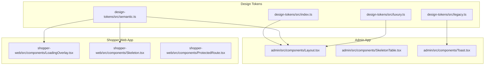
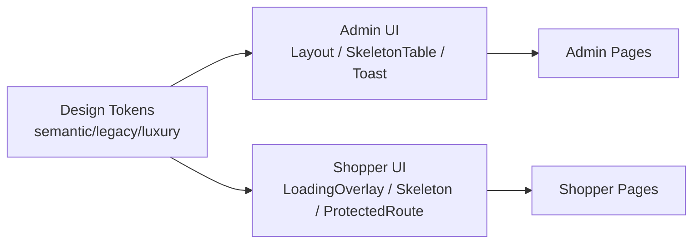
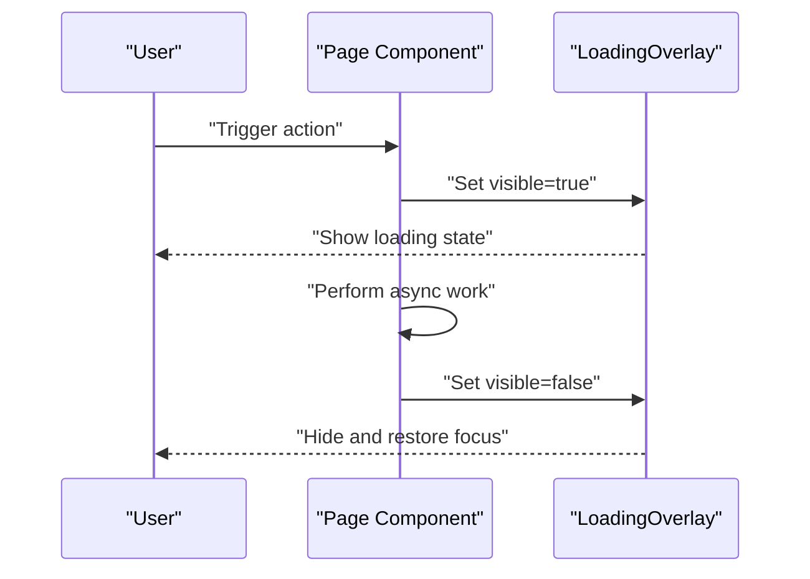
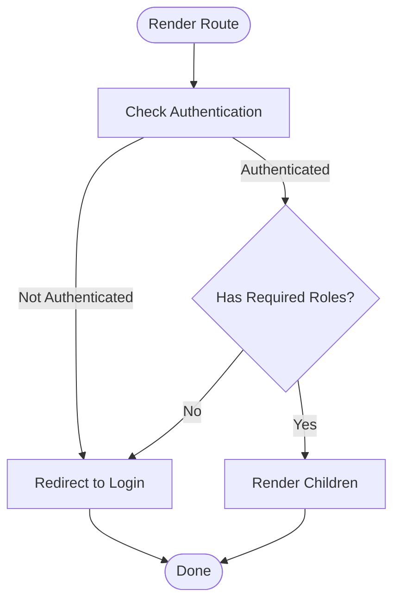
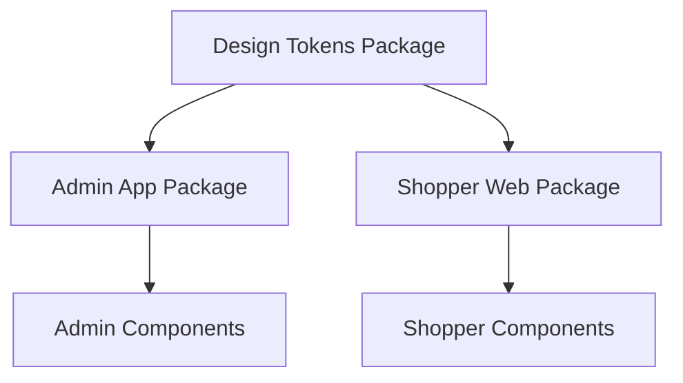

# Web Components Library

<cite>
**Referenced Files in This Document**
- [package.json](file://packages/ui-web/package.json)
- [package.json](file://apps/shopper-web/package.json)
- [package.json](file://apps/admin/package.json)
- [package.json](file://packages/design-tokens/package.json)
- [index.ts](file://packages/design-tokens/src/index.ts)
- [legacy.ts](file://packages/design-tokens/src/legacy.ts)
- [luxury.ts](file://packages/design-tokens/src/luxury.ts)
- [semantic.ts](file://packages/design-tokens/src/semantic.ts)
- [Layout.tsx](file://apps/admin/src/components/Layout.tsx)
- [SkeletonTable.tsx](file://apps/admin/src/components/SkeletonTable.tsx)
- [Toast.tsx](file://apps/admin/src/components/Toast.tsx)
- [LoadingOverlay.tsx](file://apps/shopper-web/src/components/LoadingOverlay.tsx)
- [Skeleton.tsx](file://apps/shopper-web/src/components/Skeleton.tsx)
- [ProtectedRoute.tsx](file://apps/shopper-web/src/components/ProtectedRoute.tsx)
</cite>

## Table of Contents
1. [Introduction](#introduction)
2. [Project Structure](#project-structure)
3. [Core Components](#core-components)
4. [Architecture Overview](#architecture-overview)
5. [Detailed Component Analysis](#detailed-component-analysis)
6. [Dependency Analysis](#dependency-analysis)
7. [Performance Considerations](#performance-considerations)
8. [Troubleshooting Guide](#troubleshooting-guide)
9. [Conclusion](#conclusion)
10. [Appendices](#appendices)

## Introduction
This document describes the web components library built with React and Tailwind CSS across the repository’s web applications. It consolidates available UI primitives, composition patterns, accessibility considerations, responsive design practices, and integration guidelines for consistent UI implementation. The scope includes shared design tokens, reusable UI building blocks (loading states, skeletons, toasts), and application-level layout and routing utilities used by the admin and shopper web apps.

## Project Structure
The web component surface is distributed across:
- Shared design tokens that define semantic colors, typography, spacing, and theme variants.
- Application-specific UI components in the admin and shopper web apps.
- A dedicated ui-web package scaffold intended for future shared web components.

**Diagram sources**
- [index.ts](file://packages/design-tokens/src/index.ts)
- [semantic.ts](file://packages/design-tokens/src/semantic.ts)
- [legacy.ts](file://packages/design-tokens/src/legacy.ts)
- [luxury.ts](file://packages/design-tokens/src/luxury.ts)
- [Layout.tsx](file://apps/admin/src/components/Layout.tsx)
- [SkeletonTable.tsx](file://apps/admin/src/components/SkeletonTable.tsx)
- [Toast.tsx](file://apps/admin/src/components/Toast.tsx)
- [LoadingOverlay.tsx](file://apps/shopper-web/src/components/LoadingOverlay.tsx)
- [Skeleton.tsx](file://apps/shopper-web/src/components/Skeleton.tsx)
- [ProtectedRoute.tsx](file://apps/shopper-web/src/components/ProtectedRoute.tsx)

**Section sources**
- [package.json](file://packages/ui-web/package.json)
- [package.json](file://apps/shopper-web/package.json)
- [package.json](file://apps/admin/package.json)
- [package.json](file://packages/design-tokens/package.json)

## Core Components
Below are the primary UI building blocks identified in the codebase. Each entry lists purpose, typical props, events, styling approach, and usage guidance.

- Layout (Admin)
  - Purpose: Provides page shell, navigation scaffolding, and content area for admin pages.
  - Props: Typically accepts children; may accept flags for sidebar state or header visibility depending on usage.
  - Events: None intrinsic; delegates user interactions to child pages.
  - Styling: Uses Tailwind utility classes; aligns with design tokens for spacing and color.
  - Accessibility: Ensure semantic landmarks (header, main, nav) are present within the layout.
  - Usage: Wrap admin routes/pages to provide consistent chrome.

- SkeletonTable (Admin)
  - Purpose: Displays a table-shaped loading skeleton during data fetches.
  - Props: Rows count, columns count, variant (e.g., compact/full).
  - Events: None.
  - Styling: Tailwind-based shimmer placeholders matching table structure.
  - Accessibility: Use aria-busy and role="status" where appropriate to indicate loading context.
  - Usage: Replace table rows while async data loads.

- Toast (Admin)
  - Purpose: Presents transient notifications (success, error, info).
  - Props: Message, type, duration, onClose callback, position.
  - Events: onClose triggered when dismissed or auto-expired.
  - Styling: Tailwind classes; theme-aware via design tokens.
  - Accessibility: Announce messages to screen readers using aria-live regions; ensure focus management on open/close.
  - Usage: Trigger from actions like form submissions or API responses.

- LoadingOverlay (Shopper Web)
  - Purpose: Full-screen or contextual overlay indicating loading state.
  - Props: Visible flag, message, size variant, preventClose.
  - Events: None; controlled by parent state.
  - Styling: Tailwind utilities; overlays content without blocking interaction unless configured.
  - Accessibility: Provide descriptive aria-label and role="alert" for critical loading states.
  - Usage: Show during route transitions or heavy operations.

- Skeleton (Shopper Web)
  - Purpose: Generic placeholder for text, images, or cards while content loads.
  - Props: Type (text/image/card), width/height, animation variant.
  - Events: None.
  - Styling: Tailwind-based shimmer animations aligned with brand tokens.
  - Accessibility: Avoid interactive elements inside skeletons; use inert or aria-hidden if needed.
  - Usage: Wrap dynamic content areas to prevent layout shifts.

- ProtectedRoute (Shopper Web)
  - Purpose: Guards routes based on authentication/authorization state.
  - Props: Required roles or permissions, redirect path, children.
  - Events: None; redirects internally.
  - Styling: Not applicable; behavior-driven.
  - Accessibility: Redirects should preserve focus and announce changes via router semantics.
  - Usage: Wrap private routes to enforce access control.

**Section sources**
- [Layout.tsx](file://apps/admin/src/components/Layout.tsx)
- [SkeletonTable.tsx](file://apps/admin/src/components/SkeletonTable.tsx)
- [Toast.tsx](file://apps/admin/src/components/Toast.tsx)
- [LoadingOverlay.tsx](file://apps/shopper-web/src/components/LoadingOverlay.tsx)
- [Skeleton.tsx](file://apps/shopper-web/src/components/Skeleton.tsx)
- [ProtectedRoute.tsx](file://apps/shopper-web/src/components/ProtectedRoute.tsx)

## Architecture Overview
The web components architecture centers on shared design tokens consumed by application-specific components. Admin and shopper apps compose these primitives to build feature screens consistently.

**Diagram sources**
- [semantic.ts](file://packages/design-tokens/src/semantic.ts)
- [legacy.ts](file://packages/design-tokens/src/legacy.ts)
- [luxury.ts](file://packages/design-tokens/src/luxury.ts)
- [Layout.tsx](file://apps/admin/src/components/Layout.tsx)
- [SkeletonTable.tsx](file://apps/admin/src/components/SkeletonTable.tsx)
- [Toast.tsx](file://apps/admin/src/components/Toast.tsx)
- [LoadingOverlay.tsx](file://apps/shopper-web/src/components/LoadingOverlay.tsx)
- [Skeleton.tsx](file://apps/shopper-web/src/components/Skeleton.tsx)
- [ProtectedRoute.tsx](file://apps/shopper-web/src/components/ProtectedRoute.tsx)

## Detailed Component Analysis

### Design Tokens
- Semantic tokens: Centralized definitions for colors, typography, spacing, and elevation used across components.
- Legacy tokens: Backward-compatible aliases for older naming conventions.
- Luxury tokens: Premium visual variants for enhanced UI treatments.
- Index: Aggregates and exports token sets for consumption by apps.

Usage pattern:
- Import tokens into Tailwind configuration or component styles to ensure consistency.
- Prefer semantic tokens over hard-coded values to maintain theming and dark mode support.

**Section sources**
- [index.ts](file://packages/design-tokens/src/index.ts)
- [semantic.ts](file://packages/design-tokens/src/semantic.ts)
- [legacy.ts](file://packages/design-tokens/src/legacy.ts)
- [luxury.ts](file://packages/design-tokens/src/luxury.ts)

### Admin Layout
- Composition: Wraps page content with header, navigation, and main sections.
- Responsiveness: Collapsible sidebar on smaller screens; grid/flex layouts adapt to viewport.
- Accessibility: Semantic HTML landmarks; keyboard navigable menu items; focus traps not required at this level.
- Styling: Tailwind utilities; token-driven spacing and colors.

Best practices:
- Keep Layout stateless where possible; manage sidebar state in parent if needed.
- Ensure all interactive elements have proper labels and roles.

**Section sources**
- [Layout.tsx](file://apps/admin/src/components/Layout.tsx)

### Admin SkeletonTable
- Behavior: Renders a structured placeholder mimicking table dimensions.
- Props: Row/column counts; optional variant for density.
- Performance: Lightweight; avoid excessive row counts to prevent layout thrash.
- Accessibility: Indicate loading context with aria-busy or status roles around the table region.

Integration:
- Swap SkeletonTable with real table once data resolves.
- Combine with optimistic updates for perceived performance.

**Section sources**
- [SkeletonTable.tsx](file://apps/admin/src/components/SkeletonTable.tsx)

### Admin Toast
- Behavior: Displays time-limited notifications; supports multiple types.
- Props: Message, type, duration, onClose, position.
- Event handling: Dismiss via click or timeout; propagate onClose to parent.
- Accessibility: Use aria-live="polite" or "assertive" appropriately; ensure focus is managed when opening/closing.

Patterns:
- Centralize toast manager in app root to avoid prop drilling.
- Queue multiple toasts to prevent overlap.

**Section sources**
- [Toast.tsx](file://apps/admin/src/components/Toast.tsx)

### Shopper LoadingOverlay
- Behavior: Shows an overlay during long-running tasks; can be full-screen or contextual.
- Props: Visibility, message, size, preventClose.
- Interaction: Prevents background interaction when active; returns focus on close.
- Accessibility: Role="dialog" or "alert" as appropriate; include descriptive label.

Flow:

**Diagram sources**
- [LoadingOverlay.tsx](file://apps/shopper-web/src/components/LoadingOverlay.tsx)

**Section sources**
- [LoadingOverlay.tsx](file://apps/shopper-web/src/components/LoadingOverlay.tsx)

### Shopper Skeleton
- Behavior: Placeholder shapes for content blocks; prevents layout shift.
- Props: Type, dimensions, animation variant.
- Styling: Tailwind shimmer; token-aligned colors.
- Accessibility: Non-interactive; hide from assistive tech if necessary.

Usage:
- Wrap dynamic content areas; remove on data load.
- Combine with Suspense boundaries for streaming UX.

**Section sources**
- [Skeleton.tsx](file://apps/shopper-web/src/components/Skeleton.tsx)

### Shopper ProtectedRoute
- Behavior: Guards routes based on auth state and roles; redirects unauthenticated users.
- Props: Required roles/permissions, redirect path, children.
- Flow:

**Diagram sources**
- [ProtectedRoute.tsx](file://apps/shopper-web/src/components/ProtectedRoute.tsx)

**Section sources**
- [ProtectedRoute.tsx](file://apps/shopper-web/src/components/ProtectedRoute.tsx)

## Dependency Analysis
- Design tokens are consumed by both admin and shopper apps to ensure consistent theming.
- Admin app depends on React, Tailwind, and common UI libraries; uses Zustand for state and react-hook-form for forms.
- Shopper web app uses Vite, Tailwind, and performance-oriented libraries for virtualization and charts.

**Diagram sources**
- [package.json](file://packages/design-tokens/package.json)
- [package.json](file://apps/admin/package.json)
- [package.json](file://apps/shopper-web/package.json)

**Section sources**
- [package.json](file://packages/design-tokens/package.json)
- [package.json](file://apps/admin/package.json)
- [package.json](file://apps/shopper-web/package.json)

## Performance Considerations
- Prefer skeletons and loading overlays to reduce perceived latency and layout shifts.
- Use virtualization for large lists where applicable (already present in dependencies).
- Defer non-critical rendering behind Suspense or lazy loading.
- Minimize re-renders by memoizing expensive components and avoiding unnecessary state updates.
- Leverage Tailwind’s utility-first approach to keep CSS bundles small and tree-shake unused styles.

[No sources needed since this section provides general guidance]

## Troubleshooting Guide
- Toast not announcing to screen readers: Ensure aria-live attributes are set and focus is managed on open/close.
- Skeleton causing layout shift: Verify fixed dimensions and aspect ratios; avoid variable widths.
- LoadingOverlay not trapping focus: Confirm focus trap logic and return focus to trigger element on close.
- ProtectedRoute redirect loops: Validate auth checks and role guards; ensure redirect paths do not require the same guard.

**Section sources**
- [Toast.tsx](file://apps/admin/src/components/Toast.tsx)
- [Skeleton.tsx](file://apps/shopper-web/src/components/Skeleton.tsx)
- [LoadingOverlay.tsx](file://apps/shopper-web/src/components/LoadingOverlay.tsx)
- [ProtectedRoute.tsx](file://apps/shopper-web/src/components/ProtectedRoute.tsx)

## Conclusion
The web components library leverages shared design tokens and Tailwind CSS to deliver consistent, accessible, and responsive UI across admin and shopper web applications. By composing primitives such as Layout, SkeletonTable, Toast, LoadingOverlay, Skeleton, and ProtectedRoute, teams can maintain a unified design language while optimizing performance and user experience. Adopting the patterns outlined here will streamline development and ensure scalable UI growth.

[No sources needed since this section summarizes without analyzing specific files]

## Appendices

### Integration Guidelines
- Add design tokens to your Tailwind configuration to enable token-driven styling.
- Compose pages using Layout and wrap data-heavy sections with Skeleton or LoadingOverlay.
- Manage global notifications through a centralized toast system.
- Protect routes with ProtectedRoute to enforce authentication and authorization.

[No sources needed since this section provides general guidance]