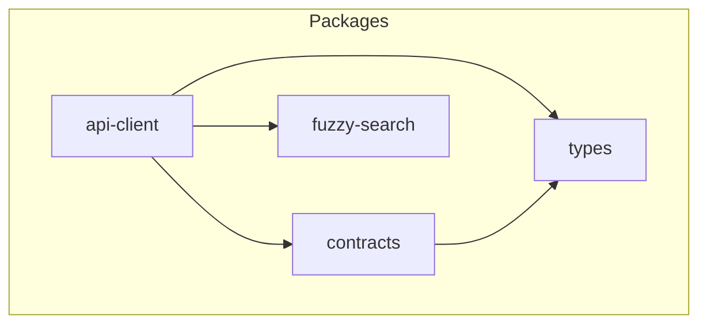
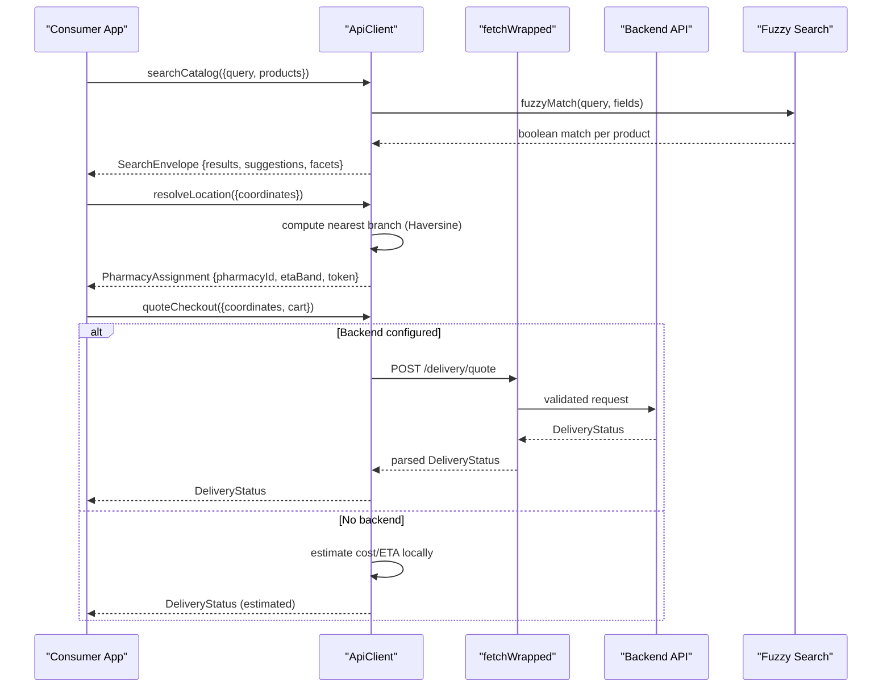
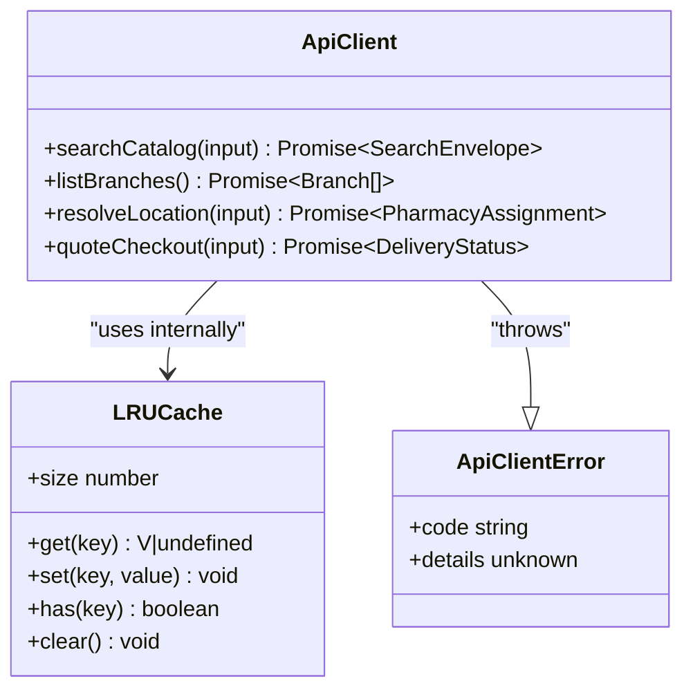
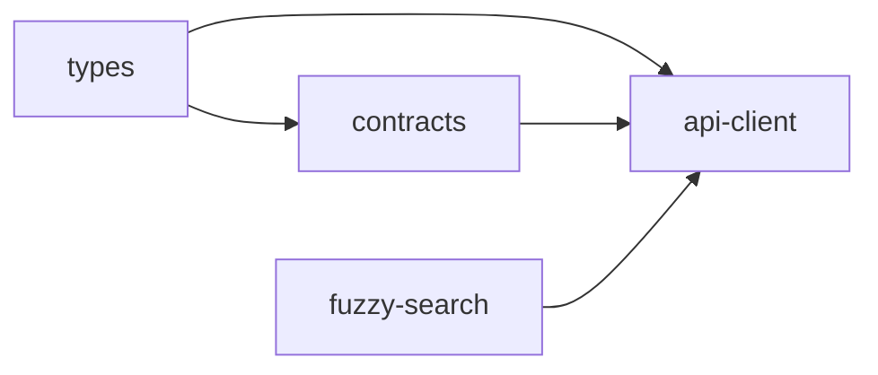

# Utility & Infrastructure Packages

<cite>
**Referenced Files in This Document**
- [index.ts](file://packages/api-client/src/index.ts)
- [index.ts](file://packages/contracts/src/index.ts)
- [apiResponse.ts](file://packages/contracts/src/apiResponse.ts)
- [branch.ts](file://packages/contracts/src/branch.ts)
- [delivery.ts](file://packages/contracts/src/delivery.ts)
- [orderStatus.ts](file://packages/contracts/src/orderStatus.ts)
- [index.ts](file://packages/types/src/index.ts)
- [index.ts](file://packages/fuzzy-search/src/index.ts)
</cite>

## Table of Contents
1. Introduction
2. Project Structure
3. Core Components
4. Architecture Overview
5. Detailed Component Analysis
6. Dependency Analysis
7. Performance Considerations
8. Troubleshooting Guide
9. Conclusion

## Introduction
This document describes the utility and infrastructure packages that power shared services across applications:
- api-client: Centralized backend communication, request handling, error management, search envelope building, location resolution, delivery quoting, and fallback strategies.
- contracts: Shared TypeScript interfaces and Zod schemas ensuring consistent API contracts between clients and servers.
- types: Reusable TypeScript types for cross-app data models (search results, coordinates, carts, orders, etc.).
- fuzzy-search: Advanced bilingual (Arabic/English) search with normalization, dictionary expansion, edit-distance tolerance, bigram similarity, and index-based candidate retrieval.

These packages are designed to be consumed by frontend apps (web/native) and server-side code to provide a unified experience for catalog search, branch assignment, and delivery quoting.

## Project Structure
The relevant packages live under packages/:
- @pharmacy/api-client: Exposes an ApiClient instance with methods for search, branch listing, location resolution, and checkout quoting. It uses contracts for response validation and fuzzy-search for local matching when no backend is configured.
- @pharmacy/contracts: Defines Zod schemas and TypeScript types for API responses, branches, delivery quotes, and order lifecycle states.
- @pharmacy/types: Declares domain-neutral types used by both client and server (e.g., SearchResultItem, Coordinates, CartSnapshot).
- @pharmacy/fuzzy-search: Implements normalisation, dictionary expansion, edit distance, bigram similarity, and index-based candidate retrieval.

**Diagram sources**
- [index.ts:1-18](file://packages/api-client/src/index.ts#L1-L18)
- [index.ts:1-8](file://packages/contracts/src/index.ts#L1-L8)
- [index.ts:1-50](file://packages/types/src/index.ts#L1-L50)
- [index.ts:1-41](file://packages/fuzzy-search/src/index.ts#L1-L41)

**Section sources**
- [index.ts:1-67](file://packages/api-client/src/index.ts#L1-L67)
- [index.ts:1-8](file://packages/contracts/src/index.ts#L1-L8)
- [index.ts:1-50](file://packages/types/src/index.ts#L1-L50)
- [index.ts:1-41](file://packages/fuzzy-search/src/index.ts#L1-L41)

## Core Components
- ApiClient: Provides searchCatalog, listBranches, resolveLocation, quoteCheckout. Uses Zod-validated fetchWrapped for backend calls; falls back to local logic when baseUrl is not set.
- Contracts: Centralizes API envelope schema and domain schemas (branches, delivery quotes, order statuses).
- Types: Defines reusable shapes like SearchEnvelope, SearchResultItem, Coordinates, CartSnapshot, DeliveryQuote, and tracking-related types.
- Fuzzy Search: Offers fuzzyMatch, fuzzyScore, buildSearchIndexImpl, queryIndexCandidates, expandSearchTerms, plus LRU caching and Arabic/English normalization.

Key responsibilities:
- Request/response validation via Zod schemas from contracts.
- Local search envelope generation using fuzzy-match over product lists.
- Location assignment based on nearest branch using Haversine distance.
- Delivery quoting via backend or local estimation.

**Section sources**
- [index.ts:40-67](file://packages/api-client/src/index.ts#L40-L67)
- [index.ts:87-122](file://packages/api-client/src/index.ts#L87-L122)
- [index.ts:196-213](file://packages/api-client/src/index.ts#L196-L213)
- [index.ts:242-342](file://packages/api-client/src/index.ts#L242-L342)
- [apiResponse.ts:1-30](file://packages/contracts/src/apiResponse.ts#L1-L30)
- [branch.ts:1-21](file://packages/contracts/src/branch.ts#L1-L21)
- [delivery.ts:1-67](file://packages/contracts/src/delivery.ts#L1-L67)
- [orderStatus.ts:59-168](file://packages/contracts/src/orderStatus.ts#L59-L168)
- [index.ts:1-191](file://packages/types/src/index.ts#L1-L191)
- [index.ts:75-100](file://packages/fuzzy-search/src/index.ts#L75-L100)
- [index.ts:922-963](file://packages/fuzzy-search/src/index.ts#L922-L963)
- [index.ts:981-1059](file://packages/fuzzy-search/src/index.ts#L981-L1059)
- [index.ts:1118-1151](file://packages/fuzzy-search/src/index.ts#L1118-L1151)
- [index.ts:1165-1223](file://packages/fuzzy-search/src/index.ts#L1165-L1223)
- [index.ts:1248-1333](file://packages/fuzzy-search/src/index.ts#L1248-L1333)

## Architecture Overview
The api-client orchestrates three primary flows:
- Catalog search: Builds a SearchEnvelope using fuzzy-match against provided products.
- Branch assignment: Finds nearest branch by Haversine distance and returns an assignment token and ETA band.
- Delivery quoting: Calls backend /delivery/quote when configured; otherwise estimates locally.

**Diagram sources**
- [index.ts:196-213](file://packages/api-client/src/index.ts#L196-L213)
- [index.ts:242-245](file://packages/api-client/src/index.ts#L242-L245)
- [index.ts:269-294](file://packages/api-client/src/index.ts#L269-L294)
- [index.ts:296-341](file://packages/api-client/src/index.ts#L296-L341)
- [index.ts:87-122](file://packages/api-client/src/index.ts#L87-L122)
- [index.ts:922-963](file://packages/fuzzy-search/src/index.ts#L922-L963)

## Detailed Component Analysis

### api-client
Responsibilities:
- Configuration: configureApiClient sets baseUrl, searchApiBase, defaultDeliveryFee, and optional branches.
- Request wrapper: fetchWrapped builds URLs, adds JSON content-type, parses JSON, validates via apiResponseSchema(dataSchema), and throws ApiClientError on invalid or failed responses.
- Search envelope: buildSearchEnvelope filters products using fuzzyMatch, deduplicates by id, builds suggestions, collections, and facets.
- Branch listing: listBranches prefers backend GET /branches; otherwise maps local branches to Branch type.
- Location resolution: resolveLocation computes nearest branch via Haversine, returns assignment token and ETA band.
- Checkout quoting: quoteCheckout prefers backend POST /delivery/quote; otherwise estimates locally using configuration defaults.

Configuration options:
- baseUrl: Base URL for backend endpoints.
- searchApiBase: Reserved for future search service integration.
- defaultDeliveryFee: Default fee used in local quote fallback.
- branches: Optional static branch list for local assignment fallback.

Usage patterns:
- Initialize once with configureApiClient(config).
- Obtain client via getApiClient() and call methods synchronously returning Promises.

Error handling:
- ApiClientError carries code, message, and details.
- Invalid response shape triggers INVALID_RESPONSE.
- Backend errors propagate their code/message/details.

Performance considerations:
- Local search avoids network calls and leverages fuzzy-search for fast filtering.
- Haversine computation is O(N) over configured branches; keep branch list small.
- Quote fallback is lightweight; prefer backend for accurate pricing.

Integration examples:
- Configure with baseUrl to enable full backend flow.
- Provide branches for offline/local development mode.

**Section sources**
- [index.ts:40-67](file://packages/api-client/src/index.ts#L40-L67)
- [index.ts:80-122](file://packages/api-client/src/index.ts#L80-L122)
- [index.ts:145-213](file://packages/api-client/src/index.ts#L145-L213)
- [index.ts:242-342](file://packages/api-client/src/index.ts#L242-L342)

#### Class and method relationships

**Diagram sources**
- [index.ts:47-52](file://packages/api-client/src/index.ts#L47-L52)
- [index.ts:69-78](file://packages/api-client/src/index.ts#L69-L78)
- [index.ts:47-69](file://packages/fuzzy-search/src/index.ts#L47-L69)

### contracts
Purpose:
- Define a uniform API envelope schema for success/error payloads.
- Provide strongly-typed schemas for Branch, DeliveryQuote, CartSnapshot, and Order Status lifecycle.

Key exports:
- apiResponseSchema(dataSchema): Discriminated union wrapping success/error.
- BranchSchema and Branch type: Branch metadata including coordinates and status.
- Delivery schemas: CartSnapshot, Eta, DeliveryQuoteRequest, DeliveryStatus, reason codes.
- Order status: Canonical statuses, labels, transitions, and normalization helpers.

Validation strategy:
- All backend responses are validated through apiResponseSchema before being returned to callers.
- Domain-specific schemas ensure structural correctness and type safety.

Usage patterns:
- Import schemas to validate incoming payloads.
- Use inferred types for compile-time safety across apps.

**Section sources**
- [apiResponse.ts:1-30](file://packages/contracts/src/apiResponse.ts#L1-L30)
- [branch.ts:1-21](file://packages/contracts/src/branch.ts#L1-L21)
- [delivery.ts:1-67](file://packages/contracts/src/delivery.ts#L1-L67)
- [orderStatus.ts:59-168](file://packages/contracts/src/orderStatus.ts#L59-L168)
- [index.ts:1-8](file://packages/contracts/src/index.ts#L1-L8)

### types
Purpose:
- Provide reusable TypeScript types for cross-package usage.

Highlights:
- LanguageCode, Coordinates, EtaBand, PharmacyBranch, PharmacyAssignment.
- SearchEnvelope, SearchResultItem, AdaptiveCollection, CatalogFacet.
- CartSnapshot, CheckoutDraft, CheckoutSubmission.
- Prescription and order tracking types.

Usage patterns:
- Import types where needed to maintain consistency across UI and services.
- Combine with contracts schemas for runtime validation and compile-time checks.

**Section sources**
- [index.ts:1-191](file://packages/types/src/index.ts#L1-L191)

### fuzzy-search
Capabilities:
- Normalization: Arabic hamza unification, tashkeel removal, taa marbuta conversion, alef maqsura, tatweel removal, punctuation handling.
- Dictionary expansion: Bidirectional mapping between Arabic and English pharmaceutical terms.
- Matching: Substring, token prefix, edit distance (Levenshtein), bigram Dice similarity.
- Indexing: Token index, 3-gram n-gram index, prefix index for fast candidate retrieval.
- Caching: LRU caches for normalization, match, and score computations.

Public API:
- normalise(text): Normalizes input strings.
- fuzzyMatch(query, fields): Boolean match decision.
- fuzzyScore(query, fields): Numeric ranking score.
- buildSearchIndexImpl(items): Build index from items.
- queryIndexCandidates(index, query): Retrieve candidate IDs efficiently.
- expandSearchTerms(rawQuery): Expand into SQL-ready terms for DB queries.
- clearFuzzyCache(): Clear internal caches.

Complexity and performance:
- Normalization and tokenization are O(L) per string.
- Edit distance uses early exit and reusable row arrays to minimize allocations.
- Bigram similarity is O(L) per pair with constant overhead.
- Index lookup reduces candidate set dramatically vs linear scan.

Usage patterns:
- Precompute indices for large catalogs and reuse across queries.
- Use fuzzyMatch for quick boolean checks; use fuzzyScore for ranking.
- Use expandSearchTerms for server-side ilike queries.

**Section sources**
- [index.ts:1-41](file://packages/fuzzy-search/src/index.ts#L1-L41)
- [index.ts:47-69](file://packages/fuzzy-search/src/index.ts#L47-L69)
- [index.ts:106-141](file://packages/fuzzy-search/src/index.ts#L106-L141)
- [index.ts:156-741](file://packages/fuzzy-search/src/index.ts#L156-L741)
- [index.ts:774-817](file://packages/fuzzy-search/src/index.ts#L774-L817)
- [index.ts:823-842](file://packages/fuzzy-search/src/index.ts#L823-L842)
- [index.ts:858-897](file://packages/fuzzy-search/src/index.ts#L858-L897)
- [index.ts:922-963](file://packages/fuzzy-search/src/index.ts#L922-L963)
- [index.ts:981-1059](file://packages/fuzzy-search/src/index.ts#L981-L1059)
- [index.ts:1118-1151](file://packages/fuzzy-search/src/index.ts#L1118-L1151)
- [index.ts:1165-1223](file://packages/fuzzy-search/src/index.ts#L1165-L1223)
- [index.ts:1248-1333](file://packages/fuzzy-search/src/index.ts#L1248-L1333)

## Dependency Analysis
- api-client depends on:
  - @pharmacy/types for domain types (SearchResultItem, Coordinates, etc.).
  - @pharmacy/contracts for Zod schemas (apiResponseSchema, BranchSchema, DeliveryStatusSchema).
  - @pharmacy/fuzzy-search for fuzzyMatch and related utilities.
- contracts depends on:
  - Zod for runtime validation and type inference.
  - Internal modules for geo, branch, delivery, orderStatus.
- types has no runtime dependencies; pure TypeScript definitions.
- fuzzy-search has no external dependencies beyond standard JS APIs.

**Diagram sources**
- [index.ts:1-18](file://packages/api-client/src/index.ts#L1-L18)
- [index.ts:1-8](file://packages/contracts/src/index.ts#L1-L8)
- [index.ts:1-50](file://packages/types/src/index.ts#L1-L50)
- [index.ts:1-41](file://packages/fuzzy-search/src/index.ts#L1-L41)

**Section sources**
- [index.ts:1-18](file://packages/api-client/src/index.ts#L1-L18)
- [index.ts:1-8](file://packages/contracts/src/index.ts#L1-L8)

## Performance Considerations
- Prefer backend endpoints when baseUrl is configured to offload heavy logic (pricing, routing).
- Keep configured branches minimal to reduce nearest-branch computation time.
- Use fuzzy-search index for large catalogs; avoid scanning entire product lists per query.
- Leverage LRU caches in fuzzy-search to amortize repeated normalizations and matches.
- Batch operations where possible (e.g., prebuild indices once per catalog snapshot).

[No sources needed since this section provides general guidance]

## Troubleshooting Guide
Common issues and resolutions:
- NO_BASE_URL: Occurs when calling fetchWrapped without configuring baseUrl. Ensure configureApiClient includes baseUrl.
- INVALID_RESPONSE: Indicates mismatched response shape; verify backend adheres to apiResponseSchema contract.
- Missing branches: resolveLocation requires at least one configured branch; supply branches or configure backend.
- Stale cache: If search behavior seems inconsistent, call clearFuzzyCache to reset internal caches.

Error propagation:
- ApiClientError wraps all client-side failures with structured code/message/details for consistent handling.

**Section sources**
- [index.ts:87-122](file://packages/api-client/src/index.ts#L87-L122)
- [index.ts:269-294](file://packages/api-client/src/index.ts#L269-L294)
- [index.ts:903-907](file://packages/fuzzy-search/src/index.ts#L903-L907)

## Conclusion
These packages form a cohesive foundation for shared functionality:
- api-client centralizes communication and provides robust fallbacks.
- contracts enforce consistent API contracts and domain rules.
- types offer reusable, well-defined shapes across the system.
- fuzzy-search delivers high-performance, bilingual search with advanced matching and indexing.

Adopting these packages ensures consistency, reliability, and scalability across web and native applications.