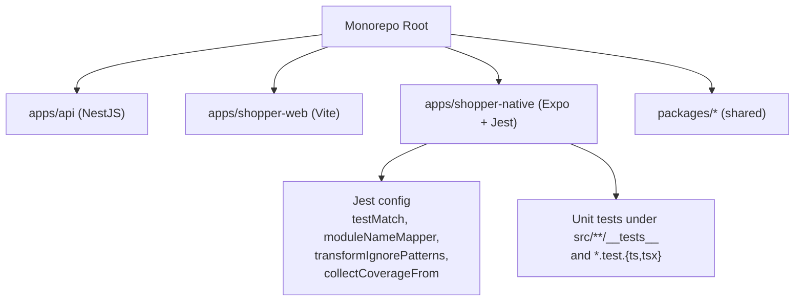
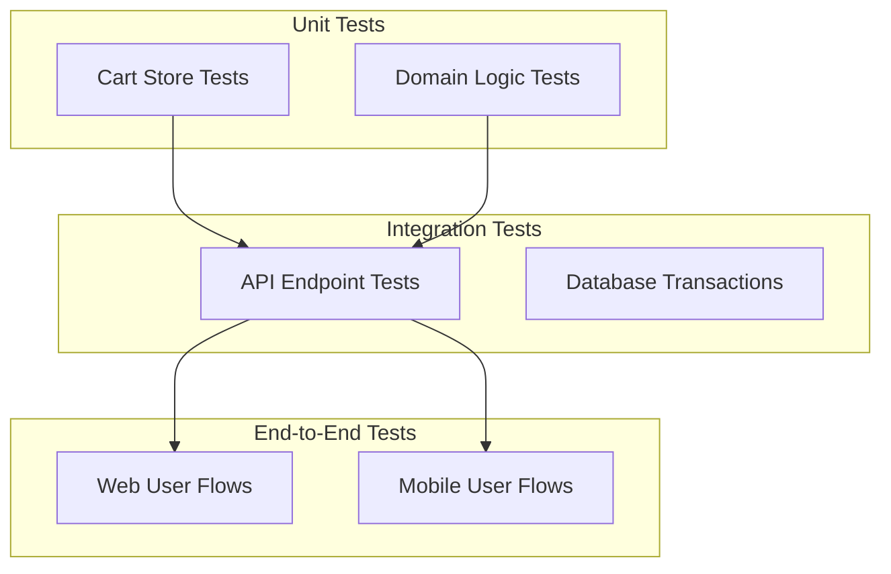
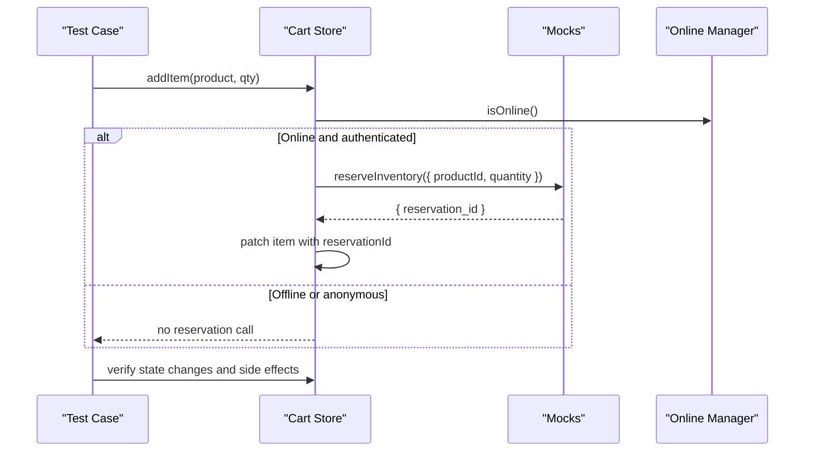
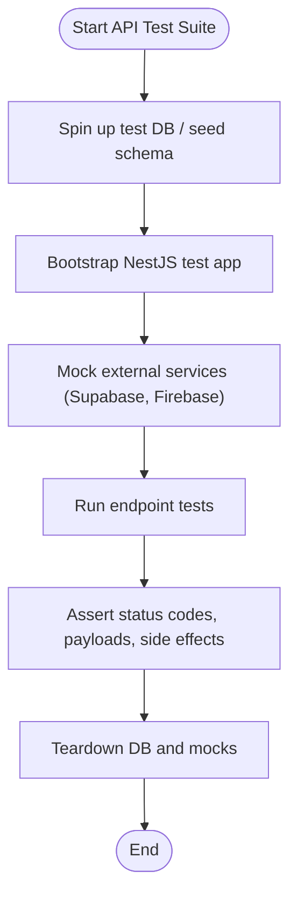
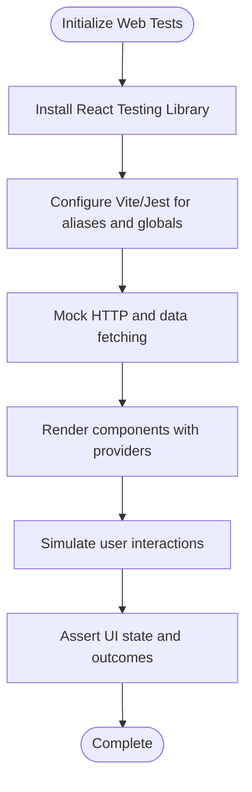
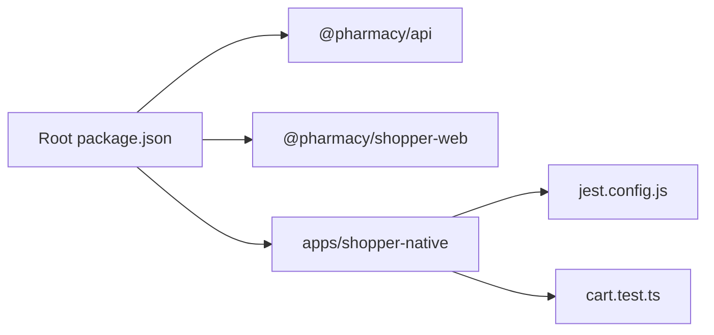

# Testing Strategy

<cite>
**Referenced Files in This Document**
- [jest.config.js](file://apps/shopper-native/jest.config.js)
- [cart.test.ts](file://apps/shopper-native/src/stores/__tests__/cart.test.ts)
- [package.json](file://package.json)
- [api package.json](file://apps/api/package.json)
- [shopper-web package.json](file://apps/shopper-web/package.json)
- [sync-npm-lockfile.yml](file://.github/workflows/sync-npm-lockfile.yml)
- [sync-root-lock.yml](file://.github/workflows/sync-root-lock.yml)
</cite>

## Table of Contents
1. Introduction
2. Project Structure
3. Core Components
4. Architecture Overview
5. Detailed Component Analysis
6. Dependency Analysis
7. Performance Considerations
8. Troubleshooting Guide
9. Conclusion

## Introduction
This document defines the testing strategy for the United Pharmacy monorepo across unit, integration, and end-to-end layers. It covers frameworks and tools, test organization, mocking strategies, continuous integration considerations, coverage expectations, and best practices for asynchronous operations, real-time features, and mobile-specific functionality. The guidance is grounded in the existing Jest configuration and tests for the shopper-native app, while providing a pragmatic plan to extend testing consistently across the API and web applications.

## Project Structure
The monorepo contains multiple apps and shared packages:
- apps/api: NestJS backend with Prisma and Supabase integrations.
- apps/shopper-web: Web application built with Vite.
- apps/shopper-native: React Native/Expo application with Jest-based unit tests.
- packages/*: Shared domain logic, contracts, UI libraries, and utilities.

Testing currently exists primarily in the shopper-native app using Jest with jest-expo preset. The API and web apps do not yet have dedicated test scripts or configurations in their package manifests.

**Diagram sources**
- [jest.config.js:1-32](file://apps/shopper-native/jest.config.js#L1-L32)
- [package.json:9-26](file://package.json#L9-L26)

**Section sources**
- [package.json:9-26](file://package.json#L9-L26)

## Core Components
- Jest configuration for Expo: Uses jest-expo preset, restricts tests to specific directories, maps path aliases, transforms necessary modules, sets up native testing extensions, and collects coverage for stores and feature code.
- Unit tests for cart store: Comprehensive coverage of state mutations, async reservation flows, error handling, race condition guards, and selectors. All external I/O is mocked to keep tests fast and deterministic.

Key aspects:
- Test discovery via testMatch patterns.
- Path alias mapping for @/ imports.
- Transform ignore patterns to handle React Native/Expo dependencies.
- Coverage collection scoped to stores and selected features.
- Extensive mocking of storage, analytics, crash reporting, inventory services, checkout helpers, and idempotency utilities.

**Section sources**
- [jest.config.js:1-32](file://apps/shopper-native/jest.config.js#L1-L32)
- [cart.test.ts:1-493](file://apps/shopper-native/src/stores/__tests__/cart.test.ts#L1-L493)

## Architecture Overview
The testing architecture spans three layers:
- Unit tests: Validate pure logic and state machines (e.g., cart store).
- Integration tests: Exercise API endpoints with a test database and mock external services.
- End-to-end tests: Simulate user workflows on web and mobile platforms.

[No sources needed since this diagram shows conceptual workflow, not actual code structure]

## Detailed Component Analysis

### Shopper-Native Unit Testing with Jest
- Framework: Jest with jest-expo preset.
- Scope: Tests located under src/**/__tests__ and *.test.{ts,tsx}.
- Environment: Node environment configured; setupFilesAfterEnv includes @testing-library/jest-native for native assertions.
- Module resolution: Path alias @/ mapped to src/.
- Transforms: Specific node_modules allowed for transformation (React Native, Expo, navigation, SVG, etc.).
- Coverage: Collected from src/features/loyalty and src/stores, excluding tests and index files.

Mocking strategy demonstrated in cart tests:
- Storage layer mocked for get/set operations.
- Analytics and crash reporter stubbed.
- Inventory service functions mocked (reserve, release, commit).
- Checkout helpers mocked to return deterministic pricing and eligibility.
- Idempotency key generator mocked to produce sequential keys for determinism.
- Network status via onlineManager spied to simulate offline behavior.

Test organization patterns:
- Grouped by feature methods (addItem, removeItem, updateQty, ensureReservations, commitReservations).
- Clear setup/reset per test lifecycle (beforeEach/afterEach).
- Helpers to construct product fixtures and reset store state.
- Assertions cover success paths, failure paths, edge cases, and race conditions.

**Diagram sources**
- [cart.test.ts:134-199](file://apps/shopper-native/src/stores/__tests__/cart.test.ts#L134-L199)
- [cart.test.ts:120-132](file://apps/shopper-native/src/stores/__tests__/cart.test.ts#L120-L132)

**Section sources**
- [jest.config.js:1-32](file://apps/shopper-native/jest.config.js#L1-L32)
- [cart.test.ts:1-493](file://apps/shopper-native/src/stores/__tests__/cart.test.ts#L1-L493)

### API Integration Testing Plan
Although the API package does not include test scripts or configurations in its manifest, a recommended approach is:
- Use NestJS testing utilities to bootstrap modules with a test database (e.g., Dockerized Postgres or Supabase test project).
- Mock external services (Supabase client, Firebase Admin, Socket.IO) where appropriate.
- Write controller/service tests for critical endpoints (auth, orders, inventory, drivers).
- Validate request/response schemas with Zod validators used in the API.
- Seed data via Prisma seed scripts for consistent test fixtures.

[No sources needed since this diagram shows conceptual workflow, not actual code structure]

### Web Application Testing Plan
The web app uses Vite and does not currently expose test scripts in its package manifest. Recommended steps:
- Add a test script using Vitest or Jest with React Testing Library for component tests.
- Configure module resolution to match Vite’s aliasing.
- Mock network calls (axios/fetch) and TanStack Query hooks to isolate components.
- Include accessibility and interaction tests for critical user flows (browse, search, cart, checkout).

[No sources needed since this diagram shows conceptual workflow, not actual code structure]

### Mobile-Specific Testing Strategies
- Use jest-expo preset to run tests without a full native runtime.
- Leverage @testing-library/jest-native for native-specific assertions.
- Stub platform APIs (GPS, push notifications, camera) when testing mobile-only features.
- For device-specific behaviors, consider running visual regression or manual QA on emulators/devices.

**Section sources**
- [jest.config.js:1-32](file://apps/shopper-native/jest.config.js#L1-L32)

## Dependency Analysis
Current testing dependencies and scripts:
- Root package manager and workspaces define apps and packages scope.
- Shopper-native has Jest configuration and tests.
- API and web apps lack test scripts in their package manifests.

**Diagram sources**
- [package.json:9-26](file://package.json#L9-L26)
- [jest.config.js:1-32](file://apps/shopper-native/jest.config.js#L1-L32)
- [cart.test.ts:1-493](file://apps/shopper-native/src/stores/__tests__/cart.test.ts#L1-L493)

**Section sources**
- [package.json:9-26](file://package.json#L9-L26)
- [api package.json:1-53](file://apps/api/package.json#L1-L53)
- [shopper-web package.json:1-26](file://apps/shopper-web/package.json#L1-L26)

## Performance Considerations
- Keep unit tests synchronous and fast by mocking all I/O (storage, analytics, inventory, checkout).
- Use selective coverage collection to focus on high-value areas (stores and loyalty features).
- Avoid heavy transformations in tests by configuring transformIgnorePatterns carefully.
- For integration tests, use lightweight databases and minimal seeds to reduce setup time.
- For e2e tests, parallelize suites and limit flaky interactions (network timeouts, animations).

[No sources needed since this section provides general guidance]

## Troubleshooting Guide
Common issues and resolutions:
- Jest cannot resolve @/ aliases: Ensure moduleNameMapper matches tsconfig paths.
- Native modules fail to transform: Adjust transformIgnorePatterns to allow required packages.
- Tests are slow due to real I/O: Verify all external dependencies are mocked; avoid real Supabase/Firebase calls in unit tests.
- Race conditions in async flows: Use controlled promises and timers to assert final state deterministically.
- Coverage gaps: Expand collectCoverageFrom to include additional features or domains as needed.

**Section sources**
- [jest.config.js:1-32](file://apps/shopper-native/jest.config.js#L1-L32)
- [cart.test.ts:120-132](file://apps/shopper-native/src/stores/__tests__/cart.test.ts#L120-L132)

## Conclusion
The monorepo currently implements robust unit testing for the shopper-native app using Jest and extensive mocking patterns. To achieve comprehensive quality assurance:
- Add integration tests for the API with a test database and mocked external services.
- Introduce component and interaction tests for the web app using React Testing Library.
- Establish e2e tests for critical user journeys across web and mobile.
- Standardize CI pipelines to run tests across apps and enforce coverage thresholds.
- Follow the established mocking and organization patterns to maintain fast, reliable, and maintainable tests.

[No sources needed since this section summarizes without analyzing specific files]