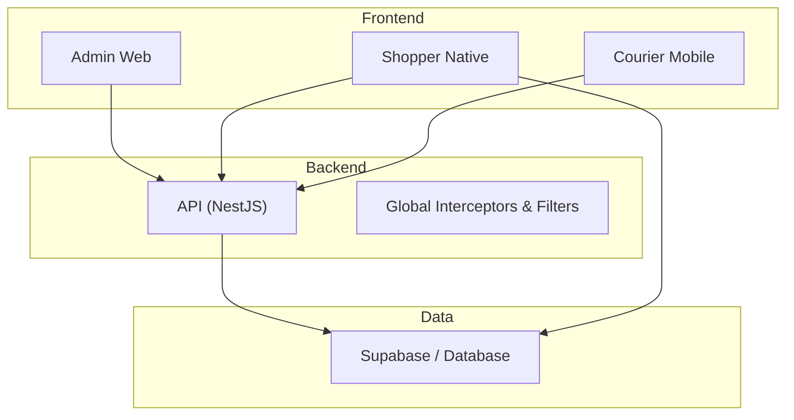
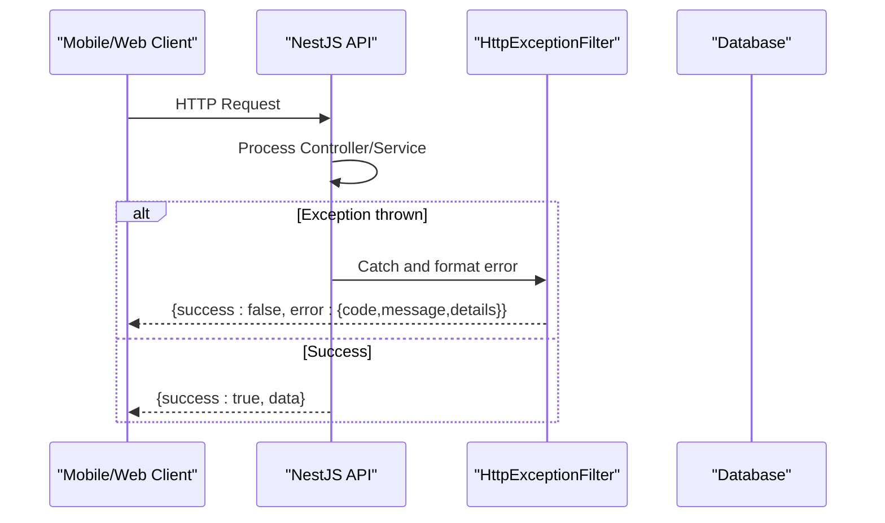
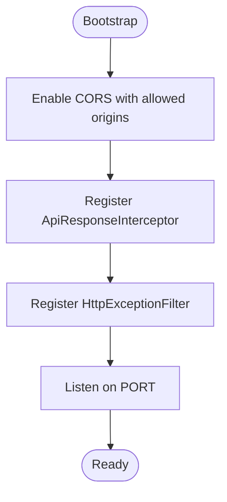
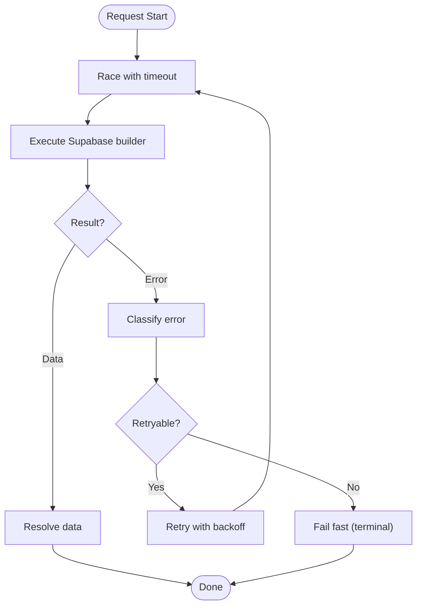
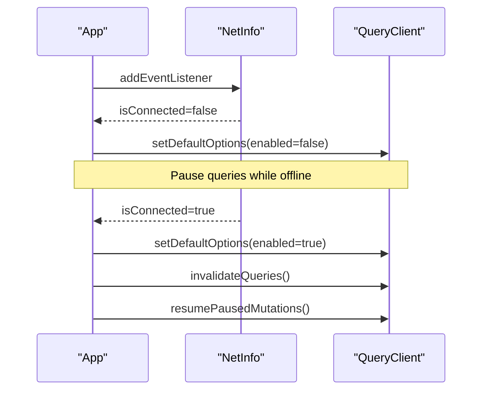
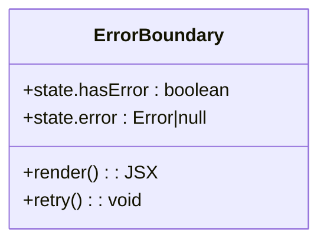
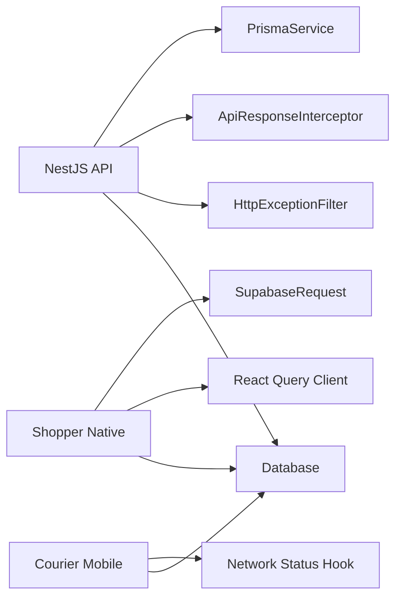

# Troubleshooting Guide

<cite>
**Referenced Files in This Document**
- [main.ts](file://apps/api/src/main.ts)
- [api-response.interceptor.ts](file://apps/api/src/common/api-response.interceptor.ts)
- [http-exception.filter.ts](file://apps/api/src/common/http-exception.filter.ts)
- [prisma.service.ts](file://apps/api/src/prisma/prisma.service.ts)
- [supabaseRequest.ts](file://apps/shopper-native/src/lib/supabaseRequest.ts)
- [queryClient.ts](file://apps/shopper-native/src/lib/queryClient.ts)
- [ErrorBoundary.tsx](file://apps/courier-mobile/src/components/ErrorBoundary.tsx)
- [useNetworkStatus.ts](file://apps/courier-mobile/src/hooks/useNetworkStatus.ts)
</cite>

## Table of Contents
1. Introduction
2. Project Structure
3. Core Components
4. Architecture Overview
5. Detailed Component Analysis
6. Dependency Analysis
7. Performance Considerations
8. Troubleshooting Guide
9. Conclusion
10. Appendices

## Introduction
This guide provides comprehensive troubleshooting for the United Pharmacy system across frontend applications, backend API, mobile apps, and database connectivity. It covers debugging techniques per environment, log analysis procedures, error diagnosis strategies, performance troubleshooting (slow queries, memory leaks, resource bottlenecks), mobile-specific issues (device compatibility, push notifications, location services), monitoring and alerting setup, diagnostic tools and commands, escalation procedures, known limitations, workarounds, and future improvements.

## Project Structure
The system is a multi-app monorepo with:
- Backend API (NestJS) exposing REST endpoints with global interceptors and filters
- Admin web app for operations
- Shopper native mobile app with robust offline-first data layer
- Courier mobile app with network status handling and UI error boundaries
- Shared libraries and Supabase integrations for data and auth

[No sources needed since this diagram shows conceptual workflow, not actual code structure]

## Core Components
- API bootstrap and CORS configuration
- Global response interceptor normalizing success payloads
- Global exception filter standardizing error responses
- Prisma service managing database lifecycle
- Mobile request helpers with timeouts and error classification
- React Query client tuned for mobile retry behavior and offline mode
- Network status hook to pause/resume queries on connectivity changes
- Error boundary component to catch and recover from UI crashes

**Section sources**
- [main.ts:7-35](file://apps/api/src/main.ts#L7-L35)
- [api-response.interceptor.ts:10-20](file://apps/api/src/common/api-response.interceptor.ts#L10-L20)
- [http-exception.filter.ts:9-43](file://apps/api/src/common/http-exception.filter.ts#L9-L43)
- [prisma.service.ts:4-12](file://apps/api/src/prisma/prisma.service.ts#L4-L12)
- [supabaseRequest.ts:23-97](file://apps/shopper-native/src/lib/supabaseRequest.ts#L23-L97)
- [queryClient.ts:32-57](file://apps/shopper-native/src/lib/queryClient.ts#L32-L57)
- [useNetworkStatus.ts:6-39](file://apps/courier-mobile/src/hooks/useNetworkStatus.ts#L6-L39)
- [ErrorBoundary.tsx:15-51](file://apps/courier-mobile/src/components/ErrorBoundary.tsx#L15-L51)

## Architecture Overview
The API bootstraps NestJS, enables strict CORS, applies a global response interceptor and exception filter, then listens on a configurable port. The shopper native app uses a timeout wrapper and error classifier to decide retries and handles terminal vs transient errors via React Query. The courier mobile app monitors network state to pause/refetch queries and resume mutations when connectivity returns.

**Diagram sources**
- [main.ts:7-35](file://apps/api/src/main.ts#L7-L35)
- [api-response.interceptor.ts:10-20](file://apps/api/src/common/api-response.interceptor.ts#L10-L20)
- [http-exception.filter.ts:9-43](file://apps/api/src/common/http-exception.filter.ts#L9-L43)

## Detailed Component Analysis

### API Bootstrap and Error Handling
- CORS is explicitly configured to allow specific origins and localhost patterns; preflight caching reduces OPTIONS overhead.
- Global response interceptor wraps successful responses into a consistent envelope.
- Global exception filter catches all exceptions and returns structured error objects including path and method details.
- Application logs startup message and exits on bootstrap failure.

**Diagram sources**
- [main.ts:7-35](file://apps/api/src/main.ts#L7-L35)
- [api-response.interceptor.ts:10-20](file://apps/api/src/common/api-response.interceptor.ts#L10-L20)
- [http-exception.filter.ts:9-43](file://apps/api/src/common/http-exception.filter.ts#L9-L43)

**Section sources**
- [main.ts:7-35](file://apps/api/src/main.ts#L7-L35)
- [api-response.interceptor.ts:10-20](file://apps/api/src/common/api-response.interceptor.ts#L10-L20)
- [http-exception.filter.ts:9-43](file://apps/api/src/common/http-exception.filter.ts#L9-L43)

### Database Connectivity (Prisma Service)
- Connects to the database on module initialization and disconnects on module destroy to prevent connection leaks.
- Use this service to ensure proper lifecycle management and avoid hanging connections under load or during deployments.

**Section sources**
- [prisma.service.ts:4-12](file://apps/api/src/prisma/prisma.service.ts#L4-L12)

### Mobile Data Layer (Timeouts, Retries, Offline Mode)
- Requests are wrapped with a timeout and abort signal to prevent indefinite hangs on mobile networks.
- Errors are classified into transient, terminal, timeout, aborted, or offline categories to drive retry decisions.
- React Query client sets conservative retry policies, long cache lifetime, and online-only query refetching; mutations queue offline-first.

**Diagram sources**
- [supabaseRequest.ts:23-97](file://apps/shopper-native/src/lib/supabaseRequest.ts#L23-L97)
- [queryClient.ts:32-57](file://apps/shopper-native/src/lib/queryClient.ts#L32-L57)

**Section sources**
- [supabaseRequest.ts:23-97](file://apps/shopper-native/src/lib/supabaseRequest.ts#L23-L97)
- [queryClient.ts:32-57](file://apps/shopper-native/src/lib/queryClient.ts#L32-L57)

### Network Status Handling (Courier Mobile)
- Listens to connectivity changes; pauses query refetching while offline and resumes upon reconnection.
- On reconnect, invalidates stale queries and resumes paused mutations to sync state.

**Diagram sources**
- [useNetworkStatus.ts:6-39](file://apps/courier-mobile/src/hooks/useNetworkStatus.ts#L6-L39)

**Section sources**
- [useNetworkStatus.ts:6-39](file://apps/courier-mobile/src/hooks/useNetworkStatus.ts#L6-L39)

### UI Error Recovery (Courier Mobile)
- ErrorBoundary catches render-time errors, displays user-friendly messages, and offers a retry action to reset state.

**Diagram sources**
- [ErrorBoundary.tsx:15-51](file://apps/courier-mobile/src/components/ErrorBoundary.tsx#L15-L51)

**Section sources**
- [ErrorBoundary.tsx:15-51](file://apps/courier-mobile/src/components/ErrorBoundary.tsx#L15-L51)

## Dependency Analysis
- API depends on NestJS core, Express middleware for CORS, and Prisma for database access.
- Mobile apps depend on Supabase JS client, React Query, and platform networking APIs.
- Tight coupling exists between request timeout/classification and React Query retry policy to ensure consistent behavior across transient failures.

**Diagram sources**
- [main.ts:7-35](file://apps/api/src/main.ts#L7-L35)
- [api-response.interceptor.ts:10-20](file://apps/api/src/common/api-response.interceptor.ts#L10-L20)
- [http-exception.filter.ts:9-43](file://apps/api/src/common/http-exception.filter.ts#L9-L43)
- [prisma.service.ts:4-12](file://apps/api/src/prisma/prisma.service.ts#L4-L12)
- [supabaseRequest.ts:23-97](file://apps/shopper-native/src/lib/supabaseRequest.ts#L23-L97)
- [queryClient.ts:32-57](file://apps/shopper-native/src/lib/queryClient.ts#L32-L57)
- [useNetworkStatus.ts:6-39](file://apps/courier-mobile/src/hooks/useNetworkStatus.ts#L6-L39)

**Section sources**
- [main.ts:7-35](file://apps/api/src/main.ts#L7-L35)
- [prisma.service.ts:4-12](file://apps/api/src/prisma/prisma.service.ts#L4-L12)
- [supabaseRequest.ts:23-97](file://apps/shopper-native/src/lib/supabaseRequest.ts#L23-L97)
- [queryClient.ts:32-57](file://apps/shopper-native/src/lib/queryClient.ts#L32-L57)
- [useNetworkStatus.ts:6-39](file://apps/courier-mobile/src/hooks/useNetworkStatus.ts#L6-L39)

## Performance Considerations
- API:
  - Ensure CORS preflight caching is effective; monitor OPTIONS requests if misconfigured.
  - Validate that Prisma connections are properly initialized and destroyed to avoid leaks.
- Mobile:
  - Tune timeouts and retry counts based on observed network conditions; excessive retries can cause battery drain.
  - Use offline-first mutations to reduce redundant network calls; validate mutation idempotency.
- Database:
  - Monitor slow queries and consider indexing strategies where applicable.
  - Avoid large result sets; paginate and limit fields returned.

[No sources needed since this section provides general guidance]

## Troubleshooting Guide

### Common Issues and Solutions

#### API: Unexpected server errors
- Symptom: Clients receive structured error envelopes with code and message.
- Diagnosis:
  - Check application logs around request timestamps.
  - Inspect the error object’s code and details (path, method).
- Resolution:
  - Fix underlying controller/service logic.
  - If transient, ensure retry policies on clients are appropriate.

**Section sources**
- [http-exception.filter.ts:9-43](file://apps/api/src/common/http-exception.filter.ts#L9-L43)

#### API: CORS failures
- Symptom: Preflight or cross-origin requests blocked.
- Diagnosis:
  - Verify origin list includes your domain and localhost patterns.
  - Confirm credentials and allowed headers are set.
- Resolution:
  - Update CORS configuration to include required origins.
  - Ensure browser sends correct headers.

**Section sources**
- [main.ts:10-28](file://apps/api/src/main.ts#L10-L28)

#### API: Database connection issues
- Symptom: Timeouts or connection errors on startup or during requests.
- Diagnosis:
  - Confirm Prisma service connects on init and disconnects on destroy.
  - Check environment variables and database availability.
- Resolution:
  - Restart service to reinitialize connections.
  - Scale or tune database pool settings if necessary.

**Section sources**
- [prisma.service.ts:4-12](file://apps/api/src/prisma/prisma.service.ts#L4-L12)

#### Mobile: Stuck loading states due to network hangs
- Symptom: Screens remain in loading indefinitely after network blips.
- Diagnosis:
  - Inspect request timeouts and whether abort signals are honored.
  - Review error classification to ensure terminal errors do not trigger retries.
- Resolution:
  - Adjust timeout thresholds and retry limits.
  - Ensure offline detection pauses queries and resumes on reconnect.

**Section sources**
- [supabaseRequest.ts:23-97](file://apps/shopper-native/src/lib/supabaseRequest.ts#L23-L97)
- [queryClient.ts:32-57](file://apps/shopper-native/src/lib/queryClient.ts#L32-L57)
- [useNetworkStatus.ts:6-39](file://apps/courier-mobile/src/hooks/useNetworkStatus.ts#L6-L39)

#### Mobile: UI crashes causing unresponsive screens
- Symptom: App shows blank or frozen UI after a crash.
- Diagnosis:
  - Check error boundary logs and captured error messages.
- Resolution:
  - Provide fallback UI and retry actions.
  - Investigate root cause in components and fix rendering logic.

**Section sources**
- [ErrorBoundary.tsx:15-51](file://apps/courier-mobile/src/components/ErrorBoundary.tsx#L15-L51)

### Debugging Techniques by Environment

- Local Development:
  - Enable verbose logging in API and mobile apps.
  - Use browser devtools to inspect network requests and responses.
  - Simulate poor network conditions to validate retry and offline behaviors.

- Staging/Production:
  - Centralize logs and correlate with request IDs.
  - Use metrics dashboards to track error rates and latency percentiles.
  - Reproduce issues using production-like data sets.

[No sources needed since this section provides general guidance]

### Log Analysis Procedures
- API:
  - Search logs for “Application is running” to confirm startup.
  - Filter by error codes from the exception filter to identify recurring issues.
- Mobile:
  - Capture console logs around network events and query lifecycle.
  - Correlate connectivity changes with query invalidation and mutation resumption.

[No sources needed since this section provides general guidance]

### Error Diagnosis Strategies
- Map client error messages to backend codes returned by the exception filter.
- Differentiate transient vs terminal errors using the mobile error classifier to determine if retries are warranted.
- Validate that offline mode correctly pauses queries and resumes them upon reconnection.

**Section sources**
- [http-exception.filter.ts:9-43](file://apps/api/src/common/http-exception.filter.ts#L9-L43)
- [supabaseRequest.ts:99-131](file://apps/shopper-native/src/lib/supabaseRequest.ts#L99-L131)
- [useNetworkStatus.ts:6-39](file://apps/courier-mobile/src/hooks/useNetworkStatus.ts#L6-L39)

### Performance Troubleshooting

- Slow Queries:
  - Identify frequent or heavy endpoints via API logs and metrics.
  - Profile database queries and add indexes where appropriate.
  - Reduce payload size by selecting only necessary fields.

- Memory Leaks:
  - Monitor API process memory usage; look for growing heap sizes.
  - Ensure Prisma connections are closed on shutdown and not leaked in long-running processes.

- Resource Bottlenecks:
  - Check CPU spikes during batch operations.
  - Rate-limit high-frequency mobile requests if needed.

[No sources needed since this section provides general guidance]

### Mobile-Specific Troubleshooting

- Device Compatibility:
  - Test on multiple OS versions and device types.
  - Validate permissions for location and notifications.

- Push Notification Issues:
  - Verify token registration and delivery pipelines.
  - Check notification worker logs for failures.

- Location Services Problems:
  - Confirm background location permissions and accuracy settings.
  - Handle GPS unavailability gracefully with fallbacks.

[No sources needed since this section provides general guidance]

### Monitoring and Alerting Setup
- Set up alerts for:
  - Elevated error rates from the exception filter.
  - Increased timeout occurrences from mobile requests.
  - Database connection failures or high latency.
- Implement dashboards for:
  - API request latency and throughput.
  - Mobile offline/online transitions and retry counts.
  - Database query performance.

[No sources needed since this section provides general guidance]

### Diagnostic Tools and Commands
- API:
  - Check startup logs for successful listen message.
  - Inspect environment variables for PORT and database URLs.
- Mobile:
  - Toggle airplane mode to simulate offline scenarios.
  - Use network inspector to capture request/response cycles.

**Section sources**
- [main.ts:33-35](file://apps/api/src/main.ts#L33-L35)

### Escalation Procedures for Critical Issues
- Immediate Actions:
  - Roll back recent changes if a regression is suspected.
  - Temporarily disable non-essential features to reduce load.
- Communication:
  - Notify stakeholders with incident timeline and impact.
  - Provide workarounds for affected users.
- Post-Incident:
  - Conduct root cause analysis and update runbooks.
  - Strengthen monitoring and add safeguards to prevent recurrence.

[No sources needed since this section provides general guidance]

### Known Limitations, Workarounds, and Future Improvements
- Limitations:
  - Mobile fetch may not reliably cancel in-flight requests; rely on timeouts and race conditions.
  - Terminal errors (e.g., schema or permission issues) should not be retried.
- Workarounds:
  - Use offline-first mutations to queue writes until connectivity returns.
  - Provide explicit retry actions in UI for recoverable states.
- Future Improvements:
  - Integrate centralized error tracking and tracing.
  - Enhance observability with structured logging and metrics collection.
  - Expand automated testing for network resilience and error paths.

**Section sources**
- [supabaseRequest.ts:23-97](file://apps/shopper-native/src/lib/supabaseRequest.ts#L23-L97)
- [queryClient.ts:32-57](file://apps/shopper-native/src/lib/queryClient.ts#L32-L57)

## Conclusion
This guide consolidates troubleshooting practices across the United Pharmacy system, focusing on API error handling, mobile data resilience, and database connectivity. By leveraging structured error responses, robust retry policies, and network-aware UI components, teams can diagnose and resolve issues efficiently. Continuous monitoring, clear escalation procedures, and iterative improvements will further enhance reliability and user experience.

## Appendices

### Quick Reference: Error Envelope Shapes
- Success: { success: true, data, error: null }
- Error: { success: false, data: null, error: { code, message, details: { path, method } } }

**Section sources**
- [api-response.interceptor.ts:10-20](file://apps/api/src/common/api-response.interceptor.ts#L10-L20)
- [http-exception.filter.ts:9-43](file://apps/api/src/common/http-exception.filter.ts#L9-L43)